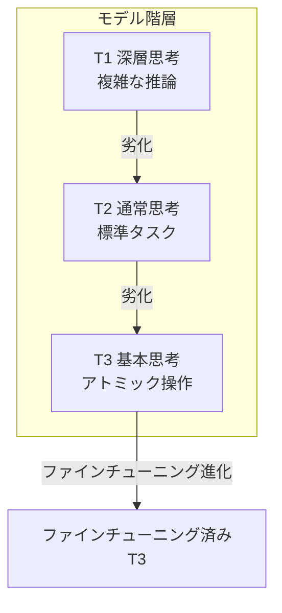
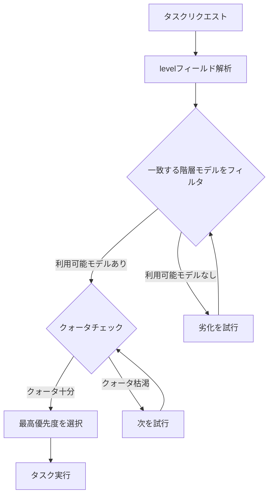
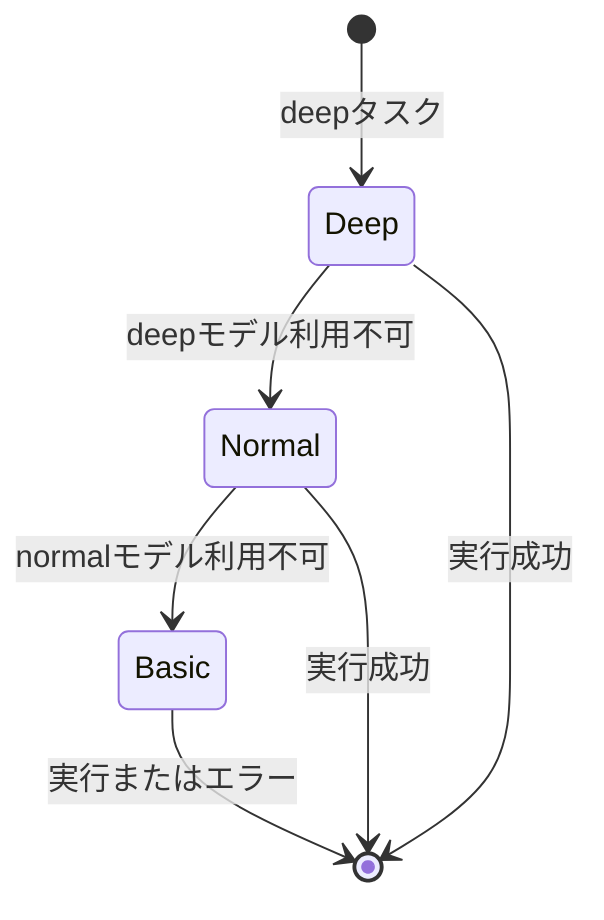
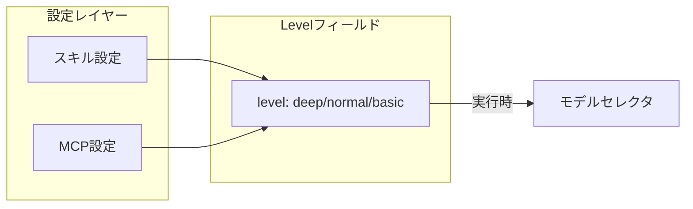
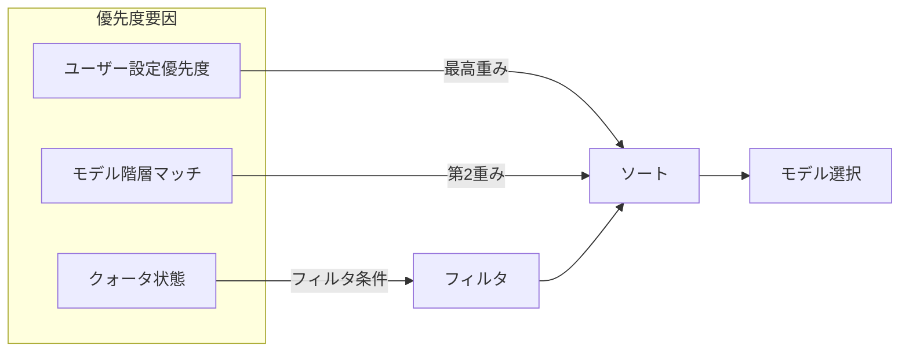
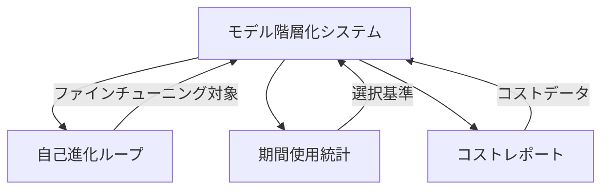

# モデル階層化システム設計

## 概要

モデル階層化システムはタスクの複雑さに基づいて適切なモデル階層を割り当てるインテリジェントなモデル選択機構であり、品質を確保しつつリソース活用を最大化する。

> **関連ドキュメント**: 本書で定義される3階層モデルシステムは、[自己進化ループシステム](04-self-evolution-loop.md)の基盤である。

## コア原則

### 3階層モデルシステム

### 階層比較

| 階層 | 位置付け | コスト | 典型的なシナリオ |
| --- | --- | --- | --- |
| T1（深層） | 複雑な推論、判断 | 最高 | アーキテクチャ設計、問題分析 |
| T2（通常） | 標準タスク | 中 | コード作成、ドキュメント生成 |
| T3（基本） | アトミック操作 | 最低 | ファイル読み取り、フォーマット変換 |

## モデル選択機構

### 選択プロセス

### 劣化戦略

## 設定機構

### スキル/MCP階層アノテーション

各スキルとMCPツールは `level` フィールドを通じて必要なモデル階層を宣言する：

### 優先度制御

## 他モジュールとの関係

## 設計上の考慮事項

### コスト最適化

- 低階層モデルを優先
- 自動劣化によりタスク失敗を回避
- クォータ監視アラート

### 品質保証

- 複雑なタスクには高階層必須
- 劣化には実現可能性検証が必要
- 失敗時の自動リトライ

### 拡張性

- カスタム階層のサポート
- 柔軟な優先度設定
- プラグ可能な選択戦略
