# 名前空間アーキテクチャ: `vars`、`refs`、`env`

> **注記 (2026-06)**: LLM可視ツール表面は5から3プリミティブに削減された。`ref_add` と `ref_remove` は **LLMに公開されなくなった** — `agent_allowed_tools()` は `exec`、`write_to_var`、`write_to_var_json` のみを返す。`__refs` 名前空間は依然として内部データ構造（スナップショット/リストア、プロンプト注入）として存在するが、モデルによって直接変更されることはなくなった。`ref_add`/`ref_remove` ディスパッチを説明する以下のセクションは、残存する内部配管を文書化したものであり、LLMツール表面ではない。

## 概要

Entelecheiaは、IEPL JavaScriptランタイム（`globalThis.$`）内に3つの共有名前空間を提供し、クロススキル・クロスエージェント通信の基盤として機能する。これらの名前空間は**Cosmosランタイムレベル**で動作し、すべてのエージェントとスキルが単一セッション内で透過的に共有することを意味する。

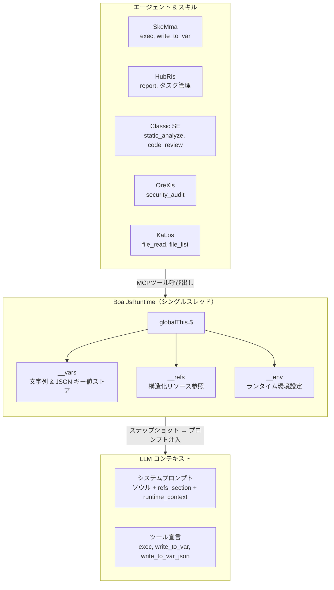

### 設計原則

| 原則 | 説明 |
| --- | --- |
| **単一の真実源** | 各名前空間は、その名前空間を参照する**すべての**JSコード文字列を生成する単一のモジュール（`var_namespace.rs`、`ref_namespace.rs`、`namespace.rs`）を持つ |
| **遅延初期化** | `__vars` と `__refs` は `JsRuntime::new()` で一度初期化され、スキルチェーンをまたいで存続する。`__env` は名前空間JS評価時に初期化される |
| **スナップショット/リストア** | 完全な `__vars` + `__refs` 状態はスナップショットおよびリストア可能であり、セッション永続化を可能にする |
| **プロンプト注入** | スナップショットデータがコンテキスト豊富なシステムプロンプトを駆動する — LLMは利用可能な変数名、参照サマリー、環境設定を参照できる |
| **ツールアクセス制御** | 3つのcosmos内部ツール（`exec`、`write_to_var`、`write_to_var_json`）はすべて `agent_allowed_tools()` を介して全エージェントに付与される。個別のスキルSOPがどれを使用するかを定義する |

-----------------------------------------------------------------------------

## 名前空間比較

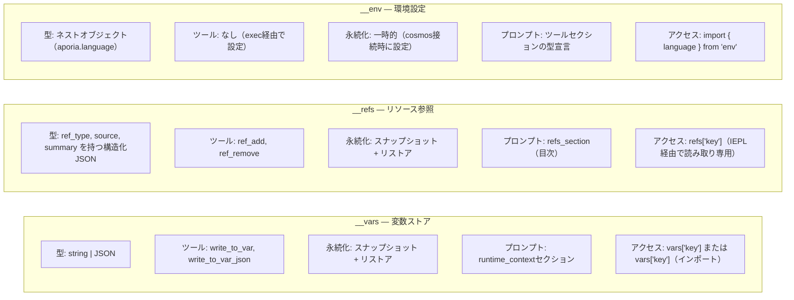

-----------------------------------------------------------------------------

## 1. `__vars` — 変数ストア（`vars`）

### 1.1 目的

`__vars` はスキルチェーン内の**主要なステップ間通信メカニズム**である。スキルは `write_to_var` / `write_to_var_json` を使用して計算結果を永続化し、後続のステップ（またはスキル）は `exec` ブロック内で `__vars` から読み取る。

### 1.2 モジュールアーキテクチャ

すべての `__vars` JSコード生成は `packages/shared/core/src/var_namespace.rs` に集中化されている。

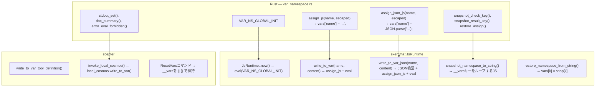

### 1.3 初期化シーケンス

```text
JsRuntime::new()
  → context.eval("globalThis.$ = globalThis.$ || {}; globalThis.__vars = {}; globalThis.__refs = {};")
  → __vars が空オブジェクトとして初期化
```

初期化は `build_namespace_js()`（`__env` と `$.variant` を設定する）の**前に**実行され、`__vars` が名前空間モジュールのロード時に常に利用可能であることを保証する。

> **注記:** `__refs` は `VAR_NS_GLOBAL_INIT`（`var_namespace.rs` で定義）を介して `__vars` と共に初期化される。`ref_namespace.rs` 内のスタンドアロン `REF_NS_GLOBAL_INIT` は対称性のために存在するが、直接呼び出されることはない — 実際の初期化は `JsRuntime::new()` で行われる。

### 1.4 操作

| 操作 | ツール名 | 型 | 動作 |
| --- | --- | --- | --- |
| 文字列保存 | `write_to_var` | ブロッキング | JS用にコンテンツをエスケープ、`vars['name'] = 'content'` を評価 |
| JSON保存 | `write_to_var_json` | ブロッキング | JSON検証、`vars['name'] = JSON.parse('content')` を評価 |
| execで読み取り | `exec` | FireAndForget | 直接アクセス: `vars['name']` または `import vars from 'vars'` |
| スナップショット | (内部) | — | 全 `__vars` キーを `{"$vars": {...}}` としてキャプチャ |
| リストア | (内部) | — | 各キーに対して `vars[k] = snap['$vars'][k]` を設定 |
| リセット | (内部) | — | `__vars = __vars \|\| {}` — 既存値を保持し構造を保証 |

### 1.5 プロンプト注入

`build_runtime_context()`（`prompt.rs:472`）では、変数ストアがシステムプロンプトに以下のように表示される：

```text
## JS ランタイムコンテキスト

__vars（write_to_var / write_to_var_json から、N 件）:
  `var_1`, `var_2`, `var_3`, ...（最大30件表示）
  インポート: `import vars from 'vars';`  アクセス: `vars['key']`
```

### 1.6 出力表示

- 文字列保存: `vars['name'] 設定:\n{最初の200文字 / 5行}...（全文字数: total_chars）`
- JSON保存: `vars['name'] 設定（解析済みJSON）: 3キーのオブジェクト`
- 解析失敗: 内容プレビュー付きエラー（最初の200文字）

### 1.7 `vars` 合成モジュール

`env` と同様に、`vars` モジュールは便利なインポートのために `__vars` をラップするBoa合成モジュールである：

```python
import vars from 'vars';
// vars === __vars（ライブ参照）
const report = vars['analysis_results'];
```

**実装:** `packages/agents/skemma/src/js_runtime/module_loader.rs` 142-156行。モジュールは `Module::synthetic()` を使用し、`globalThis.__vars` を直接返すクロージャを持つ（スナップショットではなくライブ参照）。これは `vars['key'] = value` による変更が `vars['key'] = value` と等価であることを意味する。

-----------------------------------------------------------------------------

## 2. `__refs` — リソース参照（`refs`）

### 2.1 目的

`__refs` は**構造化されたクロスエージェントリソース受け渡し**を提供する。`__vars`（生文字列）とは異なり、refsはオプションのペイロードに加えて型付きメタデータ（`ref_type`、`source`、`summary`）を運ぶ。エージェントは：

- ファイル、画像、自身の出力への**参照を公開**できる
- システムプロンプト内で名前/型により**参照を発見**できる
- IEPL execブロック内で `refs['name']` を介して**参照内容にアクセス**できる

### 2.2 モジュールアーキテクチャ

すべての `__refs` JSコード生成は `packages/shared/core/src/ref_namespace.rs` に集中化されている。

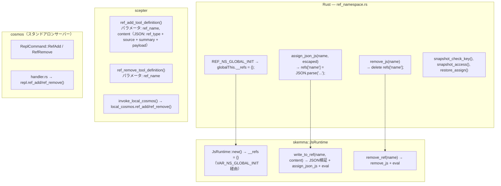

### 2.3 RefItem構造

```typescript
// TypeScript型定義（iepl-api.d.tsより）
type RefType = "code" | "image" | "agent_output";

// システムプロンプトとruntime_contextでの名前一覧表示に使用
type RefItemSummary = {
  name: string;
  ref_type: RefType;
  source: string;
  summary: string;
};

interface RefItem {
  name: string;        // 例: "code:src/main.rs", "image:diagram", "agent:orexis/audit-1"
  ref_type: RefType;   // ソート/フィルタリング用カテゴリ
  source: string;      // 誰が提供したか（"user"、エージェント名、ツール名）
  summary: string;     // プロンプト表示用の1行説明
  files?: RefCodeFile[];   // "code" refs用
  images?: RefImage[];     // "image" refs用
  output?: RefAgentOutput; // "agent_output" refs用
}

interface RefCodeFile {
  path: string;
  language: string;
  content: string;
  selection?: { start_line: number; end_line: number; content: string };
}

interface RefImage {
  mime: string;          // 例: "image/png"
  data: string;          // base64エンコードまたはdata URL
  description?: string;
}

interface RefAgentOutput {
  source_agent: string;  // エージェント名
  source_tool: string;   // この出力を生成したツール
  content: Record<string, unknown>;
}
```

### 2.4 操作

| 操作 | ツール名 | 型 | 動作 |
| --- | --- | --- | --- |
| 参照追加 | `ref_add` | ブロッキング | JSON検証、`refs['name'] = JSON.parse('...')` を評価 |
| 参照削除 | `ref_remove` | FireAndForget | `delete refs['name']` を評価 |
| execで読み取り | (`exec`経由) | — | `refs['name'].files[0].content` |
| スナップショット | (内部) | — | 全 `__refs` キーを `{"$refs": {...}}` としてキャプチャ |
| リストア | (内部) | — | 各キーに対して `refs[k] = snap['$refs'][k]` を設定 |

### 2.5 プロンプト注入

Refsはシステムプロンプト内の**2箇所**に表示される：

#### 場所1: `refs_section`（専用目次）

```text
## 参照リソース（refs）

以下のリソースが `refs['name']` 経由で利用可能です。
- `code:src/main.rs` [code] from user — メインのRustファイル
- `image:architecture` [image] from user — システムアーキテクチャ図
- `agent:orexis/audit-1` [agent_output] from OreXis — セキュリティ監査結果
```

`prompt.rs:426` の `build_refs_section()` によって生成。各refは**名前、型、ソース、サマリー**を表示する — LLMは何が利用可能かを見るが、内容は `exec` ブロック経由で読み取らなければならない。

#### 場所2: `runtime_context`（名前一覧）

```text
__refs（ユーザー/エージェントからの参照リソース、3件）:
  `code:src/main.rs`, `image:architecture`, `agent:orexis/audit-1`
  アクセス: `refs['name']` — 各refは .ref_type, .source, .summary を持つ
```

### 2.6 可視性原則

> **Ref名は全エージェントに可視。Ref内容は不可視。**

システムプロンプト内の `refs_section` は、すべてのスキル実行に**目次**（名前、型、ソース、サマリー）を公開する。しかし、実際の内容（`files[].content`、`images[].data`、`output.content`）はIEPL execブロック内での明示的な `refs['name']` アクセスを介してのみアクセス可能である。これは以下を意味する：

- OreXisは `code:src/main.rs` が存在することを（サマリーから）確認できるが、監査のためには明示的にその内容を読み取らなければならない
- LLMはタスクの関連性に基づいて内容をデリファレンスするタイミングを決定する
- エージェントが誤って参照内容を会話ストリームに漏洩させることはない

-----------------------------------------------------------------------------

## 3. `__env` — 環境設定（`env`）

### 3.1 目的

`__env` はIEPL実行エンジンとエージェントが必要とする**ランタイム環境設定**を保持する。現在、唯一のサブキーは `env.aporia.language` であり、エージェント出力の言語を制御する。

### 3.2 モジュールアーキテクチャ

環境初期化は `packages/shared/iepl/src/namespace.rs` にある。

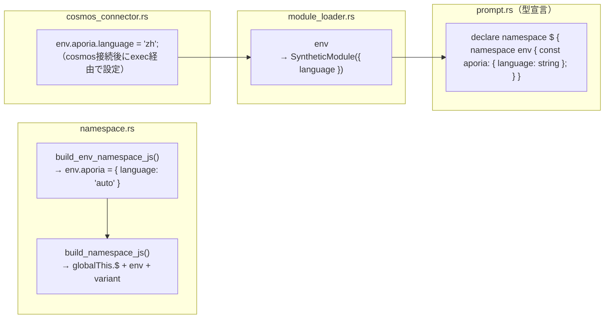

### 3.3 操作

| 操作 | 機構 | 動作 |
| --- | --- | --- |
| 初期化 | `build_namespace_js()` | `__env = __env \|\| {}; env.aporia = env.aporia \|\| { language: 'auto' }` |
| 言語設定 | cosmosコネクタ経由の `exec` 呼び出し | `env.aporia.language = 'zh'` |
| IEPLで読み取り | `import { language } from 'env'` | `'auto'` フォールバック付きで `env.aporia.language` を返す |
| スナップショット/リストア | **非対応** | `__env` はスナップショット/リストアに含まれない — 一時的であり、cosmos接続ごとに再初期化される |

### 3.4 言語フロー

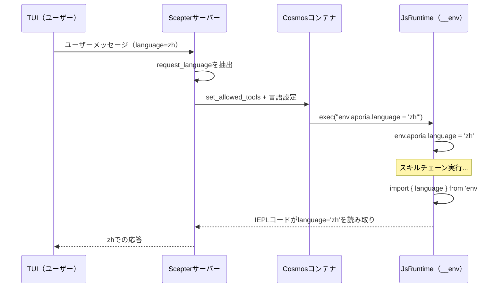

### 3.5 `$.variant` — 後方互換アクセサー

**ファイル:** `packages/shared/iepl/src/namespace.rs:199-207`

`build_variant_namespace_js()` は循環的な自己参照プロパティを作成する：

```javascript
Object.defineProperty(globalThis.$, 'variant', {
  get: function() { return globalThis.$; },
  set: function(val) { Object.assign(globalThis.$, val); },
  configurable: true,
  enumerable: true,
});
```

これにより `$.variant.tools.agent.method()` と書かれたコードが `$.tools.agent.method()` と同じオブジェクトに解決される。代替名前空間アクセスパターンとの後方互換性のために存在する。

> **スナップショット注意:** `$.variant` は循環参照（`$.variant === $`）であるため、`JSON.stringify` を試みると `TypeError` がスローされる。スナップショットJSコードは `globalThis.$` キーを反復するのではなく、`__vars` と `__refs` を明示的にターゲットとし、この問題を回避する。

-----------------------------------------------------------------------------

## 4. スナップショット & リストアアーキテクチャ

### 4.1 なぜスナップショット/リストアか？

`LocalCosmosRuntime` は専用スレッドで**単一の長寿命 `JsRuntime`** を実行する。スキルチェーン実行の合間に、ランタイム状態（`__vars`、`__refs`）は自然に持続する。しかし、スナップショットは以下のために使用される：

1. **プロンプト注入** — `build_runtime_context()` と `build_refs_section()` がスナップショットJSONを読み取り、システムプロンプトを生成する
1. **セッション永続化** — クラッシュリカバリやセッション移行のためのディスクへのダンプ/リストア
1. **コンテナ同期** — `cosmos_set_rag_context()` 経由でcosmosコンテナに状態をプッシュ

### 4.2 スナップショット形式

```json
{
  "$vars": {
    "var_name_1": "value",
    "parsed_json": { "key": "value" }
  },
  "$refs": {
    "code:src/main.rs": {
      "ref_type": "code",
      "source": "user",
      "summary": "メインのRustファイル",
      "files": [{ "path": "src/main.rs", "language": "rust", "content": "..." }]
    }
  },
  "__lexical": {
    "my_const": 42
  }
}
```

### 4.3 スナップショットコードフロー

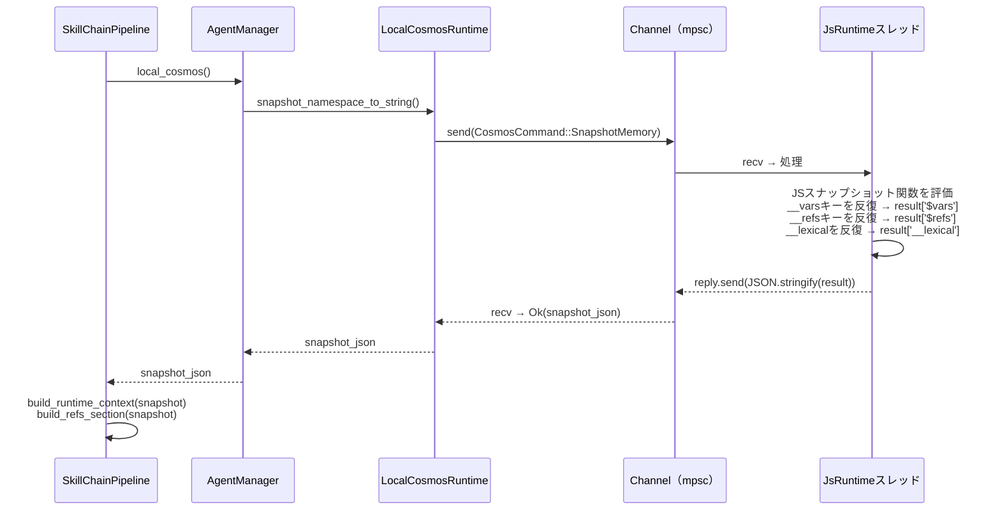

### 4.4 スナップショットJSコード（デプロイ形式）

> **注記:** 以下に示すJSコードは、Rustコードが実行時に動的に構築する**デプロイ形式**である。ソース内のRust文字列リテラルとして保存されているわけではない。`__lexical` セクションは、以前の `exec()` 呼び出し中に追跡された `self.lexical_var_names` から生成される。Rust文字列ビルダーについては `packages/agents/skemma/src/js_runtime/runtime.rs:549-607` を参照。

スナップショット関数は既知の名前空間ツリーに直接アクセスする：

```javascript
(function() {
    var result = {};
    if (globalThis.$ && globalThis.__vars) {
        var dollarVars = {};
        var dollarKeys = Object.keys(globalThis.__vars);
        for (var j = 0; j < dollarKeys.length; j++) {
            var dk = dollarKeys[j];
            try {
                var dv = globalThis.vars[dk];
                if (typeof dv === 'function') continue;
                dollarVars[dk] = dv;
            } catch(e) {}
        }
        if (Object.keys(dollarVars).length > 0) {
            result['$vars'] = dollarVars;
        }
    }
    if (globalThis.$ && globalThis.__refs) {
        var dollarRefs = {};
        var refsKeys = Object.keys(globalThis.__refs);
        for (var j = 0; j < refsKeys.length; j++) {
            var dk = refsKeys[j];
            try {
                var dv = globalThis.refs[dk];
                if (typeof dv === 'function') continue;
                dollarRefs[dk] = dv;
            } catch(e) {}
        }
        if (Object.keys(dollarRefs).length > 0) {
            result['$refs'] = dollarRefs;
        }
    }
    // ... __lexicalキャプチャ ...
    return JSON.stringify(result);
})( )
```

### 4.5 リストアコード（デプロイ）

```javascript
(function() {
    var snap = JSON.parse(snapshot_string);
    if (snap['$vars'] && globalThis.$) {
        Object.keys(snap['$vars']).forEach(function(k) {
            try { globalThis.vars[k] = snap['$vars'][k]; } catch(e) {}
        });
    }
    if (snap['$refs'] && globalThis.$) {
        Object.keys(snap['$refs']).forEach(function(k) {
            try { globalThis.refs[k] = snap['$refs'][k]; } catch(e) {}
        });
    }
    if (snap['__lexical']) {
        Object.keys(snap['__lexical']).forEach(function(k) {
            try { globalThis[k] = snap['__lexical'][k]; } catch(e) {}
        });
    }
})()
```

-----------------------------------------------------------------------------

## 5. ツール登録 & アクセス制御

### 5.1 Cosmos内部ツール

5つのcosmosレベルツールすべてが**全エージェントに普遍的に付与**される：

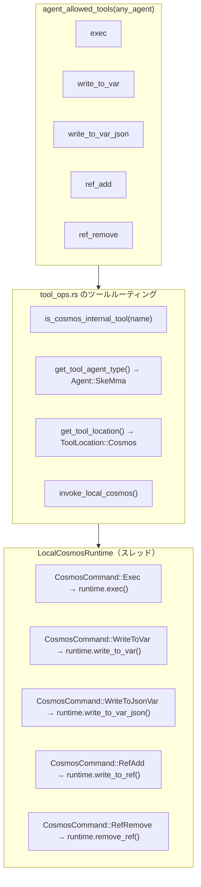

### 5.2 ツール定義

| ツール | 呼び出しモード | 要件 | パラメータスキーマ |
| --- | --- | --- | --- |
| `exec` | FireAndForget | `code: string` | 単一JSコード文字列 |
| `write_to_var` | ブロッキング | `var_name, content` | `{var_name: string, content: string}` |
| `write_to_var_json` | ブロッキング | `var_name, content` | `{var_name: string, content: string（有効なJSON）}` |
| `ref_add` | ブロッキング | `ref_name, content` | `{ref_name: string, content: string（JSON: ref_type + source + summary）}` |
| `ref_remove` | FireAndForget | `ref_name` | `{ref_name: string}` |

### 5.3 スタンドアロンCosmosサーバー

`cosmos` バイナリ（スタンドアロンJSランタイムサーバー）は、すべてのツール名を同じ `JsRuntime` インターフェースを通じてディスパッチする。これには、残存する内部配管として残る非推奨の `ref_add`/`ref_remove` ハンドラも含まれる。LLM可視プリミティブ（`exec`、`write_to_var`、`write_to_var_json`）のみがモデルに公開される。本書冒頭の非推奨注記を参照。

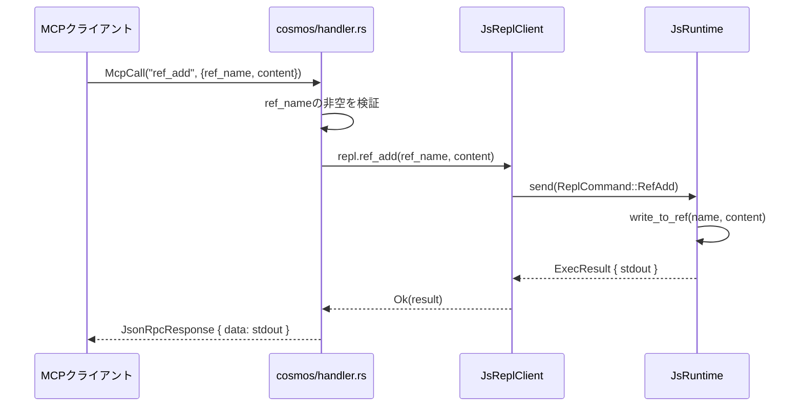

### 5.4 `is_cosmos_internal_tool` — ルーティングヘルパー

**ファイル:** `packages/scepter/src/agent_manager/tool_ops.rs:7-13`

```rust
fn is_cosmos_internal_tool(tool_name: &str) -> bool {
    tool_name == cosmos::EXEC
        || tool_name == cosmos::WRITE_TO_VAR
        || tool_name == cosmos::WRITE_TO_VAR_JSON
        || tool_name == cosmos::REF_ADD
        || tool_name == cosmos::REF_REMOVE
}
```

このヘルパーは2つの重要な目的を果たす：

1. **エージェント型解決** — 内部ツールはCosmosランタイムで実行されるため（ドメインエージェントのプロセスではない）、`get_tool_agent_type()` は `Agent::SkeMma` を返す。
1. **フォールバックルーティング** — 内部ツールに対するコンテナ化cosmos呼び出しが失敗した場合、システムはローカルcosmosランタイムにフォールバックする。非内部ツールの場合、フォールバックは代わりにプロセス内実行に移行する。これにより、cosmos操作がコンテナ化モードで黙って失敗しないことを保証する。

### 5.5 コンテナ化 vs ローカルCosmosルーティング

システムはエージェント登録時に選択されるCosmosランタイムの2つの実行モードをサポートする：

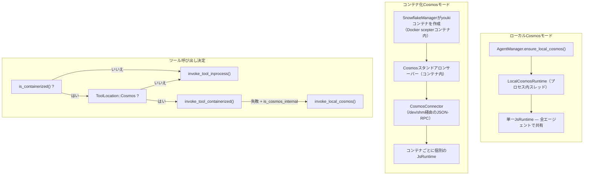

**主な違い:**

| 側面 | ローカルモード | コンテナ化モード |
| --- | --- | --- |
| `__vars` / `__refs` | 全エージェントで共有 | コンテナ内で共有、コンテナ間で隔離 |
| `__env` | `exec` 経由で直接設定 | `CosmosConnector` JSON-RPC呼び出し経由で設定 |
| パフォーマンス | シリアライズオーバーヘッドゼロ | 呼び出しごとにJSON-RPCシリアライズ |
| セキュリティ | Boaサンドボックスのみ | Boa + seccomp + youkiサンドボックス |
| コンテナランタイム | Docker/Podmanのみ | Docker/Podman（外部）+ youki（内部cosmos） |
| 使用対象 | 非コンテナ化エージェント（layer=1） | コンテナ化エージェント（layer=2+） |

### 5.6 名前空間JSアセンブリ

完全な名前空間JavaScriptは `packages/scepter/src/services/local_cosmos/namespace.rs:116-124` の `build_scepter_namespace_config_and_js()` によってアセンブルされる：

```rust
pub async fn build_scepter_namespace_config_and_js(
    registry: &SharedAgentRegistry,
    scepter_tools: &HashSet<String>,
    plugin_router: &PluginRouter,
) -> (NamespaceConfig, String) {
    let config = build_namespace_config(registry, scepter_tools, plugin_router).await;
    let js = build_namespace_js(&config);
    (config, js)
}
```

この関数は：

1. `AgentRegistry` から登録されたすべてのエージェントのMCPツールを収集する
1. エージェントごとのツールリストとメタデータ（同期/非同期、`unwrap_data`）を持つ `NamespaceConfig` を構築する
1. `build_namespace_js(&config)` を介して名前空間JSを生成する。これは：

   - 欠落時は `globalThis.$` を作成
   - `env.aporia` を `{ language: 'auto' }` で初期化
   - `$.variant` プロパティ（`globalThis.$` を返す循環ゲッター）を定義
   - `register_tool_modules_with_rag()` を介してすべてのエージェントツールモジュールを登録

名前空間JSは以下のタイミングで評価される：

- **1回** `LocalCosmosRuntime::new()` 起動時
- `CosmosCommand::RebuildNamespace` 経由でスキルチェーン再構築時に**オンデマンド**

-----------------------------------------------------------------------------

## 6. システムプロンプトアセンブリ順序

`pipeline.rs:869-882` でアセンブルされる完全なシステムプロンプト：

```text
あなたは {エージェント} {スキル名} スキル実行エンジンです。スキルを忠実に実行してください。

[capability_section]
  → エージェント固有の能力説明
  → TypeScript型宣言（IEPL API型、env）
  → インポート指示プロンプト
  → パラメータ安全ルール & データ永続化ガイダンス

[tool_decls_section]
  → ## 利用可能なツールAPI
  → すべての利用可能なMCPツールの.d.ts内容

[container_context]
  → コンテナ実行モードバッジ、ブランチ情報、制約

[soul_section]
  → ## ソウルアイデンティティ: {name}
  → エージェントのパーソナリティと運用原則

[refs_section]
  → ## 参照リソース（refs）
  → 目次: 名前、型、ソース、サマリー

[output_section]
  → 次のターゲットエージェントルーティング
  → MCPレポート呼び出し規約

[runtime_context]
  → ## JS ランタイムコンテキスト
  → __vars 名（インポートヒント付き）
  → __refs 名（アクセスヒント付き）
  → レキシカル変数名

[rag_section]
  → PhiLiaメモリセクション（関連する過去のやり取り）
  → ApoRiaナレッジセクション（関連ドキュメント）

[skill_chain_note]
  → チェーンナビゲーション: "これはステップ N / M" または "最終ステップ"
```

### セクション配置の根拠

| セクション | 位置 | 理由 |
| --- | --- | --- |
| エージェントアイデンティティ + スキル名 | 最初の文 | 即座に役割を設定 |
| ツール宣言 | ソウルの前 | LLMはパーソナリティが選択に影響する前に利用可能なツールを知る必要がある |
| ソウル | ツールの後、refsの前 | パーソナリティがrefsの解釈方法に影響する |
| Refsセクション | ソウルの後、出力の前 | LLMは生成するものを決定する前に利用可能なリソースを知る |
| 出力ルーティング | ランタイムコンテキストの前 | LLMはコンテキストを読む前に結果の送信先を知る |
| ランタイムコンテキスト | RAGの前、チェーンノートの前 | Varsとrefsが知識検索の実行コンテキストを提供する |

-----------------------------------------------------------------------------

## 7. ResetVarsの動作

チェーン内でスキルを切り替える際、`ResetVars` が呼び出されランタイム状態をサニタイズする。このコマンドは**非破壊的**な初期化を使用する：

```javascript
globalThis.$ = globalThis.$ || {};
globalThis.__vars = globalThis.__vars || {};
globalThis.__refs = globalThis.__refs || {};
```

これは以下を意味する：

- **既存の値が持続** — `__vars` と `__refs` はそのまま保持
- **破損状態が回復** — `__refs` が誤って削除された場合、再作成される
- **スキル隔離はオプトイン** — スキルは自分が知っている変数（ランタイムコンテキストプロンプト内の名前による）のみを読み取るべき
- **強制クリーンアップなし** — 変数名前空間の汚染管理はLLMの責任

-----------------------------------------------------------------------------

## 8. 実装ファイルマップ

| コンポーネント | ファイル | 行数 | 説明 |
| --- | --- | --- | --- |
| `__vars` 定数 & ジェネレーター | `packages/shared/core/src/var_namespace.rs` | 1-211 | vars用の全JSコード生成 |
| `__refs` 定数 & ジェネレーター | `packages/shared/core/src/ref_namespace.rs` | 1-145 | refs用の全JSコード生成 |
| `__env` 生成 | `packages/shared/iepl/src/namespace.rs` | 193-197 | `build_env_namespace_js()` |
| `$.variant` 生成 | `packages/shared/iepl/src/namespace.rs` | 199-207 | `build_variant_namespace_js()` |
| `JsRuntime` 初期化 | `packages/agents/skemma/src/js_runtime/runtime.rs` | 153 | `eval(VAR_NS_GLOBAL_INIT)` |
| `write_to_var` 実装 | 同ファイル | 349-403 | 文字列変数ストレージ |
| `write_to_var_json` 実装 | 同ファイル | 405-443 | JSON変数ストレージ |
| `write_to_ref` 実装 | 同ファイル | 445-492 | 型抽出付きrefストレージ |
| `remove_ref` 実装 | 同ファイル | 494-503 | Ref削除 |
| `snapshot_namespace_to_string` | 同ファイル | 549-607 | スナップショットJSを生成 |
| `restore_namespace_from_string` | 同ファイル | 617-646 | リストアJSを生成 |
| `LocalCosmosRuntime` | `packages/scepter/src/services/local_cosmos/runtime.rs` | 1-507 | スレッドセーフcosmosコマンドチャネル |
| `CosmosCommand` enum | 同ファイル | 21-65 | 全cosmos操作バリアント（SnapshotMemory、Shutdownを含む） |
| `ResetVars` ハンドラ | 同ファイル | 448-460 | 非破壊的リセット |
| `RebuildNamespace` ハンドラ | 同ファイル | 478-494 | ツールモジュールを再初期化 |
| ツール定義 | `packages/scepter/src/agent_manager/tool_ops.rs` | 1-795 | 5つのcosmosツール定義すべて |
| `is_cosmos_internal_tool` | 同ファイル | 7-13 | ルーティングヘルパー |
| `invoke_local_cosmos` | 同ファイル | 714-787 | LocalCosmosRuntimeへのツールディスパッチ |
| `build_runtime_context` | `packages/scepter/src/state_machine/skill_chain/prompt.rs` | 472-598 | プロンプト: vars + refs + lexical |
| `build_refs_section` | 同ファイル | 426-470 | プロンプト: refs目次 |
| システムプロンプトアセンブリ | `packages/scepter/src/state_machine/skill_chain/pipeline.rs` | 869-882 | 完全なシステムプロンプトフォーマット文字列 |
| 許可ツール一覧 | `packages/shared/domain_skills/src/tool_names.rs` | 265-273 | 普遍的なcosmosツールアクセス |
| Cosmosスタンドアロンハンドラ | `packages/cosmos/src/handler.rs` | 447-521 | `ref_add` / `ref_remove` ディスパッチ |
| Cosmos JsReplClient | `packages/cosmos/src/js_repl/mod.rs` | 442-467 | `ref_add()` / `ref_remove()` メソッド |
| ReplCommand enum | 同ファイル | 57-96 | `RefAdd` / `RefRemove` バリアント |
| IEPL TypeScript型 | `packages/shared/bindings/iepl-api.d.ts` | 133-154 | RefItem, RefType, __refs 宣言 |
| `vars` モジュール | `packages/agents/skemma/src/js_runtime/module_loader.rs` | 142-156 | `__vars` ライブ参照エクスポート |
| `env` モジュール | 同ファイル | 160-172 | 言語値エクスポート |
| 名前空間JSアセンブリ | `packages/scepter/src/services/local_cosmos/namespace.rs` | 116-124 | `build_scepter_namespace_config_and_js` |
| CosmosConnector言語設定 | `packages/scepter/src/services/cosmos_connector.rs` | 351-363 | コンテナ内の `env.aporia.language` |
| E2Eテスト | `packages/agents/skemma/tests/mcp_test.rs` | 1677-1726 | `refs_and_snapshot_tests` モジュール |
| 単体テスト | `packages/agents/skemma/src/js_runtime/runtime.rs` | 679-746 | `write_to_ref`、スナップショット、リストアテスト |
| Ref名前空間テスト | `packages/shared/core/src/ref_namespace.rs` | 99-145 | JSコード生成パターンテスト |

-----------------------------------------------------------------------------

## 9. クロスカッティング懸念事項

### 9.1 スレッド安全性

- `LocalCosmosRuntime` は専用スレッド（`"local-cosmos"` と命名）で**単一の `JsRuntime`** を所有する
- すべての操作は `mpsc::channel<CosmosCommand>` を通じてシリアライズされる
- `JsRuntime` は複数スレッドから決してアクセスされない — スレッド安全性はチャネルパターンによって強制される
- `AgentManager` は遅延初期化のために `OnceCell<Arc<LocalCosmosRuntime>>` を保持する

### 9.2 メモリ制限

| 制限 | 値 | 強制箇所 |
| --- | --- | --- |
| プロンプト内の最大vars数 | 30 | `build_runtime_context()` — `MAX_NAMES` 定数 |
| プロンプト内の最大refs数 | 30 | `build_refs_section()` — `.take(30)` |
| runtime_context内の最大refs数 | 30 | `build_runtime_context()` — `MAX_NAMES` 定数 |
| Execコードソフト制限 | N/A（無効） | 外部コンテナ制限 + サーキットブレーカー |
| Execタイムアウト（SkeMma） | デフォルト120秒 | `skemma/COMPUTE_TIMEOUT` |
| Exec絶対上限 | 600秒 | `skemma/ABSOLUTE_CEILING` |

### 9.3 エラーハンドリング

| エラー | 処理 |
| --- | --- |
| 無効なJSONでの `write_to_var_json` | プレビュー付きエラーを返す（最初の200文字） |
| 無効なJSONでの `ref_add` | プレビュー付き `SkemmaError::JsEval` を返す |
| 循環参照のスナップショット（`$.variant`） | `TypeError` を黙ってキャッチ、キーをスキップ |
| スナップショット内の `__refs` 欠落 | `build_refs_section` が空文字列を返す |
| ResetVars後の破損した `__refs` | `\|\| {}` が再初期化を保証 |

### 9.4 RebuildNamespaceライフサイクル

非コンテナ化スキルチェーンでスキルを切り替える際、チェーン中に発見された新しいエージェントツールを含めるために名前空間JSの**再構築**が必要になる場合がある：

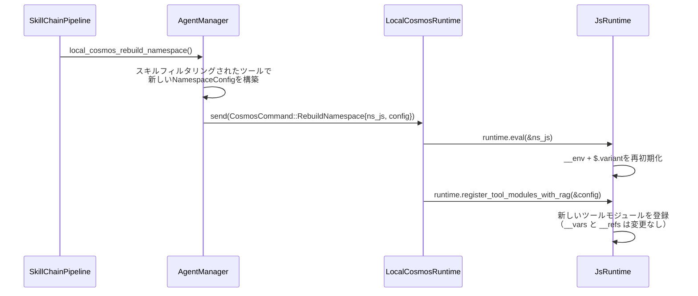

> **重要な不変条件:** RebuildNamespaceはツール登録と環境設定のみを更新する。`__vars` や `__refs` は**リセットしない** — それらは `ResetVars` によって別途処理される。

### 9.5 コンテナ化モードでの言語伝播

エージェントがyoukiコンテナ（Docker scepterコンテナ内にネスト）内で実行される場合、`env.aporia.language` の値は `CosmosConnector` を介して設定される：

```rust
// packages/scepter/src/services/cosmos_connector.rs:351-363
let lang_code = format!(
    "env.aporia.language = {};",
    serde_json::to_string(&lang).unwrap_or_else(|_| "\"en\"".to_string())
);
connector.cosmos_exec(&container_uuid, &lang_code).await?;
```

これはJSON-RPCトランスポートを介してcosmosコンテナに `exec` MCP呼び出しを送信し、コンテナの隔離された `JsRuntime` でJS代入を評価する。完全な言語伝播パスは：

```text
TUIリクエスト言語 → Scepter（request_languageを抽出）
  → [ローカルモード] 直接 exec("env.aporia.language = 'zh'")
  → [コンテナ化] CosmosConnector::cosmos_exec(json_rpc_call)
      → cosmosハンドラ → js_runtime.eval(...)
```

### 9.6 セキュリティ

- `exec` 検証: 全コードがBoa評価前にSWC AST構文検証を通過
- `exec` ブロックでの `eval()` 使用は検出されブロックされ、代わりに `write_to_var` を使用するようガイダンス
- `ref_add` コンテンツは `JSON.parse()` を通過 — 任意コードの注入不可
- 名前空間ツールは生のBoaコンテキストアクセスを公開しない
- Cosmosコンテナはseccompプロファイル付きのサンドボックス化されたyoukiコンテナで実行され、それぞれがDocker/Podman scepterコンテナ内にネスト（2層コンテナ隔離）
