# 使用期間統計システム設計

## 概要

使用期間統計システムは時間期間に基づいてLLMトークン使用量を管理・追跡し、複数の期間タイプ（5時間、7日、30日、カスタム）をサポートし、コスト管理とクォータ管理のデータ基盤を提供する。

## コア原則

### 時間ウィンドウ集計

システムはデータベースビューを通じて任意の時間範囲の使用統計をリアルタイムで計算するスライディングウィンドウ集計機構を使用する：

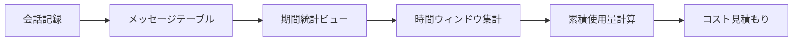

### データフロー

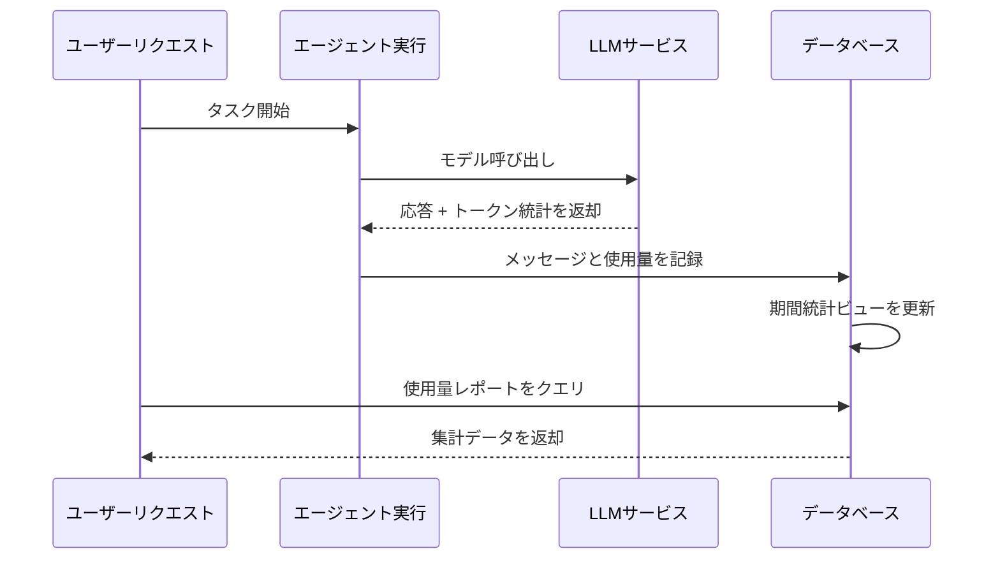

## 期間タイプ

| 期間タイプ | 期間 | 典型的な用途 |
| --- | --- | --- |
| 短期 | 5時間 | 迅速な反復開発 |
| 中期 | 7日 | 週次クォータ管理 |
| 長期 | 30日 | 月次コスト会計 |
| カスタム | 任意 | 柔軟なビジネスニーズ |

## アーキテクチャ設計

### ビュー集計アーキテクチャ

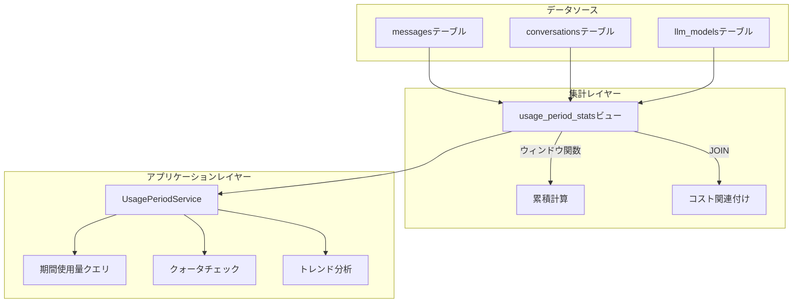

### コア計算ロジック

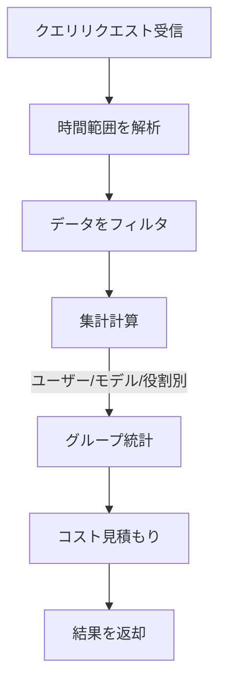

## クォータ制御機構

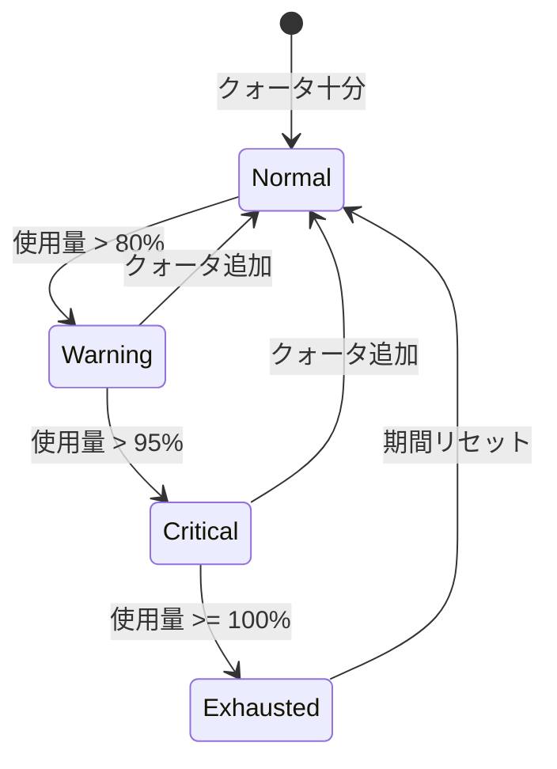

## 他モジュールとの関係

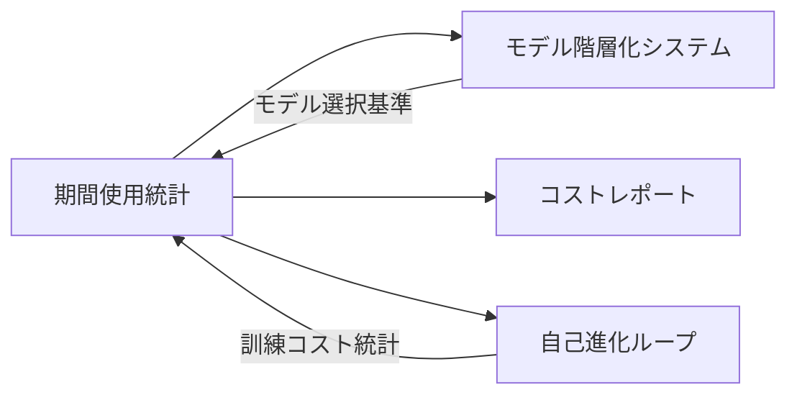

## 設計上の考慮事項

### パフォーマンス最適化

- 事前集計にデータベースビューを使用
- ウィンドウ関数で冗長計算を回避
- 時間インデックスで範囲クエリを高速化

### 拡張性

- 新しい期間タイプをサポート
- 拡張可能な集計次元
- 柔軟なコスト計算モデル

### データ整合性

- 読み取り専用ビューでデータ整合性を確保
- タイムスタンプはUTCで統一
- トランザクションで書き込みの原子性を保証

# LLM設定フロー設計

## 概要

本書はユーザーがLLMプロバイダを設定する完全なフローを説明する。設定インターフェースの相互作用、データ転送、サーバーサイド処理、会話での使用を含む。

## 設定フローアーキテクチャ

### 全体フロー

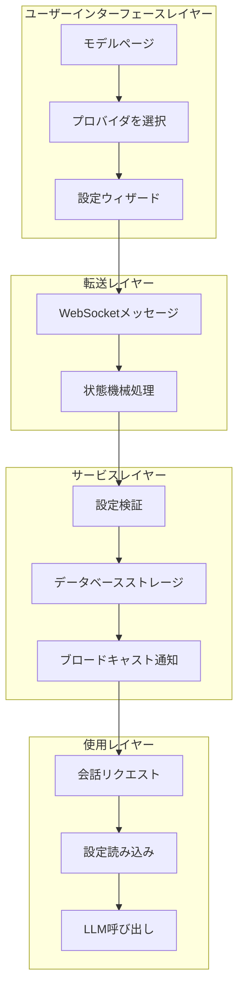

## プロバイダ設定フロー

### 設定ステップシーケンス

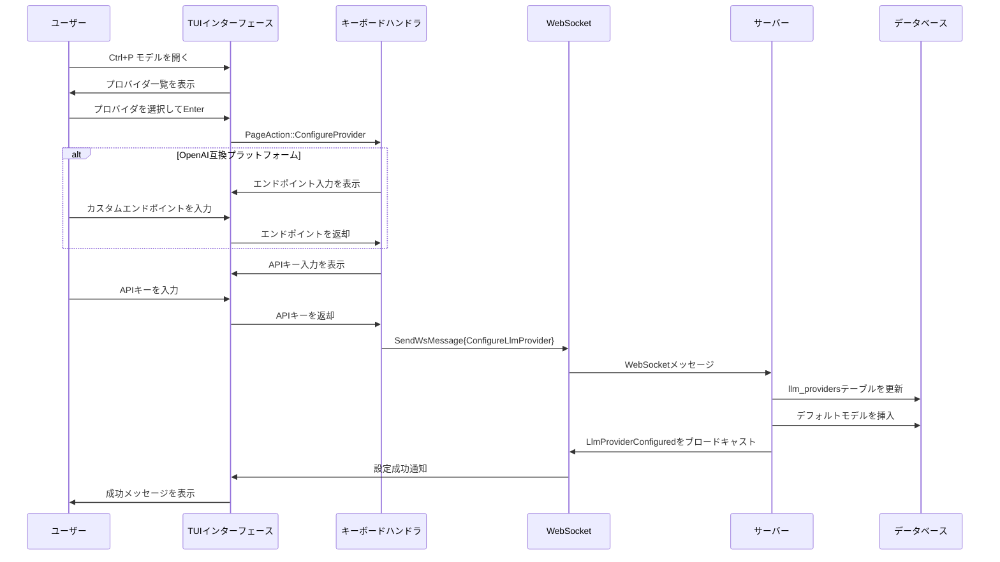

### 設定状態機械

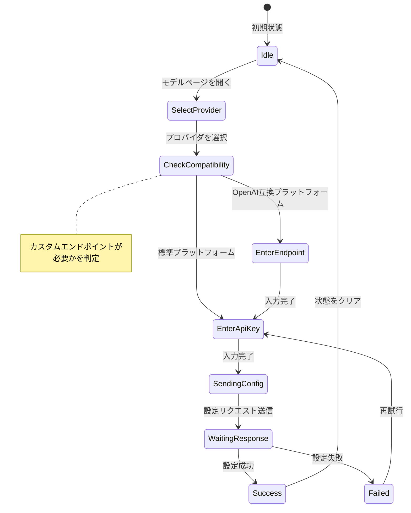

## 会話使用フロー

### LLM呼び出しシーケンス

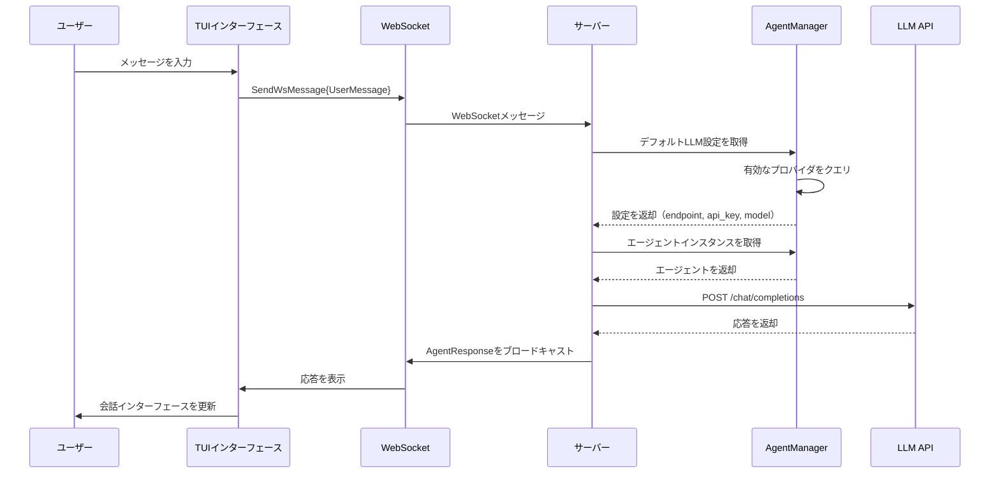

## 主要設計判断

### 二段階設定フロー

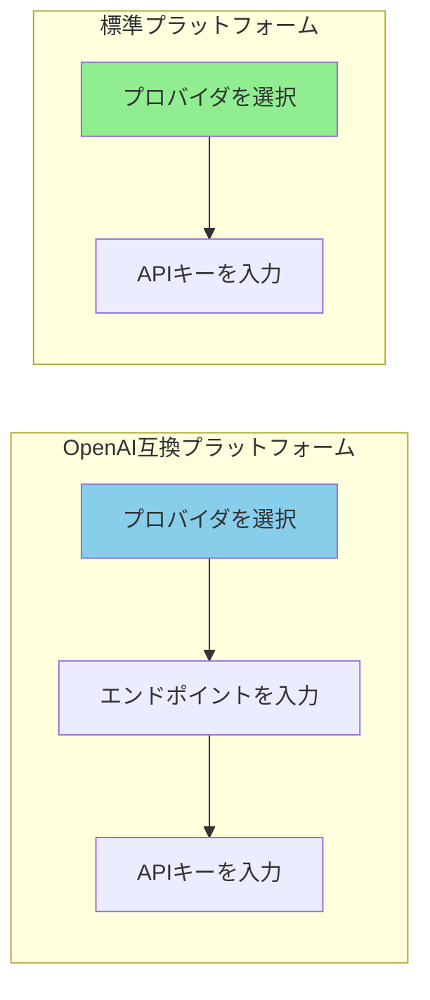

| プラットフォーム種別 | 設定ステップ | 理由 |
| --- | --- | --- |
| OpenAI互換 | エンドポイント + APIキー | カスタムサービスエンドポイントが必要 |
| 標準プラットフォーム | APIキーのみ | 公式エンドポイントを使用 |

### 設定状態管理

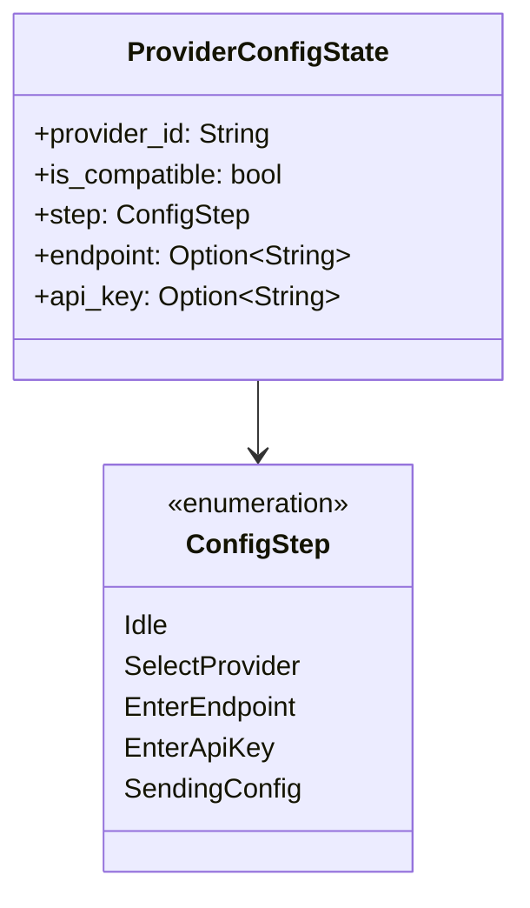

### デフォルトモデル自動挿入

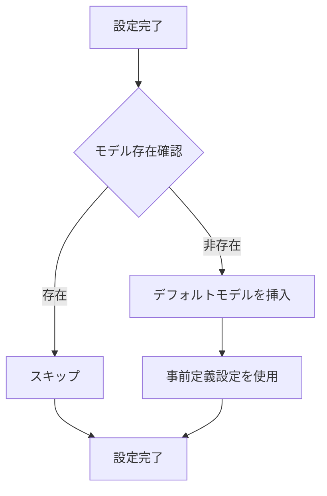

## パフォーマンス最適化

### 設定キャッシュ戦略

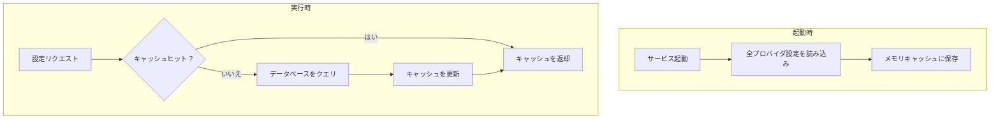

### コネクションプール管理

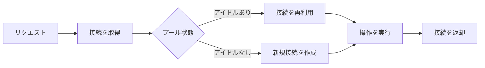

## エラーハンドリング

### ユーザー入力検証

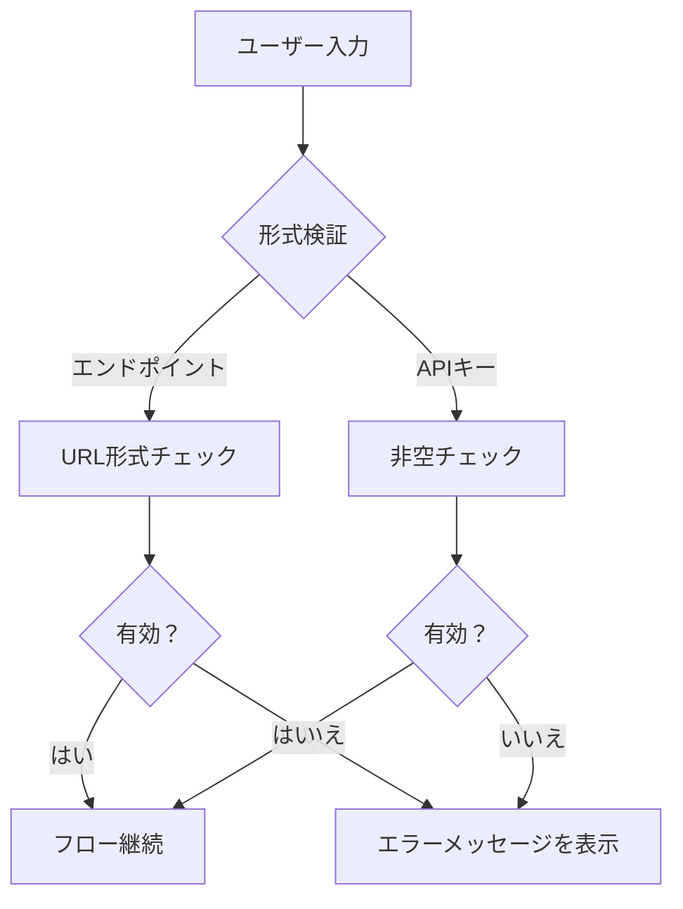

### ネットワークエラーハンドリング

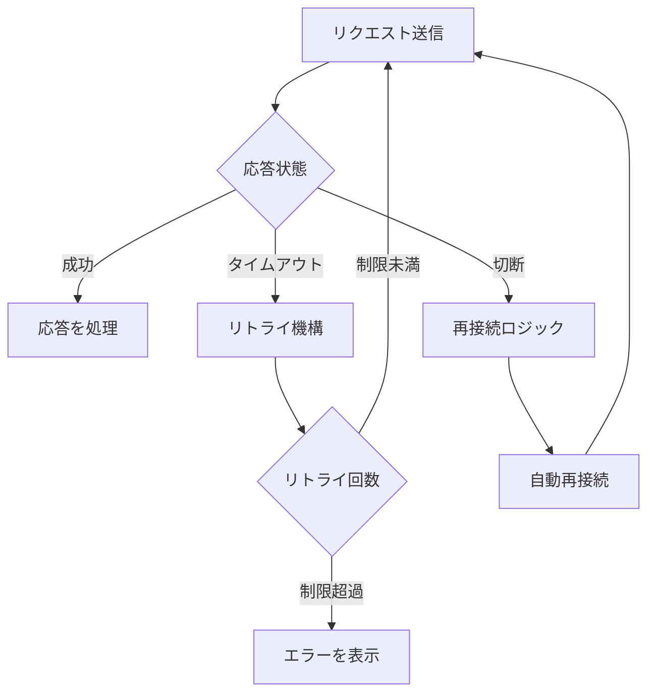

## セキュリティ考慮事項

### APIキー保護

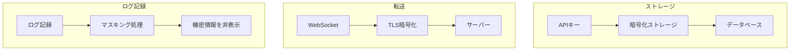

### セキュリティ対策

| 段階 | 対策 | 説明 |
| --- | --- | --- |
| ストレージ | 暗号化ストレージ | データベース内のAPIキーを暗号化 |
| 転送 | TLS暗号化 | WebSocketが暗号化チャネルを使用 |
| ログ記録 | マスキング | 平文キーをログ出力しない |
| 入力 | パラメータ化クエリ | SQLインジェクションを防止 |

## 拡張性設計

### 新規プロバイダの追加

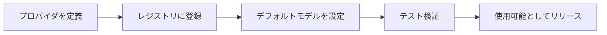

### マルチプロバイダサポート

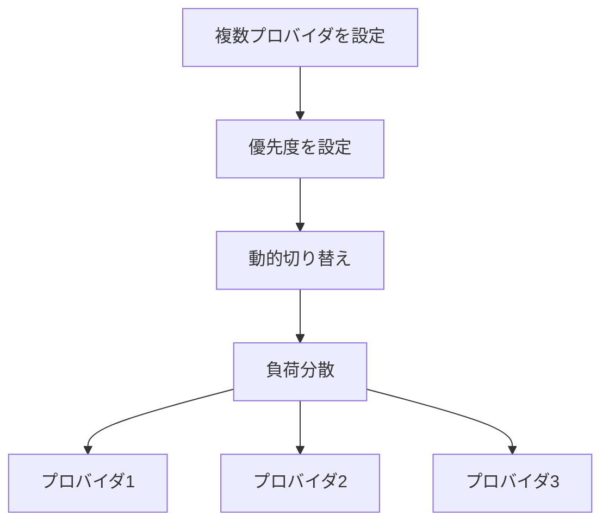

## メッセージ型定義

### WebSocketメッセージ

| メッセージ型 | 方向 | 説明 |
| --- | --- | --- |
| ConfigureLlmProvider | TUI → サーバー | 設定リクエスト |
| LlmProviderConfigured | サーバー → TUI | 設定結果 |
| UserMessage | TUI → サーバー | ユーザー会話 |
| AgentResponse | サーバー → TUI | エージェント応答 |

## 将来計画

| 機能 | 説明 | 優先度 |
| --- | --- | --- |
| 設定インポート/エクスポート | 設定ファイル移行のサポート | 高 |
| プロバイダヘルスチェック | 定期的なプロバイダ可用性検出 | 中 |
| 自動フェイルオーバー | プロバイダ利用不可時の自動切り替え | 中 |
| 使用統計との統合 | 使用統計システムとの連携 | 低 |

# MCPプロンプト注入とコンテキスト圧縮機構

## 概要

本書は2つの主要なアーキテクチャ設計を説明する：MCPツール必須プロンプト注入機構とTodoマーカーベースのコンテキスト圧縮機構。これら二つの機構は連携してエージェントの動作を標準化し、長い会話シナリオにおけるコンテキスト管理を最適化する。

## I. MCPツールドキュメント注入（Exec-Only）

### コア概念

exec-onlyマイクロカーネルアーキテクチャの下で、LLMは**3つのツール定義**（`exec`、`write_to_var`、`write_to_var_json`）のみを受け取る。MCPツールはexecのJSランタイムを通じて呼び出される内部APIである。MCPツールドキュメントは、`related_tools` 機構を介してJS APIドキュメントとしてスキルプロンプトに注入される。LLMに個別のツール定義として送信されることはない。

```mermaid
flowchart LR
    A[スキル related_tools] --> B[McpToolDocLoader]
    B --> C[TOMLパラメータ + MD説明を読み取り]
    C --> D[JS APIドキュメントとして整形]
    D --> E[システムプロンプトに注入]

    style D fill:#90EE90
```

### 主要特性

| 特性 | 説明 |
| --- | --- |
| Exec-only表面 | LLMは `exec`、`write_to_var`、`write_to_var_json` のみを参照。MCPツールはツール定義として公開されない |
| スキルスコープ | ツールドキュメントはグローバルではなく `related_tools` を介してスキルごとに注入 |
| JS API形式 | `ES module import API reference — description` として整形 |
| 内部ルーティング | McpToolRegistryはエージェントごとだが内部ディスパッチにのみ使用 |

### 設計動機

```mermaid
flowchart TB
    subgraph 問題シナリオ
        A[ツール定義が多すぎてコンテキストが肥大化]
        B[ツールごとのプロンプト注入が脆弱]
        C[ツールの氾濫でLLMが混乱]
    end

    subgraph 解決策
        D[3ツール表面: exec, write_to_var, write_to_var_json]
        E[MCPドキュメントはJS APIリファレンスとして]
        F[スキルスコープのrelated_tools注入]
    end

    A --> D
    B --> E
    C --> F
```

### 注入フロー

```mermaid
sequenceDiagram
    participant Skill as スキル（related_tools）
    participant Loader as McpToolDocLoader
    participant MCP as MCPツール設定（TOML + MD）
    participant Prompt as システムプロンプト

    Skill->>Loader: 関連ツール名のリスト
    Loader->>MCP: TOMLパラメータ + MD説明を読み取り
    MCP-->>Loader: ツールメタデータ

    Loader->>Loader: ES module import API reference — description として整形
    Loader->>Prompt: システムプロンプトのスキルセクションに注入

    Note over Prompt: LLMはexecツールのみを参照<br/>MCPドキュメントはJS APIリファレンスとして表示
```

### 注入形式

各MCPツールのドキュメントはJS APIリファレンスとして整形される：

$agent.todo_list_view() — 現在のtodoツリー構造を表示
$agent.todo_create({ title: String, description: String }) — 新しいtodo項目を作成
$agent.todo_update_status({ `todo_id`: String, status: String }) — todo項目のステータスを更新

### 設定例

```mermaid
flowchart TB
    subgraph スキル related_tools
        A[スキルTOML: related_toolsフィールド]
        A --> A1["[tool_name]"]
        A1 --> B[todo_list_view]
        A1 --> C[todo_create]
        A1 --> D[todo_update_status]
    end

    subgraph McpToolDocLoader
        E[TOMLパラメータを読み取り]
        F[MD説明を読み取り]
        G[JS APIドキュメントとして整形]
    end

    B --> E
    C --> E
    D --> E
    E --> F --> G
```

### 権限レベル

各 `[[related_tools]]` エントリはオプションで `access_mode` を宣言できる：

[[`related_tools`]]
`agent_name` = "polemos"
`tool_name` = "`node_execute`"
`access_mode` = "read"       # スキルは読み取りレベルのアクセスのみ必要（デフォルト: "read"）

二重認可ゲートウェイは以下をチェックする：

1. ツールの宣言された `ToolCapability` が要求された `access_mode` をサポートしていること
1. 対象ノードの `TrustLevel` が操作を許可していること
1. 外部ノードの場合、追加のリスクレベルゲーティングが適用されること

詳細は `docs/design/en/22-mcp-tool-permission-model.md` を参照。

### 利点とトレードオフ

```mermaid
graph TB
    subgraph 利点
        A[最小限のツール表面]
        B[スキルスコープのドキュメント]
        C[一貫したAPI形式]
        D[内部ルーティングの柔軟性]
    end

    subgraph トレードオフ
        E[LLMがJS呼び出しを構築する必要がある]
        F[デバッグにexecトレースが必要]
        G[related_toolsの保守が必要]
    end
```

## II. Todoマーカーベースのコンテキスト圧縮機構

### コア概念

従来の圧縮はテキストの要約に依存し、重要な詳細を失う。新しい機構は主要なTodo項目をマークし、元の詳細をユーザー入力として保存し、元のスキル実行を直接継続する方式に変更する。

```mermaid
flowchart LR
    subgraph 従来方式
        A1[コンテキスト] --> B1[要約テキスト]
        B1 --> C1[新しい会話]
        C1 --> D1[詳細損失の可能性]
    end

    subgraph Todoマーカー方式
        A2[コンテキスト] --> B2[主要Todoをマーク]
        B2 --> C2[元の詳細を保持]
        C2 --> D2[情報損失なし]
    end
```

### 設計動機比較

| 従来方式の問題点 | Todoマーカーの利点 |
| --- | --- |
| 情報損失 | 元の情報を保持 |
| 意味のドリフト | 追跡可能 |
| 検証不可能 | 検証可能 |
| スキル無効化 | スキル継続性 |

### 圧縮フロー

```mermaid
sequenceDiagram
    participant User as ユーザー
    participant Agent as 元のエージェント
    participant Marker as Todoマーカー
    participant NewAgent as 新しいエージェント
    participant TodoMCP as Todo MCP

    User->>Agent: コンテキスト圧縮を要求
    Agent->>Marker: 主要Todo項目を取得

    Note over Marker: マーキング戦略を適用

    Marker-->>Agent: マークされた項目リスト
    Agent->>TodoMCP: 詳細をバッチ取得
    TodoMCP-->>Agent: Todo詳細

    Agent->>NewAgent: 新しいセッションを開始

    Note over NewAgent: システムプロンプト = 元のスキル<br/>ユーザー入力 = Todo詳細

    NewAgent->>TodoMCP: Todoツリーを表示
    Note over NewAgent: 詳細は既に入力にあることを確認<br/>直接継続
```

### マーキング戦略

```mermaid
flowchart TB
    subgraph 戦略タイプ
        A[手動マーキング]
        B[AutoCritical クリティカルパス]
        C[AutoUnfinished 未完了タスク]
        D[ハイブリッド戦略]
    end

    A --> A1[ユーザーが主要項目を選択]
    B --> B1[メインタスクチェーンを自動識別]
    C --> C1[全未完了項目をマーク]
    D --> D1[複数戦略を組み合わせ]
```

### 戦略比較

| 戦略 | マーク内容 | 適用シナリオ |
| --- | --- | --- |
| 手動 | ユーザー指定 | 正確な制御 |
| AutoCritical | メインタスクチェーン + ブロックタスク | 複雑なタスク |
| AutoUnfinished | 全未完了タスク | 単純なリカバリ |
| ハイブリッド | 組み合わせ + ユーザーマーク | 一般的なシナリオ |

### マーク項目構造

```mermaid
classDiagram
    class MarkedTodoItem {
        +todo_id: String
        +include_depth: u32
        +include_ancestors: bool
        +include_artifacts: bool
    }

    class MarkerStrategy {
        <<enumeration>>
        Manual
        AutoCritical
        AutoUnfinished
        Hybrid
    }

    class TodoMarker {
        +marked_items: List~MarkedTodoItem~
        +marker_strategy: MarkerStrategy
        +mark_critical_todos()
    }

    TodoMarker --> MarkedTodoItem
    TodoMarker --> MarkerStrategy
```

## III. 二つの機構の連携

### 連携フロー

```mermaid
sequenceDiagram
    participant User as ユーザー
    participant OldAgent as 旧エージェント
    participant Marker as Todoマーカー
    participant Loader as McpToolDocLoader
    participant NewAgent as 新エージェント

    Note over OldAgent: コンテキストが上限に近い

    User->>OldAgent: コンテキストを圧縮
    OldAgent->>Marker: 主要Todoをマーク
    Marker-->>OldAgent: マーク項目リスト

    OldAgent->>NewAgent: 新しいセッションを作成

    Note over NewAgent: システムプロンプト = ソウル + スキル<br/>related_toolsがMcpToolDocLoaderにより読み込み

    NewAgent->>Loader: related_toolsのツールドキュメントを読み込み
    Loader-->>NewAgent: 整形されたJS APIドキュメント

    Note over NewAgent: システムプロンプトには以下が含まれる：<br/>1. ソウルアイデンティティ<br/>2. スキルテンプレート + related_toolsドキュメント<br/>3. 3つのツール: exec, write_to_var, write_to_var_json

    NewAgent->>NewAgent: exec JSランタイムで実行
    Note over NewAgent: MCPツールは内部API<br/>詳細は既に入力にあることを確認

    NewAgent-->>User: シームレスなタスク継続
```

### 主要な連携ポイント

```mermaid
flowchart TB
    subgraph 連携機構
        A[McpToolDocLoaderがJS APIドキュメントを注入]
        B[マーカーが完全なコンテキストを提供]
        C[ソウル + スキルプロンプトが保持]
    end

    A --> D[スキルがMCPツールのJS APIリファレンスを持つ]
    B --> E[十分な完全情報が提供される]
    C --> F[行動の一貫性が維持される]

    D --> G[シームレスなタスク継続]
    E --> G
    F --> G
```

## IV. 実装ロードマップ

```mermaid
flowchart LR
    subgraph フェーズ1 高優先度
        A[MCPプロンプト注入]
        A --> A1[データ構造]
        A --> A2[注入ロジック]
        A --> A3[設定管理]
    end

    subgraph フェーズ2 中優先度
        B[Todoマーカー機構]
        B --> B1[マーキング戦略]
        B --> B2[圧縮リカバリ]
        B --> B3[手動マーキング]
    end

    subgraph フェーズ3 低優先度
        C[スマート戦略]
        C --> C1[AutoCritical]
        C --> C2[ハイブリッド]
        C --> C3[スマート提案]
    end
```

## V. リスク評価と軽減

### リスクマトリックス

| リスク | 影響 | 軽減策 |
| --- | --- | --- |
| トークンオーバーヘッド過大 | パフォーマンス低下 | マーク数制限、圧縮レベル設定 |
| プロンプトが厳格すぎる | 柔軟性低下 | バイパス機構、例外処理ガイダンスを提供 |
| マーキング戦略の不正確さ | 情報欠落 | 手動上書き、視覚的確認 |

### エラーハンドリングフロー

```mermaid
flowchart TB
    A[操作失敗] --> B{失敗種別}
    B -->|トークン超過| C[非重要項目をトリミング]
    B -->|戦略失敗| D[手動モードにフォールバック]
    B -->|注入失敗| E[デフォルト動作を使用]

    C --> F[操作を再試行]
    D --> F
    E --> F
```

## VI. 設定統合

### 全体設定構造

```mermaid
flowchart TB
    subgraph スキル設定
        A[related_tools]
        B[tool_names リスト]
    end

    subgraph 圧縮設定
        C[enabled]
        D[default_strategy]
        E[trigger_threshold]
    end

    subgraph 戦略設定
        F[include_critical_path]
        G[include_unfinished]
        H[max_marked_items]
    end

    A --> I[JS APIドキュメント生成]
    C --> J[圧縮制御]
    F --> K[マーキングルール]
```

## VII. 将来の拡張

| 機能 | 説明 | 優先度 |
| --- | --- | --- |
| 動的プロンプト生成 | タスクの複雑さに基づいて制約を調整 | 中 |
| マルチセッション共有 | 複数エージェントがTodoマーカーを共有 | 中 |
| スマートマーキング提案 | マーク項目を自動推奨 | 低 |
| ビジュアルマーキングツール | グラフィカルなマーキングインターフェース | 低 |

## VIII. 補完的RAGコンテキスト注入（v2.1+）

セクションI-VIIで説明したMCPツール注入はLLMに**APIリファレンス**を提供する — *どのように*ツールを呼び出すかをLLMに伝える。補完的な機構であるRAGコンテキスト注入はLLMに**事前計算された知識**を提供する — RAGクエリの*結果*をシステムプロンプトに直接注入する。

| 側面 | MCPツール注入 | RAGコンテキスト注入 |
| --- | --- | --- |
| LLMが受け取るもの | APIリファレンスドキュメント（ESモジュールインポート） | 実際の知識内容（メモリノード、ワークスペースドキュメント） |
| 注入タイミング | スキルごと、`related_tools` に基づく | スキルステップごと、スキルコンテキストに基づく |
| LLMの関与 | LLMがツールを呼び出す必要がある | LLMの関与なし — 事前計算 |
| レイテンシ影響 | N往復（1呼び出しにつき1回） | スキルステップごとに1回の事前計算 |
| IEPLモジュール | `{agent}`（MCPディスパッチ） | `rag/{philia,aporia}`（バッファ読み取り） |

両方の機構は共存する：MCPツールは事前計算されたコンテキストがカバーしないクエリのフォールバックとして利用可能のままである。完全な設計については `docs/design/en/26-rag-context-injection.md` を参照。

# エージェント二重アイデンティティと可視性境界設計

## 目標

- 可視スキル実行インスタンスを内部MCP/LLMツールプロバイダから完全に分離する。
- スキル呼び出しのみが3桁バッジ付きの一時的可視エージェントを作成可能とする。
- MCP/LLMモデルとトークン使用量を、余分な可視エージェントを作成するのではなく、紐付くスキルインスタンスに帰属させる。
- ランタイムUUIDアイデンティティを監査・履歴・リプレイ用に保持しつつ、TUIタイムラインに漏洩させない。

## アイデンティティレイヤー

- `agent_number`: 3桁のUI向けバッジであり、可視タイムラインノードの安定したキー。
- `agent_uuid`: レジストリ・監査・履歴に使用されるランタイムUUID。
- `agent_id`: 互換性フィールド。
  - 可視TUIペイロードでは、`agent_id` はパネル向けの `agent_number` と一致すべき。
  - 内部レジストリとMCP実行パスでは、`agent_id` はUUID形式のままでよい。

## 可視性とインスタンス化ルール

- スキル呼び出しのみが一時的な可視エージェントインスタンスを作成する。
- SimpleTool/MCPプロバイダは、そのツールが呼び出されたというだけの理由で追加の可視エージェントを作成してはならない。
- スキルがMCPツールや内部 `llm_chat` 呼び出しを使用する場合、それらの呼び出しはそのスキルインスタンスの下位実行として留まる。
- 例: HubRisがApoRia `llm_chat` を呼び出す場合、ApoRiaは内部実行者として留まり、右上タイムラインに第二の可視ノードとして表示されてはならない。

## MCPおよびLLM帰属ルール

- MCP/LLM呼び出しが可視スキルインスタンスに属する場合、そのモデル名とトークン使用量はそのスキルインスタンスに帰属させなければならない。
- 内部プロバイダは自身の監査やグローバル会計を保持してもよいが、それらの内部統計がTUIノード作成をトリガーしてはならない。
- MCPログとコンテキストは以下を保持すべき：
  - `agent_number`
  - `agent_uuid`
  - `tool_name`
  - `phase`（`start`/`finish`）
  - `success` および `error`

## TUIレンダリング規約

- TUIは明示的な3桁パネルIDに対してのみタイムラインノードを作成する。
- 可視 `agent_number` のないペイロードはグローバルモデル/トークン統計のみを更新し、可視エージェントノードを作成してはならない。
- 表示ラベルとノードキーは、UUIDや `agent_id` 内に見つかる任意の数字から可視バッジを導出してはならない。
- 可視ノードの場合：
  - `agent_number` は表示と対話に使用される。
  - `agent_uuid` は監査・履歴・デバッグ用にのみ保持される。

## バッジ割り当てとライフサイクル

- `agent_number` は順次割り当てではなく、利用可能な `000`-`999` プールからランダムに割り当てられる。
- 解放された番号は再利用可能。
- 1000個のバッジすべてがアクティブな場合、アロケーターはランダムな再利用にフォールバックしてよい。その場合、履歴的な曖昧性解消は `agent_uuid` に依存しなければならない。
- 可視インスタンスのクリーンアップとバッジ回収はスキルライフサイクルマネージャーが処理する。

## 互換性制約

- `agent_id` のみを運ぶレガシーペイロードは内部的に解析可能だが、可視UIはUUID形式のIDから新しいノードを合成してはならない。
- `agent_number` と `agent_uuid` の両方が存在する場合、二重アイデンティティモデルが適用される：
  - `agent_number` は表示と対話用。
  - `agent_uuid` は監査と履歴用。

# リクエスト並行性アーキテクチャ

## 概要

Scepterは2つの独立した並行性レイヤーを管理する：

```mermaid
flowchart LR
    User["ユーザーリクエスト"] --> Semaphore["リクエストセマフォ"]
    Semaphore --> Cosmos["Cosmosコンテナ"]
    Cosmos --> Queue["階層キュー（RequestPool）"]
    Queue --> LLM["LLM API"]
```

## アナロジー

レストランを考えてみよう：

- **顧客**（ユーザーリクエスト）が到着し、同時に注文する
- **テーブル**（Cosmosコンテナ）はリクエストごとに作成される — それぞれが自身のワークスペースを持つ
- **厨房ステーション**（LLMプロバイダ並行性）は制限されている — おそらく合計3つ
- **チケットシステム**（RequestPool階層キュー）が階層ごとのFIFO順序を管理する

30人の顧客が同時に注文できるが（scepterは複数リクエストを受け付ける）、厨房は一度に3品しか調理できない（LLM APIレート制限）。

## レイヤー1: リクエストセマフォ

**場所**: `state_machine/domains/control_domain.rs` — `concurrent_request_semaphore`

scepterが同時に受け付けるユーザーリクエスト数を制御する。各リクエストは自身のLLMハンドルを持つ独立したCosmosコンテナを作成する。

```mermaid
flowchart LR
    User1["ユーザーメッセージ"] -->|"N = 全モデルのmax_concurrent合計"| Semaphore["Semaphore(N)"]
    User2["ユーザーメッセージ"] --> Semaphore
    User3["ユーザーメッセージ"] --> Semaphore
    Semaphore --> Container1["Cosmosコンテナ + LLMハンドル"]
    Semaphore --> Container2["Cosmosコンテナ + LLMハンドル"]
    Semaphore --> Container3["Cosmosコンテナ + LLMハンドル"]
```

N = 有効な全モデルの同時スロット合計。モデルA（3スロット）+ B（2スロット）= 5つの同時リクエスト。

以前は `AtomicBool`（N=1）だったが、現在は `Semaphore(N)`。

## レイヤー2: 階層キュー（RequestPool）

**場所**: `infra/request_pool.rs` — `RequestPool`

モデルごとのセマフォを持つ階層ごとのFIFOキュー。階層内で：

1. 到着するLLMリクエストが階層キューに入る
1. 最初に最高優先度モデルのスロット獲得を試みる
1. ビジーなら優先度順に次のモデルを試行
1. すべてビジーならFIFOキューで待機 — どのモデルのスロットが空いても次のリクエストを処理

```mermaid
flowchart TB
    subgraph Tier["階層: 'normal'"]
        direction TB
        Queue["FIFOキュー: req1 → req2 → req3 → req4"]
        MA["モデルA（優先度10）: Semaphore(3) ■■□"]
        MB["モデルB（優先度5）:  Semaphore(2) □□"]
        MC["モデルC（優先度1）:  Semaphore(1) ■"]
        Queue -->|"req1 → モデルA（利用可能）"| MA
        Queue -->|"req2 → モデルB（利用可能、Aビジー）"| MB
        Queue -->|"req3 → 待機... モデルA空く → 処理"| MA
        Queue -->|"req4 → 待機... モデルC空く → 処理"| MC
    end
```

### 主要特性

- **プロバイダごとの隔離**: 各モデルの `max_concurrent` は独立
- **優先度順序**: 利用可能な場合、高優先度モデルが優先される
- **フォールバック**: 高優先度モデルが飽和している場合、低優先度モデルが即座に処理
- **FIFO公平性**: 待機リクエストは到着順に処理される

### 設定

# provider_config.toml
[[models]]
id = "gpt-5.4"
tier = "normal"
priority = 10
`max_concurrent` = 3        # このモデルへの同時API呼び出し3件

[[models]]
id = "gpt-4o-mini"
tier = "normal"
priority = 5
`max_concurrent` = 5        # 同時API呼び出し5件

[[models]]
id = "deepseek-v3"
tier = "deep"
priority = 8
`max_concurrent` = 2

この設定では：

- `normal` 階層: モデルA（3スロット）+ モデルB（5スロット）= 8つの同時normal階層LLM呼び出し
- `deep` 階層: モデルC（2スロット）= 2つの同時deep階層LLM呼び出し
- リクエストセマフォ: 3 + 5 + 2 = 10の同時ユーザーリクエスト

## フロー: ユーザーメッセージ → LLM応答

    1. ユーザーがTUI/CLI/ソケット経由でメッセージを送信
    1. `handle_user_message`():

a. リクエストセマフォ（レイヤー1）で `try_acquire`()

          - スロットがない場合: "busy" エラーを返す
          - 各スロット → 独立したCosmosコンテナ

b. `execute_skill_chain`() → `invoke_aporia_llm_chat`()

    1. `invoke_aporia_llm_chat`():

a. `RequestPool`（レイヤー2）で `acquire_tier`("normal", `excluded_models`)

          - 各モデルを優先度順に試行（非ブロッキング）
          - すべてビジー: いずれかのモデルスロットが空くまでFIFOで待機
          - TierPermit { `model_id`, `display_name` } を返す

b. `chat_loop` → llm_backend.chat() → LlmService::`chat_with_tools`()

          - 選択されたモデルをAPI呼び出しに使用

c. TierPermitがドロップ → セマフォスロット解放

    1. `finish_handling`():

a. リクエストセマフォパーミット返却
b. Cosmosコンテナをクリーンアップ（または再利用）可能

## E2Eテスト

テストはアイドルタイムアウト（絶対期限ではない）を使用する。タイマーは意味のあるイベントごとにリセットされる：

# アクティビティがアイドルタイマーをリセット — チェーンはアクティブであり続ける限り無期限に実行可能
ACTIVE_METHODS = {
"Tui.`OrchestrationStatus`",
"Tui.`McpToolResult`",
"Tui.`AgentReport`",
"Tui.`AgentStreamingChunk`",
"Tui.`TaskStatusUpdate`",
"Tui.`AskHumanRequest`",
"Tui.AgentPatch",
"Tui.`ContainerSnapshot`",
}

これにより以下が保証される：

- 短いアイドルタイムアウト（120秒）が真に停止したチェーンを捕捉
- 長時間実行だがアクティブなチェーン（複雑なマルチスキル）が早期に強制終了されない

# 組み込み開発DB & フィーチャーゲートによるプロダクション隔離

## 概要

entelecheiaは2つの目的で組み込みPostgreSQLとして[pglite-oxide](https://crates.io/crates/pglite-oxide)を使用する：

1. **ローカル開発**: `DATABASE_URL` が設定されていない場合、scepterは自動的にpgvectorサポート付きのプロセス内PostgreSQL（WASM/wasmer経由のPG 17.5）を起動する。
1. **統合テスト**: PG統合テストはDocker/testcontainersの代わりにpglite-oxideを使用する。

プロダクション（Docker）では、`embedded-db` フィーチャーが除外され、scepterは実際のPostgreSQLコンテナに接続する。

## 設計動機

以前は、ローカル開発にDocker Composeか手動のPostgreSQLインストールが必要だった。統合テストは `testcontainers` に依存し、CIでのDocker-in-Dockerの複雑さを追加していた。pglite-oxideは両方の要件を排除する — ローカル開発では `cargo run` が「そのまま動作」し、`cargo test` はDockerなしで実行される。

## フィーチャーゲートアーキテクチャ

```mermaid
flowchart TB
    Cargo["scepter Cargo.toml<br/>[features] default = ['all-agents', 'embedded-db']  ← 開発<br/>embedded-db = ['dep:pglite-oxide']<br/>[dependencies] pglite-oxide = { workspace = true, optional = true }"]

    Cargo -->|"cargo build (デフォルト)"| Dev["pglite-oxide + wasmer WASM<br/>含まれる"]
    Cargo -->|"Dockerfile<br/>--no-default-features<br/>--features all-agents"| Prod["pgliteなし、wasmerなし<br/>(プロダクション)"]
```

| ビルドコンテキスト | コマンド | pglite-oxide | wasmer | DATABASE_URL |
| --- | --- |  ---  |  ---  | --- |
| `cargo run`（ローカル開発） | デフォルトフィーチャー | ✓ | ✓ | オプション — 不足時は組み込みPGを自動起動 |
| `cargo test`（テスト） | デフォルトフィーチャー | ✓ | ✓ | テストハーネスが自動起動 |
| `just build`（リリース） | `--no-default-features --features all-agents` | ✗ | ✗ | 必須 |
| Docker `Dockerfile` | `--no-default-features --features all-agents` | ✗ | ✗ | 必須（PGコンテナを指す） |

## 実行時DB解決順序

// packages/scepter/src/app/setup.rs
let `db_url` = if let Ok(url) = std::env::var("DATABASE_URL") {
// 1. 環境変数（プロダクション: Docker PG、開発: .envファイル）
url
} else if !user_config.database.url.is_empty() {
// 2. ユーザー設定ファイル（~/.config/entelecheia/config.toml）
user_config.database.url.clone()
} else {
// 3. 組み込みpglite-oxide（フィーチャーゲート）
#[cfg(feature = "embedded-db")]
{
let server = `PgliteServer`::builder()
.extension(`pglite_oxide`::extensions::VECTOR)  // pgvectorサポート
.start()?;
let url = server.database_url();
std::mem::forget(server);  // プロセス寿命中保持
url
}
#[cfg(not(feature = "embedded-db"))]
{
return Err(/* "DATABASE_URLが設定されていません" */);
}
};

## テストハーネスパターン

```no_run
// tests/pg_integration/auth_test.rs
static PG: OnceCell<(String, PgliteServer)> = OnceCell::const_new();

# [test]
fn pg_integration_tests() {
    let rt = tokio::Runtime::new().unwrap();
    rt.block_on(async {
        let url = ensure_pg_url().await;
        let db = connect_db(&url).await;  // max_connections=1
        pg_user_crud(&db).await;
        pg_unique_username(&db).await;
        pg_rbac_role_persistence(&db).await;
        pg_rbac_audit_log(&db).await;
    });
    std::process::exit(0);  // sqlxプールハングをバイパス
}
```

## 作成されるテーブル

全23テーブル + 1スキーマスコープテーブル + 4ビューがSeaORMマイグレーションにより作成される：

**コア**: `users`, `rbac_user_roles`, `rbac_audit_log`, `agents`, `conversations`, `messages`, `tasks`
**目標**: `goals`, `tracks`, `goal_tasks`
**知識**: `knowledge_bases`, `knowledge_documents`（pgvector埋め込み）, `rag_subscriptions`
**合意**: `consensus_records`, `consensus_references`, `consensus_verifications`
**インフラ**: `credentials`, `ssh_credentials`, `container_snapshots`, `model_usage_stats`
**ワークスペース**: `workspace_registry`, `todo_items`, `workspace_bindings`
**ログ**: `log.entries`（個別の `log` スキーマ）
**ビュー**: `usage_period_stats`, `usage_model_stats`, `usage_role_stats`, `usage_session_stats`

## PGlite制約

| 制約 | 影響 | 軽減策 |
| --- | --- | --- |
| `max_connections=1` | 一度に1つのプールのみ | サブテスト間でDB接続を共有。テスト間で `db.close()` しない |
| 厳密な型キャスト | `uuid = text` が失敗 | 常に型付き値を渡す（例：UUID列には `Uuid` を使用、`String` ではなく） |
| 同時アクセス不可 | テストは逐次的である必要がある | 全サブテストをインライン化した単一 `#[test]` ランナー |
| sqlxプールバックグラウンドタスク | `close()` が無期限にハング | 全テスト完了後に `std::process::exit(0)` |

## Dockerビルド堅牢化

すべてのプロダクションDockerfileはembedded-dbを除外する：

# Dockerfile
RUN cargo build --release -p scepter \
--no-default-features --features all-agents

これにより、プロダクションイメージにwasmer/pgliteコードがゼロであることを保証し、バイナリサイズを最小化し、攻撃表面を削減する。
