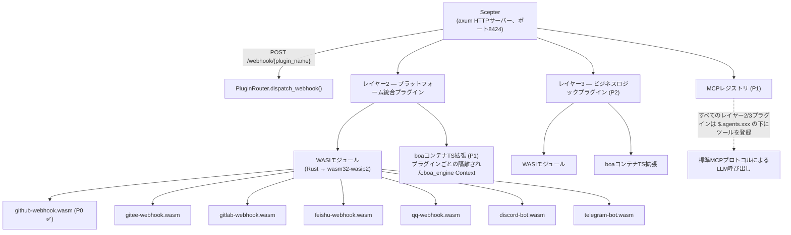
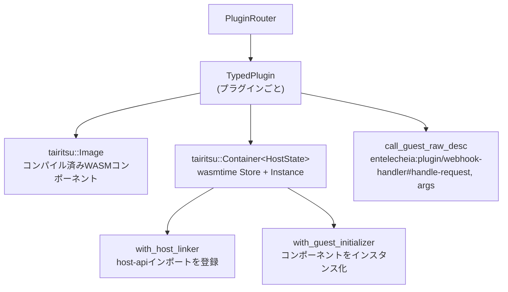

# 25 — WASIプラグインシステム設計

## 概要

WASIプラグインシステムは、以前のPython/TypeScript Webhookスキャフォールディングを**WASMコンポーネントモデル**プラグインに置き換え、サンドボックス化された言語非依存のプラットフォーム統合（レイヤー2）とビジネスロジック拡張（レイヤー3）を提供する。主要な設計目標：

1. **二重拡張機構**: レイヤー2（プラットフォーム統合）とレイヤー3（ビジネスロジック）の両方がWASIモジュールとboa TS拡張をサポートする。
1. **統一MCP登録**: すべてのプラグインは実装言語に関わらず `$.agents.xxx` の下にツールを登録する。
1. **ホスト管理I/O**: ホスト（Scepter axumサーバー）がHTTPルーティング、WebSocket、永続接続を処理する。プラグインはロジックのみを処理する。
1. **強力なサンドボックス化**: WASMモジュールは燃料制限とエポック割り込み付きでwasmtimeの下で実行される。

## アーキテクチャ



## WITインターフェース定義

`packages/shared/plugin_host/wit/plugin.wit` に配置：

```wit
package entelecheia:plugin;

interface host-api {
    http-request:  func(method: string, url: string, headers: string, body: string) -> result<string, string>;
    forward-event: func(event-json: string) -> result<_, string>;
    query-ai:      func(message: string, context: option<string>) -> result<string, string>;
    log:           func(level: string, message: string);
    config-get:    func(key: string) -> option<string>;
    kv-get:        func(key: string) -> option<string>;
    kv-set:        func(key: string, value: string) -> result<_, string>;
    register-mcp-tool: func(tool-name: string, description: string, schema: string) -> result<_, string>;
}

interface webhook-handler {
    name: func() -> string;
    handle-request: func(method: string, path: string, headers: string, body: string) -> result<string, string>;
}

interface bot-handler {
    name: func() -> string;
    on-message: func(platform: string, message: string) -> result<option<string>, string>;
}

world layer2-plugin {
    import host-api;
    export webhook-handler;
}

world layer2-bot {
    import host-api;
    export bot-handler;
}
```

### ホスト側API登録

ホストはコンポーネントのインスタンス化前にwasmtimeの `component::Linker::func_wrap` を使用してすべての `host-api` 関数を登録する：

```rust
let mut instance = linker.root().instance("entelecheia:plugin/host-api")?;

instance.func_wrap("http-request",
    |_: StoreContextMut<'_, HostState>,
     (method, url, headers, body): (String, String, String, String)| {
        Ok::<(Result<String, String>,), wasmtime::Error>(
            (api.http_request(method, url, headers, body),)
        )
    }
)?;
```

### ゲスト側バインディング

プラグインは `wit_bindgen::generate!()` を使用してゲスト側バインディングを生成する：

```rust
wit_bindgen::generate!({
    path: "wit",
    world: "layer2-plugin",
});

struct GithubWebhookPlugin;
impl exports::entelecheia::plugin::webhook_handler::Guest for GithubWebhookPlugin {
    fn name() -> String { "github-webhook".to_string() }
    fn handle_request(method: String, path: String, headers: String, body: String)
        -> Result<String, String> { /* ... */ }
}
export!(GithubWebhookPlugin);
```

## プラグインホストアーキテクチャ

### クレート: `_shared_plugin_host` (`packages/shared/plugin_host/`)

| モジュール | 役割 |
| --- | --- |
| `plugin_state.rs` | `HostFunctions` — すべての `host-api` 関数を実装（HTTP、KV、設定、イベント） |
| `plugin_loader.rs` | `TypedPlugin` — wasmtimeコンテナを構築、ホストインポートを登録、動的 `call_guest_raw_desc` を介してゲストエクスポートを呼び出す |
| `plugin_router.rs` | `PluginRouter` — ロード済みプラグインを管理、webhook/botリクエストをディスパッチ、`plugins/` ディレクトリを自動スキャン |
| `host_functions.rs` | `HostFunctions` と `HostApiProvider` トレイトを再エクスポート |

### ランタイムスタック



### ゲストエクスポート名

ゲスト側の `wit_bindgen::generate!` はWITインターフェース名の下に関数をエクスポートするため、ホストは動的呼び出しに完全修飾名を使用する：

```text
entelecheia:plugin/webhook-handler#name
entelecheia:plugin/webhook-handler#handle-request
entelecheia:plugin/webhook-handler#on-message
```

### 非同期ブリッジ

ホスト関数は同期（wasmtime要件）だが、実装は非同期（HTTP、データベース）を必要とする。ブリッジは `tokio::task::block_in_place` + `Handle::block_on` を使用する：

```rust
instance.func_wrap("kv-get",
    move |_: StoreContextMut<'_, HostState>, (key,): (String,)| {
        let result = tokio::task::block_in_place(|| {
            let handle = tokio::runtime::Handle::current();
            handle.block_on(api.kv_get(&key))
        });
        Ok::<(Option<String>,), wasmtime::Error>((result,))
    }
)?;
```

Scepterのwebhookハンドラは `tokio::task::spawn_blocking` を使用して、非同期axumハンドラから同期WASMメソッドを呼び出す。

## Scepter統合

### ルート登録

`packages/scepter/src/app/setup.rs` — axumルーターに追加：

```rust
.merge(crate::api::plugin_webhook::create_plugin_webhook_routes())
```

### Webhookハンドラ

`packages/scepter/src/api/plugin_webhook.rs`:

- `POST /webhook/{plugin_name}` — パス、ヘッダー、ボディを抽出
- `tokio::task::spawn_blocking` 内で `PluginRouter::dispatch_webhook()` を呼び出す
- プラグインの応答またはエラーを返す

### プラグイン自動ロード

起動時、Scepterは `PluginRouter` を作成し、`plugins/`（または `$PLUGIN_DIR`）をスキャンして `.wasm` ファイルを探す：

```rust
let plugin_dir = std::path::PathBuf::from(
    std::env::var("PLUGIN_DIR").unwrap_or_else(|_| "plugins".to_string()),
);
router.scan_and_load_dir(&plugin_dir)?;
```

## プラグイン開発ガイド

### WASIプラグインの作成

1. `plugins/` の下に新しいクレートを初期化する：

```toml
# plugins/my-platform/Cargo.toml
[package]
name = "plugin-my-platform"
version = "0.1.0"
edition = "2024"

[lib]
crate-type = ["cdylib", "rlib"]

[dependencies]
wit-bindgen = "0.57"
serde = { version = "1", features = ["derive"] }
serde_json = "1"
```

1. WITファイルをコピーする：

```text
plugins/my-platform/wit/plugin.wit  ← packages/shared/plugin_host/wit/ からシンボリックリンクまたはコピー
```

1. `Guest` トレイトを実装する：

```rust
// plugins/my-platform/src/lib.rs
wit_bindgen::generate!({ path: "wit", world: "layer2-plugin" });

use exports::entelecheia::plugin::webhook_handler::Guest;

struct MyPlatformPlugin;

impl Guest for MyPlatformPlugin {
    fn name() -> String { "my-platform".to_string() }
    fn handle_request(method: String, path: String, headers: String, body: String)
        -> Result<String, String> {
        // host-api関数を使用: log(), http-request(), kv-get(), など
        log("info", &format!("received {} request", method));
        Ok(r#"{"status":"ok"}"#.to_string())
    }
}

export!(MyPlatformPlugin);
```

1. `.cargo/config.toml` を設定する：

```toml
[target.wasm32-wasip2]
rustflags = ["--cfg=unstable_wasi_extension", "--cfg=unstable_wasi_export_wasi_reactor"]
```

1. ビルドする：

```bash
cargo build --target wasm32-wasip2 --release -p plugin-my-platform --lib
```

1. デプロイ: `.wasm` ファイルを `plugins/` ディレクトリにコピーする（または `PLUGIN_DIR` を設定する）。

## ホスト関数リファレンス

| 関数 | シグネチャ | 説明 |
| --- | --- | --- |
| `http-request` | `(method, url, headers, body) → result<string, string>` | HTTPリクエストを実行（外部プラットフォームへの応答用） |
| `forward-event` | `(event-json) → result<_, string>` | 構造化イベントをScepterに転送 |
| `query-ai` | `(message, context?) → result<string, string>` | AIパイプラインにクエリ（未接続） |
| `log` | `(level, message)` | Scepterのトレーシングを通じて構造化ログを出力 |
| `config-get` | `(key) → option<string>` | プラグイン設定を読み取り |
| `kv-get` | `(key) → option<string>` | 永続KVストア（OAuthトークンなど） |
| `kv-set` | `(key, value) → result<_, string>` | 永続KVストアに書き込み |
| `register-mcp-tool` | `(name, description, schema) → result<_, string>` | MCPツールを登録（P1） |

## セキュリティモデル

| 機構 | 実装 |
| --- | --- |
| **サンドボックス** | wasmtimeコンポーネントモデルサンドボックス — デフォルトでファイルシステム・ネットワークアクセスなし |
| **リソース制限** | tairitsu Containerビルダーによる燃料メータリング（命令単位の課金）+ エポック割り込み（タイムアウト） |
| **ホスト専用I/O** | すべてのI/Oはホスト関数を経由。プラグインはソケットやファイルを開けない |
| **プラグイン隔離** | 各プラグインは独自のメモリを持つ別個のwasmtimeインスタンス。プラグイン間共有なし |
| **TSサンドボックス（P1）** | skemmaのCOMPUTE_TIMEOUT（120秒）/ ABSOLUTE_CEILING（600秒）を持つboa_engine Context |

## 実装状況

| フェーズ | コンポーネント | ステータス |
| --- | --- | --- |
| **P0** | GitHub Webhook WASIプラグイン | ✅ 完了 |
| **P0** | PluginRouter + Scepter統合 | ✅ 完了 |
| **P0** | HostFunctions（全8つのhost-api関数） | ✅ 完了 |
| **P1** | boa TS拡張インフラストラクチャ | 未着手 |
| **P1** | `$.agents.xxx` によるMCPツール登録 | 未着手 |
| **P2** | 残りのプラットフォームプラグイン（Gitee, GitLab, Feishu, QQ, Discord, Telegram） | 未着手 |
| **P2** | レイヤー3 ビジネスロジックプラグイン | 未着手 |

## 主要ファイル

| ファイル | 目的 |
| --- | --- |
| `packages/shared/plugin_host/Cargo.toml` | wasmtime 43, tairitsuランタイム, reqwest |
| `packages/shared/plugin_host/wit/plugin.wit` | 標準WITインターフェース定義 |
| `packages/shared/plugin_host/src/plugin_state.rs` | HostFunctions, HostApiProviderトレイト |
| `packages/shared/plugin_host/src/plugin_loader.rs` | TypedPlugin, ホスト関数登録 |
| `packages/shared/plugin_host/src/plugin_router.rs` | PluginRouter, ディスパッチ, scan_and_load_dir |
| `packages/scepter/src/api/plugin_webhook.rs` | Axum webhookルートハンドラ |
| `packages/scepter/src/app/setup.rs` | ルート登録 + PluginRouter初期化 |
| `plugins/github-webhook/` | リファレンス実装 |
| `plugins/github-webhook/src/lib.rs` | GitHub webhookプラグイン（issues, PR, push, comment） |
