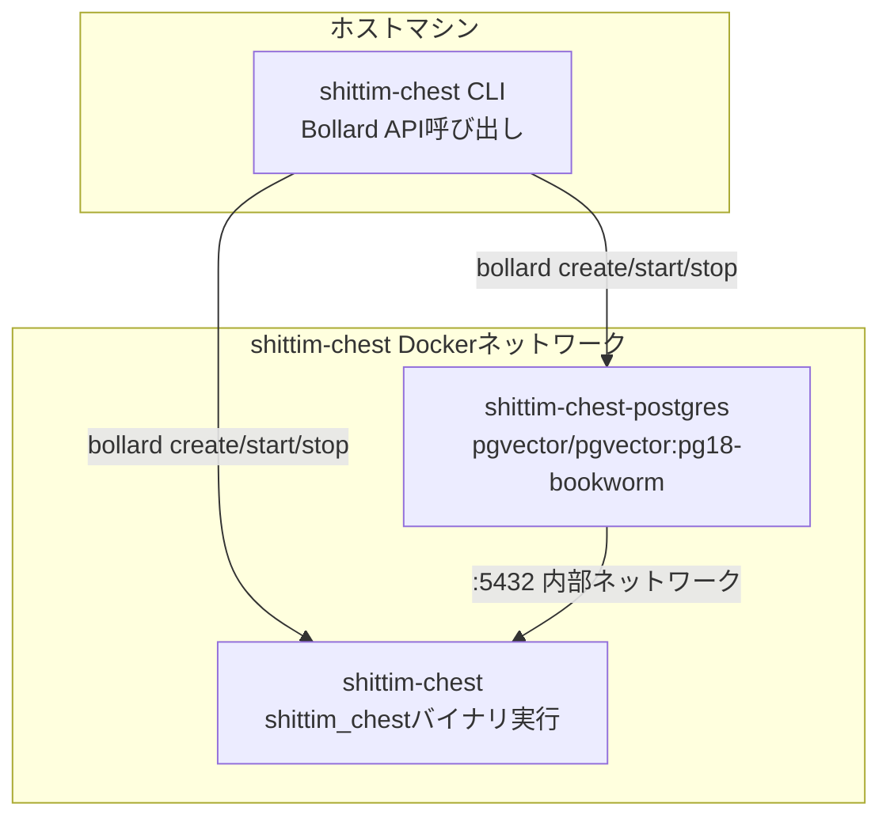

# CLIラッパーアーキテクチャ: BollardベースのDockerオーケストレーション

## 概要

`packages/cli/`は、Bollard Docker APIを介してコンテナのライフサイクルを直接管理するRustバイナリであり、docker-composeとシェルスクリプトを完全に置き換えます。CLIはホストマシン上で実行され、サーバーバイナリ（`shittim_chest`）はコンテナ内で実行されます。

## docker-composeを使用しない理由

| 側面 | docker-compose | bollard（現在のアプローチ） |
| --- | --- | --- |
| 依存関係 | スタンドアロンのdocker-composeのインストールが必要 | Docker Engine APIを再利用 |
| プログラマビリティ | YAML宣言型、ロジックが制限される | Rustネイティブ、任意の制御フロー |
| ヘルスチェック | depends_on + conditionはイベントベース | アクティブポーリング、タイムアウトなしの死亡検出 |
| エラーハンドリング | コンテナ終了 = 失敗 | リトライ + ログ収集 + 詳細なエラー情報 |
| リソースクリーンアップ | `down -v` 全てか無か | コンテナ/ネットワーク/ボリュームごとの細かなクリーンアップ |
| 統合 | 外部ツール | ライブラリとして組み込み、さらなるロジックで拡張可能 |

## コンテナトポロジー



## コンテナの命名とリソース

| 定数 | 値 | 目的 |
| --- | --- | --- |
| `NET` | `shittim-chest` | Dockerブリッジネットワーク |
| `PG` | `shittim-chest-postgres` | PostgreSQLコンテナ名 |
| `APP` | `shittim-chest` | アプリケーションコンテナ名 |
| `VOL` | `shittim-chest-pgdata` | PGデータボリューム |
| `PG_IMG` | `pgvector/pgvector:pg18-bookworm` | PGイメージ |
| `RUNTIME_IMG` | `debian:bookworm-slim` | 開発モードランタイムイメージ |
| `BUILD_IMG` | `shittim-chest` | リリースモードビルドイメージ |

## コマンドマッピング

| コマンド | 動作 |
| --- | --- |
| `dev [--clean]` | ワンショット起動: env → ネットワーク → ボリューム → PG → cargo build → マイグレーション → 起動 → ストリーミングログ |
| `up` | リリースモード: docker buildイメージ → マイグレーション → バックグラウンド起動 (restart=unless-stopped) |
| `down [--clean]` | コンテナ停止（オプションでボリューム + ネットワークのクリーンアップ） |
| `migrate` | ワンショットコンテナでdb-migrateを実行（最大5回リトライ、2秒間隔） |
| `logs` | アプリケーションコンテナのログをストリームフォロー |
| `status` | PGとアプリコンテナの実行状態 + ヘルスチェック状態を確認 |
| `build` | 完全なDockerイメージをビルド (`docker build -t shittim-chest`) |

## 環境変数の伝播

```text
.envファイル → dotenvy::from_path_iter → HashMap<String, String>
→ SHITTIM_CHEST_HOST / PORT / DATABASE_URLをマージ
→ Vec<String> = ["KEY=VALUE", ...]
→ bollard Config::env()
```

CLIは`.env`から自身の設定を読み取らず、`.env`の内容全体をコンテナ内の`shittim_chest`プロセスに渡すだけです。パスワードとポートは、2つの特定のキー`SHITTIM_CHEST_DB_PASSWORD`と`SHITTIM_CHEST_PORT`を介して読み取られます。

## ログ規約

CLIログはentelecheiaと同じ形式でstderrに直接出力されます：

- `tracing-subscriber` + `ShortTimer`（HH:MM:SS形式）
- `.compact()` コンパクトモード
- `.with_target(false)` モジュールパスを非表示
- `--log-level` CLIパラメータ（デフォルト `info`）

## 設計原則

1. **CLIはビジネスロジックを実行しない**: すべてのビジネスロジックはコンテナ内の`shittim_chest`バイナリに存在します
1. **コンテナは不変の単位**: CLIはコンテナを作成/破棄し、実行中のコンテナを変更することはありません
1. **ネットワーク分離**: PGポートはホストに公開されず、内部Dockerネットワーク内でのみ到達可能です
1. **ヘルスチェックのパッシブポーリング**: Dockerイベント（信頼性低）に依存せず、inspect結果を直接ポーリングします
