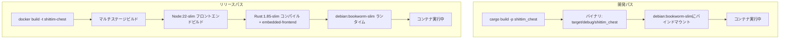

# デュアルモードデプロイメントパス: 開発 vs リリース

## 概要

shittim-chestは2つのデプロイメントモードをサポートします：開発（ローカル高速イテレーション、Node不要、イメージビルド不要）とリリース（フロントエンド静的ファイルを組み込んだ完全なDockerイメージ）。両モードは同じコンテナトポロジーとネットワークを共有します。

## 設計の動機

完全なDockerイメージのビルド（Nodeフロントエンドビルド + Rustコンパイル + `embedded-frontend`）には30秒以上かかり、日々の開発イテレーションには適していません。開発モードはホストマシンのインクリメンタルRustコンパイルキャッシュを活用し、バイナリを最小限のランタイムコンテナにバインドマウントして、サブ秒の再起動時間を実現します。

## パス比較



| 側面 | 開発モード (`just dev`) | リリースモード (`just up`) |
| --- | --- | --- |
| フロントエンド | Viteでビルド、`just dev`経由でバックエンドが配信 | バイナリに埋め込み（`embedded-frontend`機能） |
| Node必要 | はい（Viteビルド用） | はい（Docker内部） |
| バイナリソース | ローカル`cargo build` | Docker内でコンパイル |
| コンテナベースイメージ | `debian:bookworm-slim` | `debian:bookworm-slim`（マルチステージビルド結果） |
| 再起動速度 | < 5秒（インクリメンタルコンパイル後） | 30〜60秒（フルビルド） |
| ユースケース | 日々の開発、デバッグ | CI/本番デプロイメント |
| コンテナ起動方法 | `Config.cmd = ["shittim_chest"]` | イメージにENTRYPOINTを含む |

## 開発モードの実装詳細

### ローカルコンパイル

```rust
async fn cargo_build() -> Result<()> {
    Command::new("cargo")
        .args(["build", "-p", "shittim_chest"])
        .status().await?;
}
```

コンパイル出力パスは`$PWD/target/debug/shittim_chest`に固定されます（デバッグプロファイル、デバッグシンボル保持）。

### バインドマウント起動

```rust
let config = Config::<String> {
    image: Some("debian:bookworm-slim".into()),   // 最小ランタイム
    cmd: Some(vec!["shittim_chest".to_string()]),
    host_config: Some(HostConfig {
        binds: Some(vec![
            format!("{bin_path}:/usr/local/bin/shittim_chest:ro")
        ]),
        network_mode: Some(NET.into()),
        port_bindings: ...,
        ..
    }),
    env: Some(container_env(password, port)),
    ..
};
```

主なポイント：

- バイナリは読み取り専用（`:ro`）でマウントされ、コンテナ内での誤った変更を防止
- バイナリの場所は`/usr/local/bin/shittim_chest`で、コンテナ内で直接実行
- ベースイメージ`debian:bookworm-slim`が必要なglibcランタイムを提供

### マイグレーション実行

マイグレーションはワンショットコンテナを介して実行されます：

```bash
docker run --rm --network shittim-chest \
  -v $PWD/target/debug/shittim_chest:/usr/local/bin/shittim_chest:ro \
  -e SHITTIM_CHEST_DATABASE_URL=... \
  debian:bookworm-slim \
  shittim_chest db-migrate
```

PGがまだ完全に準備できていない場合に対応するため、自動的に最大5回リトライ（2秒間隔）します。

## リリースモードの実装詳細

### Dockerfileマルチステージビルド

```dockerfile
# ステージ1: フロントエンド → Node:22-slim + pnpm → pnpm build:all → /app/dist/
# ステージ2: ビルダー  → Rust:1.85-slim + COPY dist/ → cargo build --features embedded-frontend
# ステージ3: ランタイム → debian:bookworm-slim + ca-certificates + COPY バイナリ
```

### embedded-frontend機能

```rust
# [cfg(feature = "embedded-frontend")]
{
    static FRONTEND_DIR: Dir<'_> = include_dir!("$CARGO_MANIFEST_DIR/../dist");
    // Axumルーターの/static/*パスにマウント
}
```

この機能は`include_dir!`マクロを使用して、フロントエンドのビルド成果物をコンパイル時にバイナリに埋め込みます。リリースモードでは、追加のリバースプロキシなしで完全なSPAを配信できます。

## マイグレーションと起動関数の命名

混乱を避けるために、コードは2つの関数セットを明示的に区別します：

| 開発パス | リリースパス |
| --- | --- |
| `run_migrate_dev()` | `run_migrate_release()` |
| `start_app_dev()` | `start_app_release()` |
| `cargo_build()` | `build_image()` |

## フロントエンド開発

開発モードでは、`dev.py`がファイル変更時にフロントエンドアセットを再ビルドします。バックエンドは静的ファイルとAPIの両方を同じポートで配信します（開発用:3000、本番用:80）。
