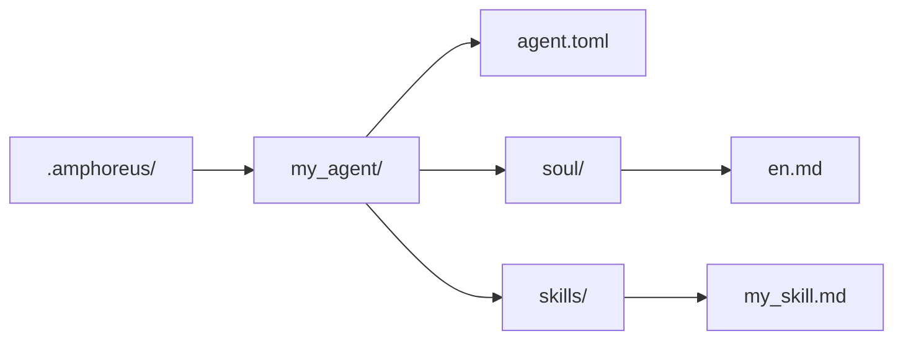

# Agent 開発チュートリアル

> 現在のリポジトリの実態に基づく Agent 開発ガイド

## 概要

現在のリポジトリには、実際に利用可能な 3 つの拡張階層があります。

| 階層 | 現在の意味 |
| --- | --- |
| Layer1 | Rust crate として実装され、workspace にコンパイルされるコア Agent |
| Layer2 | Web Automation というアクティブな組み込みドメイン Agent、およびいくつかのアーカイブまたは計画資料 |
| Layer3 | ユーザー定義 Agent（計画中、未実装） |

過去のドキュメントに記載されているすべての Layer2 ソリューションを、現在もアクティブな組み込み Agent として理解しないでください。

## Layer3 は最も簡単な拡張パス

> **注意**：Layer3 は現在設計段階にあります。`.amphoreus/` ディレクトリ、Agent ローダー（`Layer3Workspace`）、設定フレームワークは未実装です。本セクションでは、将来の使用を想定したターゲット設計について説明します。

Entelecheia（玄枢）を拡張したいが、Rust workspace を変更したくない場合は、Layer3 を優先的に使用してください（実装後）。

### 最小構成

### Layer3 が現在提供できるもの

- プロンプトベースの soul ファイル
- プロンプトベースの skill
- 既存のプラットフォームツールの再利用
- 読み込み時の事前チェックスキャン

### Layer3 が現在自動的に提供できないもの

- 新しい Rust MCP バックエンド
- 完全なサンドボックス保証
- 各 skill/tool パスの本番利用可能性

## 組み込み Agent 開発

組み込み Agent は `packages/agents/<agent>/` 配下の Rust crate です。

一般的な構成：

- `src/lib.rs`
- `src/state.rs`
- `src/skills.rs`
- `src/mcp/registry.rs`
- `src/mcp/tools/*.rs`

また、`res/prompts/agents/<agent>/` 配下に対応するドキュメントを維持する必要があります。

## 現在の Layer2 に関する推奨事項

リポジトリの履歴には多数の Layer2 ドメイン Agent 設計が含まれていました。現在は以下のように理解すべきです：

- 現在の workspace でアクティブな組み込み Layer2 crate は Web Automation です
- 古い Layer2 ドキュメントの多くは、設計目標またはアーカイブ資料を説明しています
- 新しい組み込み Layer2 開発は、実際の製品開発と見なすべきであり、ドキュメントを復元するだけで「有効化」できるものではありません

## 現在のセキュリティ注意事項

- 事前チェックスキャンは存在しますが、依然としてキーワードベースのルールスキャンです。
- ツールが利用可能かどうかは、対応する MCP ツールの背後にある実際の実装に依存します。
- ドキュメントに記載されている一部のツールと skill は、部分実装またはスタブである可能性があります。

## 参照パス

- `packages/shared/custom_agent/src/`
- `packages/agents/hubris/`
- `packages/agents/kalos/`
- `packages/agents/aporia/`
- `res/prompts/agents/`

## テストの推奨事項

現在、以下の直接検証を推奨します：

- Layer3 の解析と読み込み
- skill 解析
- Rust における MCP ツールの直接テスト
- 実際に変更した agent/tool パス

古いアーキテクチャ文書を「ある Layer2 パスがアクティブである」証拠として扱わないでください。
