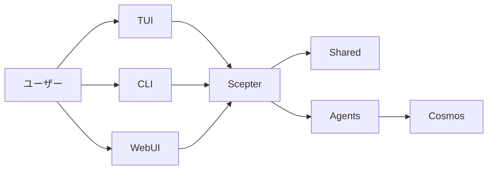

+++
title = "アーキテクチャ"
description = """> 現在のランタイム構造に基づく説明であり、目標状態の想像図ではありません"""
lang = "ja"
category = "guides"
subcategory = "core"
+++

# アーキテクチャ

> 現在のランタイム構造に基づく説明であり、目標状態の想像図ではありません

## ランタイム概要

現在のプラットフォームの中核は `packages/scepter`、`packages/shared`、`packages/tui` です。

## 現在最も成熟している部分

- Scepter サーバーサイドオーケストレーション
- Shared における設定、ツール名、プロンプト、状態タイプ
- TUI ユーザーフロー
- コンテナベースの実行パス

## 現在部分実装の部分

- CLI コマンドのカバレッジ
- 高度な memory / RAG 統合
- ほとんどのドメイン化 Layer2 ソリューション

## 現在アクティブな Agent 構造

### Layer1

workspace は現在 12 個の Layer1 Agent をコンパイルしており、メッセージルーティング、計画、ファイル、コンテナ、スクリプト、知識、検索、スケジューリング、セキュリティ、メモリ、デバイス関連の能力をカバーしています。

### Layer2

現在の workspace には 2 つのアクティブな組み込み Layer2 crate があります：**Web Automation**（ブラウザ自動化）と**クラシックソフトウェアエンジニアリング**（静的解析、コードレビュー、品質メトリクス、リファクタリング、LSP 診断/シンボル/リファクタリング）。古いドキュメントに記載されている 11 個の専用 Agent は、これら 2 つ以外のアーカイブ済みまたは計画中の内容を説明しています。

### Layer3

Layer3 は依然として `.amphoreus/` ベースのカスタム Agent 拡張ポイントです（設計段階、未実装）。

## 実行モデル

### モデル可視ツール

モデルが通常見ることができるもの：

- `exec`
- `write_to_var`
- `write_to_var_json`

内部 MCP ツールはランタイムを通じて間接的に呼び出されます。

### プロセス内とコンテナパス

一部のロジックは Scepter プロセス内で実行され、他の部分はコンテナ化パスとランタイム補助モジュールを通じて完了します。

### WebUI / IDE / Tauri

Web UI（arona）、管理パネル（malkuth）、IDE プラグイン、Tauri アプリケーションは姉妹プロジェクト **shittim-chest** に移行され、本リポジトリから削除されました。本リポジトリの優先インターフェースは **TUI** です。Web/IDE レイヤーは shittim-chest にあり、JWT + WebSocket/HTTP を通じて Scepter と通信します。

## Memory と知識能力

RAG と memory は古い概要で説明されているよりも成熟していますが、一部の統合グルーがまだ補完待ちです：

- 3 種類の埋め込みバックエンドを実装済み：API（OpenAI 互換）、ローカル ONNX 推論（`FastEmbeddingService`、デフォルト BGE-M3）、SHA-256 ハッシュフォールバック
- メモリ状態ベクトルドキュメントと **PgVector** ストレージ（HNSW インデックス）の両方が利用可能
- グラフトラバーサルとハイブリッド検索（RRF 融合）が利用可能
- embedding→RAG 自動配線と RAG サブスクリプション同期はまだ統合待ち
