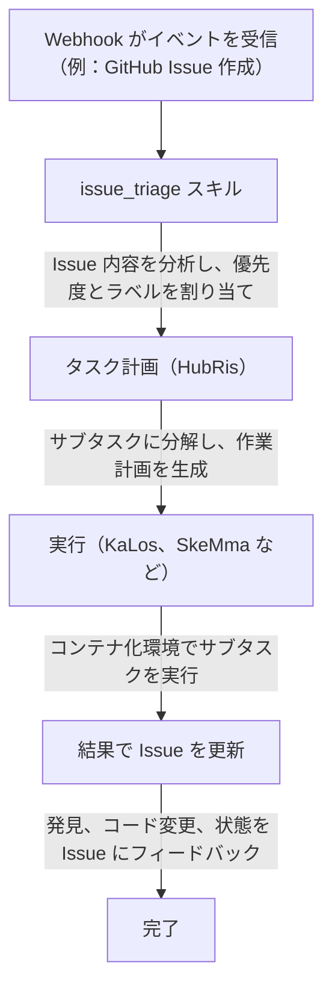

# Issue 追跡統合

> 外部 Issue 追跡システムを Entelecheia（玄枢）の Agent ワークフローに接続する
> 現在の状態説明：HubRis は現在、Issue の作成、更新、検索、コメント支援機能を実際に提供しており、リポジトリには webhook 統合も存在します。ただし、本文書は「完全に統一されたクロスプラットフォーム Issue プロダクト面が既に存在する」と理解すべきではありません。

---

## 目次

- [概要](#概要)
- [コンテナ三層識別](#コンテナ三層識別)
- [バインディング ID 形式](#バインディング-id-形式)
- [Agent が Issue と対話する方法](#agent-が-issue-と対話する方法)
- [Issue 駆動ワークフロー](#issue-駆動ワークフロー)
- [プラットフォームプレフィックス登録表](#プラットフォームプレフィックス登録表)
- [コンテナ Fork ブランチ命名](#コンテナ-fork-ブランチ命名)
- [WebUI 統合](#webui-統合)

---

## 概要

現在の Entelecheia の Issue 関連機能は主に 2 つの方向から来ています：

- webhook 統合により外部イベントをシステムに転送可能
- HubRis が Issue スタイルの CRUD 支援機能を提供

クロスプラットフォーム Issue 自動化は既存の方向性と部分実装と見なせますが、本文書の各ワークフローがすべて完全に閉ループ化されているとデフォルトで想定すべきではありません。

---

## コンテナ三層識別

Entelecheia のコンテナは三層 ID システムを使用し、異なるコンテキストでアイデンティティを維持します：

| 階層 | 形式 | ライフサイクル | 用途 |
| --- | --- | --- | --- |
| UUID | 標準 UUID（例：`550e8400-e29b-41d4-a716-446655440000`） | 永続 | データベース主キー、再起動間の追跡 |
| バインディング ID | `@platform#id`（例：`@github#234`） | 安定 | 外部リソースバインディング、ブランチ命名 |
| ランタイム ID | `#xxx`（例：`#616`） | セッション毎 | TUI 表示、Unix ソケットルーティング |

**バインディング ID** はコンテナを外部プラットフォームリソースにリンクします。Scepter 再起動後も安定しており、ランタイム ID のように起動毎に再割り当てされることはありません。

---

## バインディング ID 形式

バインディング ID の一般的な形式：

```text
@platform#id[@#floor]
```

- `platform` —— プラットフォームプレフィックス（例：`github`、`gitee`、`gitlab`）
- `id` —— プラットフォーム上の Issue またはリソース番号
- `@#floor` —— オプションのフロア番号、ネスト参照用（例：コメント）

### 例

| バインディング ID | 意味 |
| --- | --- |
| `@github#123` | GitHub Issue #123 |
| `@gitee#456` | Gitee Issue #456 |
| `@gitlab#789` | GitLab Issue #789 |
| `@github#123@#5` | GitHub Issue #123 の 5 番目のコメント |
| `@feishu#abc123` | 飛書メッセージトピック abc123 |

バインディング ID は以下に使用されます：

- コンテナラベルとメタデータ
- Issue 駆動開発のブランチ名
- Agent スキルパラメータ
- WebUI Issue リストフィルタリング

---

## Agent が Issue と対話する方法

Agent は HubRis MCP ツールを通じて外部 Issue と対話します。これらのツールはプラットフォーム固有の API をカプセル化しています：

### 利用可能な Issue 操作

| ツール | 説明 |
| --- | --- |
| `$.agent.HubRis.issue_create()` | 外部プラットフォームに新しい Issue を作成 |
| `$.agent.HubRis.issue_update()` | 既存 Issue を更新（タイトル、本文、状態、ラベル） |
| `$.agent.HubRis.issue_search()` | クロスプラットフォームで Issue を検索しフィルタを適用 |
| `$.agent.HubRis.issue_comment()` | 既存 Issue にコメントを追加 |

### exec コードでの使用

```typescript
$.agent.HubRis.issue_create({
  platform: "github",
  repository: "celestia-island/entelecheia",
  title: "Fix WebSocket reconnection logic",
  body: "The WebSocket client does not retry on connection loss.",
  labels: ["bug", "priority:high"]
});
```

```typescript
$.agent.HubRis.issue_search({
  platform: "github",
  repository: "celestia-island/entelecheia",
  state: "open",
  labels: ["bug"]
});
```

```typescript
$.agent.HubRis.issue_comment({
  binding_id: "@github#123",
  body: "Investigation complete. Root cause identified in src/ws/client.rs:42."
});
```

---

## Issue 駆動ワークフロー

デフォルトの Issue 駆動ワークフローは以下のパイプラインに従います：



### ステップバイステップ例

1. 開発者が "Memory leak in container cleanup" というタイトルの Issue `@github#42` を作成
1. GitHub Webhook がイベントを Scepter に転送
1. `issue_triage` スキルがこれを **bug** に分類、優先度 **high**
1. HubRis がタスクを分解：(a) リークの再現 (b) 根本原因の発見 (c) 修正の実装
1. KaLos が関連ソースファイルを読み取り、SkeMma が診断スクリプトを実行
1. Agent が修正をコミットし、`@github#42` に解決策をコメント

---

## プラットフォームプレフィックス登録表

プラットフォームプレフィックスマッピングは設定可能です。デフォルトの登録表：

| プレフィックス | プラットフォーム | Issue URL パターン |
| --- | --- | --- |
| `github` | GitHub | `https://github.com/{repo}/issues/{id}` |
| `gitee` | Gitee | `https://gitee.com/{repo}/issues/{id}` |
| `gitlab` | GitLab | `https://gitlab.com/{repo}/-/issues/{id}` |
| `feishu` | 飛書 / Lark | 内部メッセージリンク |
| `discord` | Discord | チャンネルメッセージリンク |
| `telegram` | Telegram | チャットメッセージリンク |

### 国際化サポート

プラットフォームプレフィックスは国際化名をサポートします。例えば、飛書は以下の方法で参照できます：

- `@feishu#123`（英語名）
- `@飞书#123`（中国語名）

プレフィックス登録表は内部的にこれらを正規プレフィックスに標準化します。

---

## コンテナ Fork ブランチ命名

Agent が Issue 駆動作業用のブランチを作成する際、ブランチは命名規則に従います：

### 形式

```text
cosmos-<binding_id>-<reason>
```

または

```text
cosmos-<uuid8>-<reason>
```

### 例

| ブランチ名 | コンテキスト |
| --- | --- |
| `cosmos-@github#42-fix-memory-leak` | GitHub Issue #42 の修正 |
| `cosmos-@gitee#15-add-ci-pipeline` | Gitee Issue #15 の機能開発 |
| `cosmos-a1b2c3d4-refactor-auth-module` | UUID プレフィックスを使用した内部タスク |

バインディング ID 形式により、ブランチを元の Issue まで追跡できます。

---

## WebUI 統合

Entelecheia WebUI は、接続されたすべてのプラットフォームにわたる Issue の統一ビューを提供します。

### 左サイドバー —— 集約 Issue リスト

- 全プラットフォームの Issue を単一リストで表示
- 各レコードに表示：プラットフォームアイコン、Issue 番号、タイトル、状態、割り当てられた Agent
- Issue をクリックすると詳細ビューが開きます

### フィルタリング

Issue は以下の条件でフィルタリングできます：

- **プラットフォーム**：GitHub、Gitee、GitLab などで表示
- **状態**：オープン、クローズ、進行中
- **優先度**：高、中、低（ラベルから派生）
- **割り当て Agent**：現在その Issue を処理している Agent でフィルタ

### Issue 詳細ビュー

詳細ビューには以下が表示されます：

- 完全な Issue タイトルと本文（Markdown からレンダリング）
- プラットフォームリンク（ブラウザで元の Issue を開く）
- Agent アクティビティログ（スキル呼び出し、投稿されたコメント）
- 関連するコンテナとブランチ

---

## 次のステップ

- [Webhook プラットフォーム設定](webhook-setup.md) を読んでプラットフォームを接続
- [アーキテクチャ](architecture.md) を参照して HubRis Agent 設計を理解
- IDE 統合は [shittim-chest](https://github.com/celestia-island/shittim-chest) 兄弟リポジトリに移行済み
