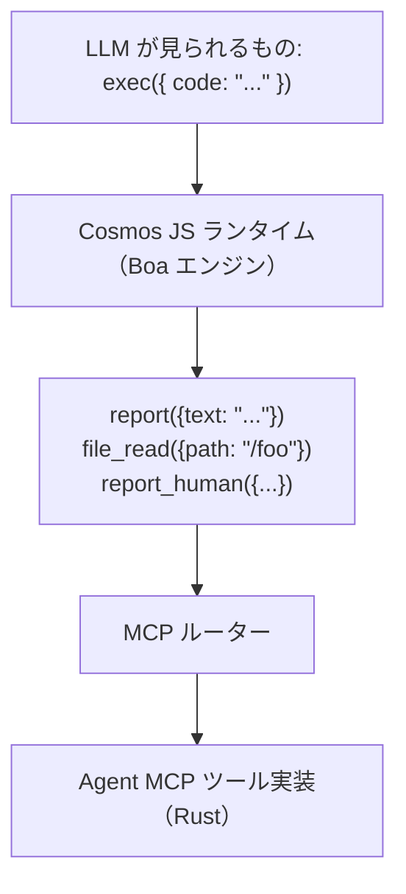
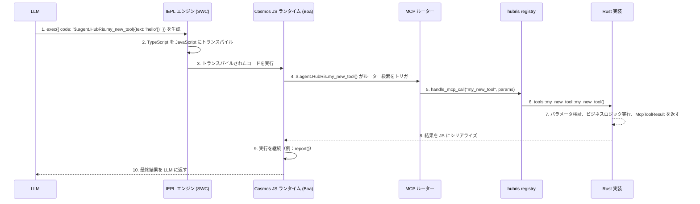

+++
title = "MCP ツール開発チュートリアル"
description = """> Entelecheia（玄枢）プラットフォームで MCP ツールを作成・登録する方法"""
lang = "ja"
category = "guides"
subcategory = "core"
+++

# MCP ツール開発チュートリアル

> Entelecheia（玄枢）プラットフォームで MCP ツールを作成・登録する方法

---

## 目次

- [Exec-Only マイクロカーネル](#exec-only-マイクロカーネル)
- [MCP ツール構造](#mcp-ツール構造)
- [新しい MCP ツールの追加](#新しい-mcp-ツールの追加)
- [ベストプラクティス](#ベストプラクティス)
- [MCP ツールのテスト](#mcp-ツールのテスト)

---

## Exec-Only マイクロカーネル

Entelecheia はツールアクセスに**マイクロカーネルアーキテクチャ**を使用します。LLM は 3 つのツール——`exec`、`write_to_var`、`write_to_var_json`——のみを見ることができ、すべての実際の作業はその TypeScript ランタイム（IEPL エンジン）内部で行われます。



**コア原則**：LLM が MCP ツールを直接呼び出すことは決してありません。LLM は ES モジュールインポートを通じてツール関数 API を呼び出す TypeScript コードを生成し（例：`import { report } from 'hubris'; report()`）、IEPL エンジンがそれを JavaScript にトランスパイルし、実際の Rust 実装にディスパッチします。

- ES モジュールインポート — 汎用パターン（例：`import { report } from 'hubris'; report()`、`file_read()`）
- `exec`、`write_to_var`、`write_to_var_json` は全 Agent が登録する唯一の 3 つのツールです（`packages/shared/domain_skills/src/tool_names.rs:265-283` を参照）

Skill の TOML frontmatter 内の `related_tools` 宣言が、LLM に送信されるプロンプトでドキュメント化される ES モジュールインポート API を決定します。

---

## MCP ツール構造

MCP ツールは 3 つの部分で構成されます：

1. **Rust 実装** — 実際のロジック、`packages/agents/<agent>/src/mcp/tools/` に配置
1. **Registry ディスパッチ** — ルーティング、`packages/agents/<agent>/src/mcp/registry.rs` に配置
1. **ツール名定数** — 文字列定数、`packages/shared/domain_skills/src/tool_names.rs` に配置

### mcp/registry.rs でのツール定義

各 Agent には `handle_mcp_call` 関数があり、ツール名を対応する実装にルーティングします：

```rust
// packages/agents/kalos/src/mcp/registry.rs

use serde_json::Value;
use tracing::info;
use crate::{mcp::tools, state::KalosState};
use _shared::skills::{mcp_tools::McpToolResult, tool_names};

pub async fn handle_mcp_call(
    state: &std::sync::Arc<tokio::sync::RwLock<KalosState>>,
    tool_name: &str,
    parameters: Value,
) -> McpToolResult {
    info!("Calling Kalos MCP tool: {}", tool_name);

    match tool_name {
        tool_names::kalos::FILE_READ => tools::file_read(state, parameters).await,
        tool_names::kalos::FILE_WRITE => tools::file_write(state, parameters).await,
        tool_names::kalos::FILE_EDIT => tools::file_edit(state, parameters).await,
        // ...
        _ => McpToolResult::failure(format!("Unknown tool: {}", tool_name)),
    }
}
```

### validate_required_params によるパラメータ検証

必須パラメータを持つツールには、共有の検証ヘルパー関数を使用します：

```rust
use _shared::skills::mcp_tools::validate_required_params;

pub async fn my_tool(parameters: Value) -> McpToolResult {
    if let Some(failure) = validate_required_params(
        &parameters,
        &["title", "content"],  // 必須パラメータ名
        "my_tool",              // エラーメッセージ用のツール名
    ) {
        return failure;
    }

    let title = parameters.get("title").unwrap().as_str().unwrap();
    // ...
}
```

`validate_required_params` は各必須パラメータが存在し、かつ空でない文字列であることをチェックします。すべて有効な場合は `None` を返し、そうでない場合は説明的なエラーメッセージを含む `Some(McpToolResult::failure(...))` を返します。

参照：`packages/shared/domain_skills/src/mcp_tools.rs:12-41`。

### 戻り値：McpToolResult

各ツールは `McpToolResult` を返さなければなりません。主要なコンストラクタ：

```rust
// 成功し、任意の JSON データを返す
McpToolResult::success(serde_json::to_value(my_struct).unwrap_or_default())

// 成功し、シリアライズ可能な構造体を返す
McpToolResult::success_struct(&my_result)

// 成功し、プレーンテキストを返す
McpToolResult::success_text("Operation completed".into())

// 成功し、LLM 使用量追跡付き
McpToolResult::success_with_usage(
    "Result text".into(),
    Some("gpt-4".into()),
    Some((prompt_tokens, completion_tokens)),
)

// 失敗し、エラーメッセージを返す
McpToolResult::failure("Missing required parameter: title".into())

// 失敗し、複数エラーを返す
McpToolResult::failure_lines(vec!["Error 1".into(), "Error 2".into()])
```

参照：`packages/shared/domain_skills/src/mcp_tools.rs:62-136`。

---

## 新しい MCP ツールの追加

本ステップガイドでは HubRis を例に、既存 Agent に新しいツールを追加する方法を示します。

### ステップ 1：ツール名定数の追加

`packages/shared/domain_skills/src/tool_names.rs` を編集：

```rust
/// HubRis tool names
pub mod hubris {
    pub const REPORT: &str = "report";
    pub const CREATE_TODO: &str = "create_todo";
    // ... 既存ツール ...
    pub const MY_NEW_TOOL: &str = "my_new_tool";  // この行を追加
}
```

### ステップ 2：ツールの実装

新規ファイル `packages/agents/hubris/src/mcp/tools/my_new_tool.rs` を作成：

```rust
use serde::Serialize;
use serde_json::Value;
use std::sync::Arc;
use tokio::sync::RwLock;

use crate::state::HubrisState;
use _shared::skills::mcp_tools::{validate_required_params, McpToolResult};

# [derive(Serialize, Debug, Clone)]
struct MyNewToolResult {
    id: String,
    message: String,
}

pub async fn my_new_tool(
    state: &Arc<RwLock<HubrisState>>,
    parameters: Value,
) -> McpToolResult {
    if let Some(failure) = validate_required_params(&parameters, &["text"], "my_new_tool") {
        return failure;
    }

    let text = parameters.get("text").and_then(|v| v.as_str()).unwrap();
    let id = uuid::Uuid::now_v7().to_string();

    let result = MyNewToolResult {
        id,
        message: format!("Processed: {}", text),
    };

    McpToolResult::success(serde_json::to_value(result).unwrap_or_default())
}
```

### ステップ 3：モジュールへの登録

`packages/agents/hubris/src/mcp/tools/mod.rs` を編集：

```rust
pub mod report;
pub mod todo_ops;
pub mod my_new_tool;  // この行を追加
```

### ステップ 4：Registry ディスパッチへの追加

`packages/agents/hubris/src/mcp/registry.rs` を編集：

```rust
pub async fn handle_mcp_call(
    state: &Arc<RwLock<HubrisState>>,
    todo_store: &Option<Arc<TodoStore>>,
    tool_name: &str,
    parameters: Value,
) -> McpToolResult {
    match tool_name {
        // ... 既存ツール ...
        tool_names::hubris::MY_NEW_TOOL => {
            crate::mcp::tools::my_new_tool::my_new_tool(state, parameters).await
        },
        _ => McpToolResult::failure(format!(
            "HubRis does not provide tool: {}",
            tool_name
        )),
    }
}
```

### ステップ 5：MCP ツールドキュメントの作成

`res/prompts/agents/hubris/mcp/my_new_tool.md` を作成：

```markdown
+++
name = "my_new_tool"
agent = "hubris"

[description]
en = "Process text and return a structured result."
ja = "テキストを処理し、構造化された結果を返します。"
+++

# my_new_tool

テキストを処理し、構造化された結果を返します。

## パラメータ

- **text** (string, 必須): 処理するテキスト

## 戻り値

### 成功

\`\`\`json
{ "id": "...", "message": "Processed: ..." }
\`\`\`

### 失敗

\`\`\`text
Missing required parameter(s) for my_new_tool: text
\`\`\`
```

### ステップ 6：Skill の related_tools を通じた公開

LLM にツールを認識させるには、Skill の frontmatter に追加します：

```toml
[[related_tools]]
agent_name = "hubris"
tool_name = "my_new_tool"
```

これにより、ツールの API ドキュメントが Skill プロンプトに注入され、LLM が `$.agent.HubRis.my_new_tool()` を呼び出せるようになります。

### ステップ 7：exec を通じた使用（プロンプト注入）

LLM が `related_tools` に `my_new_tool` がリストされている Skill を処理する際、TypeScript コードを生成します：

```typescript
const result: { id: string; message: string } = await $.agent.HubRis.my_new_tool({ text: "some content to process" });
```

IEPL エンジンが TypeScript を JavaScript にトランスパイルし、Cosmos JS ランタイムが呼び出しをインターセプトし、MCP ルーターを通じて Rust 実装にディスパッチし、結果を JavaScript コンテキストに返します。

### 完全な呼び出しチェーン



---

## ベストプラクティス

### 1. 複数行出力には常に write_to_var を使用

`exec` コードで複数行文字列を構築する際は、Token オーバーヘッドの大きいインライン文字列を避けるために `write_to_var` を使用します：

```typescript
// 非推奨——大きなインライン文字列
exec({ code: "report({text: 'line1\\nline2\\nline3\\n...very long...'})" })

// 推奨——段階的に構築
exec({ code: `
  let output: string = '';
  $write_to_var('step1', 'First part of the content');
  $write_to_var('step2', 'Second part of the content');
  output = $read_var('step1') + '\\n' + $read_var('step2');
  report({text: output});
` })
```

### 2. env.aporia.language で出力言語を設定

ユーザー向けテキストを生成する Skill は、設定された出力言語を確認すべきです：

```typescript
const lang: string = env.aporia.language;  // 例："en"、"ja"、"zhs"
const greeting: string = lang === "en" ? "Hello" : lang === "ja" ? "こんにちは" : "Hello";
```

Skill の frontmatter でこの依存関係を宣言できます：

```toml
config = ["user_language"]
```

### 3. TypeScript を使用し、常に const/let、決して var を使わない

`exec` 内のすべてのコードは TypeScript 構文を使用すべきです：

```typescript
// 正しい
const result = file_read({path: '/src/main.rs'});
let items: string[] = result.content.split('\n');

// 誤り
var result = file_read({path: '/src/main.rs'});
```

### 4. オブジェクトを段階的に構築

複雑なパラメータオブジェクトの場合、段階的に構築します：

```typescript
let params: Record<string, unknown> = {};
params.title = "My Task";
params.description = "Detailed description";
params.priority = "high";

if (hasDueDate) {
    params.due_date = dueDate;
}

$.agent.HubRis.create_todo(params);
```

### 5. report() で結果を報告

各 Skill は終了前に少なくとも 1 回 `report()` を呼び出す必要があります。これは結果をキャプチャし、Skill チェーンの次のステップにルーティングする方法です：

```typescript
report({text: "Task decomposition complete. Found 3 sub-tasks."});
```

複数回の呼び出しは集約されます——すべての内容は思考段階終了時にマージされます。

### 6. パラメータ命名規則

- パラメータ名には `snake_case` を使用（例：`parent_id`、`due_date`、`workspace_id`）
- 文字列 ID は UUID 形式を使用
- タイムスタンプは ISO 8601 / RFC 3339 形式を使用
- オプションパラメータには明確なデフォルト値をドキュメント化

### 8. IEPL バッチ優先ツール設計（重要）

従来の MCP では、ツールは細粒度です——CPU、メモリ、ディスクにそれぞれ異なるツールを呼び出します。IEPL では、各往復が LLM Token とレイテンシを消費します。**最大 1〜2 回の呼び出しですべての関連データを返すようにツールを設計してください。**

```rust
// 非推奨：3 つの独立したツールでデバイス情報を取得
pub const CPU_INFO: &str = "cpu_info";
pub const MEMORY_INFO: &str = "memory_info";
pub const STORAGE_INFO: &str = "storage_info";

// 推奨：1 つのツールで完全なシステム構成を返す
pub const SYSTEM_INFO: &str = "system_info";
// 戻り値: { cpu: {...}, memory: {...}, storage: {...}, pci: [...], gpu: {...}, os: {...} }
```

外部ソース（デバイス、プロトコル、データベース）からデータを読み取るツールでは、バッチクエリをサポートするために `scan` または `ranges` パラメータを受け入れます：

```typescript
// バッチ Modbus 読み取り——1 回の呼び出しで複数のレジスタ範囲を読み取り
const result = $.agent.SkeMma.modbus_read({
  endpoint: "/dev/ttyUSB0",
  scan: [
    { register_type: "holding", start_address: 0, count: 10 },
    { register_type: "input", start_address: 100, count: 5 }
  ]
});
```

**細粒度ツールが許容されるのは**、特定アドレスへの書き込み操作、または呼び出し元が明示的に狭い範囲のデータを要求するクエリの場合のみです。

### 7. ツールにおけるエラーハンドリング

LLM が自己修正できるように説明的なエラーメッセージを返します：

```rust
// 推奨——具体的で実行可能
McpToolResult::failure("Missing required parameter(s) for create_todo: title".into())

// 推奨——コンテキスト付き
McpToolResult::failure(format!("TODO item {} not found", id))

// 非推奨——曖昧
McpToolResult::failure("Error".into())
```

---

## MCP ツールのテスト

### 単一ツールのユニットテスト

`Value` パラメータを構築し `McpToolResult` をアサートすることで、各ツール関数を直接テストします：

```rust
# [tokio::test]
async fn test_report_success() {
    use std::sync::Arc;
    use tokio::sync::RwLock;

    let state = Arc::new(RwLock::new(HubrisState::new()));
    let params = serde_json::json!({
        "text": "Test report content"
    });

    let result = crate::mcp::tools::report::report(&state, params).await;

    assert!(result.success);
    assert!(result.data.get("summary").is_some());

    // 状態が更新されたことを検証
    let state = state.read().await;
    assert_eq!(state.pending_reports.len(), 1);
    assert_eq!(state.pending_reports[0], "Test report content");
}

# [tokio::test]
async fn test_report_empty_text() {
    let state = Arc::new(RwLock::new(HubrisState::new()));
    let params = serde_json::json!({
        "text": ""
    });

    let result = crate::mcp::tools::report::report(&state, params).await;

    assert!(!result.success);
    assert!(!result.error.is_empty());
}
```

### Registry ディスパッチのテスト

Registry がツール名を正しくルーティングするかをテストします：

```rust
# [tokio::test]
async fn test_registry_routes_known_tool() {
    let state = Arc::new(RwLock::new(HubrisState::new()));
    let params = serde_json::json!({"text": "hello"});

    let result = handle_mcp_call(&state, &None, "report", params).await;
    assert!(result.success);
}

# [tokio::test]
async fn test_registry_rejects_unknown_tool() {
    let state = Arc::new(RwLock::new(HubrisState::new()));
    let params = serde_json::json!({});

    let result = handle_mcp_call(&state, &None, "nonexistent_tool", params).await;
    assert!(!result.success);
    assert!(result.error[0].contains("does not provide tool"));
}
```

### パラメータ検証のテスト

`validate_required_params` ヘルパー関数を直接テストします：

```rust
# [test]
fn test_validate_required_params_all_present() {
    let params = serde_json::json!({"title": "test", "content": "body"});
    let result = validate_required_params(&params, &["title", "content"], "test_tool");
    assert!(result.is_none());
}

# [test]
fn test_validate_required_params_missing() {
    let params = serde_json::json!({"title": "test"});
    let result = validate_required_params(&params, &["title", "content"], "test_tool");
    assert!(result.is_some());
    let failure = result.unwrap();
    assert!(!failure.success);
    assert!(failure.error[0].contains("content"));
}

# [test]
fn test_validate_required_params_empty_string() {
    let params = serde_json::json!({"title": ""});
    let result = validate_required_params(&params, &["title"], "test_tool");
    assert!(result.is_some());
}
```

### データベース Store を使用したテスト

データベース Store に依存するツールの場合、通常はインメモリまたはテストデータベースを使用してテストします：

```rust
# [tokio::test]
async fn test_create_todo_success() {
    // セットアップ：テスト TodoStore を作成（テストインフラに依存）
    let todo_store = create_test_store().await;
    let params = serde_json::json!({
        "title": "Test Task",
        "workspace_id": test_workspace_id.to_string()
    });

    let result = create_todo(&todo_store, params).await;

    assert!(result.success);
    let id = result.data.get("id").unwrap().as_str().unwrap();
    assert!(!id.is_empty());
    assert_eq!(result.data.get("title").unwrap().as_str(), Some("Test Task"));
}
```

### テストの実行

```bash
# 全テストを実行
just test

# 特定の Agent crate のテストを実行
cargo test -p hubris
cargo test -p kalos

# 特定のテストを実行
cargo test -p hubris test_report_success

# 出力付きで実行
cargo test -p hubris -- --nocapture
```

---

## クイックリファレンス：主要ファイル

| 用途 | パス |
| --- | --- |
| `McpToolResult` 定義 | `packages/shared/domain_skills/src/mcp_tools.rs` |
| `validate_required_params` | `packages/shared/domain_skills/src/mcp_tools.rs:12-41` |
| ツール名定数 | `packages/shared/domain_skills/src/tool_names.rs` |
| `agent_allowed_tools()` | `packages/shared/domain_skills/src/tool_names.rs:166-169` |
| HubRis MCP registry | `packages/agents/hubris/src/mcp/registry.rs` |
| HubRis report ツール | `packages/agents/hubris/src/mcp/tools/report.rs` |
| HubRis TODO CRUD ツール | `packages/agents/hubris/src/mcp/tools/todo_ops.rs` |
| KaLos MCP registry | `packages/agents/kalos/src/mcp/registry.rs` |
| MCP ツールドキュメント例 | `res/prompts/agents/hubris/mcp/` |
| Skill プロンプト例 | `res/prompts/agents/hubris/skills/` |
