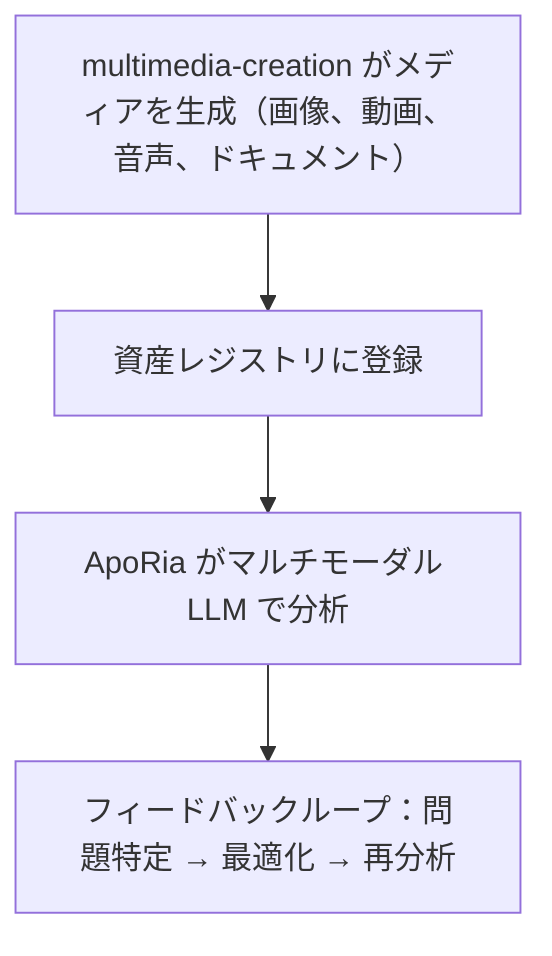

# マルチモーダルパイプライン

> **⚠️ アーカイブ済み Agent リファレンス — 開発パイプライン外**
> 本文書で参照されている `multimedia-creation` Layer2 Agent は**アーカイブ**されています。その Rust コード、`.d.ts` バインディング、Agent 登録はすべて削除されました。本文書が説明するマルチモーダルパイプラインは**設計目標**であり、提供済みの機能ではありません。開発者が明示的に要求しない限り、このパイプラインの作業を実装したりスケジュールしたりしないでください。
> multimedia-creation と ApoRia を使用したメディアの生成、登録、分析
> 現在の状態説明：本文書は主に目標ワークフローを説明しています。現在のコードベースには確かに ApoRia のマルチモーダル関連ツールが存在しますが、まだ下記で説明する集中型資産レジストリと完全な閉ループ機能には達していません。

-----------------------------------------------------------------------------

## 目次

- [概要](#概要)
- [資産レジストリ](#資産レジストリ)
- [生成ツール](#生成ツール)
- [登録](#登録)
- [マルチモーダル分析](#マルチモーダル分析)
- [レビューループ](#レビューループ)
- [Office ドキュメント](#office-ドキュメント)
- [完全な例](#完全な例)

-----------------------------------------------------------------------------

## 概要

Entelecheia（玄枢）は現在、マルチモーダル関連の基盤モジュール、特に ApoRia 側の初期ツールを含んでいます。しかし、ここで説明する multimedia-creation -> 集中型資産登録 -> マルチモーダルレビュー閉ループは、完全な現状ではなく目標設計と見なすのが適切です。



-----------------------------------------------------------------------------

## 資産レジストリ

資産レジストリは ApoRia が管理する集中型メディアメタデータストアです。以下を追跡します：

- ファイルパスと保存場所
- MIME タイプ
- 生成メタデータ（プロンプト、パラメータ、タイムスタンプ）
- 分析履歴と品質スコア

### 登録 / 取得ワークフロー

```typescript
const asset = $.agent.ApoRia.media_asset_register({
  file_path: "/output/marketing-banner.png",
  mime_type: "image/png",
  metadata: {
    prompt: "A futuristic city skyline at sunset",
    generator: "multimedia-creation",
    model: "stable-diffusion-xl"
  }
});

const asset_id: string = asset.id;

const retrieved = $.agent.ApoRia.media_asset_retrieve({
  asset_id: asset_id
});
```

-----------------------------------------------------------------------------

## 生成ツール

multimedia-creation は様々なメディアタイプ向けの生成ツールを提供します。すべてのツールは exec コード内で `$multimedia-creation.<tool>()` を通じて呼び出されます。

### 画像生成

```typescript
$multimedia-creation.image_generate({
  prompt: "A futuristic city skyline at sunset, cyberpunk style",
  width: 1024,
  height: 512,
  model: "stable-diffusion-xl",
  output_path: "/output/city-skyline.png"
});
```

### 動画生成

```typescript
$multimedia-creation.video_generate({
  prompt: "Camera panning across a mountain landscape at golden hour",
  duration_seconds: 10,
  fps: 24,
  resolution: "1080p",
  output_path: "/output/mountain-pan.mp4"
});
```

### 音声生成

```typescript
$multimedia-creation.audio_generate({
  prompt: "Ambient electronic background music, calm and atmospheric",
  duration_seconds: 30,
  format: "mp3",
  output_path: "/output/ambient-bg.mp3"
});
```

### ドキュメント生成

```typescript
$multimedia-creation.doc_generate({
  template: "technical-report",
  title: "Q4 Performance Analysis",
  content: report_markdown,
  format: "docx",
  output_path: "/output/q4-report.docx"
});
```

### スプレッドシート生成

```typescript
$multimedia-creation.sheet_generate({
  title: "Budget Forecast 2025",
  data: budget_data,
  format: "xlsx",
  output_path: "/output/budget-2025.xlsx"
});
```

### スライド生成

```typescript
$multimedia-creation.slide_generate({
  title: "Product Roadmap Presentation",
  sections: slide_sections,
  format: "pptx",
  output_path: "/output/roadmap.pptx"
});
```

-----------------------------------------------------------------------------

## 登録

メディア生成後、ApoRia による分析のために資産レジストリに登録します：

```typescript
const result = $multimedia-creation.image_generate({
  prompt: "Product hero shot on white background",
  width: 1920,
  height: 1080,
  output_path: "/output/hero-shot.png"
});

const asset = $.agent.ApoRia.media_asset_register({
  file_path: result.output_path,
  mime_type: "image/png",
  metadata: {
    prompt: "Product hero shot on white background",
    generator: "multimedia-creation",
    dimensions: "1920x1080"
  }
});

const asset_id: string = asset.id;
```

-----------------------------------------------------------------------------

## マルチモーダル分析

ApoRia は `$.agent.ApoRia.multimodal_chat()` を通じてマルチモーダル分析を提供します。1 つ以上の資産 ID とテキストプロンプトを渡します：

```typescript
const analysis = $.agent.ApoRia.multimodal_chat({
  prompt: "Analyze this image for composition, color balance, and visual hierarchy. Rate each aspect from 1-10.",
  asset_ids: [asset_id]
});
```

### 複数資産の分析

```typescript
const comparison = $.agent.ApoRia.multimodal_chat({
  prompt: "Compare these two design variations. Which one has better visual balance and why?",
  asset_ids: [variant_a_id, variant_b_id]
});
```

### コンテキスト付き分析

```typescript
const context_analysis = $.agent.ApoRia.multimodal_chat({
  prompt: "Does this image match the brand guidelines? Guidelines: primary color blue (#0066CC), clean layout, sans-serif typography.",
  asset_ids: [asset_id]
});
```

-----------------------------------------------------------------------------

## レビューループ

マルチモーダルパイプラインは反復レビューサイクルをサポートします：

1. **生成** —— multimedia-creation が初期メディアを作成
1. **登録** —— 資産レジストリに保存
1. **分析** —— ApoRia がマルチモーダル LLM でメディアを評価
1. **問題特定** —— 分析から具体的な改善点を抽出
1. **最適化** —— multimedia-creation がフィードバックに基づいてパラメータを調整し再生成
1. **再分析** —— ApoRia が最適化後の出力を評価

### exec コードでのレビューループ例

```typescript
let iteration: number = 0;
const max_iterations: number = 3;
const quality_threshold: number = 8.0;
let current_prompt: string = "A serene mountain lake at dawn, photorealistic";

while (iteration < max_iterations) {
  iteration++;

  const gen_result = $multimedia-creation.image_generate({
    prompt: current_prompt,
    width: 1024,
    height: 768,
    output_path: `/output/lake-v${iteration}.png`
  });

  const asset = $.agent.ApoRia.media_asset_register({
    file_path: gen_result.output_path,
    mime_type: "image/png",
    metadata: { prompt: current_prompt, iteration: iteration }
  });

  const analysis = $.agent.ApoRia.multimodal_chat({
    prompt: "Rate this image on composition (1-10), color harmony (1-10), and overall quality (1-10). Provide specific improvement suggestions.",
    asset_ids: [asset.id]
  });

  const overall_score: number = analysis.data.overall_quality;

  if (overall_score >= quality_threshold) {
    report({ text: `Quality threshold met at iteration ${iteration}. Score: ${overall_score}` });
    break;
  }

  const suggestions = analysis.data.improvement_suggestions;
  current_prompt = current_prompt + ". " + suggestions.join(". ");

  if (iteration === max_iterations) {
    report({ text: `Max iterations reached. Final score: ${overall_score}` });
  }
}
```

-----------------------------------------------------------------------------

## Office ドキュメント

multimedia-creation は Office 互換ドキュメントを生成できます：

### Word ドキュメント（`doc_generate`）

Markdown または構造化コンテンツから `.docx` ファイルを生成します。一般的なドキュメントタイプのテンプレートをサポート：

- 技術レポート
- 会議議事録
- 提案書

```typescript
$multimedia-creation.doc_generate({
  template: "meeting-notes",
  title: "Sprint Planning - Week 12",
  content: meeting_content,
  format: "docx",
  output_path: "/output/sprint-12-notes.docx"
});
```

### Excel スプレッドシート（`sheet_generate`）

構造化データ、数式、書式を含む `.xlsx` ファイルを生成します：

```typescript
$multimedia-creation.sheet_generate({
  title: "Monthly Revenue",
  data: revenue_data,
  format: "xlsx",
  output_path: "/output/revenue.xlsx"
});
```

### PowerPoint プレゼンテーション（`slide_generate`）

セクション、箇条書き、オプションの画像埋め込みを含む `.pptx` ファイルを生成します：

```typescript
$multimedia-creation.slide_generate({
  title: "Quarterly Business Review",
  sections: [
    { title: "Revenue", bullets: ["Q1: $1.2M", "Q2: $1.5M"] },
    { title: "Goals", bullets: ["Launch v2.0", "Expand to APAC"] }
  ],
  format: "pptx",
  output_path: "/output/qbr.pptx"
});
```

-----------------------------------------------------------------------------

## 完全な例

本サンプルは完全なパイプラインを示します：マーケティング画像の生成、登録、分析、最適化。

### ステップ 1：初期画像の生成

```typescript
const gen = $multimedia-creation.image_generate({
  prompt: "A modern SaaS product dashboard mockup, clean UI, blue and white color scheme",
  width: 1920,
  height: 1080,
  output_path: "/output/dashboard-v1.png"
});
```

### ステップ 2：資産の登録

```typescript
const asset = $.agent.ApoRia.media_asset_register({
  file_path: gen.output_path,
  mime_type: "image/png",
  metadata: {
    prompt: "SaaS dashboard mockup",
    purpose: "marketing",
    version: 1
  }
});
```

### ステップ 3：構図の分析

```typescript
const analysis = $.agent.ApoRia.multimodal_chat({
  prompt: "Analyze this dashboard mockup for: 1) Visual hierarchy, 2) Color consistency, 3) Readability of data elements. Provide a score (1-10) for each and specific suggestions for improvement.",
  asset_ids: [asset.id]
});
```

### ステップ 4：フィードバックに基づく最適化

```typescript
const refined = $multimedia-creation.image_generate({
  prompt: "A modern SaaS product dashboard mockup, clean UI, blue and white color scheme. " + analysis.data.suggestions.join(". "),
  width: 1920,
  height: 1080,
  output_path: "/output/dashboard-v2.png"
});
```

### ステップ 5：登録と再分析

```typescript
const refined_asset = $.agent.ApoRia.media_asset_register({
  file_path: refined.output_path,
  mime_type: "image/png",
  metadata: {
    prompt: "SaaS dashboard mockup (refined)",
    purpose: "marketing",
    version: 2,
    previous_version: asset.id
  }
});

const final_analysis = $.agent.ApoRia.multimodal_chat({
  prompt: "Compare this refined version to the original. Has the visual hierarchy improved? Rate the overall quality 1-10.",
  asset_ids: [asset.id, refined_asset.id]
});

report({
  text: `Marketing image pipeline complete. Initial score: ${analysis.data.overall_score}, Refined score: ${final_analysis.data.overall_score}`
});
```

-----------------------------------------------------------------------------

## 次のステップ

- [基本ガイド](fundamentals.md) を読んで multimedia-creation と ApoRia Agent の詳細を確認
- [アーキテクチャ](architecture.md) を参照して完全な Agent システム概要を把握
- [Webhook 統合](webhook-setup.md) を設定して外部イベントから生成をトリガー
