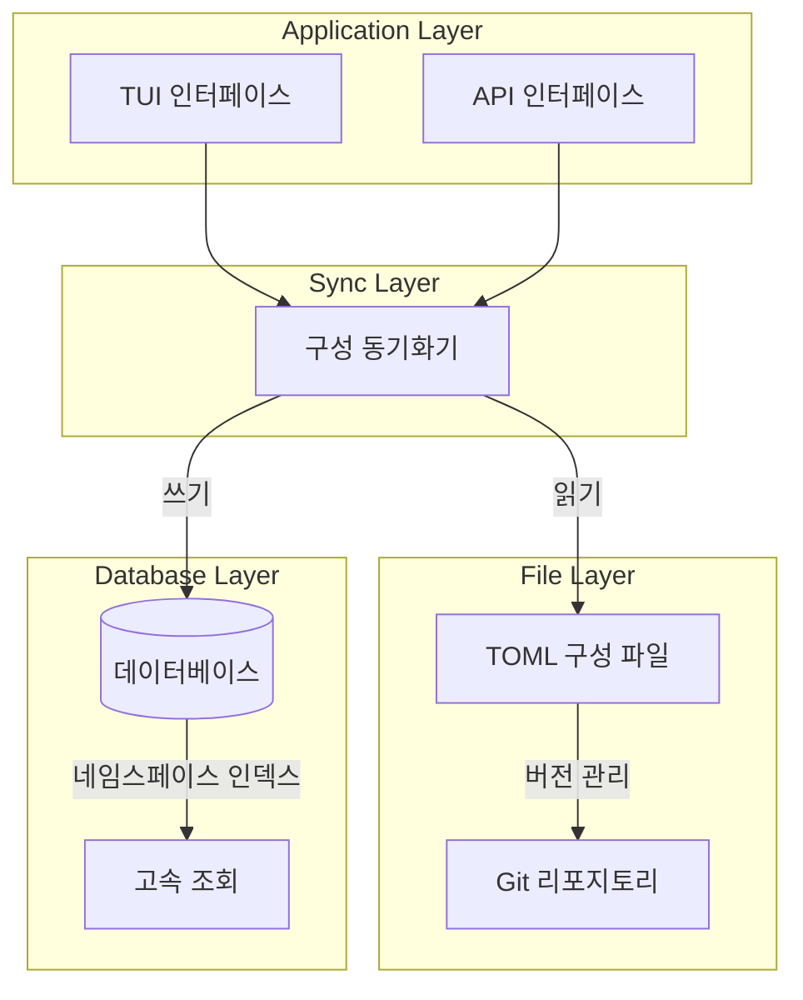
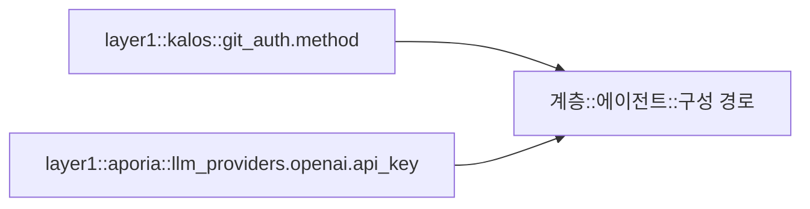
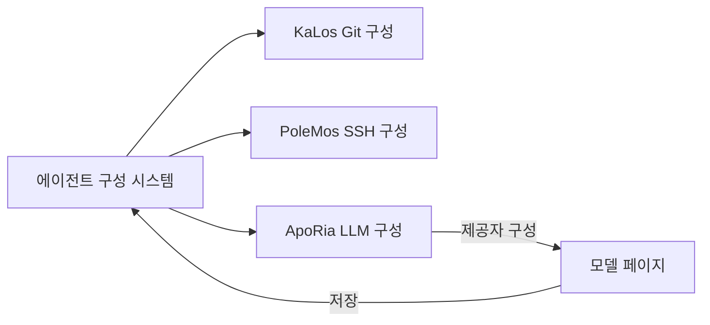

+++
title = "에이전트 구성 시스템 설계"
description = """에이전트 구성 시스템은 통합된 구성 관리 메커니즘을 제공하며, TOML 파일 저장소와 데이터베이스 영속성을 지원하고, 구성 버전 관리 및 핫 리로딩을 구현합니다."""
lang = "ko"
category = "design"
subcategory = "core"
+++

# 에이전트 구성 시스템 설계

## 개요

에이전트 구성 시스템은 통합된 구성 관리 메커니즘을 제공하며, TOML 파일 저장소와 데이터베이스 영속성을 지원하고, 구성 버전 관리 및 핫 리로딩을 구현합니다.

## 핵심 원칙

### 이중 계층 저장소 아키텍처



### 구성 네임스페이스

계층적 네임스페이스 설계를 채택합니다:



## 아키텍처 설계

### 구성 생명주기

```mermaid
stateDiagram-v2
    [*] --> Default: 시스템 기본값
    Default --> FileConfig: TOML 불러오기
    FileConfig --> DbSync: 데이터베이스 동기화
    DbSync --> Active: 구성 활성화

    Active --> Updated: 사용자 수정
    Updated --> Validated: 형식 검증
    Validated --> DbSync: 변경사항 저장

    Active --> HotReload: 핫 리로드 트리거
    HotReload --> Active: 재시작 불필요
```

### TUI 구성 인터페이스

```mermaid
graph TB
    subgraph Agent Document Modal
        Tabs[개요 | 구성 | MCP | 스킬]
        Tabs --> Content[콘텐츠 영역]
    end

    subgraph Configuration Page
        Groups[구성 그룹 목록]
        Groups --> Group1[Git 인증 구성]
        Groups --> Group2[소스 관리 구성]
        Groups --> AddGroup[새 구성 그룹 추가]
    end

    Content --> Groups
```

## 타 모듈과의 관계



## 설계 고려사항

### 보안

- 민감 구성 항목 암호화 저장
- 접근 권한 제어
- 구성 변경 감사

### 확장성

- 사용자 정의 구성 유형 지원
- 유연한 검증 규칙
- 플러그 가능한 구성 처리기

### 일관성

- 파일과 데이터베이스 간 동기화
- 구성 버전 관리
- 충돌 감지 및 해소
