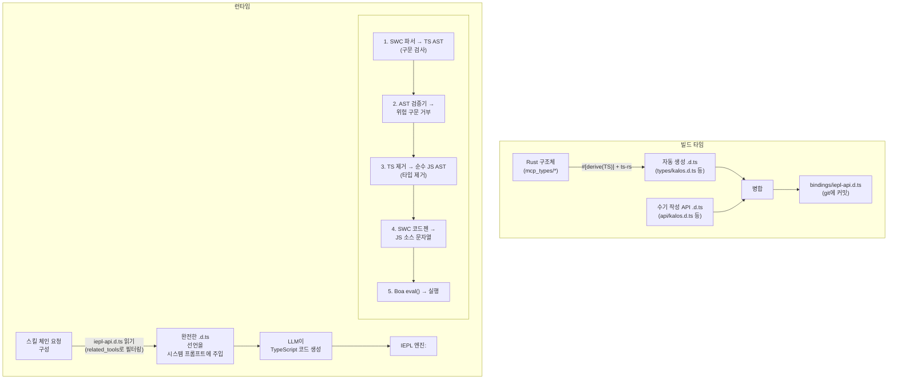
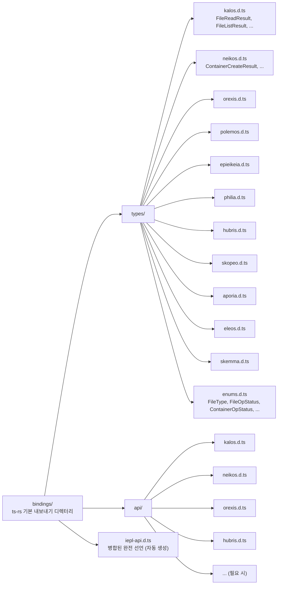

+++
title = "22 — IEPL TypeScript 실행 엔진 설계"
description = """IEPL (In-Execution Prompt Language) 실행 엔진은 기존 Cosmos/SkeMma JS 런타임에 대한 아키텍처 업그레이드로, LLM 생성 실행 코드를 JavaScript에서 TypeScript로 업그레이드합니다. 핵심 """
lang = "ko"
category = "design"
subcategory = "core"
+++

# 22 — IEPL TypeScript 실행 엔진 설계

## 개요

IEPL (In-Execution Prompt Language) 실행 엔진은 기존 Cosmos/SkeMma JS 런타임에 대한 아키텍처 업그레이드로, LLM 생성 실행 코드를 JavaScript에서 TypeScript로 업그레이드합니다. 핵심 변경사항은 다음과 같습니다:

1. **내장 SWC 크레이트**: LLM 생성 TypeScript의 엄격한 구문 검사, 타입 제거, 트랜스파일
1. **Rust derive → TypeScript 타입 생성**: `ts-rs`를 통해 Rust 구조체를 `.d.ts` 선언 파일로 자동 내보내기
1. **타입 안전 스킬 프롬프트**: 하드코딩된 함수 목록 대신 완전한 `.d.ts` 선언을 주입하여 견고성 대폭 향상

## 현재 상태 및 문제점

### 현재 실행 흐름


### 기존 문제점

| 문제 | 설명 |
| --- | --- |
| **타입 제약 없음** | LLM 생성 JS 코드에 정적 타입 정보가 전무; 매개변수 오타는 런타임에만 포착됨 |
| **취약한 인터페이스 설명** | `build_report_tool_instruction()`이 `- file_read (imported from 'kalos')`와 같은 텍스트 목록을 하드코딩, 매개변수 타입이나 반환 값 구조를 표현할 수 없음 |
| **사전 검증 없음** | LLM 코드가 Boa `eval()`로 바로 전달됨; 구문 오류는 실행 시점에만 발견됨 |
| **스키마와 프롬프트 분리** | `McpSchemaWriter`가 JSON 스키마 파일을 생성하지만 프롬프트 주입에 사용되지 않음 |
| **도구 매개변수 무타입** | 현재 도구 매개변수가 `serde_json::Value`로 전달되고 `get("field")`로 수동 추출되며, 타입 안전성 보장 없음 |

### 관련 주요 파일

| 파일 | 현재 책임 |
| --- | --- |
| `packages/agents/skemma/src/js_runtime/runtime.rs` | Boa JS 런타임, `exec()`가 `eval()`을 직접 호출 |
| `packages/agents/skemma/src/mcp/tools/script_exec.rs` | `"javascript"` 언어만 허용 |
| `packages/cosmos/src/bin/cosmos/js_repl/js_commands.rs` | `globalThis.$agent.tool = (...) => ...`을 동적 생성 |
| `packages/scepter/src/state_machine/skill_chain/prompt.rs:51` | `build_report_tool_instruction()`이 API 목록 하드코딩 |
| `packages/shared/src/mcp_types/*.rs` | 모든 MCP 도구 결과 타입 정의 (serde 전용, TS 내보내기 없음) |
| `packages/shared/src/mcp_types/schema.rs` | `McpSchemaWriter`가 JSON 스키마 생성 (프롬프트에서 사용되지 않음) |

## 목표 아키텍처



## 기술 선정

### 1. Rust → TypeScript 타입 생성: `ts-rs`

| 속성 | 값 |
| --- | --- |
| 크레이트 | `ts-rs` (Aleph-Alpha/ts-rs) |
| 버전 | ≥ 12.0 |
| 스타 | 1,772 |
| 다운로드 | ~730만 |
| 라이선스 | MIT |

**근거:**

- 프로젝트의 기존 `serde` 생태계와 깊이 호환 (`serde-compat` 기능이 `rename`/`rename_all`/`skip` 등을 자동 인식)
- `#[derive(TS)]`는 비침습적이며 기존 구조체 정의를 변경하지 않음
- `cargo test` 중 `bindings/` 디렉터리로 자동 내보내기를 위한 `#[ts(export)]` 지원
- 표준 TypeScript `type` 별칭을 생성하여 `.d.ts`에서 직접 사용 가능
- 교차 파일 임포트, 제네릭, 유니온 타입 지원
- 풍부한 생태계 통합: `chrono-impl`, `uuid-impl`, `serde-json-impl`

**제외된 대안:**

| 크레이트 | 제외 이유 |
| --- | --- |
| `specta` | Tauri/rspc 생태계 편향; 이 시나리오에서 함수 타입 내보내기 불필요 |
| `typeshare` | CLI 주도, CI 통합 불편; `type` 대신 `interface` 생성 (LLM 프롬프트에 실용적 차이 없음) |
| `tsify` | `wasm-bindgen`에 결합; 이 프로젝트는 WASM 워크플로우가 아님 |

### 2. TypeScript 파싱 및 트랜스파일: SWC

| 크레이트 | 목적 |
| --- | --- |
| `swc_core` (기능: `ecma_parser`) | TS 소스를 AST로 파싱 |
| `swc_core` (기능: `ecma_ast`) | AST 노드 타입 |
| `swc_core` (기능: `ecma_visit`) | AST 순회/변환 |
| `swc_core` (기능: `ecma_transforms_typescript`) | TS → JS 타입 제거 |
| `swc_core` (기능: `ecma_codegen`) | AST → 소스 코드 생성 |

**주요 기능:**

- 완전한 TypeScript 구문 지원 (제네릭, 조건부 타입, 매핑된 타입, 데코레이터 등)
- 고성능 Rust 네이티브 구현 (tsc보다 20–70배 빠름)
- 타입 제거(`strip`)가 TS AST를 JS AST로 변환
- 구문 수준 오류 보고 (닫히지 않은 괄호, 유효하지 않은 토큰 등)

**제한사항:**

- SWC는 **완전한 타입 검사를 수행하지 않습니다** (`tsc --noEmit`에 해당하는 기능 없음). 즉, "존재하지 않는 속성 호출"과 같은 의미적 오류를 포착할 수 없습니다.
- 이 시나리오에서는 수용 가능합니다: LLM 생성 코드는 주로 구문적 정확성 보장이 필요하며, Boa 엔진이 런타임 동적 타입 안전성을 제공합니다.
- 향후 완전 타입 검사가 필요하면 AST 수준 사용자 정의 검증을 도입할 수 있습니다 (아래 "AST 검증기" 참조).

## 상세 설계

### 1단계: ts-rs 타입 내보내기 인프라

#### 1.1 새 워크스페이스 의존성

```toml
# Cargo.toml (워크스페이스)
[workspace.dependencies]
ts-rs = { version = "12", features = ["serde-compat", "format"] }
```

#### 1.2 MCP 타입에 `#[derive(TS)]` 추가

`packages/shared/src/mcp_types/` 하위의 모든 구조체가 `ts-rs` derive를 얻습니다:

```rust
// packages/shared/src/mcp_types/kalos.rs
use ts_rs::TS;

# [derive(Debug, Clone, Serialize, Deserialize, TS)]
# [ts(export)]
pub struct FileReadResult {
    pub path: String,
    pub size_bytes: u64,
    pub content: String,
}

# [derive(Debug, Clone, Serialize, Deserialize, TS)]
# [ts(export)]
pub struct FileListResult {
    pub path: String,
    pub total_count: usize,
    pub entries: Vec<FileEntry>,
}

// ... 기타 타입도 유사하게
```

열거형은 `str_enum!` 매크로 적응이 필요합니다:

```rust
// packages/shared/src/mcp_types/enums.rs
// 기존 str_enum! 매크로 생성 열거형에 추가 TS derive 필요

# [derive(Debug, Clone, Copy, PartialEq, Eq, Serialize, Deserialize, TS)]
pub enum FileType {
    File,
    Directory,
}
// 참고: str_enum! 매크로가 TS도 derive하도록 확장 필요
// 또는 기존 매크로 생성 열거형에 개별적으로 #[derive(TS)] 추가
```

#### 1.3 `.d.ts` 파일 레이아웃



#### 1.4 수기 작성 API `.d.ts` 예시

```typescript
// bindings/api/kalos.d.ts

import type {
  FileReadResult,
  FileListResult,
  FileWriteResult,
  FileEditResult,
  FileDeleteResult,
  FileExistsResult,
  MkDirResult,
  FileInfoResult,
} from "../types/kalos";

export interface KalosApi {
  /**
   * 파일 내용 읽기
   * @param params.path - 파일 경로 (절대 경로)
   */
  file_read(params: { path: string }): Promise<FileReadResult>;

  /**
   * 파일에 쓰기
   * @param params.path - 파일 경로
   * @param params.content - 파일 내용
   */
  file_write(params: { path: string; content: string }): Promise<FileWriteResult>;

  /**
   * 파일 편집 (찾아서 바꾸기)
   * @param params.path - 파일 경로
   * @param params.old_string - 바꿀 원본 문자열
   * @param params.new_string - 대체 문자열
   */
  file_edit(params: {
    path: string;
    old_string: string;
    new_string: string;
  }): Promise<FileEditResult>;

  file_delete(params: { path: string }): Promise<FileDeleteResult>;
  file_exists(params: { path: string }): Promise<FileExistsResult>;
  file_list(params: { path: string }): Promise<FileListResult>;
  file_get_info(params: { path: string }): Promise<FileInfoResult>;
  file_create_dir(params: { path: string }): Promise<MkDirResult>;
}
```

#### 1.5 빌드 타임 병합 스크립트

`packages/shared/build.rs` 또는 독립형 `xtask`에서:

```rust
// xtask/src/bin/iepl_codegen.rs
// 1. cargo test 실행하여 ts-rs 내보내기 트리거
// 2. bindings/types/*.d.ts + bindings/api/*.d.ts 읽기
// 3. 에이전트별 그룹화 및 병합, 최종 iepl-api.d.ts 생성
// 4. bindings/iepl-api.d.ts로 출력
```

또는 더 간단히, 테스트 중 내보내기 및 병합을 트리거하는 `iepl_codegen` 모듈을 `packages/shared/src/mcp_types/`에 추가.

**핵심 원칙: 한 번 생성되면 `.d.ts` 파일은 git에 커밋되고 소스 트리의 영구적 부분이 됩니다.** 이후 Rust 타입 변경 시 파일이 재생성되고 업데이트가 커밋됩니다.

### 2단계: IEPL 실행 엔진

#### 2.1 새 SWC 의존성

```toml
# Cargo.toml (워크스페이스)
[workspace.dependencies]
swc_core = { version = "65", features = [
    "ecma_parser",
    "ecma_ast",
    "ecma_visit",
    "ecma_transforms_base",
    "ecma_transforms_typescript",
    "ecma_codegen",
    "common",
] }
```

#### 2.2 IEPL 엔진 코어

`packages/agents/skemma/src/` 하위에 새 `iepl/` 모듈:

```text
packages/agents/skemma/src/iepl/
  mod.rs     → 모듈 진입점
  engine.rs  → IEPL 핵심 엔진 (파싱 → 검증 → 제거 → 코드젠)
  ast_validator.rs → AST 안전 검증기
  type_index.rs    → 타입 인덱스 (.d.ts에서 구축)
```

##### engine.rs — 핵심 트랜스파일 흐름

```rust
use anyhow::{anyhow, Result};
use swc_core::{
    common::{errors::ColorConfig, SourceFile, SourceMap, GLOBALS},
    ecma::{
        ast::Program,
        codegen::{text_writer::JsWriter, Emitter},
        parser::{lexer::Lexer, Parser, StringInput, Syntax, TsSyntax},
        transforms::{
            base::fixer::fixer,
            typescript::strip,
        },
        visit::FoldWith,
    },
};

pub struct IeplEngine {
    cm: Arc<SourceMap>,
}

pub struct TranspileResult {
    pub js_code: String,
    pub parse_errors: Vec<String>,
}

impl IeplEngine {
    pub fn new() -> Self {
        Self {
            cm: Arc::new(SourceMap::default()),
        }
    }

    /// TypeScript 코드를 JavaScript로 트랜스파일
    pub fn transpile(&self, ts_code: &str) -> Result<TranspileResult> {
        let fm = self.cm.new_source_file(
            swc_core::common::FileName::Custom("iepl-input".into()),
            ts_code.into(),
        );

        // 1. TS 파싱 → AST
        let mut parse_errors = Vec::new();
        let module = self.parse_ts(&fm, &mut parse_errors)?;

        if !parse_errors.is_empty() {
            return Err(anyhow!("TypeScript 파싱 오류:\n{}", parse_errors.join("\n")));
        }

        // 2. AST 안전 검증
        let validator = AstValidator::new();
        validator.validate(&module)?;

        // 3. 타입 제거 TS → JS
        let mut transforms = swc_core::common::pass::Optional::new(
            strip::strip_typescript(swc_core::common::comments::NoComments),
            true,
        );
        let program = module.fold_with(&mut transforms);

        // 4. AST → JS 소스
        let js_code = self.emit(program)?;

        Ok(TranspileResult {
            js_code,
            parse_errors,
        })
    }

    fn parse_ts(
        &self,
        fm: &SourceFile,
        errors: &mut Vec<String>,
    ) -> Result<Program> {
        let lexer = Lexer::new(
            Syntax::Typescript(TsSyntax {
                tsx: false,
                decorators: true,
                dts: false,
                no_early_errors: false,
                disallowAmbiguousJSXLike: true,
            }),
            Default::default(),
            StringInput::from(fm),
            None,
        );
        let mut parser = Parser::new_from(lexer);
        match parser.parse_program() {
            Ok(program) => Ok(program),
            Err(e) => {
                errors.push(format!("{:?}", e));
                Err(anyhow!("TypeScript 파싱 실패"))
            }
        }
    }

    fn emit(&self, program: Program) -> Result<String> {
        let mut buf = Vec::new();
        let writer = JsWriter::new(self.cm.clone(), "\n", &mut buf, None);
        let mut emitter = Emitter {
            cfg: Default::default(),
            cm: self.cm.clone(),
            comments: None,
            wr: writer,
        };
        emitter.emit_program(&program)?;
        Ok(String::from_utf8(buf)?)
    }
}
```

##### ast_validator.rs — 안전 검증기

```rust
use anyhow::{anyhow, Result};
use swc_core::ecma::ast::{Module, Program};
use swc_core::ecma::visit::{Visit, VisitWith};

/// AST에 위험 패턴이 포함되지 않았는지 검증
pub struct AstValidator {
    violations: Vec<String>,
}

impl AstValidator {
    pub fn new() -> Self {
        Self {
            violations: Vec::new(),
        }
    }

    pub fn validate(&self, program: &Program) -> Result<()> {
        // 위험 패턴 감지 구현
        // - eval() / Function() 호출 금지
        // - 동적 import() 금지
        // - __proto__ / constructor 접근 금지
        // - with 문 금지
        // - 선택적: 허용 목록에 없는 전역 변수 접근 금지
        if self.violations.is_empty() {
            Ok(())
        } else {
            Err(anyhow!("AST 검증 위반:\n{}", self.violations.join("\n")))
        }
    }
}
```

#### 2.3 script_exec으로의 통합

`packages/agents/skemma/src/mcp/tools/script_exec.rs` 수정:

```rust
// 변경 전 (53행):
if !matches!(language.as_str(), "javascript" | "js" | "node") {
    return McpToolResult::failure(format!(
        "지원되지 않는 언어: '{}'. JavaScript만 지원됩니다.", language
    ));
}

// 변경 후:
let executable_code = match language.as_str() {
    "typescript" | "ts" => {
        let engine = crate::iepl::IeplEngine::new();
        match engine.transpile(code) {
            Ok(result) => result.js_code,
            Err(e) => return McpToolResult::failure(format!("TS 트랜스파일 오류: {}", e)),
        }
    }
    "javascript" | "js" | "node" => code.to_string(),
    _ => {
        return McpToolResult::failure(format!(
            "지원되지 않는 언어: '{}'. TypeScript 및 JavaScript만 지원됩니다.",
            language
        ));
    }
};
```

#### 2.4 Cosmos JS REPL로의 통합

`packages/cosmos/src/bin/cosmos/js_repl/mod.rs`의 실행 경로를 수정하여 `runtime.exec()` 호출 전 IEPL 트랜스파일 단계 추가.

### 3단계: 스킬 프롬프트 타입 주입

#### 3.1 현재 프롬프트 구성

`prompt.rs:51`의 `build_report_tool_instruction()`:

```rust
// 현재: 하드코딩된 API 목록
let items: Vec<String> = available_apis
    .iter()
    .map(|a| format!("- ${}", a))
    .collect();
parts.push(format!("\n사용 가능한 JS API:\n{}", items.join("\n")));
```

이것이 생성하는 것:

```text
사용 가능한 JS API:
- file_read (imported from 'kalos')
- file_write (imported from 'kalos')
- report()
```

#### 3.2 새 프롬프트 구성

```rust
pub(super) fn build_report_tool_instruction(
    next_targets: &[String],
    related_tools: &[RelatedTool],  // 완전한 RelatedTool 정보 수용하도록 변경
) -> String {
    let mut parts = Vec::new();

    // bindings/에서 에이전트별 그룹화된 .d.ts 불러오기
    let type_declarations = load_iepl_type_declarations(related_tools);
    if !type_declarations.is_empty() {
        parts.push(format!(
            "TypeScript 코드를 작성하고 있습니다. 사용 가능한 API 타입 선언:\n\n\
             ```typescript\n{}\n```",
            type_declarations
        ));
    }

    // ... next_targets와 mcp_conv는 변경 없음
}
```

프롬프트에 주입되는 예시 콘텐츠:

```typescript
TypeScript 코드를 작성하고 있습니다. 사용 가능한 API 타입 선언:

```

// === 타입 (Rust에서 자동 생성) ===
type `FileReadResult` = { path: string; `size_bytes`: number; content: string };
type `FileListResult` = { path: string; `total_count`: number; entries: Array<{ name: string; `file_type`: "file" | "directory" }> };
type `FileWriteResult` = { path: string; `size_bytes`: number; status: "created" | "deleted" | "edited" | "written" };

// === API (수기 작성) ===
interface KalosApi {
`file_read`(params: { path: string }): Promise<`FileReadResult`>;
`file_write`(params: { path: string; content: string }): Promise<`FileWriteResult`>;
`file_list`(params: { path: string }): Promise<`FileListResult`>;
// ...
}

declare const $kalos: KalosApi;

```text

#### 3.3 .d.ts 로더

```

// packages/shared/src/iepl/decl_loader.rs

use `include_dir`::{Dir, `include_dir`};

static IEPL_BINDINGS: Dir = `include_dir`!("$CARGO_MANIFEST_DIR/../../../bindings");

pub struct `IeplDeclLoader`;

impl `IeplDeclLoader` {
/// related_tools로 필터링된 필수 .d.ts 선언 불러오기
pub fn `load_for_tools`(`related_tools`: &[`RelatedTool`]) -> String {
let mut declarations = Vec::new();

// 관련된 에이전트 집합 수집
let agents: std::collections::HashSet<&str> = `related_tools`
.iter()
.map(|t| t.agent_name.as_str())
.collect();

for agent in &agents {
// 자동 생성 타입 선언 불러오기
if let Some(`types_file`) = IEPL_BINDINGS.get_file(format!("types/{}.d.ts", agent)) {
if let Ok(content) = std::str::`from_utf8`(types_file.contents()) {
declarations.push(content.to_string());
}
}

// 수기 작성 API 선언 불러오기
if let Some(`api_file`) = IEPL_BINDINGS.get_file(format!("api/{}.d.ts", agent)) {
if let Ok(content) = std::str::`from_utf8`(api_file.contents()) {
declarations.push(content.to_string());
}
}
}

declarations.join("\n\n")
}
}

```text

#### 3.4 JS 네임스페이스 빌더 업그레이드

`js_commands.rs`의 `build_tool_namespace_js()`는 계속해서 JavaScript 함수 래퍼를 변경 없이 생성하지만(Boa 엔진은 JS만 실행), 프롬프트 측 인터페이스 설명은 하드코딩 대신 `.d.ts`가 제공합니다.

## 데이터 흐름 비교

### 현재 (JavaScript)

```

flowchart TD
Meta["스킬 메타데이터\`nrelated_tools`:\n- kalos.file_read\n- kalos.file_write"]
Meta --> Build["`build_report_tool_instruction`\n→ '- `file_read` (imported)'\n→ '- `file_write` (imported)'\n(하드코딩된 텍스트)"]
Build -->|"시스템 프롬프트에\n주입"| LLM1["LLM이 JavaScript 생성\`nfile_read`({path:'x'})\n(타입 검사 없음)"]
LLM1 --> Boa1["Boa eval() 직접 실행\n(사전 검증 없음)"]

```text

### 목표 (TypeScript + IEPL)

```

flowchart TD
Meta2["스킬 메타데이터\`nrelated_tools`:\n- kalos.file_read\n- kalos.file_write"]
Meta2 --> Loader["`IeplDeclLoader`\n→ types/kalos.d.ts\n→ api/kalos.d.ts\n(완전한 타입 선언)"]
Loader -->|"시스템 프롬프트에\n주입"| LLM2["LLM이 TypeScript 생성\nconst r: `FileReadResult` =\n  await `file_read`(\n    {path: 'x'}\n  );\n(타입 제약됨)"]
LLM2 --> IEPL["IEPL 엔진\n1. SWC 파싱 → AST (구문 검사)\n2. AST 검증기 (안전 검사)\n3. 타입 제거 → JS (타입 제거)\n4. 코드젠 → JS 문자열"]
IEPL --> Boa2["Boa eval() 실행"]

```text

## 견고성 개선 분석

### 비교: 현재 vs IEPL

| 차원 | 현재 (JS + 하드코딩 목록) | IEPL (TS + .d.ts) |
|-----------|------------------------------|-------------------|
| **인터페이스에 대한 LLM 이해** | `- file_read (imported from 'kalos')`를 봄 | 완전한 `file_read(params: {path: string}): Promise<FileReadResult>`를 봄 |
| **매개변수 오류** | LLM이 매개변수명 추측 | LLM이 정확한 매개변수 타입을 앎 |
| **반환 값 사용** | 어떤 필드가 반환되는지 알 수 없음 | `FileReadResult`의 완전한 구조를 앎 |
| **구문 오류** | 런타임에만 발견됨 | 트랜스파일 전 SWC에 의해 거부됨 |
| **인터페이스 변경** | 하드코딩된 텍스트 수동 갱신 필요 | Rust 구조체 수정 → .d.ts 재생성 → 프롬프트에 자동 반영 |
| **새 도구 온보딩** | prompt.rs 로직 수정 | ts-rs derive 추가 + 수기 api .d.ts 작성 |
| **타입 내보내기 유지보수** | 없음 | .d.ts가 git에서 추적 가능한 diff로 관리됨 |

### LLM 프롬프트 품질 향상

LLM이 보는 현재 프롬프트 조각:

```

사용 가능한 JS API:

- `file_read` (imported from 'kalos')
- `file_write` (imported from 'kalos')
- report()

```text

IEPL에서 LLM이 보는 프롬프트 조각:

```

declare const $kalos: {
`file_read`(params: { path: string }): Promise<{ path: string; `size_bytes`: number; content: string }>;
`file_write`(params: { path: string; content: string }): Promise<{ path: string; `size_bytes`: number; status: "created" | "deleted" | "edited" | "written" }>;
`file_list`(params: { path: string }): Promise<{ path: string; `total_count`: number; entries: Array<{ name: string; `file_type`: "file" | "directory" }> }>;
};
// ES 모듈 임포트를 통해 사용 가능한 hubris 도구: import { report } from 'hubris'
report(params: { summary: string }): Promise<{ summary: string }>;
};

```text

후자는 다음을 제공합니다:
- 정밀한 매개변수명과 타입
- 완전한 반환 값 구조
- 유니온 타입 리터럴 (예: `"file" | "directory"`)
- 비동기 의미론을 표현하는 TypeScript 네이티브 `Promise<>`

## 새 워크스페이스 의존성 요약

```

# 신규

ts-rs = { version = "12", features = ["serde-compat", "format"] }
`swc_core` = { version = "65", features = [
"`ecma_parser`",
"`ecma_ast`",
"`ecma_visit`",
"`ecma_transforms_base`",
"`ecma_transforms_typescript`",
"`ecma_codegen`",
"common",
] }

```text

## 새 크레이트 구조

```

packages/agents/skemma/src/iepl/
mod.rs          → pub mod engine; pub mod `ast_validator`;
engine.rs       → IeplEngine: transpile(`ts_code`) -> Result<`TranspileResult`>
ast_validator.rs → `AstValidator`: 안전 패턴 감지

packages/shared/src/iepl/
mod.rs          → pub mod `decl_loader`;
decl_loader.rs  → `IeplDeclLoader`: related_tools로 필터링된 .d.ts 불러오기

bindings/
types/           → ts-rs 자동 내보내기
kalos.d.ts
neikos.d.ts
...
api/             → 수기 작성 및 유지보수
kalos.d.ts
neikos.d.ts
...
iepl-api.d.ts    → 병합된 아티팩트 (선택적)

```text

## 구현 경로

### 1단계: ts-rs 인프라 (~2–3일)

1. `ts-rs` 워크스페이스 의존성 추가
2. 모든 `mcp_types/*.rs` 구조체에 `#[derive(TS)]` 추가
3. `str_enum!` 매크로가 `ts-rs` derive와 호환되도록 확장
4. `cargo test` 실행하여 `bindings/types/*.d.ts` 생성
5. `bindings/api/*.d.ts` 수기 작성 (에이전트별 하나의 파일)
6. 병합 스크립트 작성하여 `bindings/iepl-api.d.ts` 생성
7. 모든 `.d.ts`를 git에 커밋

### 2단계: IEPL 실행 엔진 (~3–5일)

1. `swc_core` 워크스페이스 의존성 추가
2. `iepl/engine.rs` 구현: 파싱 → 제거 → 코드젠
3. `iepl/ast_validator.rs` 구현: 위험 패턴 감지
4. `script_exec.rs`를 TypeScript 언어 지원하도록 수정
5. Cosmos JS REPL 실행 경로에 통합
6. 종단 간 테스트: TS 코드 → SWC → JS → Boa

### 3단계: 프롬프트 타입 주입 (~2–3일)

1. `IeplDeclLoader` 구현
2. `build_report_tool_instruction()`을 .d.ts 사용하도록 수정
3. `execution_steps.rs`의 시스템 프롬프트 구성 로직 갱신
4. LLM 생성 TS 코드의 개선된 품질 검증

### 4단계: 정리 및 최적화 (~1–2일)

1. `McpSchemaWriter` 제거 또는 폐기 (.d.ts 시스템으로 대체됨)
2. CI 단계 추가: `cargo test` 후 `bindings/`의 커밋되지 않은 변경 확인
3. 문서 갱신

## 위험 및 완화

| 위험 | 완화 방안 |
|------|-----------|
| SWC 컴파일 시간 증가 | `swc_core` 온디맨드 기능, 임포트 최소화 |
| `str_enum!` 매크로가 `ts-rs`와 충돌 | 매크로 확장 또는 열거형별로 `TS` 트레이트 구현 |
| `.d.ts`가 너무 커서 프롬프트 토큰 한도 초과 | `related_tools`로 정밀 필터링, 현재 스킬에 필요한 타입만 주입 |
| Boa가 `async/await` 지원하지 않음 | SWC가 콜백 스타일로 다운그레이드 구성 가능 (또는 Boa 향후 버전 지원) |
| ts-rs 버전이 serde 버전과 호환되지 않음 | 워크스페이스 버전 잠금, CI 검증 |

## 확장 가능성

1. **AST 수준 타입 검사**: SWC AST에서 경량 타입 검사 구현 (ES 모듈 임포트 호출이 선언된 매개변수 사용하는지 확인)
2. **.d.ts 버전 관리**: `.d.ts` 파일 헤더에 버전 번호 추가, LLM 프롬프트에 버전 정보 포함
3. **증분 갱신**: Rust 타입 변경 시 CI가 `bindings/` diff를 자동 감지하고 갱신 알림
4. **다중 언어 실행**: IEPL 프레임워크가 다른 언어 지원으로 확장 가능 (RustPython을 통한 Python 등)
5. **런타임 타입 검증**: Boa 실행 전/후에 serde 검증을 추가하여 LLM이 사용한 매개변수와 반환 값이 타입 정의를 준수하는지 확인
