+++
title = "프로바이더 TOML 설정 시스템 설계"
description = """프로바이더 TOML 설정 시스템은 모든 LLM 프로바이더 구성을 하드코딩된 값에서 TOML 설정 파일로 마이그레이션하여, 설정과 코드를 분리하고 유지보수성과 확장성을 향상시킵니다"""
lang = "ko"
category = "design"
subcategory = "core"
+++

# 프로바이더 TOML 설정 시스템 설계

## 개요

프로바이더 TOML 설정 시스템은 모든 LLM 프로바이더 구성을 하드코딩된 값에서 TOML 설정 파일로 마이그레이션하여, 설정과 코드를 분리하고 유지보수성과 확장성을 향상시킵니다.

## 핵심 목표

| 목표 | 설명 |
| --- | --- |
| 유지보수성 | 설정이 코드와 분리되어 변경 시 재컴파일 불필요 |
| 확장성 | 새 프로바이더 추가 시 TOML 파일만 추가하면 됨 |
| 가독성 | 설정 파일이 명확하고 이해하기 쉬움 |
| 재사용성 | 설정을 다양한 환경에서 공유 가능 |

## 아키텍처 설계

### 설정 로딩 프로세스

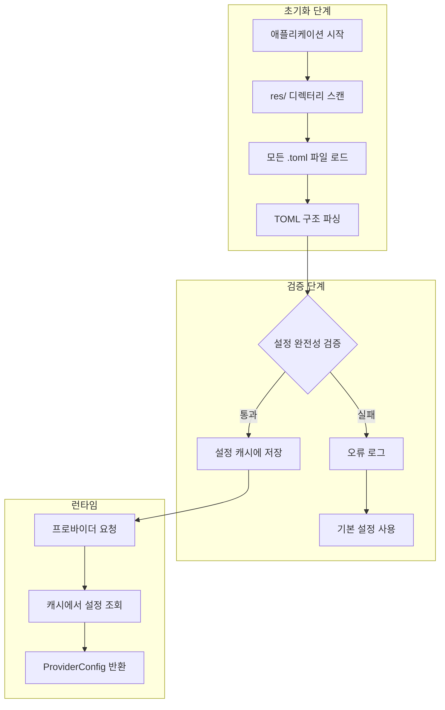

### 설정 계층 구조

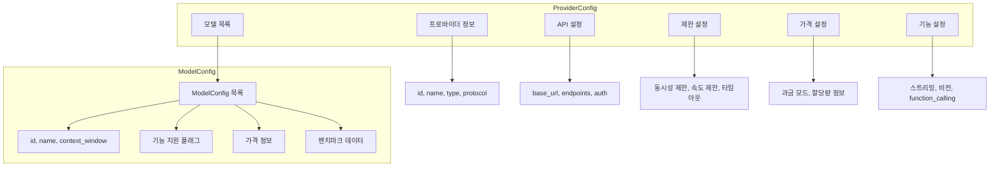

## 설정 우선순위

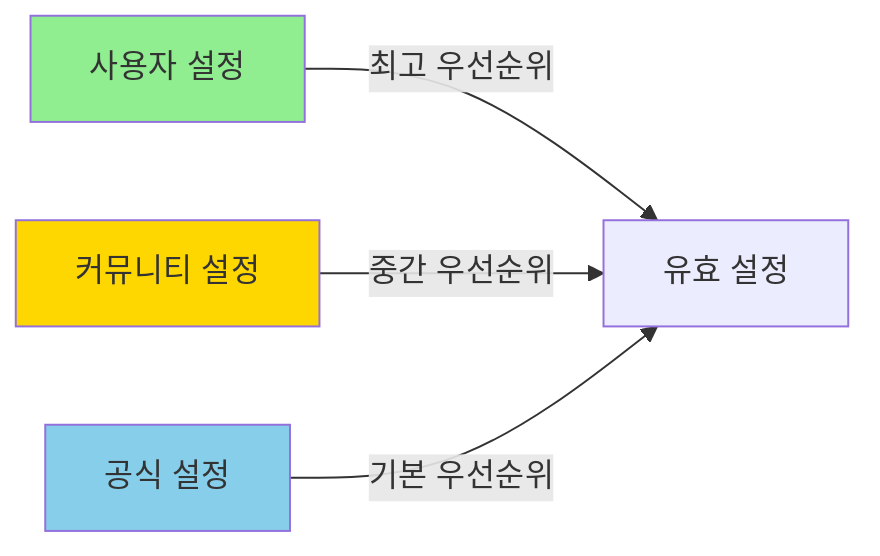

### 우선순위 병합 규칙

| 계층 | 출처 | 설명 |
| --- | --- | --- |
| 1 | 공식 설정 | 프로바이더 공식 문서 데이터, 기본값으로 사용 |
| 2 | 커뮤니티 설정 | 커뮤니티 기여 최적화 설정, 공식 데이터 덮어씀 |
| 3 | 사용자 설정 | 사용자 정의 설정, 최고 우선순위 |

## 가격 모델

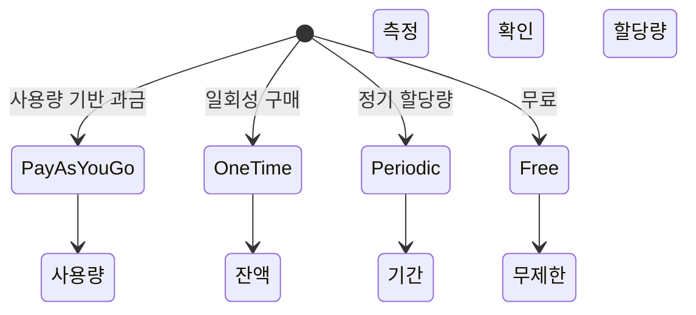

### 가격 모델 비교

| 모델 | 적용 시나리오 | 특성 |
| --- | --- | --- |
| PayAsYouGo | OpenAI, Anthropic | 토큰당 과금, 실시간 차감 |
| OneTime | 선불 패키지 | 할당량 사전 구매, 소진 시까지 사용 |
| Periodic | GLM 중국 등 | 주기적 할당량 초기화 |
| Free | Ollama 로컬 모델 | 비용 제한 없음 |

## 프로바이더 유형 분류

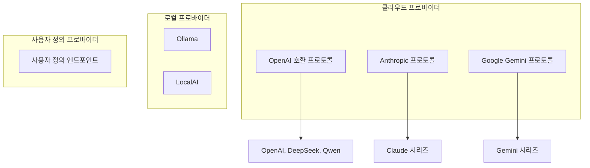

## 핫 리로드 메커니즘

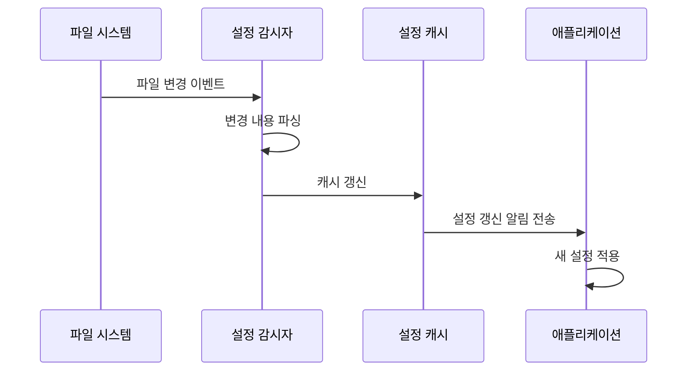

## 오류 처리 전략

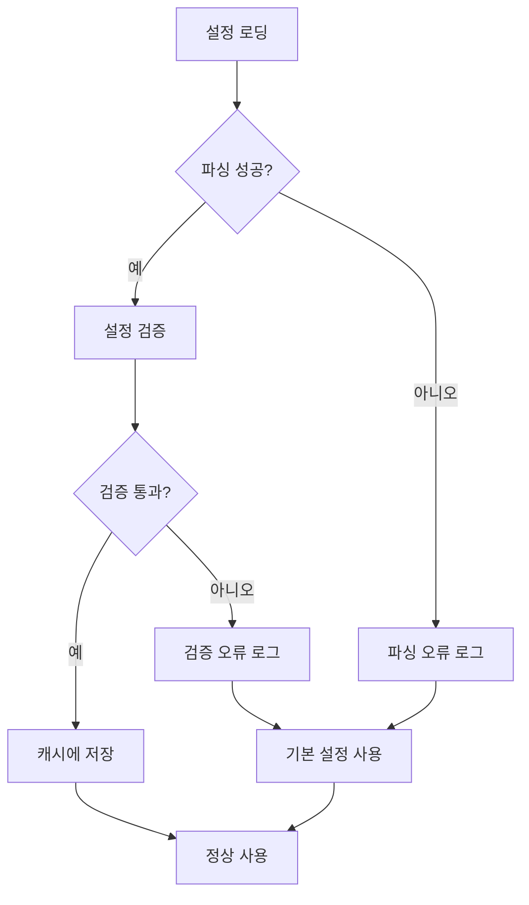

## 확장성 설계

### 새 프로바이더 추가


### 설정 검증 규칙

| 필드 | 검증 규칙 | 오류 처리 |
| --- | --- | --- |
| provider.id | 비어 있지 않음, 고유함 | 로딩 거부, 오류 로그 |
| api.base_url | 유효한 URL 형식 | 기본값 사용 |
| models[].id | 비어 있지 않음 | 해당 모델 건너뜀 |
| pricing.model | Enum 값 확인 | 기본값 PayAsYouGo |

## 보안 고려 사항

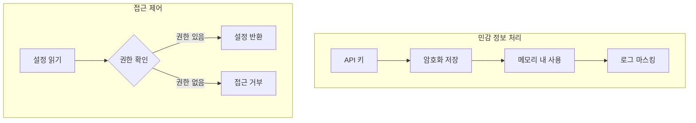

## 향후 확장

| 기능 | 설명 | 우선순위 |
| --- | --- | --- |
| 설정 핫 리로드 | 런타임에 외부 설정 파일 로드 | 높음 |
| 설정 검증 | 시작 시 설정 완전성 검증 | 높음 |
| 설정 병합 | 사용자 설정이 기본 설정 덮어씀 | 중간 |
| 설정 임포트/익스포트 | 설정 파일 임포트/익스포트 지원 | 중간 |
| 에이전트 갱신 | 공식 문서에서 설정 자동 갱신 | 낮음 |

# 프로바이더 메타데이터 관리 설계

## 개요

프로바이더 메타데이터 관리 시스템은 공식 LLM 프로바이더 문서에서 설정 정보를 동적으로 가져와, 설정 데이터의 자동화된 갱신 및 검증을 가능하게 합니다.

## 핵심 문제

현재 구현은 하드코딩된 사용량 통계를 포함하고 있으며 동적 프로바이더 데이터 지원이 부족합니다. 자동화된 메타데이터 획득 및 관리 메커니즘을 구축해야 합니다.

## 아키텍처 설계

### 데이터 흐름 아키텍처

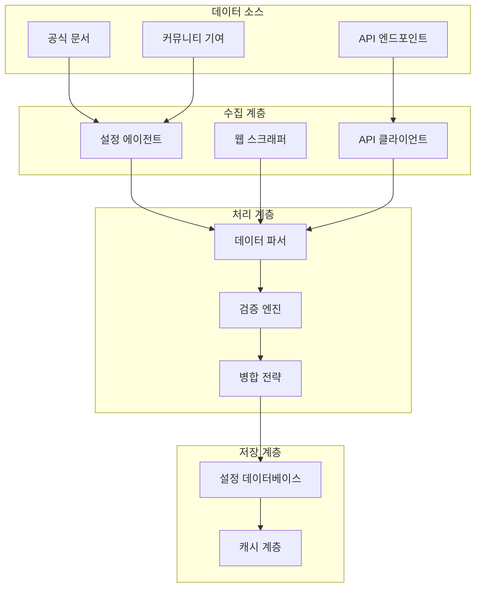

### 설정 우선순위 모델

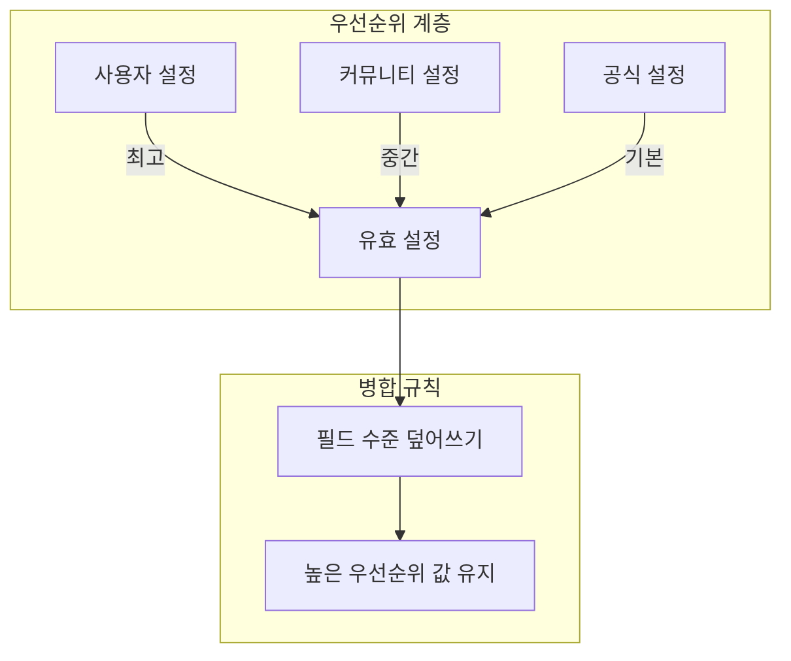

## 메타데이터 구조

### 프로바이더 설정 계층 구조

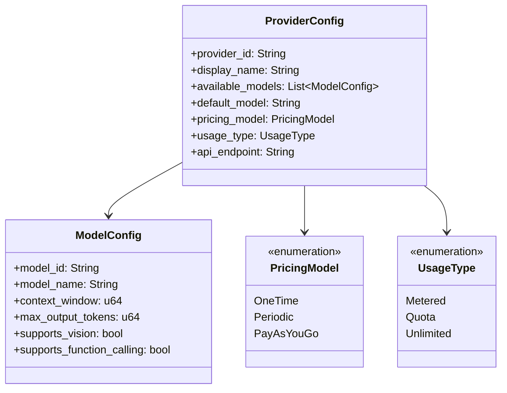

### 설정 출처 분류

| 출처 유형 | 설명 | 신뢰도 | 갱신 빈도 |
| --- | --- | --- | --- |
| 공식 | 프로바이더 공식 문서 | 높음 | 자동 주기적 |
| 커뮤니티 | 커뮤니티 기여 데이터 | 중간 | 수동 갱신 |
| 사용자덮어쓰기 | 사용자 사용자 정의 | 최고 | 실시간 |

## 에이전트 수집 시스템

### 수집 프로세스

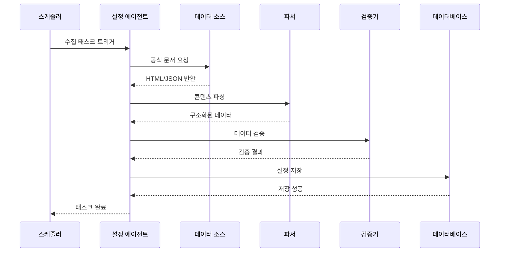

### 프로바이더 에이전트 책임

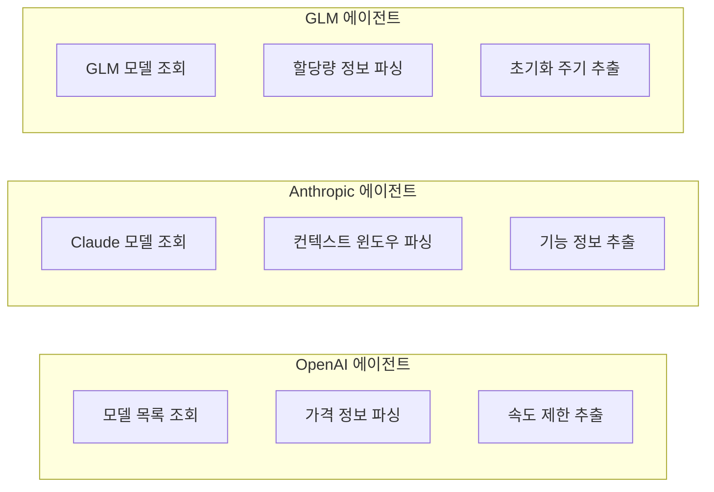

## 데이터 검증 메커니즘

### 검증 프로세스

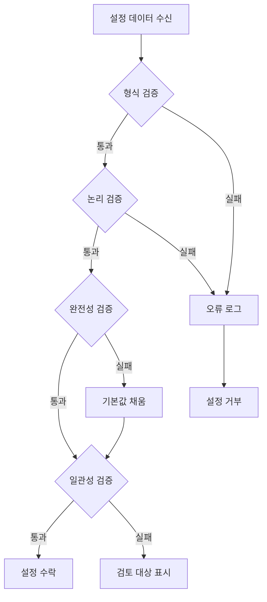

### 검증 규칙

| 검증 유형 | 확인 내용 | 실패 처리 |
| --- | --- | --- |
| 형식 검증 | 데이터 타입, 필드 형식 | 거부 및 로그 |
| 논리 검증 | 값 범위, Enum 값 | 기본값 사용 |
| 완전성 검증 | 필수 필드 존재 | 기본값 채움 |
| 일관성 검증 | 필드 간 관계 정확성 | 검토 대상 표시 |

## 설정 병합 전략

### 필드 수준 병합

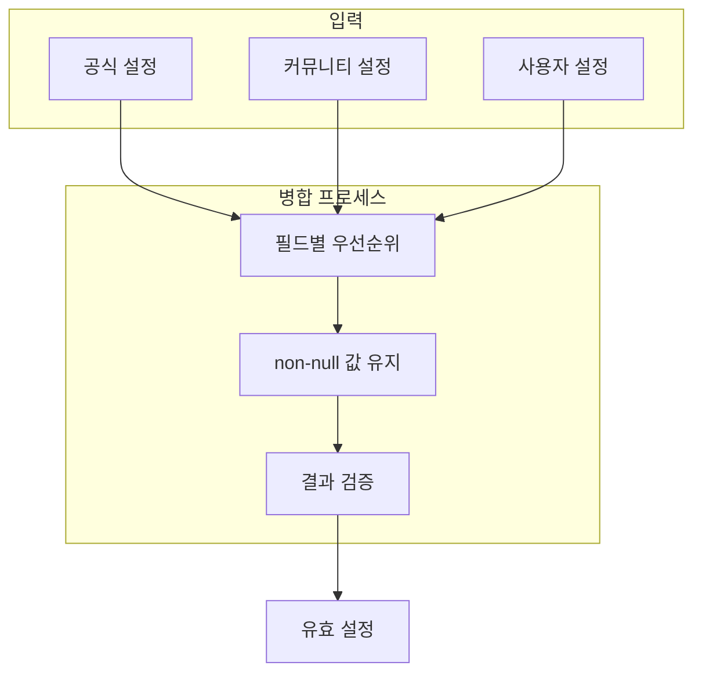

### 병합 예시

| 필드 | 공식 값 | 커뮤니티 값 | 사용자 값 | 최종 값 |
| --- | --- | --- | --- | --- |
| context_window | 128000 | - | 64000 | 64000 |
| max_concurrent | 100 | 50 | - | 50 |
| pricing_model | PayAsYouGo | - | - | PayAsYouGo |

## 사용자 설정 인터페이스

### 설정 파일 구조

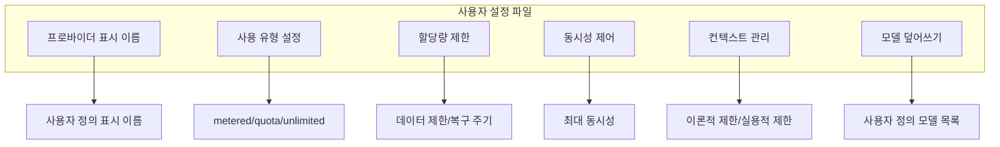

## 스케줄 갱신 메커니즘

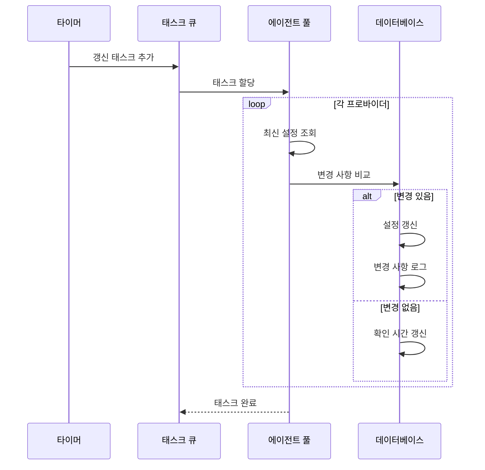

## 오류 처리

### 수집 실패 처리

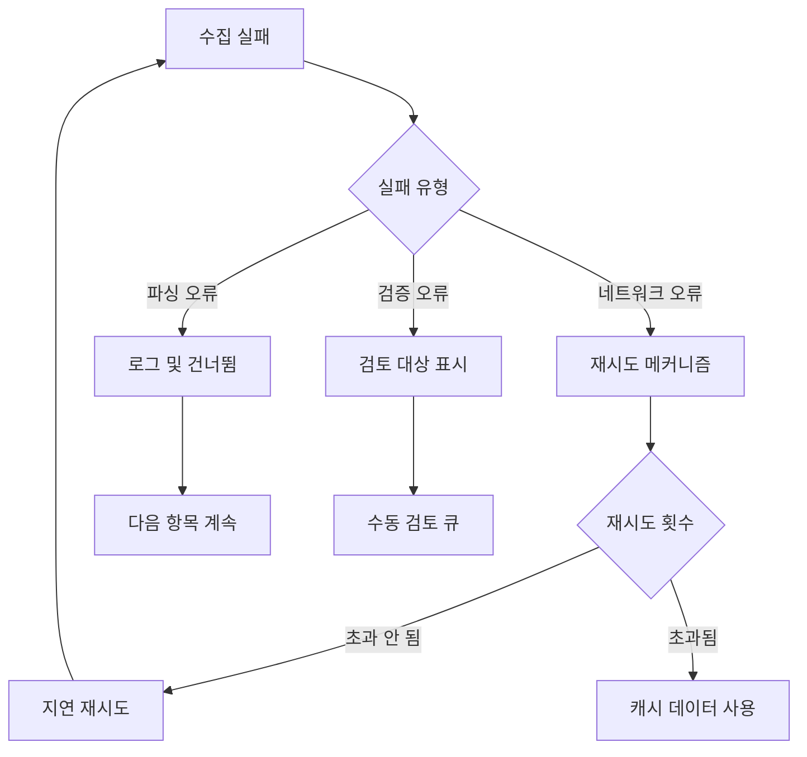

## 확장성 설계

### 새 프로바이더 추가


### 확장 포인트

| 확장 유형 | 설명 | 구현 방식 |
| --- | --- | --- |
| 새 프로바이더 | 새 설정 소스 추가 | 프로바이더 에이전트 인터페이스 구현 |
| 새 필드 | 설정 구조 확장 | 데이터 모델 및 검증 규칙 갱신 |
| 새 검증 규칙 | 검증 로직 추가 | 검증기 구현 추가 |

## 레이어3 에이전트 구현

### ProviderScratch 에이전트

`ProviderScratch`는 최초의 레이어3 공식 에이전트로, 스크래핑 기능의 예시 구현 역할을 합니다.

```mermaid
flowchart TB
    subgraph ProviderScratch 에이전트
        A[에이전트 진입] --> B{실행 모드}
        B -->|TUI 모드| C[대화형 인터페이스]
        B -->|CI 모드| D[자동 실행]

        C --> E[프로바이더 선택]
        D --> F[환경 변수 읽기]

        E --> G[스킬 호출]
        F --> G

        G --> H[문서 스크래핑]
        H --> I[데이터 파싱]
        I --> J[TOML 생성]

        J --> K{커밋 확인?}
        K -->|예| L[워크스페이스에 쓰기]
        K -->|아니오| M[변경 사항 폐기]

        L --> N[사용자 커밋 요청]
    end
```

### 스킬 아키텍처

각 프로바이더는 독립적인 스킬에 대응합니다:

```mermaid
graph LR
    subgraph 스킬
        A[openai]
        B[anthropic]
        C[glm]
        D[deepseek]
        E[qwen]
        F[gemini]
    end

    subgraph 공유 구성 요소
        G[문서 스크래퍼]
        H[데이터 파서]
        I[TOML 생성기]
    end

    A --> G
    B --> G
    C --> G
    D --> G
    E --> G
    F --> G

    G --> H
    H --> I
```

### 디렉터리 구조

```mermaid
flowchart LR
    Root[".amphoreus/provider_scratch/"]
    AT["agent.toml"]
    OV["overview/"]
    SK["skills/"]
    Root --> AT
    Root --> OV
    Root --> SK
    OV --> ZH["zhs.md"]
    SK --> OA["openai/"]
    SK --> AN["anthropic/"]
    SK --> GL["glm/"]
    SK --> DS["deepseek/"]
    SK --> QW["qwen/"]
    SK --> GE["gemini/"]
    OA --> OAP["prompt.md"]
    AN --> ANP["prompt.md"]
    GL --> GLP["prompt.md"]
    DS --> DSP["prompt.md"]
    QW --> QWP["prompt.md"]
    GE --> GEP["prompt.md"]
```

### CI 자동화

```mermaid
flowchart LR
    A[스케줄 트리거] --> B[코드 체크아웃]
    B --> C[ProviderScratch 실행]
    C --> D{변경 감지}
    D -->|변경 있음| E[브랜치 생성]
    E --> F[변경 사항 커밋]
    F --> G[PR 생성]
    G --> H[리뷰 대기]
    D -->|변경 없음| I[완료]
```

### 환경 변수

| 변수명 | 설명 |
| --- | --- |
| `AMPHOREUS_PROVIDER_SCRATCH_PROVIDERS` | 스크래핑할 프로바이더 목록 |
| `AMPHOREUS_PROVIDER_SCRATCH_OUTPUT_DIR` | 출력 디렉터리 경로 |
| `AMPHOREUS_PROVIDER_SCRATCH_GIT_BRANCH` | 대상 Git 브랜치 |
| `AMPHOREUS_PROVIDER_SCRATCH_DRY_RUN` | 드라이 런 전용 |

## 향후 계획

| 기능 | 설명 | 우선순위 |
| --- | --- | --- |
| 설정 버전 관리 | 설정 변경 이력 추적 | 높음 |
| 변경 알림 | 설정 갱신 시 사용자에게 알림 | 중간 |
| 설정 롤백 | 이전 버전으로 롤백 지원 | 중간 |
| 스마트 추천 | 사용 패턴 기반 설정 추천 | 낮음 |
| GitHub 순회 에이전트 | 설정 갱신을 위한 PR 자동 생성 | 높음 |
