+++
title = "네임스페이스 아키텍처: `vars`, `refs`, `env`"
description = """> 참고 (2026-06): LLM에 노출되는 도구 표면이 5개에서 3개의 프리미티브로 축소되었습니다. `ref_add`와 `ref_remove`는 더 이상 LLM에 노출되지 않습니다 — `agent_allowed_tools()`는 `exec`, `write_to_"""
lang = "ko"
category = "design"
subcategory = "core"
+++

# 네임스페이스 아키텍처: `vars`, `refs`, `env`

> **참고 (2026-06)**: LLM에 노출되는 도구 표면이 5개에서 3개의 프리미티브로 축소되었습니다. `ref_add`와 `ref_remove`는 **더 이상 LLM에 노출되지 않습니다** — `agent_allowed_tools()`는 `exec`, `write_to_var`, `write_to_var_json`만 반환합니다. `__refs` 네임스페이스는 여전히 내부 데이터 구조(스냅샷/복원, 프롬프트 주입)로 존재하지만 더 이상 모델에 의해 직접 변경되지 않습니다. 아래에서 `ref_add`/`ref_remove` 디스패치를 설명하는 절들은 잔여 내부 배관을 문서화한 것이며, LLM 도구 표면이 아닙니다.

## 개요

Entelecheia는 IEPL JavaScript 런타임(`globalThis.$`) 내에 세 개의 공유 네임스페이스를 제공하며, 이들은 스킬 간, 에이전트 간 통신 기반 역할을 합니다. 이 네임스페이스는 **Cosmos 런타임 수준**에서 동작하므로, 모든 에이전트와 스킬이 단일 세션 내에서 투명하게 공유합니다.

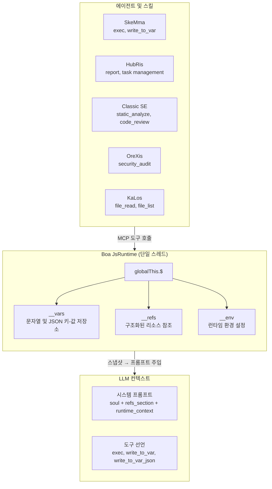

### 설계 원칙

| 원칙 | 설명 |
| --- | --- |
| **단일 진실 공급원** | 각 네임스페이스는 정확히 하나의 모듈(`var_namespace.rs`, `ref_namespace.rs`, `namespace.rs`)을 가지며, 해당 네임스페이스를 참조하는 **모든** JS 코드 문자열을 생성합니다 |
| **지연 초기화** | `__vars`와 `__refs`는 `JsRuntime::new()`에서 한 번 초기화되어 스킬 체인 전반에 걸쳐 생존합니다; `__env`는 네임스페이스 JS 평가 중에 초기화됩니다 |
| **스냅샷/복원** | 전체 `__vars` + `__refs` 상태는 스냅샷 및 복원 가능하여 세션 영속화를 가능하게 합니다 |
| **프롬프트 주입** | 스냅샷 데이터는 컨텍스트가 풍부한 시스템 프롬프트를 구동합니다 — LLM은 가용 변수명, 참조 요약, 환경 설정을 확인합니다 |
| **도구 접근 제어** | 3개의 cosmos 내부 도구(`exec`, `write_to_var`, `write_to_var_json`)는 `agent_allowed_tools()`를 통해 모든 에이전트에 부여됩니다; 개별 스킬 SOP가 어떤 것을 사용할지 정의합니다 |

---

## 네임스페이스 비교

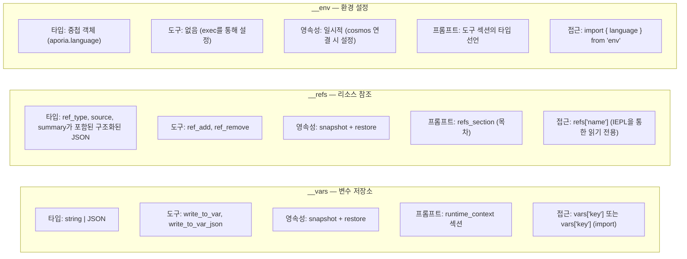

---

## 1. `__vars` — 변수 저장소 (`vars`)

### 1.1 목적

`__vars`는 스킬 체인 내에서 **주요 스텝 간 통신 메커니즘**입니다. 스킬은 `write_to_var` / `write_to_var_json`을 사용하여 계산된 결과를 영속화하고, 후속 스텝(또는 스킬)은 `exec` 블록에서 `__vars`를 읽습니다.

### 1.2 모듈 아키텍처

모든 `__vars` JS 코드 생성은 `packages/shared/core/src/var_namespace.rs`에 집중되어 있습니다.

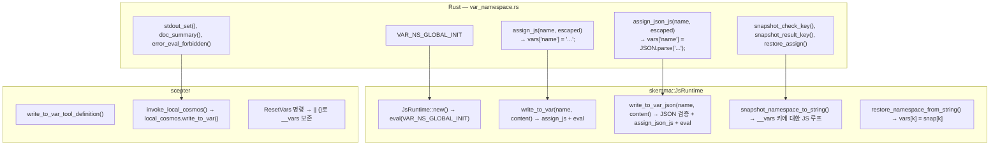

### 1.3 초기화 순서

```text
JsRuntime::new()
  → context.eval("globalThis.$ = globalThis.$ || {}; globalThis.__vars = {}; globalThis.__refs = {};")
  → __vars가 빈 객체로 초기화됨
```

초기화는 `build_namespace_js()`(`__env`와 `$.variant`를 설정) **이전에** 실행되어, 네임스페이스 모듈이 로드될 때 `__vars`가 항상 가용 상태임을 보장합니다.

> **참고:** `__refs`는 `VAR_NS_GLOBAL_INIT`(`var_namespace.rs`에 정의됨)을 통해 `__vars`와 함께 초기화됩니다. `ref_namespace.rs`의 독립형 `REF_NS_GLOBAL_INIT`은 대칭성을 위해 존재하지만 직접 호출되지는 않습니다 — 실제 초기화는 `JsRuntime::new()`에서 발생합니다.

### 1.4 연산

| 연산 | 도구명 | 타입 | 동작 |
| --- | --- | --- | --- |
| 문자열 저장 | `write_to_var` | Blocking | JS용 콘텐츠 이스케이프, `vars['name'] = 'content'` eval |
| JSON 저장 | `write_to_var_json` | Blocking | JSON 검증, `vars['name'] = JSON.parse('content')` eval |
| exec에서 읽기 | `exec` | FireAndForget | 직접 접근: `vars['name']` 또는 `import vars from 'vars'` |
| 스냅샷 | (내부) | — | 모든 `__vars` 키를 `{"$vars": {...}}`로 캡처 |
| 복원 | (내부) | — | 각 키에 대해 `vars[k] = snap['$vars'][k]` 설정 |
| 초기화 | (내부) | — | `__vars = __vars \|\| {}` — 기존 값 보존, 구조 보장 |

### 1.5 프롬프트 주입

`build_runtime_context()`(`prompt.rs:472`)에서 변수 저장소는 시스템 프롬프트에 다음과 같이 나타납니다:

```text
## JS 런타임 컨텍스트

__vars (write_to_var / write_to_var_json에서, N개):
  `var_1`, `var_2`, `var_3`, ... (최대 30개 표시)
  임포트: `import vars from 'vars';`  접근: `vars['key']`
```

### 1.6 출력 표시

- 문자열 저장: `vars['name'] 설정됨:\n{처음 200자 / 5줄}... (총 chars자)`
- JSON 저장: `vars['name'] 설정됨 (파싱된 JSON): 3개의 키를 가진 객체`
- 파싱 실패: 콘텐츠 미리보기와 함께 오류 (처음 200자)

### 1.7 `vars` 합성 모듈

`env`와 유사하게, `vars` 모듈은 편리한 임포트를 위해 `__vars`를 래핑하는 Boa 합성 모듈입니다:

```python
import vars from 'vars';
// vars === __vars (실시간 참조)
const report = vars['analysis_results'];
```

**구현:** `packages/agents/skemma/src/js_runtime/module_loader.rs` 142-156행. 모듈은 `globalThis.__vars`를 직접 반환하는 클로저와 함께 `Module::synthetic()`을 사용합니다(스냅샷이 아닌 실시간 참조). 이는 `vars['key'] = value`를 통한 수정이 `vars['key'] = value`와 동등함을 의미합니다.

---

## 2. `__refs` — 리소스 참조 (`refs`)

### 2.1 목적

`__refs`는 **구조화된 에이전트 간 리소스 전달**을 제공합니다. `__vars`(원시 문자열)와 달리, refs는 타입화된 메타데이터(`ref_type`, `source`, `summary`)와 선택적 페이로드를 운반합니다. 에이전트는 다음을 수행할 수 있습니다:

- 파일, 이미지, 또는 자신의 출력에 대한 **참조 게시**
- 시스템 프롬프트에서 이름/타입별로 **참조 발견**
- IEPL exec 블록에서 `refs['name']`을 통해 **참조 콘텐츠 접근**

### 2.2 모듈 아키텍처

모든 `__refs` JS 코드 생성은 `packages/shared/core/src/ref_namespace.rs`에 집중되어 있습니다.

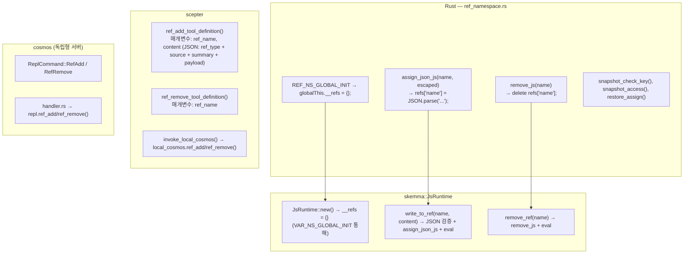

### 2.3 RefItem 구조

```typescript
// TypeScript 타입 정의 (iepl-api.d.ts에서)
type RefType = "code" | "image" | "agent_output";

// 시스템 프롬프트 및 runtime_context에서 이름 목록 표시에 사용
type RefItemSummary = {
  name: string;
  ref_type: RefType;
  source: string;
  summary: string;
};

interface RefItem {
  name: string;        // 예: "code:src/main.rs", "image:diagram", "agent:orexis/audit-1"
  ref_type: RefType;   // 정렬/필터링용 카테고리
  source: string;      // 제공자 ("user", 에이전트명, 도구명)
  summary: string;     // 프롬프트 표시용 한 줄 설명
  files?: RefCodeFile[];   // "code" refs용
  images?: RefImage[];     // "image" refs용
  output?: RefAgentOutput; // "agent_output" refs용
}

interface RefCodeFile {
  path: string;
  language: string;
  content: string;
  selection?: { start_line: number; end_line: number; content: string };
}

interface RefImage {
  mime: string;          // 예: "image/png"
  data: string;          // base64 인코딩 또는 data URL
  description?: string;
}

interface RefAgentOutput {
  source_agent: string;  // 에이전트명
  source_tool: string;   // 이 출력을 생성한 도구
  content: Record<string, unknown>;
}
```

### 2.4 연산

| 연산 | 도구명 | 타입 | 동작 |
| --- | --- | --- | --- |
| 참조 추가 | `ref_add` | Blocking | JSON 검증, `refs['name'] = JSON.parse('...')` eval |
| 참조 제거 | `ref_remove` | FireAndForget | `delete refs['name']` eval |
| exec에서 읽기 | (`exec` 통해) | — | `refs['name'].files[0].content` |
| 스냅샷 | (내부) | — | 모든 `__refs` 키를 `{"$refs": {...}}`로 캡처 |
| 복원 | (내부) | — | 각 키에 대해 `refs[k] = snap['$refs'][k]` 설정 |

### 2.5 프롬프트 주입

Refs는 시스템 프롬프트의 **두 위치**에 나타납니다:

#### 위치 1: `refs_section` (전용 목차)

```text
## 참조된 리소스 (refs)

다음 리소스는 `refs['name']`을 통해 사용 가능합니다.
- `code:src/main.rs` [code] from user — 메인 Rust 파일
- `image:architecture` [image] from user — 시스템 아키텍처 다이어그램
- `agent:orexis/audit-1` [agent_output] from OreXis — 보안 감사 결과
```

`build_refs_section()`(`prompt.rs:426`)에 의해 생성됩니다. 각 ref는 **이름, 타입, 출처, 요약**을 표시합니다 — LLM은 무엇이 가용한지 볼 수 있지만 `exec` 블록을 통해 콘텐츠를 읽어야 합니다.

#### 위치 2: `runtime_context` (이름 목록)

```text
__refs (사용자/에이전트의 참조된 리소스, 3개):
  `code:src/main.rs`, `image:architecture`, `agent:orexis/audit-1`
  접근: `refs['name']` — 각 ref는 .ref_type, .source, .summary를 가짐
```

### 2.6 가시성 원칙

> **Ref 이름은 모든 에이전트에 표시됩니다. Ref 콘텐츠는 그렇지 않습니다.**

시스템 프롬프트의 `refs_section`은 **목차**(이름, 타입, 출처, 요약)를 모든 스킬 실행에 노출합니다. 그러나 실제 콘텐츠(`files[].content`, `images[].data`, `output.content`)는 IEPL exec 블록에서 명시적인 `refs['name']` 접근을 통해서만 접근 가능합니다. 이는 다음을 의미합니다:

- OreXis는 `code:src/main.rs`가 존재함을 볼 수 있지만(요약으로부터), 감사를 위해서는 명시적으로 콘텐츠를 읽어야 합니다
- LLM은 태스크 관련성에 따라 콘텐츠 역참조 시점을 결정합니다
- 어떤 에이전트도 실수로 참조 콘텐츠를 대화 스트림에 유출할 수 없습니다

---

## 3. `__env` — 환경 설정 (`env`)

### 3.1 목적

`__env`는 IEPL 실행 엔진과 에이전트가 필요로 하는 **런타임 환경 설정**을 보유합니다. 현재 유일한 하위 키는 `env.aporia.language`이며, 에이전트 출력 언어를 제어합니다.

### 3.2 모듈 아키텍처

환경 초기화는 `packages/shared/iepl/src/namespace.rs`에 있습니다.

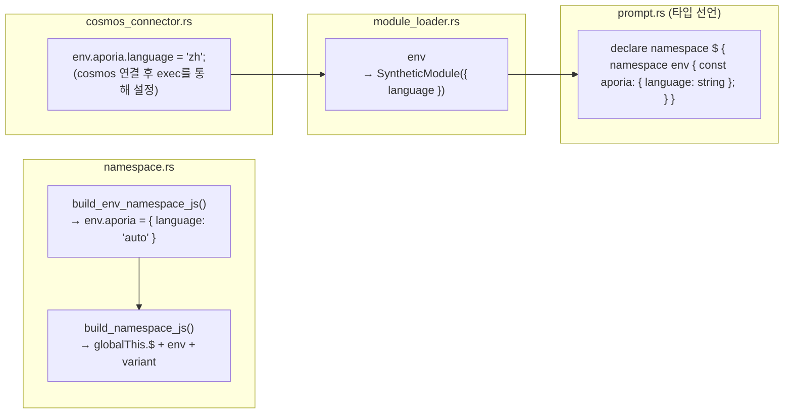

### 3.3 연산

| 연산 | 메커니즘 | 동작 |
| --- | --- | --- |
| 초기화 | `build_namespace_js()` | `__env = __env \|\| {}; env.aporia = env.aporia \|\| { language: 'auto' }` |
| 언어 설정 | cosmos 커넥터를 통한 `exec` 호출 | `env.aporia.language = 'zh'` |
| IEPL에서 읽기 | `import { language } from 'env'` | `'auto'` 폴백과 함께 `env.aporia.language` 반환 |
| 스냅샷/복원 | **지원 안 함** | `__env`는 스냅샷/복원에 포함되지 않습니다 — 일시적이며 각 cosmos 연결 시 재초기화됩니다 |

### 3.4 언어 흐름

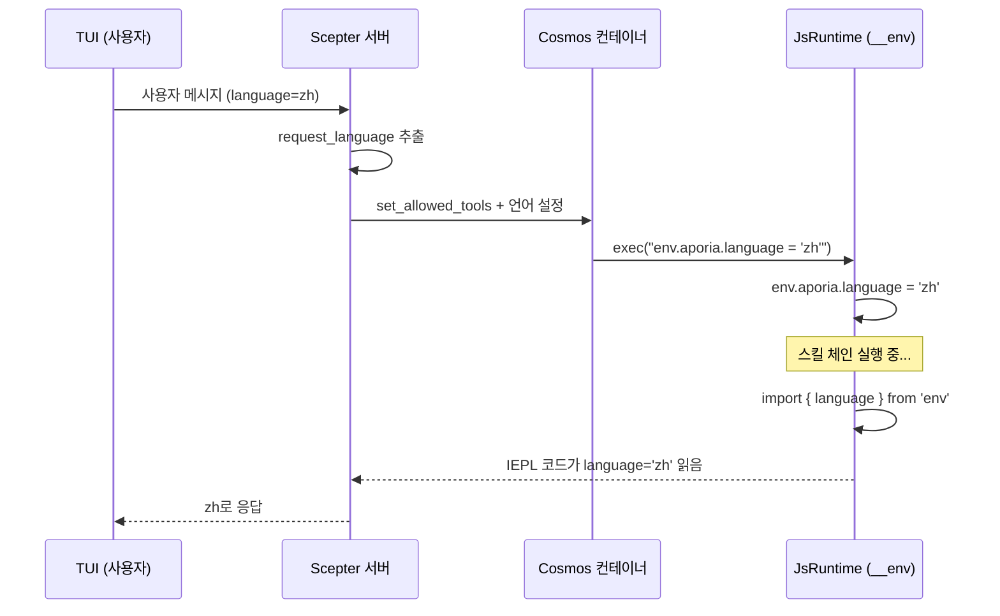

### 3.5 `$.variant` — 하위 호환 접근자

**파일:** `packages/shared/iepl/src/namespace.rs:199-207`

`build_variant_namespace_js()`는 순환 자기 참조 속성을 생성합니다:

```javascript
Object.defineProperty(globalThis.$, 'variant', {
  get: function() { return globalThis.$; },
  set: function(val) { Object.assign(globalThis.$, val); },
  configurable: true,
  enumerable: true,
});
```

이를 통해 `$.variant.tools.agent.method()`로 작성된 코드가 `$.tools.agent.method()`와 동일한 객체로 해석됩니다. 대체 네임스페이스 접근 패턴과의 하위 호환성을 위해 존재합니다.

> **스냅샷 주의:** `$.variant`는 순환 참조(`$.variant === $`)이므로, `JSON.stringify`를 시도하면 `TypeError`가 발생합니다. 스냅샷 JS 코드는 `globalThis.$` 키를 순회하는 대신 `__vars`와 `__refs`를 직접 대상으로 하여 이 문제를 회피합니다.

---

## 4. 스냅샷 및 복원 아키텍처

### 4.1 스냅샷/복원이 필요한 이유

`LocalCosmosRuntime`은 전용 스레드에서 **단일 장수명 `JsRuntime`**을 실행합니다. 스킬 체인 실행 사이에 런타임 상태(`__vars`, `__refs`)는 자연스럽게 지속됩니다. 그러나 스냅샷은 다음 용도로 사용됩니다:

1. **프롬프트 주입** — `build_runtime_context()` 및 `build_refs_section()`이 스냅샷 JSON을 읽어 시스템 프롬프트를 채웁니다
1. **세션 영속화** — 충돌 복구 또는 세션 마이그레이션을 위한 디스크 덤프/복원
1. **컨테이너 동기화** — `cosmos_set_rag_context()`를 통해 cosmos 컨테이너로 상태 푸시

### 4.2 스냅샷 형식

```json
{
  "$vars": {
    "var_name_1": "value",
    "parsed_json": { "key": "value" }
  },
  "$refs": {
    "code:src/main.rs": {
      "ref_type": "code",
      "source": "user",
      "summary": "메인 Rust 파일",
      "files": [{ "path": "src/main.rs", "language": "rust", "content": "..." }]
    }
  },
  "__lexical": {
    "my_const": 42
  }
}
```

### 4.3 스냅샷 코드 흐름

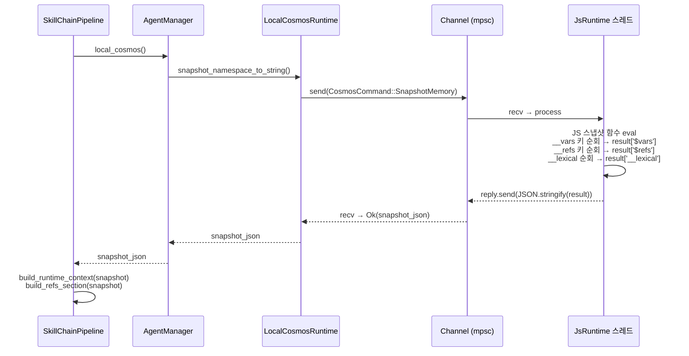

### 4.4 스냅샷 JS 코드 (배포 형태)

> **참고:** 아래 표시된 JS 코드는 Rust 코드가 런타임에 동적으로 구축하는 **배포 형태**입니다. 소스에 Rust 문자열 리터럴로 저장되지 않습니다. `__lexical` 섹션은 이전 `exec()` 호출 중에 추적된 `self.lexical_var_names`로부터 생성됩니다. Rust 문자열 빌더는 `packages/agents/skemma/src/js_runtime/runtime.rs:549-607`을 참조하십시오.

스냅샷 함수는 알려진 네임스페이스 트리에 직접 접근합니다:

```javascript
(function() {
    var result = {};
    if (globalThis.$ && globalThis.__vars) {
        var dollarVars = {};
        var dollarKeys = Object.keys(globalThis.__vars);
        for (var j = 0; j < dollarKeys.length; j++) {
            var dk = dollarKeys[j];
            try {
                var dv = globalThis.vars[dk];
                if (typeof dv === 'function') continue;
                dollarVars[dk] = dv;
            } catch(e) {}
        }
        if (Object.keys(dollarVars).length > 0) {
            result['$vars'] = dollarVars;
        }
    }
    if (globalThis.$ && globalThis.__refs) {
        var dollarRefs = {};
        var refsKeys = Object.keys(globalThis.__refs);
        for (var j = 0; j < refsKeys.length; j++) {
            var dk = refsKeys[j];
            try {
                var dv = globalThis.refs[dk];
                if (typeof dv === 'function') continue;
                dollarRefs[dk] = dv;
            } catch(e) {}
        }
        if (Object.keys(dollarRefs).length > 0) {
            result['$refs'] = dollarRefs;
        }
    }
    // ... __lexical 캡처 ...
    return JSON.stringify(result);
})( )
```

### 4.5 복원 코드 (배포)

```javascript
(function() {
    var snap = JSON.parse(snapshot_string);
    if (snap['$vars'] && globalThis.$) {
        Object.keys(snap['$vars']).forEach(function(k) {
            try { globalThis.vars[k] = snap['$vars'][k]; } catch(e) {}
        });
    }
    if (snap['$refs'] && globalThis.$) {
        Object.keys(snap['$refs']).forEach(function(k) {
            try { globalThis.refs[k] = snap['$refs'][k]; } catch(e) {}
        });
    }
    if (snap['__lexical']) {
        Object.keys(snap['__lexical']).forEach(function(k) {
            try { globalThis[k] = snap['__lexical'][k]; } catch(e) {}
        });
    }
})()
```

---

## 5. 도구 등록 및 접근 제어

### 5.1 Cosmos 내부 도구

5개의 cosmos 수준 도구 모두가 **모든 에이전트에 보편적으로 부여**됩니다:

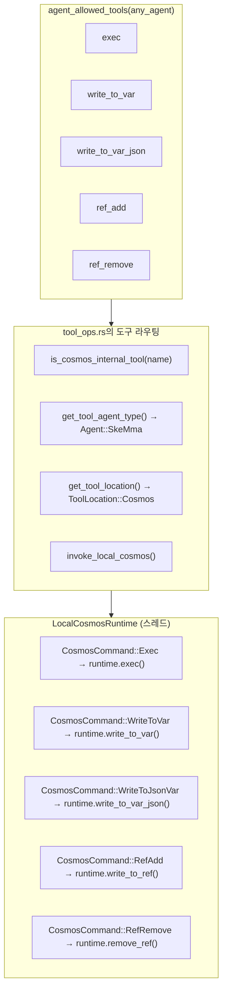

### 5.2 도구 정의

| 도구 | 호출 모드 | 필요 | 매개변수 스키마 |
| --- | --- | --- | --- |
| `exec` | FireAndForget | `code: string` | 단일 JS 코드 문자열 |
| `write_to_var` | Blocking | `var_name, content` | `{var_name: string, content: string}` |
| `write_to_var_json` | Blocking | `var_name, content` | `{var_name: string, content: string (유효한 JSON)}` |
| `ref_add` | Blocking | `ref_name, content` | `{ref_name: string, content: string (JSON: ref_type + source + summary)}` |
| `ref_remove` | FireAndForget | `ref_name` | `{ref_name: string}` |

### 5.3 독립형 Cosmos 서버

`cosmos` 바이너리(독립형 JS 런타임 서버)는 동일한 `JsRuntime` 인터페이스를 통해 모든 도구명을 디스패치하며, 여기에는 잔여 내부 배관으로 남아 있는 더 이상 사용되지 않는 `ref_add`/`ref_remove` 핸들러도 포함됩니다. 오직 세 개의 LLM 가시 프리미티브(`exec`, `write_to_var`, `write_to_var_json`)만 모델에 노출됩니다; 본 문서 상단의 폐기 참고를 참조하십시오.

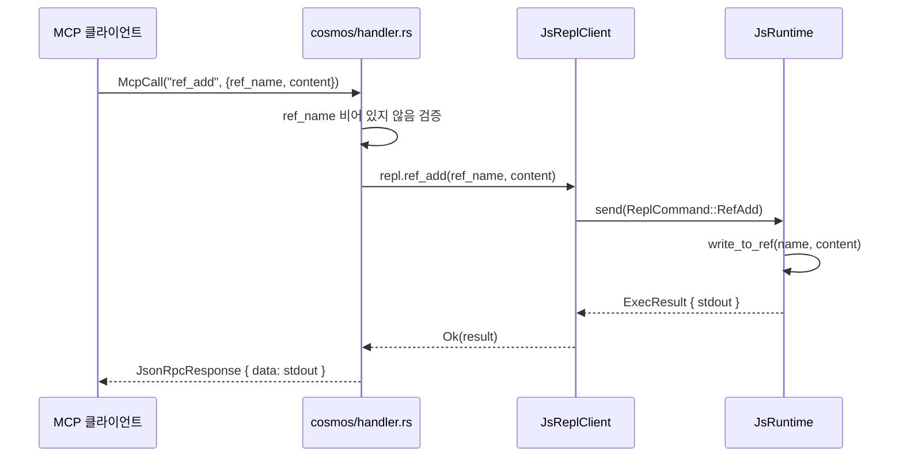

### 5.4 `is_cosmos_internal_tool` — 라우팅 헬퍼

**파일:** `packages/scepter/src/agent_manager/tool_ops.rs:7-13`

```rust
fn is_cosmos_internal_tool(tool_name: &str) -> bool {
    tool_name == cosmos::EXEC
        || tool_name == cosmos::WRITE_TO_VAR
        || tool_name == cosmos::WRITE_TO_VAR_JSON
        || tool_name == cosmos::REF_ADD
        || tool_name == cosmos::REF_REMOVE
}
```

이 헬퍼는 두 가지 중요한 목적을 수행합니다:

1. **에이전트 타입 해석** — `get_tool_agent_type()`은 내부 도구에 대해 `Agent::SkeMma`를 반환하는데, 이는 도구가 Cosmos 런타임에서 실행되기 때문입니다(도메인 에이전트의 프로세스가 아님).
1. **폴백 라우팅** — 컨테이너화된 cosmos 호출이 내부 도구에 대해 실패할 경우, 시스템은 로컬 cosmos 런타임으로 폴백합니다. 비내부 도구의 경우 폴백은 대신 인프로세스 실행으로 전환됩니다. 이는 cosmos 연산이 컨테이너화 모드에서 결코 조용히 실패하지 않도록 보장합니다.

### 5.5 컨테이너화 vs 로컬 Cosmos 라우팅

시스템은 Cosmos 런타임에 대해 두 가지 실행 모드를 지원하며, 에이전트 등록 시점에 선택됩니다:

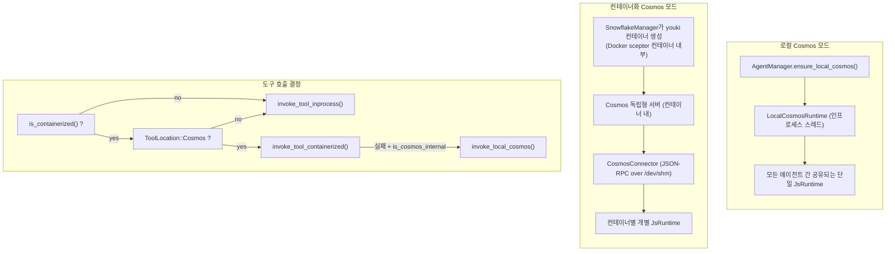

**주요 차이점:**

| 측면 | 로컬 모드 | 컨테이너화 모드 |
| --- | --- | --- |
| `__vars` / `__refs` | 모든 에이전트 간 공유 | 컨테이너 내 공유, 컨테이너 간 격리 |
| `__env` | `exec`를 통해 직접 설정 | `CosmosConnector` JSON-RPC 호출을 통해 설정 |
| 성능 | 직렬화 오버헤드 없음 | 호출당 JSON-RPC 직렬화 |
| 보안 | Boa 샌드박스만 | Boa + seccomp + youki 샌드박스 |
| 컨테이너 런타임 | Docker/Podman만 | Docker/Podman (외부) + youki (내부 cosmos) |
| 사용 대상 | 비컨테이너화 에이전트 (layer=1) | 컨테이너화 에이전트 (layer=2+) |

### 5.6 네임스페이스 JS 어셈블리

전체 네임스페이스 JavaScript는 `packages/scepter/src/services/local_cosmos/namespace.rs:116-124`의 `build_scepter_namespace_config_and_js()`에 의해 조립됩니다:

```rust
pub async fn build_scepter_namespace_config_and_js(
    registry: &SharedAgentRegistry,
    scepter_tools: &HashSet<String>,
    plugin_router: &PluginRouter,
) -> (NamespaceConfig, String) {
    let config = build_namespace_config(registry, scepter_tools, plugin_router).await;
    let js = build_namespace_js(&config);
    (config, js)
}
```

이 함수는:

1. `AgentRegistry`에서 모든 등록된 에이전트의 MCP 도구를 수집합니다
1. 에이전트별 도구 목록과 메타데이터(동기/비동기, `unwrap_data`)를 포함하는 `NamespaceConfig`를 구축합니다
1. `build_namespace_js(&config)`를 통해 네임스페이스 JS를 생성하며, 이는:

   - `globalThis.$`가 없으면 생성
   - `env.aporia`를 `{ language: 'auto' }`로 초기화
   - `$.variant` 속성 정의 (`globalThis.$`를 반환하는 순환 getter)
   - `register_tool_modules_with_rag()`를 통해 모든 에이전트 도구 모듈 등록

네임스페이스 JS는 다음과 같이 평가됩니다:

- `LocalCosmosRuntime::new()` 시작 시 **1회**
- `CosmosCommand::RebuildNamespace`를 통한 스킬 체인 재구축 시 **요청형**

---

## 6. 시스템 프롬프트 어셈블리 순서

`pipeline.rs:869-882`에서 조립되는 완전한 시스템 프롬프트:

```text
You are the {Agent} {skill_name} skill execution engine. Execute the skill faithfully.

[capability_section]
  → 에이전트별 기능 설명
  → TypeScript 타입 선언 (IEPL API 타입, env)
  → 임포트 명령 프롬프트
  → 매개변수 안전 규칙 및 데이터 영속성 안내

[tool_decls_section]
  → ## 가용 도구 API
  → 모든 가용 MCP 도구에 대한 .d.ts 콘텐츠

[container_context]
  → 컨테이너 실행 모드 배지, 브랜치 정보, 제약 사항

[soul_section]
  → ## 소울 정체성: {name}
  → 에이전트의 개성 및 운영 원칙

[refs_section]
  → ## 참조된 리소스 (refs)
  → 목차: 이름, 타입, 출처, 요약

[output_section]
  → 다음 대상 에이전트 라우팅
  → MCP 보고서 호출 규칙

[runtime_context]
  → ## JS 런타임 컨텍스트
  → __vars 이름 (임포트 힌트 포함)
  → __refs 이름 (접근 힌트 포함)
  → 렉시컬 변수 이름

[rag_section]
  → Philia 메모리 섹션 (관련 과거 상호작용)
  → Aporia 지식 섹션 (관련 문서)

[skill_chain_note]
  → 체인 내비게이션: "이것은 M단계 중 N단계입니다" 또는 "마지막 단계"
```

### 섹션 배치 근거

| 섹션 | 위치 | 이유 |
| --- | --- | --- |
| 에이전트 정체성 + 스킬명 | 첫 문장 | 즉시 역할 설정 |
| 도구 선언 | 소울 이전 | LLM이 개성이 선택에 영향을 미치기 전에 가용 도구를 알아야 함 |
| 소울 | 도구 이후, refs 이전 | 개성은 refs가 해석되는 방식에 영향을 미침 |
| Refs 섹션 | 소울 이후, 출력 이전 | LLM이 무엇을 생성할지 결정하기 전에 어떤 리소스가 가용한지 앎 |
| 출력 라우팅 | 런타임 컨텍스트 이전 | LLM이 컨텍스트를 읽기 전에 결과를 보낼 곳을 앎 |
| 런타임 컨텍스트 | RAG 이전, 체인 노트 이전 | Vars와 refs는 지식 검색을 위한 실행 컨텍스트를 제공 |

---

## 7. ResetVars 동작

체인에서 스킬을 전환할 때, `ResetVars`가 호출되어 런타임 상태를 정리합니다. 이 명령은 **비파괴적** 초기화를 사용합니다:

```javascript
globalThis.$ = globalThis.$ || {};
globalThis.__vars = globalThis.__vars || {};
globalThis.__refs = globalThis.__refs || {};
```

이는 다음을 의미합니다:

- **기존 값이 유지됨** — `__vars`와 `__refs`는 그대로 보존됩니다
- **손상된 상태 복구** — `__refs`가 실수로 삭제된 경우 재생성됩니다
- **스킬 격리는 옵트인** — 스킬은 자신이 알고 있는 변수만 읽어야 합니다(런타임 컨텍스트 프롬프트의 이름으로)
- **강제 정리 없음** — 변수 네임스페이스 오염을 관리하는 것은 LLM의 책임입니다

---

## 8. 구현 파일 맵

| 구성 요소 | 파일 | 라인 | 설명 |
| --- | --- | --- | --- |
| `__vars` 상수 및 생성기 | `packages/shared/core/src/var_namespace.rs` | 1-211 | vars용 모든 JS 코드 생성 |
| `__refs` 상수 및 생성기 | `packages/shared/core/src/ref_namespace.rs` | 1-145 | refs용 모든 JS 코드 생성 |
| `__env` 생성 | `packages/shared/iepl/src/namespace.rs` | 193-197 | `build_env_namespace_js()` |
| `$.variant` 생성 | `packages/shared/iepl/src/namespace.rs` | 199-207 | `build_variant_namespace_js()` |
| `JsRuntime` init | `packages/agents/skemma/src/js_runtime/runtime.rs` | 153 | `eval(VAR_NS_GLOBAL_INIT)` |
| `write_to_var` impl | 동일 파일 | 349-403 | 문자열 변수 저장 |
| `write_to_var_json` impl | 동일 파일 | 405-443 | JSON 변수 저장 |
| `write_to_ref` impl | 동일 파일 | 445-492 | 타입 추출을 포함한 Ref 저장 |
| `remove_ref` impl | 동일 파일 | 494-503 | Ref 제거 |
| `snapshot_namespace_to_string` | 동일 파일 | 549-607 | 스냅샷 JS 생성 |
| `restore_namespace_from_string` | 동일 파일 | 617-646 | 복원 JS 생성 |
| `LocalCosmosRuntime` | `packages/scepter/src/services/local_cosmos/runtime.rs` | 1-507 | 스레드 안전 cosmos 명령 채널 |
| `CosmosCommand` enum | 동일 파일 | 21-65 | 모든 cosmos 연산 변형 (SnapshotMemory, Shutdown 포함) |
| `ResetVars` 핸들러 | 동일 파일 | 448-460 | 비파괴적 초기화 |
| `RebuildNamespace` 핸들러 | 동일 파일 | 478-494 | 도구 모듈 재초기화 |
| 도구 정의 | `packages/scepter/src/agent_manager/tool_ops.rs` | 1-795 | 5개 cosmos 도구 정의 모두 |
| `is_cosmos_internal_tool` | 동일 파일 | 7-13 | 라우팅 헬퍼 |
| `invoke_local_cosmos` | 동일 파일 | 714-787 | LocalCosmosRuntime으로의 도구 디스패치 |
| `build_runtime_context` | `packages/scepter/src/state_machine/skill_chain/prompt.rs` | 472-598 | 프롬프트: vars + refs + lexical |
| `build_refs_section` | 동일 파일 | 426-470 | 프롬프트: refs 목차 |
| 시스템 프롬프트 어셈블리 | `packages/scepter/src/state_machine/skill_chain/pipeline.rs` | 869-882 | 전체 시스템 프롬프트 형식 문자열 |
| 허용 도구 목록 | `packages/shared/domain_skills/src/tool_names.rs` | 265-273 | 보편적 cosmos 도구 접근 |
| Cosmos 독립형 핸들러 | `packages/cosmos/src/handler.rs` | 447-521 | `ref_add` / `ref_remove` 디스패치 |
| Cosmos JsReplClient | `packages/cosmos/src/js_repl/mod.rs` | 442-467 | `ref_add()` / `ref_remove()` 메서드 |
| ReplCommand enum | 동일 파일 | 57-96 | `RefAdd` / `RefRemove` 변형 |
| IEPL TypeScript 타입 | `packages/shared/bindings/iepl-api.d.ts` | 133-154 | RefItem, RefType, __refs 선언 |
| `vars` 모듈 | `packages/agents/skemma/src/js_runtime/module_loader.rs` | 142-156 | `__vars` 실시간 참조 내보내기 |
| `env` 모듈 | 동일 파일 | 160-172 | 언어 값 내보내기 |
| 네임스페이스 JS 어셈블리 | `packages/scepter/src/services/local_cosmos/namespace.rs` | 116-124 | `build_scepter_namespace_config_and_js` |
| CosmosConnector 언어 설정기 | `packages/scepter/src/services/cosmos_connector.rs` | 351-363 | 컨테이너 내 `env.aporia.language` |
| E2E 테스트 | `packages/agents/skemma/tests/mcp_test.rs` | 1677-1726 | `refs_and_snapshot_tests` 모듈 |
| 단위 테스트 | `packages/agents/skemma/src/js_runtime/runtime.rs` | 679-746 | `write_to_ref`, 스냅샷, 복원 테스트 |
| Ref 네임스페이스 테스트 | `packages/shared/core/src/ref_namespace.rs` | 99-145 | JS 코드 생성 패턴 테스트 |

---

## 9. 교차 관심사

### 9.1 스레드 안전성

- `LocalCosmosRuntime`은 전용 스레드(이름 `"local-cosmos"`)에서 **단일 `JsRuntime`**을 소유합니다
- 모든 연산은 `mpsc::channel<CosmosCommand>`를 통해 직렬화됩니다
- `JsRuntime`은 여러 스레드에서 절대 접근되지 않습니다 — 스레드 안전성은 채널 패턴에 의해 강제됩니다
- `AgentManager`는 지연 초기화를 위해 `OnceCell<Arc<LocalCosmosRuntime>>`를 보유합니다

### 9.2 메모리 제한

| 제한 | 값 | 적용 위치 |
| --- | --- | --- |
| 프롬프트 내 최대 vars | 30 | `build_runtime_context()` — `MAX_NAMES` 상수 |
| 프롬프트 내 최대 refs | 30 | `build_refs_section()` — `.take(30)` |
| runtime_context 내 최대 refs | 30 | `build_runtime_context()` — `MAX_NAMES` 상수 |
| Exec 코드 소프트 제한 | N/A (비활성화) | 외부 컨테이너 제한 + 회로 차단기 |
| Exec 타임아웃 (SkeMma) | 기본 120초 | `skemma/COMPUTE_TIMEOUT` |
| Exec 절대 상한 | 600초 | `skemma/ABSOLUTE_CEILING` |

### 9.3 오류 처리

| 오류 | 처리 |
| --- | --- |
| 유효하지 않은 JSON으로 `write_to_var_json` | 미리보기(처음 200자)와 함께 오류 반환 |
| 유효하지 않은 JSON으로 `ref_add` | 미리보기와 함께 `SkemmaError::JsEval` 반환 |
| 순환 참조(`$.variant`)의 스냅샷 | `TypeError`를 조용히 캐치, 키 건너뜀 |
| 스냅샷에 `__refs` 누락 | `build_refs_section`이 빈 문자열 반환 |
| ResetVars 후 손상된 `__refs` | `|| {}`가 재초기화 보장 |

### 9.4 RebuildNamespace 생명주기

비컨테이너화 스킬 체인에서 스킬을 전환할 때, 체인 중에 발견된 새로운 에이전트 도구를 포함하도록 네임스페이스 JS를 **재구축**해야 할 수 있습니다:

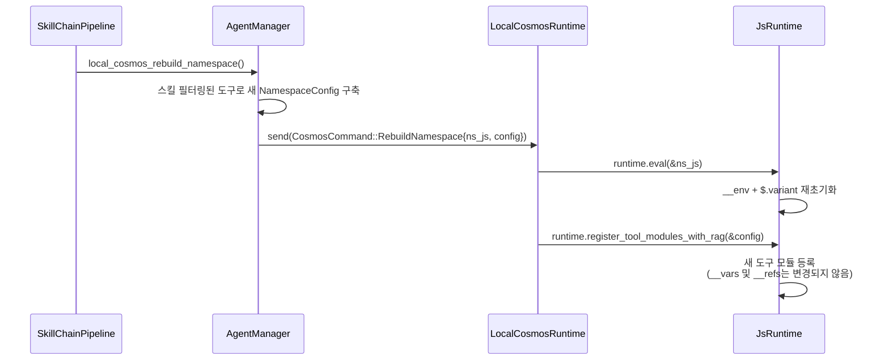

> **핵심 불변성:** RebuildNamespace는 도구 등록과 환경 설정만 갱신합니다. `__vars`나 `__refs`를 **초기화하지 않습니다** — 그것들은 `ResetVars`에 의해 별도로 처리됩니다.

### 9.5 컨테이너화 모드에서의 언어 전파

에이전트가 youki 컨테이너(Docker scepter 컨테이너 내부에 중첩)에서 실행될 때, `env.aporia.language` 값은 `CosmosConnector`를 통해 설정됩니다:

```rust
// packages/scepter/src/services/cosmos_connector.rs:351-363
let lang_code = format!(
    "env.aporia.language = {};",
    serde_json::to_string(&lang).unwrap_or_else(|_| "\"en\"".to_string())
);
connector.cosmos_exec(&container_uuid, &lang_code).await?;
```

이는 JSON-RPC 전송을 통해 cosmos 컨테이너로 `exec` MCP 호출을 전송하며, 컨테이너의 격리된 `JsRuntime`에서 JS 할당을 평가합니다. 전체 언어 전파 경로는 다음과 같습니다:

```text
TUI 요청 언어 → Scepter (request_language 추출)
  → [로컬 모드] 직접 exec("env.aporia.language = 'zh'")
  → [컨테이너화] CosmosConnector::cosmos_exec(json_rpc_call)
      → cosmos handler → js_runtime.eval(...)
```

### 9.6 보안

- `exec` 검증: 모든 코드는 Boa 평가 전에 SWC AST 구문 검증을 통과합니다
- `exec` 블록의 `eval()` 사용은 감지되어 차단되며 대신 `write_to_var` 사용 안내가 제공됩니다
- `ref_add` 콘텐츠는 `JSON.parse()`를 통과합니다 — 임의 코드를 주입할 수 없습니다
- 어떤 네임스페이스 도구도 원시 Boa 컨텍스트 접근을 노출하지 않습니다
- Cosmos 컨테이너는 seccomp 프로필이 적용된 샌드박스형 youki 컨테이너에서 실행되며, 각각은

Docker/Podman scepter 컨테이너 내부에 중첩됩니다 (2계층 컨테이너 격리)
