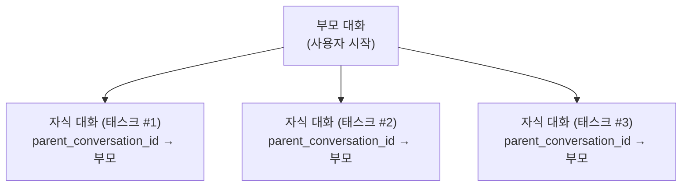

+++
title = "ADR-004: 세션 저장소 수명 주기 관리"
description = """> 상태: 승인됨 (2026-06-10)"""
lang = "ko"
category = "design"
subcategory = "core"
+++

# ADR-004: 세션 저장소 수명 주기 관리

> **상태**: 승인됨 (2026-06-10)
> **컨텍스트**: entelecheia + shittim-chest
> **영감**: [opencode #16101](https://github.com/anomalyco/opencode/issues/16101)

## 배경

opencode(비교 가능한 AI 코딩 에이전트)는 단 2개월 만에 약 300억 토큰을 소비하며 9GB의 대화 기록 DB를 축적했습니다. 메모리 사용량은 약 10개의 프로젝트만 로드된 상태에서도 정기적으로 30GiB를 초과했습니다. 근본 원인은 세션 수명 주기 관리의 부재였습니다: TTL 없음, 자동 정리 없음, 저장소 상한 없음, 압축 후 재확보 없음.

entelecheia와 shittim-chest는 해결되지 않으면 동일한 근본적 문제에 직면합니다:

- **entelecheia**: `conversations` 및 `messages` DB 테이블이 존재했지만 기록된 적이 없었습니다. 실제 대화는 무제한 TOML 로그 파일로 저장되었습니다. `dialogue_events` 테이블은 CRUD 코드가 있었지만 마이그레이션이 없었습니다. 설정 제한(`MAX_DIALOGUE_HISTORY_LEN`, `MAX_DIALOGUE_RECORDS`, `DIALOGUE_TIMEOUT_MS`)이 정의되었지만 적용된 적이 없었습니다.
- **shittim-chest**: 작동하는 대화/메시지 영속화가 있지만, 만료된 인증 세션, 오래된 워크스페이스 세션, 순항 기록, 웹훅 전달 로그에 대한 자동 정리가 없습니다.

## 결정

다음 원칙에 따라 통합 저장소 수명 주기 관리 시스템을 구현합니다:

### 1. 대화는 탄생뿐 아니라 수명 주기를 가진다

- **TTL**: `CONVERSATION_TTL_DAYS`(기본 90일)를 초과하여 비활성 상태인 대화는 아카이빙 후 정리 대상이 됩니다.
- **삭제 전 아카이브**: TTL 정리가 대화를 제거하기 전에 대화가 아카이브(`is_archived = TRUE`)되어야 합니다.
- **자식 세션**: 부모-자식 대화 관계는 `parent_conversation_id`를 통해 추적됩니다. 자식 대화는 독립적으로 아카이브되고 `CHILD_SESSION_RETENTION_DAYS`(기본 7일) 후에 정리될 수 있습니다.

### 2. 정리는 수동이 아닌 자동으로 이루어진다

- **백그라운드 태스크**: 설정 가능한 간격(`CLEANUP_INTERVAL_MINUTES`, 기본 60)으로 주기적 정리가 실행됩니다.
- **혼합 전략**: 시작 스캔 + 주기적 타이머. 사용자 개입이 필요하지 않습니다.
- **멱등성**: 정리 태스크는 여러 번 안전하게 실행될 수 있습니다.

### 3. 압축으로 저장소 재확보 가능

- `is_compacted = TRUE`로 표시된 메시지는 콘텐츠가 요약된 것입니다. 보존 기간이 지나면 상세 콘텐츠를 정리할 수 있습니다.
- 기본적으로 보수적: 압축된 메시지 콘텐츠만 지우고, 메타데이터(도구명, 타임스탬프, 토큰 수)는 보존합니다.

### 4. 설정은 중앙 집중화된다

모든 수명 주기 매개변수는 `StorageLifecycleConfig`(entelecheia) 및 `CleanupConfig`(shittim-chest)에 상주하며, 합리적인 기본값으로 환경 변수에서 로드됩니다.

### 5. 파일 기반 로그는 부차적이다

- `CHAT_LOG_ENABLED`의 기본값은 `false`입니다. TOML 대화 로그 파일은 디버깅 전용입니다.
- 활성화된 경우, 로그 파일은 `CHAT_LOG_RETENTION_DAYS`(기본 7일) 후에 정리됩니다.

## 스키마 변경

### conversations 테이블 (entelecheia)

추가된 열:

- `parent_conversation_id UUID REFERENCES conversations(conversation_id)` — 자식 세션 추적
- `is_archived BOOLEAN NOT NULL DEFAULT FALSE` — 아카이브 플래그
- `archived_at TIMESTAMPTZ` — 아카이브된 시점
- `metadata JSONB NOT NULL DEFAULT '{}'` — 확장 가능한 메타데이터

### messages 테이블 (entelecheia)

추가된 열:

- `is_compacted BOOLEAN NOT NULL DEFAULT FALSE` — 콘텐츠 정리 대상인 압축된 메시지 표시
- `metadata JSONB NOT NULL DEFAULT '{}'` — 확장 가능한 메타데이터

### dialogue_events 테이블 (entelecheia)

이전에 CRUD 코드는 있었지만 `CREATE TABLE` 마이그레이션이 없었습니다. 현재 `baseline_tables.sql`에 포함되었습니다.

### rbac_sessions 테이블 (entelecheia)

kirino 세션 영속화(SQL 백엔드)를 위한 새 테이블입니다.

## 구현 단계

| 단계 | 설명 | 상태 |
| --- | --- | --- |
| 0.1 | 스키마 마이그레이션 수정 (dialogue_events, conversations/messages 업그레이드) | 완료 |
| 1.2 | 통합 설정 네임스페이스 (`StorageLifecycleConfig`) | 완료 |
| 0.2 | CRUD + 정리 메서드를 포함한 `ConversationStore` | 완료 |
| 2.1 | 범용 `CleanupScheduler` 인프라 | 완료 |
| 2.2 | entelecheia 정리 태스크, scepter `setup.rs`에 연결 | 완료 |
| 2.3 | shittim-chest 정리 태스크 | 제거됨 (패키지가 존재하지 않음) |
| 1.3 | kirino `PgSessionManager` (SQL 세션 백엔드) | 완료 |
| 3.1 | 기존 대화 제한 적용 (`max_dialogue_records`, `enforce_max_conversations`) | 완료 |
| 3.2 | 대화 로그 파일 기본 비활성화 + TTL 정리 | 완료 |
| 4.1 | CLI 관리 명령 (`session stats`, `session purge`) | 완료 |
| 5 | 자식 세션 연쇄 + 고아 수명 주기 | 완료 |

## 결과

### 긍정적

- opencode를 괴롭혔던 무제한 저장소 증가 방지
- 대화가 명시적 수명 주기를 가짐: 활성 → 아카이브됨 → 정리됨
- 백그라운드 정리는 사용자 개입이 필요 없음
- 합리적인 기본값으로 설정 기반
- PostgreSQL VACUUM이 삭제 후 디스크 공간을 재확보 (opencode가 사용하는 SQLite와 달리)

### 부정적

- 추가 백그라운드 태스크가 최소한의 CPU/메모리 소비
- 아카이브된 대화는 TTL 이후 상세 콘텐츠를 잃음 (의도된 설계)
- 정리 태스크가 실행 중인지 확인하기 위한 모니터링 필요

### 완화된 위험

- **데이터 손실**: 삭제 전 아카이브가 유예 기간을 제공합니다. 정리는 이미 아카이브된 대화만 제거합니다.
- **성능 영향**: 정리는 설정 가능한 간격으로 실행되며, `updated_at`/`created_at`의 인덱스 쿼리를 사용합니다.
- **자식 세션 고아화**: `parent_conversation_id`가 관계를 추적합니다. 고아 TTL은 더 짧습니다 (90일 대비 30일).

## 자식 세션 수명 주기 설계 (5단계)

### 문제

opencode 이슈 #16101은 세션의 86%가 `task()`에 의해 생성된 자식 세션이며, 저장소의 75%를 차지함을 밝혀냈습니다. 이러한 자식 세션은 독립적인 수명 주기 관리 없이 축적됩니다.

### 아키텍처



### 수명 주기 규칙

1. **생성**: 스킬 체인이 하위 태스크를 생성하면, `parent_conversation_id`가 부모의 `conversation_id`로 설정된 새 대화가 생성됩니다.

1. **독립적 아카이빙**: 자식은 부모와 독립적으로 아카이브될 수 있습니다. 자식 태스크가 완료되면 `CHILD_SESSION_RETENTION_DAYS`(기본 7일) 후에 자동으로 아카이브됩니다.

1. **부모 아카이브 시 연쇄**: 부모가 아카이브되면 모든 자식이 아카이브됩니다. 부모가 삭제되면 모든 자식이 삭제됩니다.

1. **고아 처리**: 삭제되었거나 존재하지 않는 부모를 가리키는 `parent_conversation_id`를 가진 대화는 고아로 처리되며 `ORPHAN_CONVERSATION_TTL_DAYS`(기본 30일) 후에 정리됩니다.

1. **압축 자격**: 부모가 요약을 보유하므로, 자식 대화는 아카이브 직후(유예 기간 없음) 메시지 압축 대상이 됩니다.

### 정리 쿼리

```sql
-- 부모가 아카이브된 자식 아카이브
UPDATE conversations SET is_archived = TRUE, archived_at = NOW()
WHERE parent_conversation_id IN (
    SELECT conversation_id FROM conversations WHERE is_archived = TRUE
) AND is_archived = FALSE;

-- 부모가 삭제된 자식 삭제
DELETE FROM conversations WHERE parent_conversation_id IS NOT NULL
    AND parent_conversation_id NOT IN (SELECT conversation_id FROM conversations);

-- 보존 기간이 지난 아카이브된 자식 삭제
DELETE FROM conversations WHERE is_archived = TRUE
    AND archived_at < NOW() - (CHILD_SESSION_RETENTION_DAYS || ' days')::interval
    AND parent_conversation_id IS NOT NULL;
```

### 구현 현황

- `parent_conversation_id` 열이 `conversations` 테이블에 존재 (0.1단계)
- `ConversationStore.cleanup_expired_conversations()`가 TTL 기반 정리 처리 (0.2단계)
- `StorageLifecycleConfig.child_session_retention_days` 및 `orphan_conversation_ttl_days` 설정됨 (1.2단계)
- 연쇄 쿼리가 `ConversationStore`에 구현됨:
  - `cascade_archive_children()` — 부모가 아카이브될 때 자식 아카이브
  - `cascade_delete_orphaned_children()` — 부모가 삭제된 자식 삭제
  - `cleanup_expired_child_conversations()` — 아카이브된 자식에 대한 TTL 기반 정리
  - `cleanup_orphan_conversations()` — 부모가 누락된 자식 정리
  - `enforce_max_dialogue_records()` — `dialogue_events` 수에 대한 하드 상한
  - `enforce_max_conversations()` — 활성 대화 수에 대한 하드 상한
- scepter `setup.rs`에 모두 주기적 정리 태스크로 등록됨
