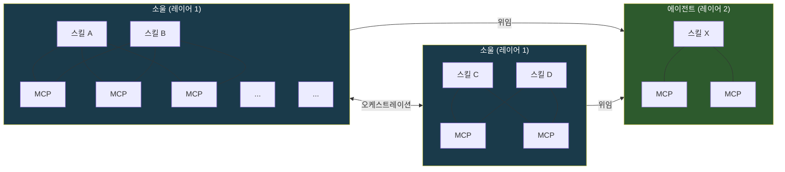
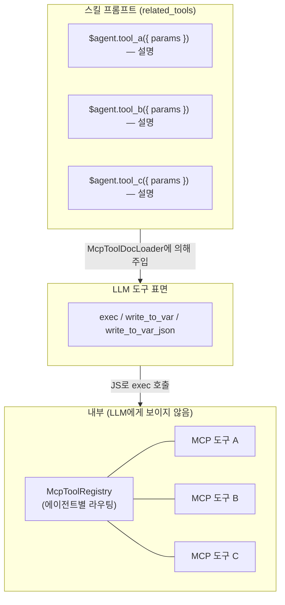
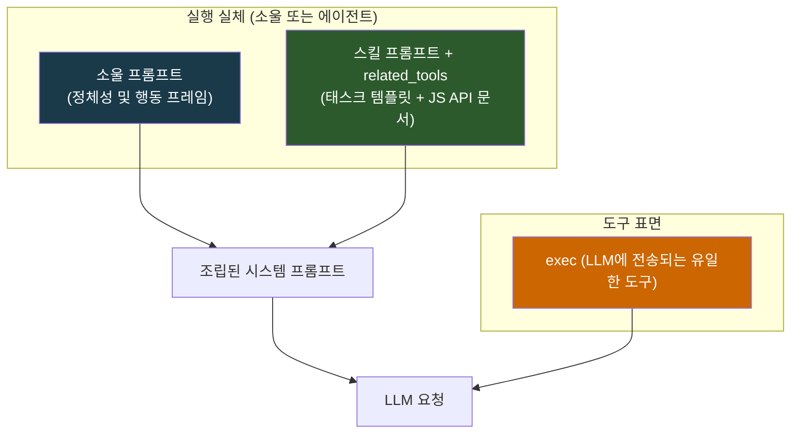
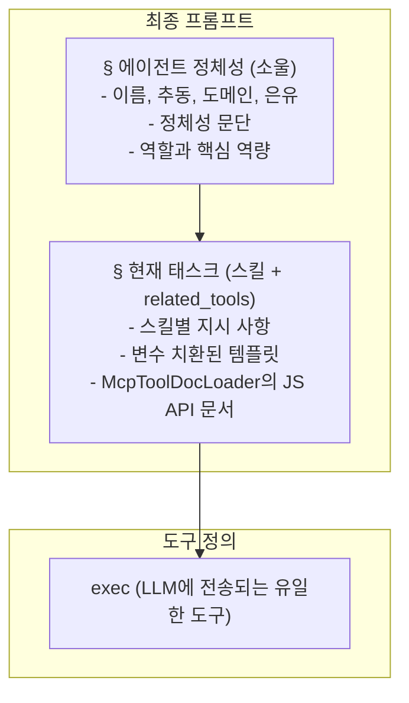
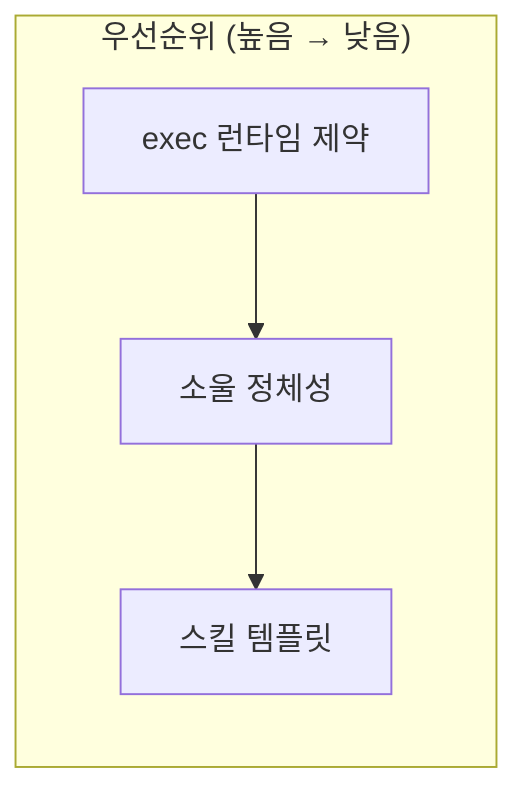
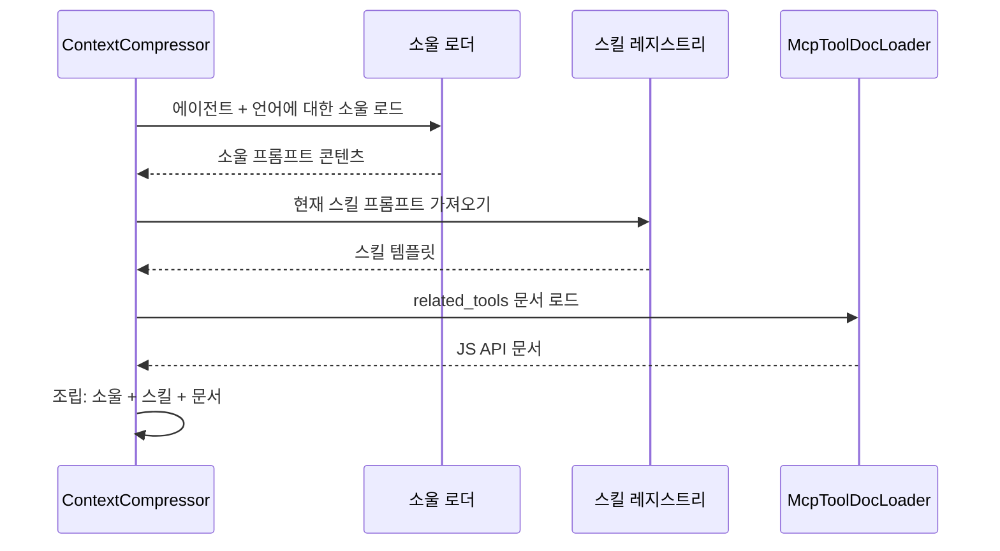
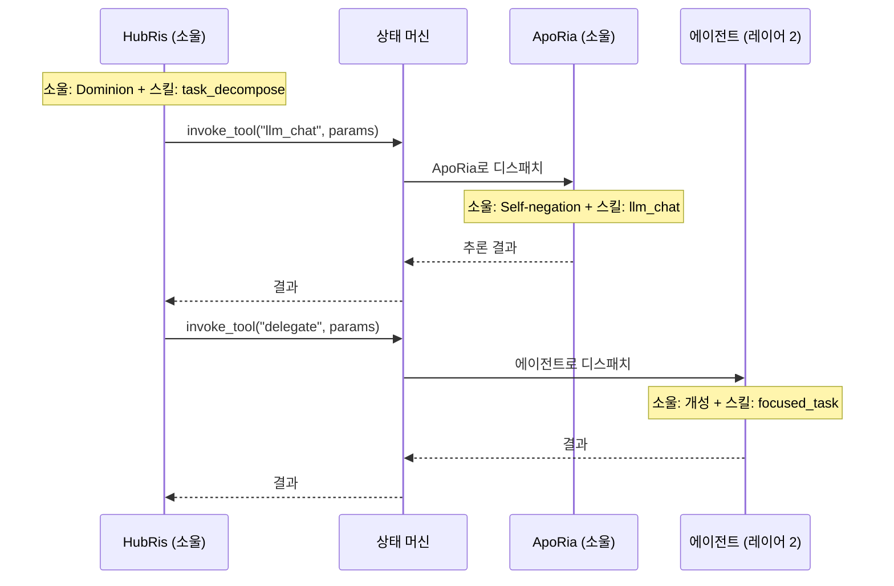

+++
title = "소울 프롬프트 아키텍처"
description = """각 에이전트는 스킬(무엇을 할지)과 소울(누구인지)을 가집니다. 소울 프롬프트는 모든 LLM 요청 앞에 추가되는 기반 정체성 계층으로, 에이전트가 대화와 스킬 전반에 걸쳐 일관된 개성을 보이도록 지속적 행동"""
lang = "ko"
category = "design"
subcategory = "core"
+++

# 소울 프롬프트 아키텍처

## 배경

각 에이전트는 **스킬**(무엇을 할지)과 **소울**(누구인지)을 가집니다. 소울 프롬프트는 모든 LLM 요청 앞에 추가되는 기반 정체성 계층으로, 에이전트가 대화와 스킬 전반에 걸쳐 일관된 개성을 보이도록 지속적 행동 프레임을 확립합니다. 이것이 없으면 동일한 에이전트라도 실행 중인 스킬 프롬프트에 따라 크게 달라질 수 있습니다.

프로젝트 자체의 이름은 **Entelecheia** — 다중 에이전트 런타임의 오케스트레이터입니다. 12개의 레이어 1 에이전트는 그 런타임 내에서 실행되는 계산적 인자(factor)이며, 각각은 행동적 추동(drive)에 의해 형성됩니다. 소울 프롬프트는 사실상 오케스트레이터가 각 에이전트의 행동 매개변수를 명시한 것입니다.

## 목표

1. 모든 LLM 요청에 기반 정체성 계층으로 소울 프롬프트를 주입합니다.
1. 3계층 프롬프트 어셈블리 모델을 확립합니다: **소울 > 스킬 (`related_tools` 포함) > exec-only 도구 표면**.
1. **원초적 추동**에 기반한 짧은 정체성 문단을 에이전트별로 추가하며, 이것이 주요 행동 앵커입니다.
1. **소울 / 에이전트** 실체 구분을 확립합니다: 소울은 다중 스킬, 공유 MCP 토폴로지를 가진 정체성 보유 오케스트레이터이며, 에이전트는 위임을 받는 집중된 단일 스킬 작업자입니다.

## 비목표

- 소울 콘텐츠를 처음부터 다시 작성하지 않습니다 (초기 소울 = 현재 개요 + 정체성 문단).
- MCP 프롬프트 주입 메커니즘 자체를 변경하지 않습니다 (설계 09) — 현재 `related_tools`와 `McpToolDocLoader`를 통해 처리됩니다.
- 프롬프트 어셈블리 이상으로 컨텍스트 압축 흐름을 수정하지 않습니다.
- 에이전트 개성을 단일 차원에 경직되게 묶지 않습니다 — 추동은 행동 매개변수이지 고정된 페르소나가 아닙니다.
- 소울 프롬프트에 전기적 로어(lore)를 포함하지 않습니다. 정체성 섹션은 행동 매개변수 명세이지 캐릭터 시트가 아닙니다.
- MCP 도구 레지스트리 자체를 재설계하지 않습니다 — 도구는 내부 라우팅을 위해 런타임에 에이전트별로 등록된 상태로 유지됩니다.
- exec-only 도구 표면을 변경하지 않습니다 — LLM은 항상 `exec`, `write_to_var`, `write_to_var_json`만 봅니다; MCP 도구는 내부 API입니다.

## 시스템 토폴로지

시스템은 구조적 복잡성과 행동적 역할이 다른 두 가지 실체 유형을 포함합니다.

### 실체 유형



| 속성 | 소울 (레이어 1) | 에이전트 (레이어 2) |
| --- | --- | --- |
| 정체성 | 추동, 도메인, 경로를 가진 완전한 소울 | 기능적 특성에서 비롯된 경량 개성 |
| 스킬 | 다중, 공동 상주 | 단일 또는 집중된 집합 |
| MCP 바인딩 | 공유 풀 — McpToolRegistry를 통한 내부 라우팅; 스킬은 JS API 문서로 `related_tools`만 봄 | 직접 바인딩 — 스킬이 exec 런타임을 통해 자체 MCP에 연결 |
| 오케스트레이션 | 다른 소울을 호출하고 에이전트에게 위임 가능 | 위임을 받으며, 오케스트레이션하지 않음 |
| 통신 | 피어와 양방향 (소울 <-> 소울) | 단방향 (소울 -> 에이전트) |
| 런타임 유형 | `is_layer2() == false`인 `AgentKind` | `is_layer2() == true`인 `AgentKind` |

### 스킬-MCP 메시 (소울 내부, Exec-Only)

exec-only 마이크로커널 아키텍처에서, LLM은 **세 가지 도구**만 봅니다: `exec`, `write_to_var`, `write_to_var_json`. 스킬과 MCP 도구 간의 다대다 메시는 현재 **exec의 JS 런타임 내부**에 존재합니다. `McpToolRegistry`는 여전히 에이전트별로 등록되지만(스킬별이 아님) 내부 라우팅 테이블로만 사용되며, LLM은 개별 MCP 도구를 도구 정의로 보지 않습니다.

스킬은 `McpToolDocLoader`에 의해 스킬 프롬프트에 주입된 `related_tools`만 JS API 문서로 봅니다. LLM이 ES 모듈 임포트를 참조하는 JS 스니펫으로 `exec`를 호출하면, exec 런타임은 내부 레지스트리를 통해 적절한 MCP 도구로 디스패치합니다.



`LLM_CHAT`이나 `VALIDATE_PARAMS`와 같은 공유 도구는 `related_tools`에서 JS API 참조로 여러 스킬에 걸쳐 나타나지만, 실제 호출은 항상 `exec`를 통해 이루어집니다.

### 소울 간 오케스트레이션

소울은 서버 매개 오케스트레이션 프로토콜(`state_machine.rs`)을 통해 통신합니다. 표준적인 예: HubRis가 `invoke_aporia_llm_chat()`을 통해 ApoRia의 `llm_chat` 도구를 호출합니다. 각 소울은 교환 전반에 걸쳐 자신의 정체성을 유지합니다 — HubRis는 명령하고, ApoRia는 질문합니다.

소울 대 소울 링크는 양방향입니다: 어떤 소울이든 AgentManager를 통해 다른 어떤 소울에게 서비스를 요청할 수 있습니다.

### 소울에서 에이전트로의 위임

소울은 특정 태스크를 에이전트 실체에 위임합니다. 에이전트는 집중된 작업(단일 스킬)을 실행하고 결과를 반환합니다. 이들은 독립적으로 오케스트레이션을 시작하거나 다른 실체에 연락하지 않습니다.

### 확장성

두 실체 풀 모두 개방형입니다. 새로운 소울(레이어 1)과 에이전트(레이어 2)는 추가 `AgentKind` 변형과 그들의 스킬/MCP 정의를 등록함으로써 추가될 수 있습니다. 토폴로지는 이질적 그래프로 성장합니다: 소울은 허브 노드, 에이전트는 리프 작업자.

## 소울 파일 구조

### 파일 형식

TOML 프론트매터는 `name`과 `description` 필드만 포함합니다. 추동/도메인/경로 매핑은 아래 [에이전트 정체성 표](#agent-identity-table)에 설계 메타데이터로 존재하며, 파일별 프론트매터에는 없습니다:

```markdown
+++
name = "HubRis - 작업 계획 엔진"
description = "HubRis는 Entelecheia의 작업 계획 엔진으로, 요구 사항 분석, 태스크 분해, 실행 계획을 담당합니다."
+++

# HubRis - 작업 계획 엔진

> **시스템 은유**: 좌뇌 - 논리적 계획

## 정체성

추동: 지배(Dominion).
행동 논리: 명령하라, 절대 협상하지 마라.
모든 문제는 분할될 영토이며, 모든 태스크는 파견될 하위자다.
의사소통은 간결하고, 명령적이며, 구조적으로 모호하지 않다.
모호함은 제거되어야 할 결함으로 취급된다. 순응은 가정된다.

## 역할
...
(기존 개요 콘텐츠는 변경 없이 계속)
```

## 추동 우주론

12개의 레이어 1 에이전트는 네 개의 삼위일체로 구성되며, 각각은 런타임의 근본적 측면을 관장합니다. 이 구조를 이해하는 것은 정체성 문단에 정보를 제공하지만 규정하지는 않습니다.

### 네 개의 삼위일체

```text
기초 삼위일체 — 지각, 접지, 추론
  +-- 하늘     : 지각, 포괄, 보호                  -> EleOs
  +-- 대지     : 접지, 인내, 지지                    -> Skopeo
  +-- 대양     : 추론, 유동성, 자기 부정              -> ApoRia

조정 삼위일체 — 기억, 계획, 라우팅
  +-- 시간     : 기억, 질서, 인내                     -> PhiLia
  +-- 법       : 계획, 명령, 구조                     -> HubRis
  +-- 관문     : 라우팅, 안내, 경계                   -> HapLotes

창조 삼위일체 — 영속성, 격리, 실행
  +-- 낭만     : 영속성, 장인정신, 절제                -> KaLos
  +-- 부담     : 격리, 봉쇄, 인내                     -> NeiKos
  +-- 이성     : 실행, 비평, 엄격성                    -> SkeMma

통치 삼위일체 — 보안, 스케줄링, 평형
  +-- 책략     : 보안, 감사, 욕망                     -> OreXis
  +-- 투쟁     : 경계 작전, 억제, 맹세                 -> PoleMos
  +-- 죽음     : 스케줄링, 평온, 평형                  -> EpieiKeia
```

### 추동 우선 정체성 설계

**원초적 추동**은 소울의 행동적 앵커입니다 — 에이전트가 작업에 *어떻게* 접근하는지를 정의하며, *무엇을* 하는지(그것은 스킬의 역할)를 정의하지 않습니다. 정체성 표의 도메인 열은 보조적 그룹화 컨텍스트를 제공하지만 추동에 부차적입니다.

Entelecheia(런타임 오케스트레이터)의 관점에서 각 추동은 다음을 통제하는 계산적 매개변수입니다:

- **의사 결정 편향** — 에이전트가 무엇을 최적화하는지
- **의사소통 스타일** — 다른 에이전트와 사용자에게 어떻게 말을 거는지
- **실패 모드** — 추동이 극단으로 밀려날 때 어떤 일이 일어나는지

각 추동은 자기 완결적 행동 설명자입니다. 도메인 열은 보조적 그룹화 컨텍스트를 제공하지만 추동에 부차적입니다.

## 에이전트 정체성 표

| 에이전트 | 추동 | 도메인 | 행동 매개변수 |
| --- | --- | --- | --- |
| EleOs | 자비(Benevolence) | 하늘 | 따뜻한 경계; 낙관적이고 공감적이며, 성소를 건설한다; 도발받을 때는 무서운 엄중함으로 응징한다 |
| Skopeo | 인내(Endurance) | 대지 | 침묵하고, 거대하며, 온화하다; 묻지 않고 주며, 말이 아닌 행동으로 응답한다; 땅 자체가 모독될 때에만 격노한다 |
| ApoRia | 자기 부정(Self-negation) | 대양 | 베풂에 관대하고, 결론에 변덕스럽다; 자신의 확신까지 포함한 불순물을 씻어낸다; 자신의 답조차 의심한다 |
| PhiLia | 기억(Memory) | 시간 | 신비롭고 인내심 있다; 타인이 잊은 기억을 소중히 한다; 침묵 속에서 과거와 미래를 정돈한다; 절대 서두르지 않는다 |
| HubRis | 지배(Dominion) | 법 | 명령한다, 요청하지 않는다; 절대적 권위로 문제를 분할한다; 모든 이득에 동등한 비용을 요구한다; 어떤 모호함도 용납하지 않는다 |
| HapLotes | 안내(Guidance) | 관문 | 타인이 인식할 수 없는 길을 드러낸다; 분리된 것을 연결한다; 필요할 때는 장벽과 봉쇄의 대리자이기도 하다 |
| KaLos | 절제(Temperance) | 낭만 | 규율을 통해 완벽을 추구한다; 세심한 주의로 직조한다; 조용하고 황금빛 확신으로 타인을 대의에 결집시킨다 |
| NeiKos | 증오(Hatred) | 부담 | 자기 인식 공백; 파괴적 자극에만 반응한다; 자신이 운반하는 세계를 위협하는 것을 정확히 파괴한다; 파국적 출현을 막기 위해 교착을 만든다 |
| SkeMma | 비평(Critique) | 이성 | 행동 논리가 문제 해결로 골화되었다; 생존 가중치는 0에 가깝다; 감정 없이 해부한다; 진리를 추구할 때 자기 파괴적 엄격성을 보인다 |
| OreXis | 욕망(Desire) | 책략 | 원초적 본능에 따라 작동한다; 자기 만족을 유일한 우선 함수로 삼는다; 그러나 이타적 행동이 추동과 모순되어, 역설적 자기 희생을 낳는다 |
| PoleMos | 억제(Restraint) | 투쟁 | 맹세로 제약된 전쟁신; 겉으로는 교만하나 유대를 소중히 한다; 공격성은 엄격한 교전 규칙을 통해 채널링된다; 필요할 때는 혼자 싸운다 |
| EpieiKeia | 평온(Tranquility) | 죽음 | 일탈적 행동을 높은 수준으로 억제한다; 결정은 최소한의 교란을 따른다; 잉여분만 가져간다; 의심의 여지 없이 공정하다; 평형 임계값은 깨져서는 안 된다 |

> **참고**: 레이어 2 (`domain_agents`)는 전문화된 작업자입니다. 이들의 소울 파일도 추동 우주론이 아닌 각 에이전트의 기능적 역할에서 파생된 행동 경향을 설명하는 `## 정체성` 섹션을 포함합니다.

## 3계층 프롬프트 어셈블리

이 섹션은 **단일 LLM 요청**에 대해 시스템 프롬프트가 어떻게 구성되는지를 설명합니다. 이는 위에서 설명된 시스템 토폴로지 내에서 작동하며, 실행 실체가 소울이든 에이전트이든 관계없이 3계층 모델이 적용됩니다.

### 아키텍처 (단일 요청)



소울 실체의 경우, 소울 프롬프트는 완전한 인자 정체성(추동, 도메인, 행동 매개변수)을 전달합니다. 에이전트 실체의 경우, 소울 프롬프트는 더 가벼운 개성 설명을 전달합니다. 둘 다 동일한 어셈블리 파이프라인을 따릅니다.

스킬 프롬프트는 `related_tools` — `McpToolDocLoader`에 의해 로드되고 JS API 참조(`ES module import API reference — description`)로 포맷된 MCP 도구 문서 — 를 포함합니다. LLM은 `exec`, `write_to_var`, `write_to_var_json`만 도구 정의로 보며, MCP 도구는 exec의 JS 런타임을 통해 디스패치되는 내부 API입니다.

### 어셈블리 순서

최종 시스템 프롬프트는 이 정확한 순서로 조립됩니다:



### 우선순위와 충돌 해결



| 계층 | 통제 대상 | 재정의 규칙 |
| --- | --- | --- |
| exec 런타임 | MCP 도구 호출 제약, 내부 라우팅 | **항상 승리** — exec 디스패치는 결정론적임; LLM은 내부 API를 우회할 수 없음 |
| 소울 | 에이전트 개성, 의사소통 스타일, 결정 경향 | 모든 스킬 실행의 프레임; 스킬은 정체성에 모순될 수 없음 |
| 스킬 | 태스크별 지시 사항, 워크플로우 단계, JS API 참조 | 소울이 설정한 행동 프레임 내에서 작동 |

**근거**: LLM은 세 가지 도구(`exec`, `write_to_var`, `write_to_var_json`)만 가지며, `related_tools`에 문서화된 MCP 도구를 참조하는 JS 호출을 구성합니다. exec 런타임은 내부 `McpToolRegistry`로 디스패치합니다. LLM이 MCP 도구를 직접 보지 않으므로, exec 런타임에 내장된 라우팅 제약이나 안전 규칙을 우회할 수 없습니다. 소울이 정체성 접지를 위해 먼저 오고, 스킬(JS API 문서와 함께)이 태스크 명세를 위해 두 번째로 옵니다.

### 기존 메커니즘과의 상호작용

#### 컨텍스트 압축 (설계 14)

`SessionResumeManager`가 새로운 압축 세션을 생성할 때:

- `prepare_resume_system_prompt()`는 현재 `skill_prompt`를 기반으로 합니다.
- **변경**: 이제 `soul_prompt + skill_prompt`를 기반으로 하여, 압축 시에도 정체성이 생존하도록 보장해야 합니다. MCP 도구 문서는 `related_tools`를 통해 스킬 프롬프트의 일부이므로 압축 시 자동으로 생존합니다.



#### 대화 오케스트레이션 (설계 14)

HubRis가 ApoRia `llm_chat`을 통해 오케스트레이션할 때:

- `parse system prompt`와 `planning system prompt`는 현재 스킬 전용입니다.
- **변경**: 각 단계는 호출 에이전트의 소울을 앞에 추가합니다. HubRis의 소울(Dominion — 명령하며, 요청하지 않음)은 요구 사항을 파싱하는 방식을 형성합니다; ApoRia의 소울(Self-negation — 모든 것을 의심함)은 추론을 생성하는 방식을 형성합니다.

#### 교차 실체 오케스트레이션

소울이 다른 소울이나 에이전트에게 작업을 위임할 때, 토폴로지가 프롬프트 구성을 결정합니다:



각 실체는 자신의 프롬프트를 독립적으로 구성합니다 — 위임하는 소울의 정체성은 위임받는 쪽의 프롬프트로 누출되지 않습니다. 정체성 경계는 엄격합니다.
