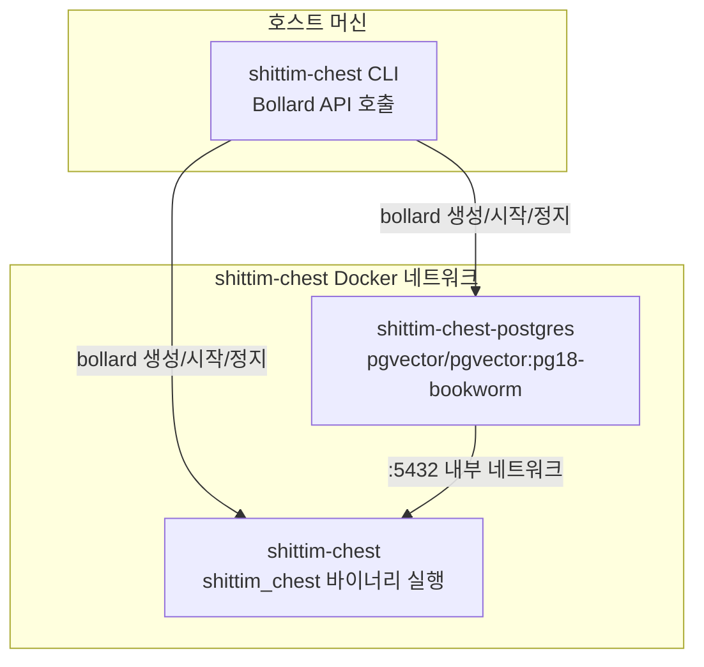

+++
title = "CLI 래퍼 아키텍처: Bollard 기반 Docker 오케스트레이션"
description = """`packages/cli/`는 Bollard Docker API를 통해 컨테이너 수명 주기를 직접 관리하는 Rust 바이너리로, docker-compose와 셸 스크립트를 완전히 대체한다. CLI는 호스트 머신에서 실행되며, 서버 바이너리(`shitt"""
lang = "ko"
category = "design"
subcategory = "webui"
+++

# CLI 래퍼 아키텍처: Bollard 기반 Docker 오케스트레이션

## 개요

`packages/cli/`는 Bollard Docker API를 통해 컨테이너 수명 주기를 직접 관리하는 Rust 바이너리로, docker-compose와 셸 스크립트를 완전히 대체한다. CLI는 호스트 머신에서 실행되며, 서버 바이너리(`shittim_chest`)는 컨테이너 내부에서 실행된다.

## docker-compose를 사용하지 않는 이유

| 차원 | docker-compose | bollard (현재 접근 방식) |
| --- | --- | --- |
| 의존성 | 독립형 docker-compose 설치 필요 | Docker Engine API 재사용 |
| 프로그래밍 가능성 | YAML 선언적, 제한된 로직 | Rust 네이티브, 임의의 제어 흐름 |
| 헬스 체크 | depends_on + condition은 이벤트 기반 | 능동 폴링; 타임아웃 없는 사망 감지 |
| 오류 처리 | 컨테이너 종료 = 실패 | 재시도 + 로그 수집 + 상세 오류 정보 |
| 리소스 정리 | `down -v` 전체 또는 없음 | 컨테이너/네트워크/볼륨별 세분화된 정리 |
| 통합 | 외부 도구 | 라이브러리로 내장, 더 많은 로직으로 확장 가능 |

## 컨테이너 토폴로지



## 컨테이너 명명 및 리소스

| 상수 | 값 | 목적 |
| --- | --- | --- |
| `NET` | `shittim-chest` | Docker 브리지 네트워크 |
| `PG` | `shittim-chest-postgres` | PostgreSQL 컨테이너 이름 |
| `APP` | `shittim-chest` | 애플리케이션 컨테이너 이름 |
| `VOL` | `shittim-chest-pgdata` | PG 데이터 볼륨 |
| `PG_IMG` | `pgvector/pgvector:pg18-bookworm` | PG 이미지 |
| `RUNTIME_IMG` | `debian:bookworm-slim` | Dev 모드 런타임 이미지 |
| `BUILD_IMG` | `shittim-chest` | Release 모드 빌드 이미지 |

## 명령어 매핑

| 명령어 | 동작 |
| --- | --- |
| `dev [--clean]` | 원샷 시작: env → 네트워크 → 볼륨 → PG → cargo build → 마이그레이션 → 실행 → 스트리밍 로그 |
| `up` | 릴리스 모드: docker build 이미지 → 마이그레이션 → 백그라운드 실행 (restart=unless-stopped) |
| `down [--clean]` | 컨테이너 정지 (선택적 볼륨 + 네트워크 정리) |
| `migrate` | 원샷 컨테이너에서 db-migrate 실행 (최대 5회 재시도, 2초 간격) |
| `logs` | 애플리케이션 컨테이너 로그 스트림 팔로우 |
| `status` | PG 및 앱 컨테이너 실행 상태 + 헬스 체크 상태 확인 |
| `build` | 전체 Docker 이미지 빌드 (`docker build -t shittim-chest`) |

## 환경 변수 전파

```text
.env 파일 → dotenvy::from_path_iter → HashMap<String, String>
→ SHITTIM_CHEST_HOST / PORT / DATABASE_URL 병합
→ Vec<String> = ["KEY=VALUE", ...]
→ bollard Config::env()
```

CLI는 `.env`에서 자체 구성을 읽지 않으며, 전체 `.env` 내용을 컨테이너 내부의 `shittim_chest` 프로세스에 전달하기만 한다. 비밀번호와 포트는 `SHITTIM_CHEST_DB_PASSWORD` 및 `SHITTIM_CHEST_PORT` 두 개의 특정 키를 통해 읽는다.

## 로깅 규칙

CLI 로그는 entelecheia와 동일한 형식을 사용하여 stderr로 직접 출력된다:

- `tracing-subscriber` + `ShortTimer` (HH:MM:SS 형식)
- `.compact()` 압축 모드
- `.with_target(false)` 모듈 경로 숨김
- `--log-level` CLI 매개변수 (기본값 `info`)

## 설계 원칙

1. **CLI는 비즈니스 로직을 수행하지 않는다**: 모든 비즈니스 로직은 컨테이너 내부의 `shittim_chest` 바이너리에 존재한다
1. **컨테이너는 불변 단위이다**: CLI는 컨테이너를 생성/파기하며, 실행 중인 컨테이너를 수정하지 않는다
1. **네트워크 격리**: PG 포트는 호스트에 노출되지 않으며, Docker 내부 네트워크 내에서만 접근 가능하다
1. **헬스 체크를 위한 수동 폴링**: Docker 이벤트(신뢰할 수 없음)에 의존하지 않고, inspect 결과를 직접 폴링한다
