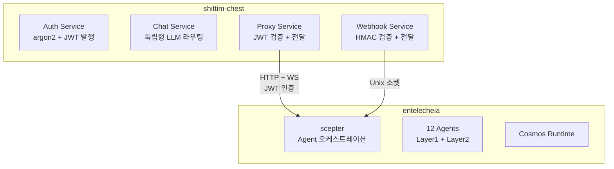

+++
title = "entelecheia와의 느슨한 결합"
description = """shittim-chest와 entelecheia의 통합은 JWT 인증 HTTP/WebSocket 프록시 브리지를 기반으로 한다. 이 설계는 shittim-chest가 entelecheia 없이 완전히 독립적으로 실행될 수 있도록 하면서, 필요 시 Agent 오케스트레이"""
lang = "ko"
category = "design"
subcategory = "webui"
+++

# entelecheia와의 느슨한 결합

## 개요

shittim-chest와 entelecheia의 통합은 JWT 인증 HTTP/WebSocket 프록시 브리지를 기반으로 한다. 이 설계는 shittim-chest가 entelecheia 없이 완전히 독립적으로 실행될 수 있도록 하면서, 필요 시 Agent 오케스트레이션 기능을 온디맨드로 활성화할 수 있게 한다.

## 경계 설계



## 데이터 소유권

| shittim_chest_db | entelecheia_db |
| --- | --- |
| auth_users (비밀번호 해시) | user_identities (user_id) |
| sessions (활성 세션) | groups |
| refresh_tokens | group_memberships |
| oauth_connections | role_assignments |
| api_keys (암호화된 Provider 키) | group_permissions (Provider 할당량) |
| conversations | agent_configs |
| messages | cosmos_state |
| llm_providers (Provider 구성) | iepl_state |
| remote_devices (장치 레코드) | |
| device_sessions | |
| channel_configs | |
| webhook_logs (전달 로그) | |

**원칙**: shittim-chest는 "사용자 측" 데이터를 보유하고, entelecheia는 "Agent 측" 데이터를 보유한다. `user_id`가 양측을 연결하는 키이다.

## JWT 인증 프로토콜

### 키 공유

shittim-chest와 scepter는 동일한 `JWT_SECRET` 환경 변수를 통해 JWT 서명 키를 공유한다. 양측은 상대방이 발행한 JWT를 독립적으로 검증할 수 있다.

### 토큰 구조

```json
{
  "sub": "user-uuid",
  "groups": ["admin", "developer"],
  "exp": 1710000000,
  "iat": 1709996400
}
```

| 필드 | 설명 |
| --- | --- |
| `sub` | 사용자 UUID (양측 데이터베이스에서 공유) |
| `groups` | 사용자가 속한 그룹 목록 |
| `exp` | 만료 시간 (기본값 1시간) |
| `iat` | 발행 시각 |

### 로그인 흐름

```text
사용자 → shittim_chest: POST /api/auth/login
shittim_chest: argon2 비밀번호 검증
shittim_chest → scepter: GET /api/user/{id}/permissions
scepter → entelecheia_db: 그룹 및 권한 쿼리
scepter → shittim_chest: { groups, permissions }
shittim_chest: JWT 발행 (access + refresh)
shittim_chest → 사용자: tokens
```

## 프록시 브리징

### HTTP 프록시

```text
브라우저 → shittim_chest:80/api/proxy/chat (헤더에 JWT)
shittim_chest: JWT 검증
shittim_chest → scepter:8424/api/chat (JWT 전달)
scepter → Agent → LLM → scepter → shittim_chest → 브라우저
```

### WebSocket 프록시

```text
브라우저 → shittim_chest:80/api/proxy/ws (헤더에 JWT)
shittim_chest: JWT 검증
shittim_chest ↔ scepter:8424/ws (양방향 전달 + JWT)
브라우저 ↔ scepter: 전이중 Agent 상호작용
```

### 속도 제한 및 모니터링

프록시 계층에서 shittim-chest는 다음을 담당한다:

- 속도 제한 (사용자별 / IP별)
- 사용량 로깅
- 연결 수명 주기 관리
- 비정상 연결 해제 시 재연결

## Webhook 파이프라인

```text
GitHub/GitLab/Gitee → POST /api/webhook/{source} → HMAC 검증 → 이벤트 파싱 → Unix 소켓 → scepter
```

shittim-chest는 HMAC 검증과 이벤트 파싱을 처리하고, scepter는 이벤트에 기반한 Agent 작업(예: 자동 코드 리뷰)을 트리거한다.

## 독립형 운영 모드

scepter URL이 환경 변수에 구성되지 않았거나 `SHITTIM_CHEST_SCEPTER_PROXY`가 `disabled`로 설정된 경우:

- `/api/proxy/*` 엔드포인트는 503 (Service Unavailable) 반환
- `/api/devices/*` 엔드포인트는 503 반환
- 채팅은 내장 LlmRouter를 완전히 사용
- 다른 모든 기능(인증, 채팅, Provider 관리, Webhook 수신)은 정상 작동

이를 통해 shittim-chest는 entelecheia 없이 완전한 독립형 LLM WebUI로 배포될 수 있다.
