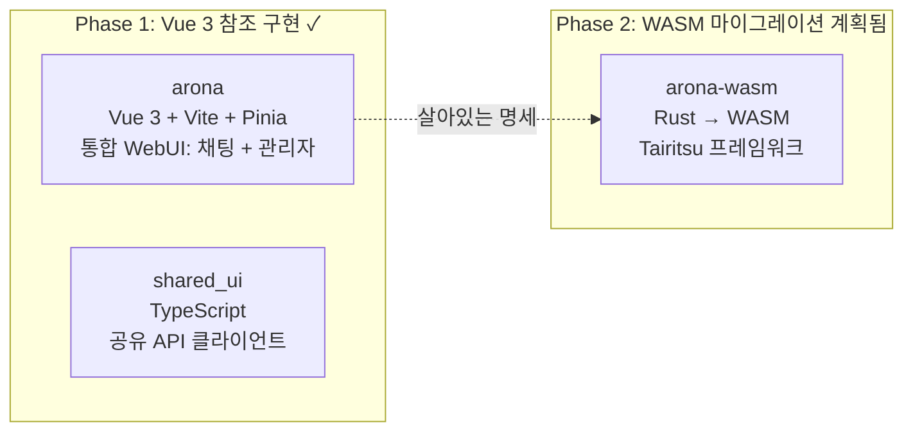
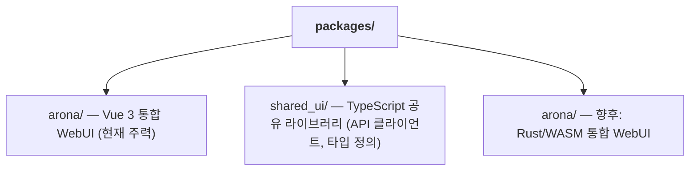

+++
title = "듀얼 프론트엔드 WASM 마이그레이션 전략"
description = """shittim-chest는 "Vue 3 우선, WASM 이후" 2단계 프론트엔드 전략을 채택한다. Vue 3 버전은 프로덕션급 참조 구현으로 먼저 제공되며, Rust/WASM 버전은 조건이 성숙할 때 마이그레이션된다. 두 버전이 병렬로 실행"""
lang = "ko"
category = "design"
subcategory = "webui"
+++

# 듀얼 프론트엔드 WASM 마이그레이션 전략

## 개요

shittim-chest는 "Vue 3 우선, WASM 이후" 2단계 프론트엔드 전략을 채택한다. Vue 3 버전은 프로덕션급 참조 구현으로 먼저 제공되며, Rust/WASM 버전은 조건이 성숙할 때 마이그레이션된다. 두 버전이 병렬로 실행되는 기간 동안, 동일한 사용자 상호작용은 동일한 결과를 생성해야 한다.

## 단계별 분류



## 기술 스택 비교

| 차원 | Phase 1 (Vue 3) | Phase 2 (WASM) |
| --- | --- | --- |
| 언어 | TypeScript / Vue 3 SFC | Rust |
| 프레임워크 | Vite + Pinia + Vue Router | Tairitsu (자체 개발) |
| 빌드 아티팩트 | JS/CSS 번들 | WASM 바이너리 |
| 번들 크기 | 더 큼 | 현저히 작음 |
| 런타임 성능 | 양호 | 우수 (네이티브에 가까운 속도) |
| 개발자 경험 | 즉시 HMR | 컴파일 대기 |
| 생태계 성숙도 | 성숙함 | 초기 단계 |

## "살아있는 명세" 원칙

Vue 3 버전은 단순한 임시 구현이 아니라, WASM 마이그레이션을 위한 **실행 가능한 명세** 역할을 한다:

1. **기능 완전성**: WASM 버전의 모든 기능은 Vue 3 버전과 동일하게 동작해야 한다
1. **API 계약**: 두 버전 모두 동일한 REST API와 WebSocket 프로토콜을 사용한다
1. **시각적 일관성**: 두 버전 모두 동일한 상태에서 동일한 UI를 렌더링한다
1. **점진적 교체**: arona의 채팅 및 관리자 기능은 독립적으로 WASM으로 마이그레이션될 수 있다

## WASM 마이그레이션 결정 기준

조건이 성숙하기 전에는 WASM 마이그레이션이 시작되지 않는다. 결정 기준:

| 조건 | 설명 |
| --- | --- |
| Tairitsu 프레임워크 성숙도 | 컴포넌트 라이브러리, 라우팅, 상태 관리, i18n 및 기타 인프라가 완성되어야 함 |
| WASM 생태계 적용 범위 | `web-sys` / `wasm-bindgen`이 필요한 Web API를 지원해야 함 |
| 개발 대역폭 | 두 버전을 유지하면서 마이그레이션을 진행할 충분한 인력 |
| 성능 요구 사항 | Vue 3 버전이 실제 시나리오에서 성능 병목 현상이 발생함 |

## 프론트엔드 패키지 구조



`shared_ui/`는 공유 프론트엔드 코드를 포함한다:

- API 클라이언트 (인증, 채팅, Provider 관리 등)
- 인증 유틸리티 (JWT 저장, 갱신, 인터셉터)
- 타입 정의 (도메인 열거형, 요청/응답 타입)

## 프론트엔드 개발 명령어

```bash
just build-frontend  # 두 프론트엔드 빌드 (pnpm build:all)
dev.py               # 파일 변경 감시 + 자동 재빌드
```

Dev 모드에서 `dev.py`는 소스 파일을 감시하고 변경 시 `pnpm build`를 실행한다. 백엔드는 동일한 포트에서 정적 에셋과 API 엔드포인트를 모두 제공하므로, 별도의 개발 서버나 프록시가 필요하지 않다.

## 설계 원칙

1. **Vue 3가 먼저 기능을 제공한다**: WASM을 기다리지 않는다. 사용자는 지금 완전한 기능의 채팅 및 관리자 인터페이스를 사용할 수 있다.
1. **WASM은 대체가 아닌 향상이다**: 마이그레이션은 기존 사용자에게 영향을 주지 않으며, 두 버전 모두 동일한 백엔드 API를 사용한다.
1. **프레임워크에 구애받지 않는 백엔드**: `shittim_chest` 백엔드는 프론트엔드 구현을 인식하지 않는다. 모든 HTTP/WS 클라이언트가 통합될 수 있다.
1. **Tairitsu는 내부 개발이 아닌 의존성이다**: WASM 마이그레이션의 시작은 외부 Tairitsu 프레임워크의 성숙도에 달려 있다.
