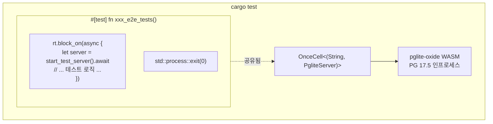

+++
title = "내장형 테스트 데이터베이스 (pglite-oxide)"
description = """shittim-chest는 모든 통합 및 E2E 테스트에 [pglite-oxide](https://crates.io/crates/pglite-oxide)를 내장 PostgreSQL로 사용한다. 외부 Postgres, Docker, `testcontainers`가 필요하지 않으며, 어떤 머신에서"""
lang = "ko"
category = "design"
subcategory = "webui"
+++

# 내장형 테스트 데이터베이스 (pglite-oxide)

## 개요

shittim-chest는 모든 통합 및 E2E 테스트에 [pglite-oxide](https://crates.io/crates/pglite-oxide)를 내장 PostgreSQL로 사용한다. 외부 Postgres, Docker, `testcontainers`가 필요하지 않으며, 어떤 머신에서든 단일 `cargo test` 명령어로 테스트를 실행할 수 있다.

## 설계 동기

이전에는 통합 테스트가 `postgresql_embedded`에 의존했으며, 이는 런타임에 전체 PostgreSQL 바이너리(~100 MB)를 다운로드했다. 이로 인해 느린 시작, 플랫폼별 실패, CI 불안정성이 발생했다. pglite-oxide는 PostgreSQL 17.5를 wasmer 런타임을 통해 WASM 모듈로 패키징하여, 인프로세스, 이식성 높고, 빠르게(~96 ms 콜드 스타트) 실행된다.

## 아키텍처



## 주요 결정 사항

| 결정 | 근거 |
| --- | --- |
| `postgresql_embedded`(네이티브 바이너리) 대신 `pglite-oxide`(WASM) | ~100 MB 다운로드 불필요, 플랫폼별 PG 바이너리 불필요, ~96 ms 시작 |
| `pglite-rust-bindings` 대신 `pglite-oxide` | crates.io에 게시됨(v0.5.0), 더 빠른 시작, 확장 지원이 포함된 성숙한 빌더 API |
| `reqwest` 대신 `tower::ServiceExt::oneshot` | sqlx 풀 백그라운드 태스크와 hyper HTTP 서버 간의 tokio 런타임 교착 상태 방지 |
| `std::process::exit(0)`을 사용하는 단일 `#[test]` 러너 | sqlx `PgPool`은 tokio 런타임을 유지하는 영구 백그라운드 태스크(idle reaper, 헬스 체크)를 생성함. `exit(0)`이 이 중단을 우회함 |
| `max_connections=1` | PGlite 근본적 제한 — 단일 연결만 가능 |
| `OnceCell<(String, PgliteServer)>` | 동일 바이너리 실행 내 서브 테스트 간 공유 PG 인스턴스; `PgliteServer`는 살아 있어야 함(드롭되면 안 됨) |
| `[dev-dependencies]`에만 `pglite-oxide` | wasmer 런타임이 프로덕션 빌드에 유출되어서는 안 됨 |

## 테스트 하네스 패턴

```rust
// tests/common/mod.rs
static PG: OnceCell<(String, PgliteServer)> = OnceCell::const_new();

async fn ensure_pg_url() -> String {
    PG.get_or_init(|| async {
        let server = PgliteServer::builder()
            .start()
            .expect("pglite-oxide 시작 실패");
        let url = server.database_url();
        // 연결, 마이그레이션 실행, 초기 연결 종료
        (url, server)
    }).await.0.clone()
}

pub async fn start_test_server() -> TestServer {
    let db_url = ensure_pg_url().await;
    let db = Database::connect(/* max_connections=1 */).await;
    // AppState, Router 구축, tower oneshot을 래핑한 TestServer 반환
}
```

```rust
// tests/xxx_tests.rs
# [test]
fn xxx_e2e_tests() {
    let rt = tokio::runtime::Runtime::new().unwrap();
    rt.block_on(async {
        let mut server = common::start_test_server().await;
        // ... server.request()를 사용한 모든 서브 테스트 ...
    });
    std::process::exit(0);
}
```

## 생성되는 테이블

테스트 설정 중 SeaORM 마이그레이션을 통해 13개의 모든 테이블이 생성된다:

`auth_users`, `sessions`, `api_keys`, `oauth_connections`, `channel_configs`, `channel_messages`, `channel_pairings`, `conversations`, `messages`, `llm_providers`, `remote_devices`, `device_sessions`, `system_settings`, `workspace_sessions`

## PGlite 제한 사항

1. **단일 연결**: `max_connections`는 1이어야 한다. 동일한 PGlite 인스턴스에 대한 여러 풀은 중단된다.
1. **엄격한 타입 캐스팅**: PGlite는 표준 PostgreSQL보다 더 엄격하다. `uuid_column = text_value`와 같은 쿼리는 실패하므로, 항상 명시적으로 캐스팅해야 한다.
1. **동시 테스트 러너 불가**: 하나의 PGlite 인스턴스를 공유하는 모든 비동기 테스트는 단일 `#[test]` 함수 내에서 순차적으로 실행되어야 한다.
1. **드롭 시 풀 중단**: `sqlx::PgPool::close()`는 무기한 중단될 수 있다. `std::process::exit(0)`을 사용하여 테스트 프로세스를 종료한다.
