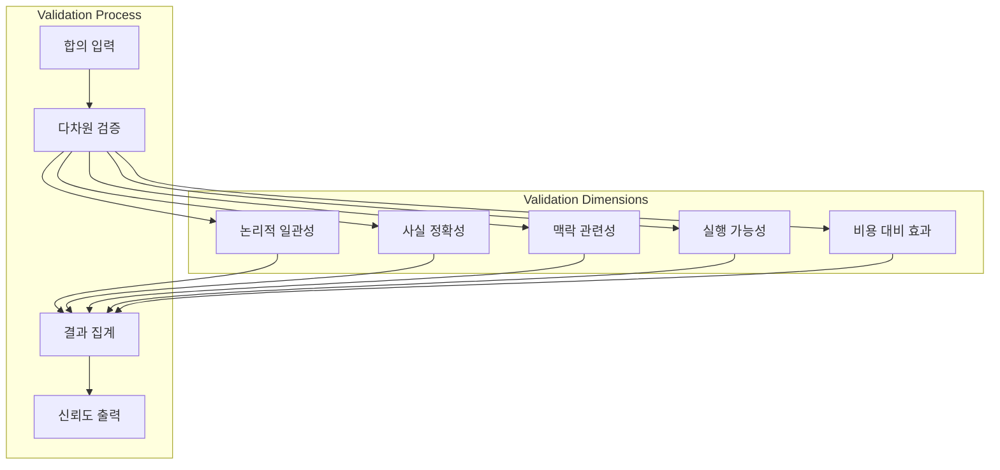
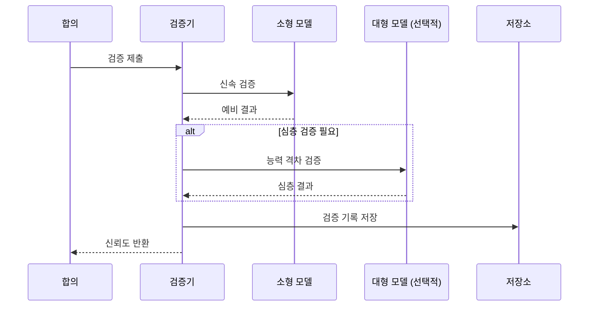
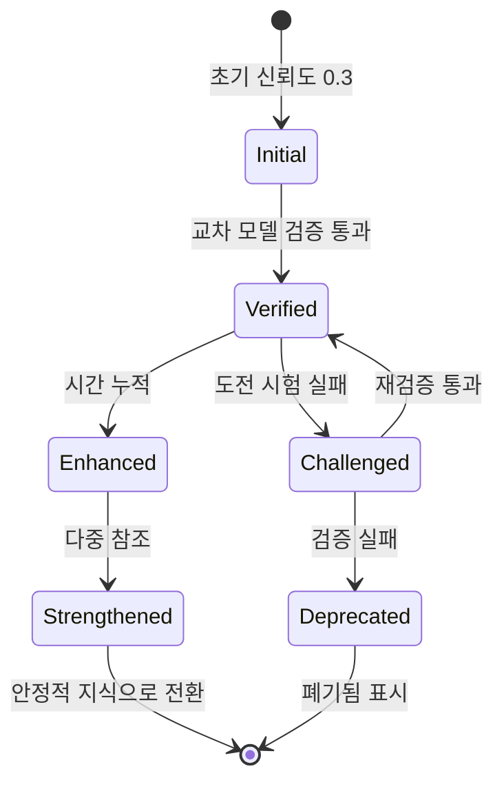
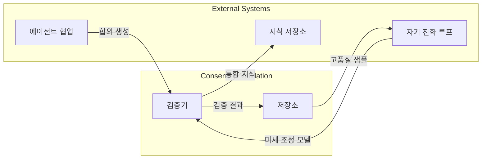

# 합의 검증 메커니즘

## 개요

합의 검증 메커니즘은 다중 에이전트 협업 시스템의 핵심 구성 요소로, 여러 에이전트에 의해 형성된 합의의 신뢰성과 정확성을 검증하고 평가하여 시스템 출력 품질을 보장합니다.

## 핵심 원칙

### 다차원 검증 프레임워크

시스템은 다섯 가지 차원을 통해 포괄적인 검증을 수행합니다:

### 검증 차원 설명

| 차원 | 검증 대상 | 주요 지표 |
| --- | --- | --- |
| 논리적 일관성 | 합의가 자기모순 없이 일관되는가 | 모순 없음, 완전한 추론 |
| 사실 정확성 | 사실 진술이 올바른가 | 알려진 지식과 일치 |
| 맥락 관련성 | 현재 작업과 관련이 있는가 | 관련성 점수 |
| 실행 가능성 | 계획이 실행 가능한가 | 운용 가능성 평가 |
| 비용 대비 효과 | 비용 대비 효과가 합리적인가 | ROI 평가 |

## 아키텍처 설계

### 점진적 검증 절차

### 신뢰도 누적 메커니즘

## 타 시스템과의 통합

## 설계 고려사항

### 비용 제어

- 소형 모델을 검증에 우선 사용
- 필요 시에만 대형 모델 활성화
- 검증 결과 캐싱 및 재사용

### 품질 보증

- 다차원 교차 검증
- 시간 누적을 통한 신뢰도 향상
- 도전 시험으로 잠재적 문제 발견

### 추적성

- 완전한 검증 이력 기록
- 감사 및 역추적 지원
- 통계 분석 지원
