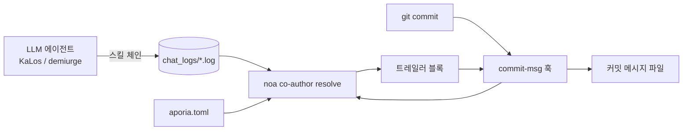

# AI 에이전트 식별 및 커밋 공동 저자 전략

## 개요

본 문서는 celestia-island 프로젝트(`noa`, `entelecheia`, `evernight`)에서
AI가 생성한 커밋에 **출처 메타데이터**를 부착하는 방식을 명세합니다:
어떤 모델이 변경을 작성했는지, 어떤 제공자/플랫폼을 통해 접근했는지,
얼마나 많은 토큰을 소비했는지, 그리고 해당 변경이 자율(YOLO) 반복
하에 생성되었는지 여부를 기록합니다.

이 메커니즘은 **실용적 메타데이터**입니다: AI 에이전트가 생성한 모든 커밋에는
`noa`가 설치하고 분석하는 git `commit-msg` 훅에 의해
`Co-authored-by` 트레일러 블록(및 선택적 `Token usage` 블록)이 추가됩니다.
이는 법적 준수 장벽이 아닙니다; 어떤 모델과 제공자가 코드에 접촉했는지를
사람이 감사할 수 있게 하는 추적성입니다.

## 동기

| 우려사항 | 이 방식의 도움 |
| --- | --- |
| **추적성** | 모든 커밋이 이를 생성한 정확한 모델을 기록합니다. |
| **제공자 책임성** | 저자 이메일이 서드파티 중계기를 포함한 제공자/플랫폼을 인코딩합니다. |
| **오염 방지** | 중계기나 제공자가 손상된 데이터를 제공할 경우, 공동 저자 트레일러가 출처를 식별합니다. |
| **비용 추적** | 선택적 `Token usage` 블록이 모델별 업로드/다운로드/캐시를 기록합니다. |
| **자율 모드 표시** | YOLO 순항 제어 하에 완전히 실행된 체인은 `Entelecheia` 권한으로 표시됩니다. |

## 제공자 신원 모델

저자 이메일은 단일 신뢰 네임스페이스 — `celestia.world` — 를 사용하며,
로컬 파트는 **누가 모델을 제공했는지**를 인코딩합니다:

```text
Display Name <provider-or-platform-id@celestia.world>
```

제공자 id는 각 제공자 구성(제공자 레지스트리 진입점 TOML 및 로컬
`aporia.toml`)에 선언된 **필수 `website_domain`** 필드입니다.
API base_url에서 파생되지 **않습니다** — 단일 제공자가 여러 `base_url`
호스트를 노출할 수 있기 때문입니다(예: zhipu_glm은 `open.bigmodel.cn`과
`api.z.ai` 모두를 제공하지만, 표준 도메인은 `zhipuai.cn`입니다).
제공자에 `website_domain`이 없으면 해당 제공자에 대한 공동 저자는
귀속되지 않습니다(리졸버는 URL이나 모델 접두사로 추측하지 않고 건너뜁니다).

- **1차 제공자**는 표준 도메인으로 식별됩니다:

`anthropic.com`, `deepseek.com`, `openai.com`, `zhipuai.cn`, `google.com`, ...

- **서드파티/중계 제공자**는 중계기가 보이도록 자체 도메인을 유지합니다:

`opencode.ai`, `jdcloud.com`, `openrouter.ai`, `dashscope.aliyuncs.com`, ...

즉, 서로 다른 경로를 통해 도달한 *동일한* 모델이 구별 가능합니다:

```text
GLM 5 <zhipuai.cn@celestia.world>              # Zhipu AI 직접
GLM 5 <jdcloud.com@celestia.world>           # JD Cloud를 통한 GLM 5
Deepseek V4 Pro <deepseek.com@celestia.world> # DeepSeek 직접
Deepseek V4 Pro <opencode.ai@celestia.world>  # opencode를 통한 DeepSeek
```

## 공동 저자 트레일러 명세

- 트레일러 키: `Co-authored-by` (git 인식 트레일러).
- 값: `Display Name <local@celestia.world>`.
- **사용 순서대로** 구별되는 모델당 하나의 트레일러.
- 표시 이름은 모델 id(브랜드 + 버전, 타이틀 케이스)에서 파생됩니다.
- 로컬 파트는 유효한 RFC-5321 서브도메인(영문자, 숫자, `.`, `-`)이어야 합니다.

## YOLO 권한 트레일러

커밋을 생성한 전체 사고 체인이 **YOLO 순항 제어**(자율 반복) 하에 실행된 경우,
추가 공동 저자가 맨 앞에 추가됩니다:

```text
Co-authored-by: Entelecheia <demiurge@celestia.world>
```

YOLO 모드는 다음 중 하나에서 감지됩니다:

1. 세션 채팅 로그에 `YOLO cruise control` / `YOLO auto` 마커가 포함됨, 또는
1. `/run/entelecheia/yolo_active` 감시 파일의 존재.

이를 통해 사람이 "이 커밋은 인간이 개입하지 않고 생성되었다"는 것을
즉시 확인할 수 있습니다.

## 토큰 사용량 내장

각 모델의 표시 이름 내에 `Co-authored-by` 트레일러에 내장됩니다
(GitHub가 올바르게 파싱하는 트레일러 블록 하나):

```text
Co-authored-by: Claude Opus 4.8 (↑ 12.5k ↓ 8.3k ●45.2k) <anthropic.com@celestia.world>
Co-authored-by: Deepseek V4 Pro (↑ 5.1k ↓ 3.2k) <deepseek.com@celestia.world>
```

규칙:

- 사용량은 `(↑ 업로드 ↓ 다운로드)`로 인라인 내장되며, 캐시된 입력 토큰이

보고되었고 0보다 큰 경우에만 `●캐시`가 추가됩니다.

- `↑` = 프롬프트/입력 토큰; `↓` = 완성/출력 토큰.
- 개수는 천 단위(`k`), 소수점 한 자리, 후행 0 제거.

## 전체 커밋 메시지 예시

```text
fix(auto_fix): clippy/check 제한 시간을 180초에서 300초로 인상

기존 180초 제한 시간은 부하가 걸린 머신에서 클린 빌드에 너무
촉박했습니다; 거짓 검증 실패를 방지하기 위해 300초로 인상합니다.

Co-authored-by: Entelecheia <demiurge@celestia.world>
Co-authored-by: GLM 5 (↑ 36.4k ↓ 1.5k) <zhipuai.cn@celestia.world>
```

## noa 훅 설치

`noa`는 훅 생명주기를 제공합니다:

```text
noa hook install --repo <path> [--force] [--noa-bin <path>]
```

- `.git/hooks/commit-msg`를 작성합니다(모드 `0755`).
- 훅은 `<noa> co-author resolve`를 호출하고 그 stdout을 커밋

메시지 파일(`$1`)에 추가합니다.

- 훅은 **절대 커밋을 차단하지 않습니다**: 리졸버 실패 시 조용히 `0`을 반환합니다.
- 커밋 메시지에 이미 `Co-authored-by:` 트레일러가 포함되어 있으면

훅은 아무 작업도 하지 않습니다(중복되거나 덮어쓰지 않습니다).

- 환경 변수 `NOA_COAUTHOR_DISABLE=1`은 한 커밋에 대해 훅을 비활성화합니다.

## noa 공동 저자 분석

```text
noa co-author resolve [--repo <path>] [--chat-log-dir <dir>]
                      [--aporia-config <path>] [--lookback-secs <n>]
```

리졸버는:

1. 제공자 맵을 불러옵니다: 내장 레지스트리를 `aporia.toml` 제공자 구성과

병합합니다(정확한 model→endpoint→provider 매핑을 제공).

1. 가장 최근의 entelecheia 채팅 로그를 읽고 모델별 토큰 사용량을

집계합니다. `--lookback-secs 0`(기본값)으로는 가장 최근 로그 하나만 사용됩니다.

1. YOLO 모드를 감지합니다(채팅 로그 마커 또는 감시 파일).
1. 공동 저자 목록(YOLO인 경우 먼저 `Entelecheia` 권한, 그 다음 모델)과

토큰 사용량 블록을 작성하고, 트레일러 블록을 stdout으로 출력합니다.

## 데이터 흐름



## entelecheia 통합

- `commit-msg` 훅이 `/mnt/sdb1/entelecheia/.git/hooks/`에 설치됩니다.
- 수술 파이프라인(`packages/scepter/src/state_machine/skill_chain/execution/noa_post_chain.rs`의

`NoaMergeCommit` 훅) 및 `KaLos:auto_fix` 자가 치유 루프에 의해
생성된 모든 커밋이 git `commit-msg` 훅을 통과하므로 자동으로 도장이 찍힙니다.

- 커밋 호출 지점에 변경이 필요하지 않습니다: 훅이 유일한 삽입 지점입니다.

## evernight 통합

AI 에이전트가 `evernight`를 통해 커밋을 조율할 때(예: 호스트 A의 에이전트 →
evernight SSH → 호스트 B → `git commit`), 호스트 측 `commit-msg` 훅이
여전히 로컬에서 실행되어 커밋에 도장을 찍습니다. `evernight` 자체는
모델 트래픽을 중계할 때 저자 이메일에 **전송 제공자**로 나타날 수 있으며
(예: `GLM 5 <evernight.celestia.world@celestia.world>`),
이를 통해 전송 홉을 감사할 수 있게 됩니다.

## 보안 고려사항

- 공동 저자 트레일러는 **자체 보고** 출처 정보이며, 암호학적 증명이 아닙니다.

향후 과제로 서명된 증명서가 추가될 수 있습니다.

- 리졸버는 안전하게 성능 저하합니다: 채팅 로그 누락, `noa` 누락, 또는

파싱 오류는 모두 빈 블록을 초래하며 커밋은 그대로 진행됩니다.

- 제공자 식별자는 로컬 `aporia.toml`에서 가져오므로, 사용자는 항상

*자신이* 구성한 제공자를 보게 됩니다.

## 제공자 식별자 참조 (초기 레지스트리)

| 제공자 id | 브랜드 | 엔드포인트 힌트 |
| --- | --- | --- |
| `zhipuai.cn` | GLM | `open.bigmodel.cn` |
| `deepseek.com` | Deepseek | `api.deepseek.com` |
| `anthropic.com` | Claude | `api.anthropic.com` |
| `openai.com` | GPT / OpenAI | `api.openai.com` |
| `google.com` | Gemini | `googleapis.com` |
| `dashscope.aliyuncs.com` | Qwen | `dashscope.aliyuncs.com` |
| `moonshot.cn` | Kimi | `api.moonshot.cn` |
| `mistral.ai` | Mistral | `api.mistral.ai` |
| `opencode.ai` | (중계기) | `opencode.ai` |
| `jdcloud.com` | (중계기) | `jdcloud.com` |
| `openrouter.ai` | (중계기) | `openrouter.ai` |
