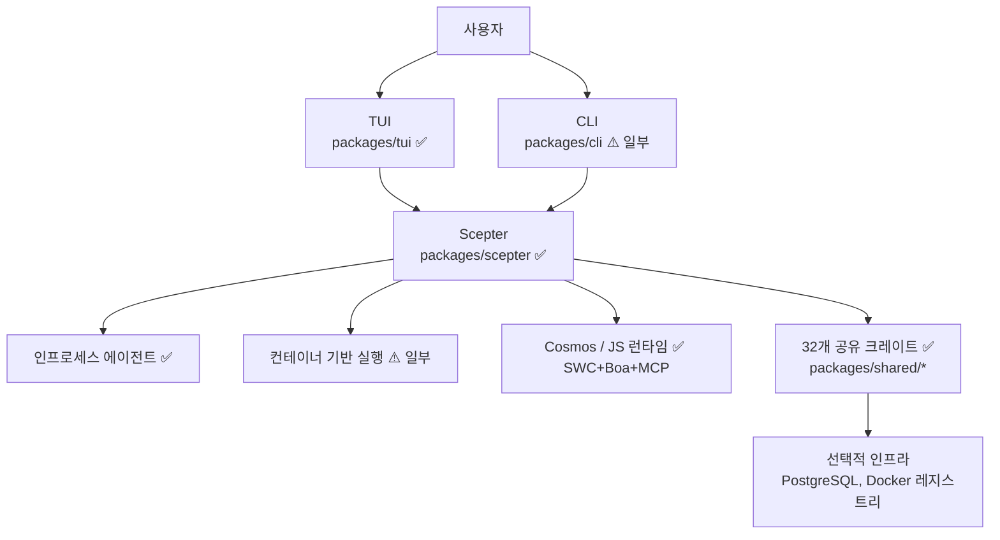
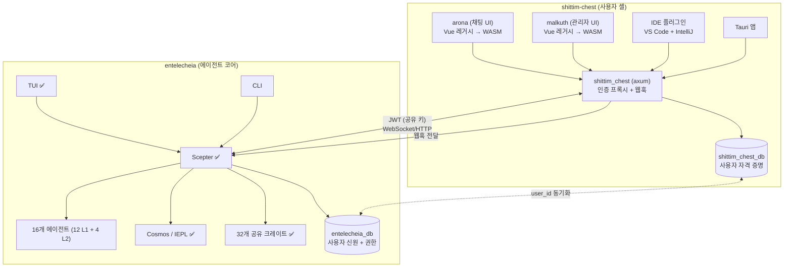
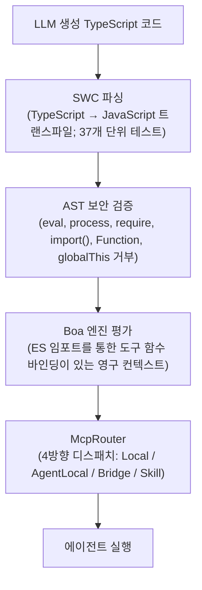
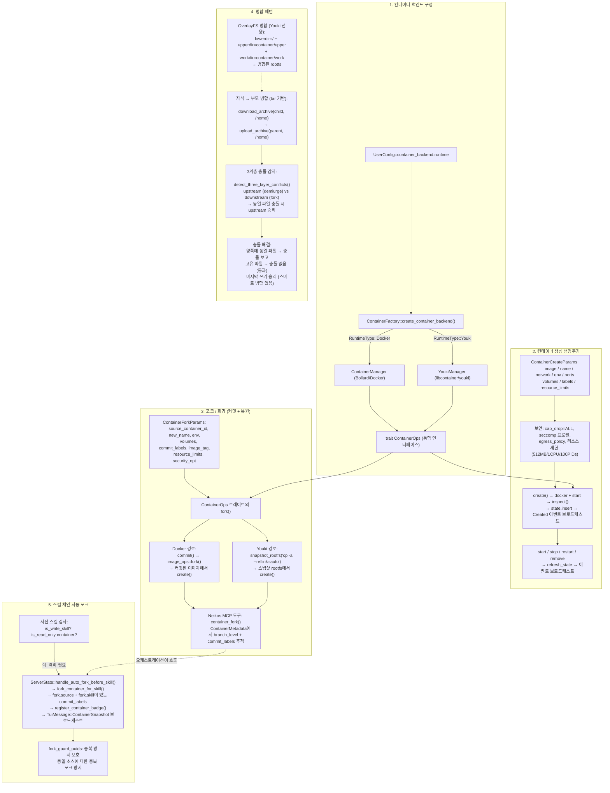
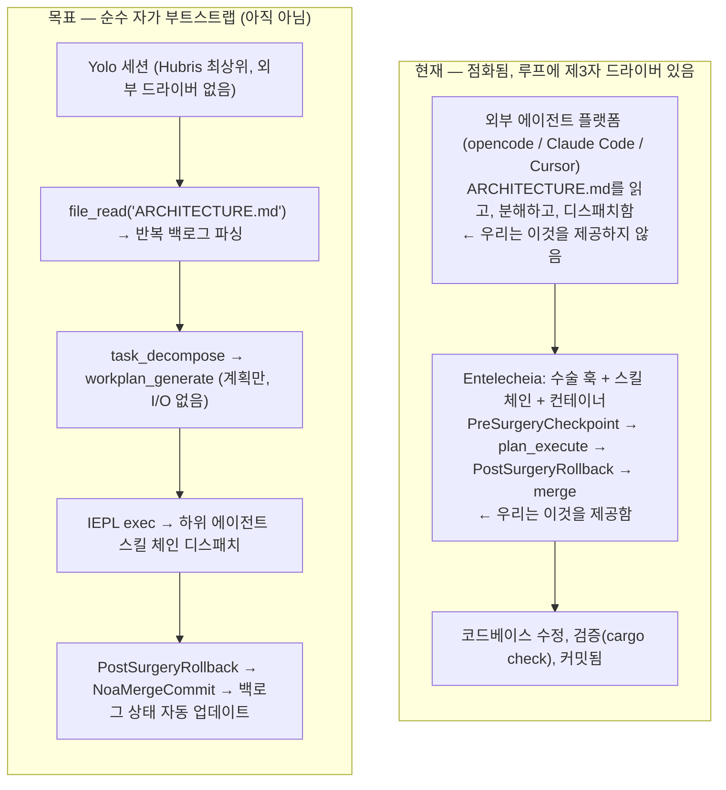
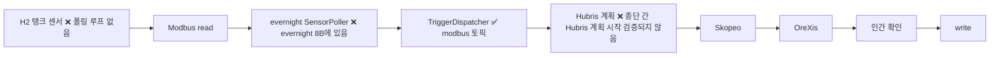
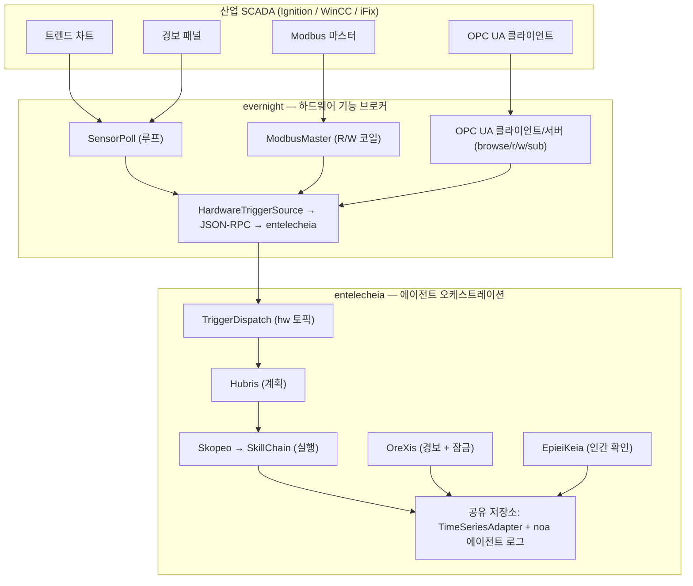

# 아키텍처

> **버전**: 0.2.0 — 초기 개발 단계, 프로덕션 준비 안 됨.
> **최종 검증**: 2026-06-17 (심층 분석 — 실제 코드 기준으로 재검증)
> 본 문서는 구현된 코드와 의도된 설계를 모두 설명합니다.
> 배포 결정 전에 [현재 공백](#현재-공백) 섹션을 읽어 주십시오.

## 저장소 분할

Entelecheia는 주요 분할을 완료했습니다: 사용자 대상 셸 레이어가 형제 프로젝트 **shittim-chest**(`../shittim-chest`)로 이전되었습니다. Entelecheia는 이제 멀티 에이전트 오케스트레이션 코어에만 집중합니다.

| 저장소 | 범위 |
| --- | --- |
| **entelecheia** | Scepter 오케스트레이션, 16개 에이전트 (12개 L1 + 4개 L2), Cosmos/IEPL 런타임, 32개 공유 크레이트 |
| **shittim-chest** | arona (채팅 UI 프론트엔드), malkuth (관리자 UI), `shittim_chest` 백엔드 (axum 프록시 + 인증 + 웹훅), IDE 플러그인, Tauri 앱 |

## 현재 범위

Entelecheia는 `packages/scepter`(오케스트레이션 서버)를 중심으로 **56개 크레이트**의 Rust 워크스페이스이며, `packages/shared/` 아래의 **32개 공유 크레이트**(이전 모놀리식 크레이트에서 완전히 분해됨; 5개의 계획된 하위 크레이트는 실현되지 않았으며 그 기능은 형제 크레이트에 인라인됨), 그리고 `packages/tui`(터미널 UI)로 구성됩니다. TUI는 가장 완전한 사용자 인터페이스입니다. `packages/cli`는 서비스 관리, 채팅, 타임라인 명령어를 갖추고 있습니다.

다음 구성 요소는 **shittim-chest로 이전**되어 본 저장소에서 제거되었습니다:

- `packages/webui` (HTTP/정적 호스트, WebSocket 브리지) — 제거됨
- `packages/webui_frontend` (WASM 프론트엔드) — 제거됨 (1단계)
- `packages/ide/vscode` (VS Code 확장) — 제거됨 (1단계)
- `packages/ide/idea` (IntelliJ 플러그인) — 제거됨 (1단계)
- `packages/app/tauri*` (Tauri 데스크톱/모바일 앱) — 제거됨 (1단계)
- TUI/CLI/Scepter/공유 크레이트의 모든 WebUI 상태, 명령어, 렌더링 — 제거됨 (2단계)

프로젝트는 주요 분해를 거쳤습니다: 기존의 모놀리식 `packages/shared` 크레이트(38K 라인, 187개 .rs 파일)가 집중된 하위 크레이트로 완전히 해체되었습니다. 초기 레이어링 다이어그램에 나타났던 5개의 크레이트 경계는 별도의 크레이트로 실현되지 않았으며, 의도된 기능은 다른 크레이트 내에 존재합니다(예: 도메인 열거형은 `shared-domain-agent`에 인라인, 스레드 타입은 `shared-state-types`에 인라인). 모든 내부 의존성 선언은 버전 일관성을 위해 `workspace = true`를 사용합니다.

## 구성 요소 현실 점검

| 구성 요소 | 구현됨 | 설계 전용 / 스텁 | 판정 |
| --- | --- | --- | --- |
| **Scepter** (오케스트레이션) | 인증/RBAC, 제공자 라우팅, 에이전트 생명주기, 스킬 체인 실행, WebSocket/HTTP 엔드포인트, 키 암호화. 49개 소스 파일에 걸쳐 351개 단위 테스트. `AppState`는 5개 하위 상태에 대한 `FromRef` 구현 보유; agent_lifecycle 핸들러는 `State<Arc<Persistence>>` 사용 | 완전한 API 표면. 배치 프로세서 정의되었으나 인스턴스화되지 않음. | 🟢 실제 |
| **TUI** | 전체 생명주기: 스플래시, Docker 초기화, 타임라인, 에이전트 모달, i18n (8개 언어), 제공자 설정, 테마 지원. 47개 소스 파일에 걸쳐 329개 단위 테스트. `ComponentStore`가 5개 하위 구조체로 분할; AppState가 6개 필드로 축소. Unix 소켓(우선) 또는 WebSocket 폴백으로 연결. | Scepter API와 기능 동등. `CancelRequest`/`ExecuteSudoCommand`는 아직 연결되지 않음. | 🟢 실제 |
| **CLI** | 서비스 관리, 채팅, 타임라인, 에이전트 생명주기 명령어. 28개 단위 테스트. | TUI와 기능 동등하지 않음 | 🟡 일부 |
| **WebUI** | 제거됨 — shittim-chest로 이전 | — | ✅ 완료 |
| **WebUI 프론트엔드** | 제거됨 — shittim-chest로 이전 | — | ✅ 완료 |
| **Cosmos / JS 런타임** | Boa 엔진, ES 모듈 임포트 디스패치(`__native_dispatch` 내부 해결), 네임스페이스 생성, 서킷 브레이커+재시도 포함 McpRouter. `#[derive(TS)]`의 `.d.ts` 자동 생성이 TypeScript 타입 파일을 채움. 50개 단위 테스트. | SWC TypeScript 트랜스파일 파이프라인 구현 및 테스트 완료(37개 단위 테스트). `in-process-transpile` 기능 플래그가 있는 `shared_iepl::client`를 통해 전체 자동 파이프라인(LLM 출력 → SWC → Boa) 연결 가능. | 🟢 활성 |
| **16개 에이전트 (12개 L1 + 4개 L2)** | 모든 16개 에이전트가 MCP 도구 구현과 함께 컴파일됨. 총 147개 MCP 도구 — **모두 실제**. 코드베이스에 `unimplemented!()` 또는 `todo!()` 매크로 없음. | 클래식 SE 도구는 메타데이터에서 `maturity: Stub`로 표시되었으나 실제 구현 보유(cargo clippy, eslint, pylint, go vet 서브프로세스 호출; 코드 메트릭; 함수 추출 리팩토링). | 🟢 활성 |
| **Layer2: 웹 자동화** | 11개 MCP 도구 — WebDriver 프로토콜을 통한 모든 실제 구현: 세션 관리, 탐색, 스크린샷, 스크립트 실행, 콘솔/네트워크 로그, 키보드, 마우스, 녹화. 10개 도구에 `maturity: Experimental`. | — | 🟢 활성 |
| **Layer2: 클래식 SE** | 7개 MCP 도구 — 모든 실제 구현: static_analyze (cargo clippy/eslint/pylint/go vet), code_review (긴 함수, 깊은 중첩, 매직 넘버 감지), quality_check (LOC, 복잡도, 등급), refactor_suggest, lsp_diagnose, lsp_symbols, lsp_refactor (실제 이름 변경 및 함수 추출). 2개 단위 테스트. | LSP refactor의 인라인 작업은 미리보기 전용(LSP 서버가 있어야 전체 해결 가능). | 🟢 활성 |
| **Layer2: 산업 IoT** | 7개 MCP 도구 — 모두 실제 구현: modbus_read, modbus_write, s7comm_probe, serial_discover, opcua_browse, opcua_read, opcua_write. 산업 프로토콜 통신 (Modbus RTU/TCP, Siemens S7comm, OPC UA 클라이언트). `maturity: Experimental`. | L2 통합의 일환으로 SkeMma/PoleMos에서 이전됨. | 🟢 활성 |
| **Layer2: 원격 작업** | 16개 MCP 도구 — 모두 실제 구현: SSH 세션 관리, 원격 명령 실행, 파일 전송 (SFTP), 호스트 정보 수집, GUI 자동화 (X11/VNC 스크린샷, 입력, 탐색), 시스템 모니터링. `maturity: Experimental`. | L2 통합의 일환으로 SkeMma/PoleMos에서 이전됨. | 🟢 활성 |
| **기타 Layer2 설계** | 계획된 4개의 L2 에이전트가 모두 구현됨. `res/prompts/domain_agents/`는 모든 구현된 에이전트에 대한 설정/스킬 문서를 포함. | `docs/plans/`는 생성된 적 없음 | 🟢 활성 |
| **컨테이너 격리** | 2계층 런타임: Bollard를 통한 Docker/Podman (외부 오케스트레이션), libcontainer를 통한 Youki/libcontainer (내부 샌드박스). 비루트 사용자, cap_drop=ALL, no-new-privileges, 전용 Docker 네트워크, Unix 소켓 IPC, 생성/포크/병합/재생성 시 리소스 제한(512MB/1CPU/100 PIDs). 사용자 정의 seccomp 프로필. 포크/커밋/스냅샷이 두 백엔드에서 완전히 작동. | AppArmor 프로필 미구현. `read_only_rootfs`가 기본적으로 활성화되지 않음. | 🟡 일부 |
| **메모리 / RAG** | API 기반 임베딩(OpenAI 호환, SHA-256 해시 폴백, ONNX fastembed BGE-M3). 3개 임베딩 백엔드 완전 구현. PgVector 저장소, 인메모리 벡터 문서, 그래프 탐색, 주변 컨텍스트 주입용 RagContextBuffer. 39개 단위 테스트. | 임베딩→RAG 연결 분리(호출자가 사전 계산된 임베딩 제공). PgVector 경로가 인메모리 폴백보다 새롭고 테스트가 적음. RAG 구독 동기화 예약됨(아직 구현되지 않음). | 🟡 일부 |
| **IEPL 파이프라인** | Boa 엔진 + MCP 브리지 + 네임스페이스 필터링 + 서킷 브레이커. SWC TypeScript 파싱 구현 및 테스트(37개 단위 테스트). `.d.ts` 자동 생성 작동 중. IEPL 코드 생성(Rust 타입 → TS 선언) 연결됨. `shared_iepl::client`를 통해 TS→JS 트랜스파일 가능(인프로세스 또는 서브프로세스 모드). | Cosmos 컨테이너 실행 경로에 대해 SWC→Boa 체인이 통합되지 않음(사전 스트립된 JS 예상). | 🟡 일부 |
| **IDE 통합** | 제거됨 — shittim-chest로 이전 | — | ✅ 완료 |

## 아키텍처 다이어그램

### 현재



### 목표 (분할 후)



범례: ✅ 작동 중 | ⚠️ 부분 구현 | 🔴 스텁/설계

## 크레이트 의존성 계층

32개 공유 크레이트는 계층화된 의존성 그래프로 구성됩니다:

```mermaid
block-beta
    columns 1
    block:L0["계층 0 (리프)"]:1
        shared-core shared-logging shared-macros
    end
    block:L1["계층 1"]:1
        shared-domain-enums shared-mcp-types shared-text shared-concurrent
    end
    block:L2["계층 2"]:1
        shared-config shared-agent-registry shared-state-types
    end
    block:L3["계층 3"]:1
        shared-domain-agent shared-container shared-domain-agent-lifecycle shared-domain-agent-runtime
        shared-domain-thread-types shared-domain-toolchain shared-infra-utils
    end
    block:L4["계층 4"]:1
        shared-state-sync shared-domain-skills shared-hooks shared-domain-auth shared-container-runtime
        shared-domain-skills-permissions shared-timeline shared-iepl
    end
    block:L5["계층 5"]:1
        shared-llm-provider shared-prompt shared-custom-agent shared-storage
        shared-infra-jsonrpc shared-infra-services shared-e2e-events shared-adapter shared-plugin_host
        shared-rag shared-embedding shared-security-policy
    end
    L0 --> L1 --> L2 --> L3 --> L4 --> L5
```

소비자(scepter, 에이전트, tui)는 개별 하위 크레이트에서 직접 임포트합니다(예: `_shared_domain_agent`, `_shared_llm_provider`). 얇은 집계 크레이트는 없습니다 — 기존의 모놀리식 `shared`는 완전히 해체되었습니다. 모든 내부 의존성은 버전 일관성을 위해 `workspace = true` 선언을 사용합니다.

> **참고:** 위 다이어그램은 6개 계층에 걸쳐 37개 크레이트 슬롯을 나열하지만, 컴파일 가능한 워크스페이스 멤버로 존재하는 것은 32개뿐입니다. 다음 5개 슬롯은 계획된 크레이트 경계였으나 별도 크레이트로 실현되지 않았습니다: `shared-domain-enums`, `shared-agent-registry`, `shared-domain-thread-types`, `shared-domain-toolchain`, `shared-state-sync`. 이들의 기능은 형제 크레이트에 인라인되어 있습니다(예: 도메인 열거형은 `shared-domain-agent` 내부에 존재; `shared-state-sync`는 `packages/shared/state_types`를 가리키는 워크스페이스 별칭 `_shared_state_sync`로만 존재).

## 활성 에이전트

워크스페이스는 12개 Layer1 에이전트(111개 MCP 도구)와 4개 Layer2 크레이트(웹 자동화 11개 도구, 클래식 소프트웨어 엔지니어링 7개 도구, 산업 IoT 7개 도구, 원격 작업 16개 도구)를 컴파일합니다. 모든 에이전트는 MCP 도구 등록을 위해 `agent_mcp_module!` 매크로를 사용합니다. 이 매크로는 사전 디스패치 인터셉션이 필요한 에이전트(예: Skopeo의 `SkillExecutor` 이중 디스패치)를 위해 `skill_routing`을 지원합니다.

**도구 구현 상태:** 모든 147개 도구가 실제 구현을 보유하고 있습니다. 코드베이스 어디에도 `unimplemented!()` 또는 `todo!()` 매크로가 존재하지 않습니다. 실제 로직 없이 단순히 `Ok(())`를 반환하는 도구는 없습니다.

| 에이전트 | 계층 | 현재 책임 | 도구 | 스텁 | 테스트 커버리지 | 완성도 |
| --- | --- | --- |  ---  |  ---  |  ---  | --- |
| **HapLotes** | 1 | 게이트웨이, 메시지 라우팅, 전송 글루 | 2 | 0 | 21개 테스트 | 🟢 실제 |
| **SkoPeo** | 1 | 조정 및 LLM 대면 실행 흐름 | 12 | 0 | 41개 테스트 | 🟢 실제 |
| **HubRis** | 1 | 계획, 할 일 관리, 보고, 이슈 도우미 | 8 | 0 | 65개 테스트 | 🟢 실제 |
| **KaLos** | 1 | 파일 및 저장소 작업 | 8 | 0 | 20개 테스트 | 🟢 실제 |
| **NeiKos** | 1 | 컨테이너 생명주기 및 실행 도우미 | 17 | 0 | 14개 테스트 | 🟢 실제 |
| **SkeMma** | 1 | 스크립트 실행 및 런타임 샌드박싱 | 2 | 0 | 124개 테스트 | 🟢 실제 |
| **ApoRia** | 1 | 제공자 설정, 지식 도우미, RAG 도구 | 11 | 0 | 14개 테스트 | 🟢 실제 |
| **EleOs** | 1 | 웹 검색 및 원격 정보 검색 | 2 | 0 | 11개 테스트 | 🟢 실제 |
| **EpieiKeia** | 1 | 스케줄링 및 유지보수 도우미 | 8 | 0 | 4개 테스트 | 🟢 실제 |
| **OreXis** | 1 | 보안 정책 집행(거부목록/허용목록/잠금을 통한 런타임 차단) + 경보 계층 + 감사 보고 | 20 | 0 | 19개 테스트 | 🟢 실제 |
| **PhiLia** | 1 | 메모리 및 데이터 저장소 관련 함수 | 7 | 0 | 0개 테스트 | 🟡 테스트 커버리지 없음 |
| **PoleMos** | 1 | 호스트 통신 및 하드웨어 원격 측정 | 9 | 0 | 3개 테스트 | 🟡 낮은 테스트 커버리지 |
| **웹 자동화** | 2 | 브라우저 자동화 (생성, 탐색, 스크린샷, 실행, 콘솔, 네트워크, 키보드, 마우스, 녹화) | 11 | 0 | 3개 테스트 | 🟡 낮은 테스트 커버리지 (`maturity: Experimental`) |
| **클래식 소프트웨어 엔지니어링** | 2 | 정적 분석, 코드 리뷰, 품질 검사, 리팩토링 제안, LSP 진단/심볼/리팩토링 | 7 | 0 | 2개 테스트 | 🟡 낮은 테스트 커버리지 (메타데이터에서는 `maturity: Stub`이나 실제 구현) |
| **산업 IoT** | 2 | 산업 프로토콜 통신 (Modbus RTU/TCP, Siemens S7comm, OPC UA 클라이언트) | 7 | 0 | 0개 테스트 | 🟡 낮은 테스트 커버리지 (`maturity: Experimental`) |
| **원격 작업** | 2 | SSH 원격 실행, 파일 전송, GUI 자동화, 시스템 모니터링 | 16 | 0 | 0개 테스트 | 🟡 낮은 테스트 커버리지 (`maturity: Experimental`) |

## Layer2 및 Layer3

- **현재 Layer2**: `web_automation`(11개 MCP 도구), `classic-software-engineering`(7개 MCP 도구), `industrial_iot`(7개 MCP 도구), `remote_operations`(16개 MCP 도구)이 활성 Layer2 크레이트입니다. `classic-software-engineering`은 정적 분석, 코드 리뷰, 품질 검사, 리팩토링 제안, LSP 진단, 심볼 추출, LSP 리팩토링을 `packages/domain_agents/classic_software_engineering/`에서 제공합니다. `industrial_iot`는 산업 프로토콜 통신(Modbus RTU/TCP, Siemens S7comm, OPC UA)을 제공하며 SkeMma/PoleMos Layer1 도구에서 이전되었습니다. `remote_operations`는 SSH 원격 실행, 파일 전송, GUI 자동화, 시스템 모니터링을 제공하며 SkeMma/PoleMos Layer1 도구에서 이전되었습니다. wasmtime + boa TS 이중 샌드박스를 갖춘 WASI 플러그인 시스템(`plugin_host`)은 참조 GitHub 웹훅 플러그인을 호스팅합니다; 트리거 아키텍처(`TriggerDispatcher` / `TriggerTopic` / `TriggerConfig`)는 외부 이벤트를 스킬 체인으로 디스패치합니다.
- **기타 Layer2 설계**: 계획된 4개의 L2 에이전트가 모두 구현되었습니다. `res/prompts/domain_agents/`는 구현된 L2 에이전트에 대한 설정/스킬/mcp 문서를 포함합니다. 원래 계획된 `docs/plans/` 디렉터리는 생성된 적이 없습니다.
- **Layer3**: 사용자 정의 에이전트는 워크스페이스 로컬 `.amphoreus/` 디렉터리에서 로드됩니다. 외부 Layer 3 에이전트의 subscribe/list/run을 위한 CLI 명령어가 존재합니다. `shared-custom-agent` 크레이트는 부분적 인프라를 제공합니다. 실제 Layer 3 비즈니스 로직 플러그인은 구현되지 않았습니다.

## 런타임 패턴

### Exec-Only 도구 노출

모델 대면 도구 표면은 의도적으로 작습니다: `exec`, `write_to_var`, `write_to_var_json`. 내부 MCP 도구(모든 에이전트에 걸쳐 약 146개)는 하나씩 직접 노출되는 대신 ES 모듈 임포트를 통해 런타임에서 호출됩니다. 이는 프로젝트의 핵심 아키텍처 혁신으로, LLM 컨텍스트 오버헤드를 최소화하고 공격 표면을 줄이며 권한 집행을 중앙 집중화합니다.

### 혼합 실행 모델

Scepter는 인프로세스 로직과 컨테이너 기반 실행 경로를 모두 조정합니다. 주요 오케스트레이션 루프는 `SkillChainPipeline::execute()` (`packages/scepter/src/state_machine/skill_chain/pipeline.rs`)에 있으며, 집중된 단계 메서드로 분해되었습니다 — `resolve_agent_identity()`, `broadcast_skill_started()`, `finalize_execution()`, `route_to_next_skill()` — 그리고 가드 검사, 프롬프트 구성, 도구 화이트리스트, 하위 작업 생명주기를 위한 기존 8개 헬퍼 메서드가 추가되었습니다. `ReportDispatchContext` 구성은 `new()` 생성자를 통해 중앙 집중화되어 3회 반복을 제거했습니다.

`execution/execution_steps.rs`의 레거시 `run_chain_loop` 함수는 `SkillChainPipeline::execute()`에 위임하는 얇은 6줄 래퍼로 리팩토링되었습니다.

### IEPL TypeScript 파이프라인



Boa 엔진 + MCP 브리지 부분은 종단 간 작동합니다. SWC 기반 TypeScript 트랜스파일 파이프라인이 구현 및 테스트되었습니다(37개 단위 테스트). Rust `#[derive(TS)]` 구조체의 `.d.ts` 자동 생성이 IEPL 자동 완성을 위한 TypeScript 타입 파일을 채웁니다. 전체 자동 파이프라인(LLM 출력 → SWC → 바인딩이 있는 Boa)은 `shared_iepl::client`(인프로세스 또는 서브프로세스 트랜스파일 모드)를 통해 연결 가능합니다. Cosmos 컨테이너 실행 경로는 현재 사전 스트립된 JS를 예상합니다(SWC→Boa 통합이 아직 컨테이너 내에 없음).

### 컨테이너 구성, 포크 및 병합 로직

컨테이너 하위 시스템은 두 개의 상호 교환 가능한 백엔드(Bollard를 통한 Docker, youki/libcontainer를 통한 OCI)를 갖춘 통합된 `ContainerOps` 트레이트를 중심으로 구축되었습니다. 포크 작업(스냅샷에서 커밋 + 생성)은 회귀/복원 메커니즘을 제공합니다. Tar 기반 아카이브 전송 및 3계층 충돌 감지가 병합 전략을 형성합니다.

**2계층 런타임 아키텍처:**

| 계층 | 런타임 | 기본값 | 범위 |
| --- | --- | --- | --- |
| **외부** (오케스트레이션) | Docker/Podman | `CONTAINER_RUNTIME=docker` | 인프라 컨테이너: scepter, postgres. init 엔진을 통해 생성, TUI에서 상태 확인. 전체 오케스트레이션 필요(네트워킹, 볼륨, 상태 확인). |
| **내부** (cosmos 샌드박스) | Youki/libcontainer | `COSMOS_CONTAINER_RUNTIME=youki` | scepter 내의 임시 에이전트 샌드박스. 경량, 빠른 시작, seccomp 제약. |

런타임 선택 헬퍼는 `shared/infra_services/src/container_factory.rs`에 있습니다:

- `outer_runtime_type()` — `CONTAINER_RUNTIME`를 읽고, 기본값은 `docker`
- `cosmos_runtime_type()` — `COSMOS_CONTAINER_RUNTIME`를 읽고, 기본값은 `youki`



| 개념 | 소스 파일 |
| --- | --- |
| 백엔드 구성 | `shared/infra_services/src/container_factory.rs` |
| `ContainerOps` 트레이트 | `shared/container/src/ops.rs` |
| Docker 생성/포크 | `shared/container/src/lifecycle.rs`, `image_ops.rs` |
| Youki 생성/포크 | `shared/container_runtime/src/manager.rs`, `rootfs.rs` |
| 자식→부모 병합 | `shared/container/src/copy_ops.rs` (tar 다운로드→업로드) |
| 3계층 충돌 | `shared/container/src/copy_ops.rs` (`detect_three_layer_conflicts()`) |
| 스킬 체인 자동 포크 | `scepter/src/state_machine/skill_chain/container_ops.rs` |
| Neikos 포크 MCP 도구 | `agents/neikos/src/mcp/tools/container/container_fork.rs` |
| 컨테이너 스냅샷 | `scepter/src/state_machine/snapshot.rs`, `agents/neikos/src/mcp/tools/container/container_snapshot.rs` |

### 종단 간 경로 연결 상태

| # | 경로 | 상태 | 주요 연결 지점 |
| --- | --- | --- | --- |
| 1 | **Scepter 시작 → WS → 스킬 체인** | 🟢 완전 연결 | `scepter/src/app/setup.rs:876-1653`, `scepter/src/lib.rs:139-361`, `scepter/src/tui_connection/core/message_dispatch.rs:10-140` |
| 2 | **TUI 시작 → scepter 연결** | 🟢 완전 연결 | 전체 핸드셰이크 + 상태 동기화가 있는 Unix 소켓(우선) 또는 WebSocket 폴백 |
| 3 | **IEPL 파이프라인 (SWC→Boa→MCP)** | 🟡 부분 연결 | 트랜스파일러 작동(37개 테스트). Boa+MCP 디스패치 연결됨. `shared_iepl::client`를 통해 SWC→Boa 연결 가능하나 컨테이너 내 아님. |
| 4 | **컨테이너 생성/포크/병합** | 🟢 완전 연결 | 2계층: Docker/Podman (Bollard) + Youki (libcontainer). 둘 다 `ContainerOps` 트레이트 구현. |
| 5 | **트리거 디스패처 (HW 이벤트→에이전트)** | 🟢 완전 연결 | Unix 소켓 + WebSocket + PluginHost → `TriggerDispatcher` → `SkillInvoker` |
| 6 | **텔레메트리/배치 읽기** | 🟡 부분 연결 | `BatchProcessor` 정의됨, 인스턴스화되지 않음. `SensorBatch` 파서 존재하나 호출되지 않음. |
| 7 | **RAG/임베딩 파이프라인** | 🟡 부분 연결 | 3개 임베딩 백엔드 완전 구현. RAG 엔진 작동. 임베딩→RAG 연결 분리(호출자 제공). |

### 이중 샌드박스 격리

| 실행 채널 | 도구 함수 호출 가능 (ES 모듈 임포트를 통해) | 샌드박스 유형 | 목적 |
| --- | --- | --- | --- |
| `neikos.exec()` | 예 (ES 모듈 임포트를 통해) | Boa 영구 컨텍스트 | 스킬 오케스트레이션 (에이전트 간 디스패치) |
| `skemma.script_exec()` | 아니오 | 독립 프로세스 샌드박스 | MCP 도구 백엔드 (계산/I/O) |

### 현재 메모리 모델

지식 및 메모리 기능은 설계 문서가 설명하는 것보다 단순한 형태로 존재합니다: 인메모리 벡터 문서, 해시 기반 임베딩, 그래프 탐색이 존재합니다. 해시 폴백이 있는 API 기반 임베딩 서비스와 PgVector 저장소 백엔드가 추가되었으나, ONNX + pgvector 전체 스택은 아직 종단 간 통합되지 않았습니다.

### 제공자 통합

26개 LLM 제공자가 구성되어 있습니다(OpenAI, Anthropic, Google 및 중국 LLM 생태계 전체: DeepSeek, Qwen, GLM, StepFun, Moonshot, Doubao, Hunyuan 등). 생성 모델(이미지/오디오/비디오/3D)은 TOML 메타데이터와 제공자 트레이트를 갖추고 있습니다. 대부분의 중국 제공자는 OpenAI 호환 프로토콜만 사용하므로 네이티브 기능이 손실됩니다.

## 현재 공백

> **본 섹션은 아직 작동하지 않는 것에 대한 권위 있는 참조입니다.**

### 심각 (비 TUI 사용 차단)

- **CLI 기능 동등성 상당히 개선됨**: `packages/cli`는 이제 서비스 관리(init, serve, stop), 채팅, 타임라인, 에이전트 생명주기 쿼리(`Cli.Status`를 통해), 제공자 설정 CRUD(`config provider {list,get,add,set,rename,remove}`), MCP 도구/스킬 브라우징(`Cli.ListTools`/`Cli.ListSkills`를 통한 `mcp tools`/`mcp skills`)을 지원합니다. 죽은 `ProcessManager`(독립 실행형 바이너리로서의 에이전트 start/stop/restart)는 제거되었습니다 — 에이전트는 scepter 내에서 인프로세스로 실행됩니다. TUI 대비 남은 CLI 공백: 대화형 다중 페이지 UI, i18n, 테마, 에이전트 컨테이너 포크/병합 시각화.
- **TUI 명령 팔레트 및 취소 연결됨**: `Ctrl+P`가 명령 팔레트를 엽니다(12개 명령). `Ctrl+G`가 새로운 빠른 경로 RPC를 통해 `request.cancel`을 scepter로 보내 취소 플래그를 설정하고 활성 요청 JoinHandle을 중단합니다. `/clear` 및 `/settings` 슬래시 명령이 구현되었습니다. `WorkerInput::CancelRequest`가 Ctrl+G 경로를 문서화합니다. `ExecuteSudoCommand`는 연결되지 않은 상태로 남아 있습니다(보안 감사 필요).
- **WebUI, IDE 플러그인, Tauri 앱이 shittim-chest로 이전됨**: 웹 대면 사용자 경험(arona 채팅 UI, malkuth 관리자 패널, IDE 통합, 웹훅 수신)이 이제 형제 프로젝트 `../shittim-chest`에 있습니다. 모든 WebUI 참조가 TUI, CLI, Scepter, 공유 크레이트에서 제거되었습니다. (참고: `packages/webui_bindings/`는 어떤 Rust 크레이트에서도 참조되지 않는 잔여 TypeScript 프로젝트 디렉터리입니다.)

### 주요 (프로덕션 준비 차단)

- **클래식 소프트웨어 엔지니어링은 실제 구현이 있으나 강화 필요**: 7개 MCP 도구가 완전히 작동합니다(서브프로세스 기반 cargo clippy/eslint/pylint/go vet; 패턴 기반 코드 리뷰, 품질 메트릭, 함수 추출 리팩토링). 등록 메타데이터의 `maturity: Stub` 표시는 오해의 소지가 있습니다 — 도구는 작동하나 심층 분석을 위해 LSP 서버 통합이 도움이 될 것입니다. 2개 단위 테스트.
- **혼합 언어 오류 메시지**: UI 수준 i18n 문자열은 언어 매개변수에 의해 적절히 디스패치됩니다. Rust 비즈니스 로직의 나머지 오류 메시지는 영어입니다. `tui/src/ui/modals/models.rs`의 일부 모델 이름 번역 문자열은 중국어를 소스 데이터로 사용합니다(제공자 모델 이름).
- **Scepter `AppState`에 `FromRef` 구현 있음**: `FromRef<AppState>`가 `RbacServices`, `Arc<Persistence>`, `Arc<ApiGateway>`, `ConfigServices`, `Arc<ServerState>`에 대해 구현됨. 에이전트 생명주기 핸들러가 `State<Arc<Persistence>>`로 이전됨. 나머지 핸들러는 점진적으로 옵트인 가능.

### 중간 (완전성 차단)

- **컨테이너 보안 공백**: 사용자 정의 seccomp 프로필 구현됨. AppArmor 프로필 미구현. `read_only_rootfs`가 기본적으로 활성화되지 않음. 리소스 제한(512MB 메모리, 1 CPU, 100 PIDs)이 컨테이너 생성, 포크, 재생성 시 집행됨. 2계층 런타임(Docker/Podman 외부 + Youki/libcontainer 내부) 완전 작동.
- **OreXis 완전 작동**: 보안 에이전트가 `SecurityPolicySet`을 통해 호출 시점에 도구 거부목록, 허용목록, 긴급 잠금, 세션별 정책 재정의를 집행합니다. HH/H/L/LL/ROC 임계값, 히스테리시스, 디바운스, 에스컬레이션 경로가 있는 경보 계층(`alarm_tools.rs`). `audit_only` 모드(기본값: 꺼짐) 전환 가능. 19개 테스트. 누락: hydro-tin-monitor의 97개 오류 코드 사전 로드.
- **메모리/RAG 스택 대부분 연결됨**: 3개 임베딩 백엔드(API, ONNX fastembed, SHA-256 해시 폴백) 모두 완전 구현. PgVector 백엔드 작동. 그래프 탐색 작동 중. 임베딩→RAG 연결 분리(호출자가 자동 인라인 계산 대신 사전 계산된 임베딩 제공). RAG 구독 동기화 예약됨(아직 구현되지 않음).
- **텔레메트리/배치 읽기 부분 연결**: `BatchProcessor` 구조체 정의되었으나 scepter 설정에서 인스턴스화되지 않음. `try_intercept_sensor_batch()` 파서 정의되었으나 메시지 디스패치 루프에서 호출되지 않음. `SensorBatch` 메시지 형식 파싱이 trigger_intercept에 존재.
- **JSON-RPC id 타입 불일치**: Rust/TypeScript/Kotlin이 서로 다른 JSON-RPC id 타입 사용.
- **테스트 커버리지**: 약 2,070개 `#[test]` 함수. scepter (351)와 tui (329)가 가장 많이 테스트됨. 5개 크레이트에 테스트 없음(philia, concurrent, e2e_events, github-webhook, plugins/examples). 대부분의 공유 크레이트(30/33)는 인라인 단위 테스트에만 의존. 워크스페이스 수준 E2E 테스트 크레이트(`tests/rust`)에 95개 테스트.

### 설계 신호 대 잡음

- 프로젝트에는 구현된 것 이상의 기능을 설명하는 광범위한 설계 문서가 있습니다. README와 설계 문서는 기능 목록으로 읽어서는 안 됩니다.
- 단일 메인테이너 현실(`Cargo.toml`에 저자 1명)은 57+ 크레이트 워크스페이스가 본질적으로 용량 제약이 있음을 의미합니다.
- 추가 사용 허가가 있는 BUSL-1.1 라이선스: 비상업적, 학술, 정부, 교육 및 내부 운영은 SySL-1.0 동등 권리로 무료입니다. 상업적 호스팅, 재판매, 유료 배포/지원에는 상업 라이선스가 필요합니다. 2030-01-01에 모든 사용에 대해 SySL-1.0으로 전환됩니다.

## 아키텍처 부채

| 이슈 | 우선순위 | 예상 노력 |
| --- | --- | --- |
| 21개 파일에 걸쳐 약 60개의 `.map_err(...to_string())` 패턴(정확히 `\|e\| e.to_string()` 8개, 더 넓은 변형 52개). 어댑터 경계(`shared/adapter`, `shared/llm_provider`)와 외부 API 클라이언트(`docker_client`, `plugin_loader`)에 집중. 경계에서 허용 가능한 어댑터 패턴; 내부 코드는 타입화된 오류를 사용해야 함. | P4 | 라이브러리 수준 관심사 |
| Classic SE 도구의 `maturity: Stub` 메타데이터는 오해의 소지가 있음 — 7개 모두 실제 구현 보유(서브프로세스 기반 분석기, 패턴 감지기, 코드 메트릭, 함수 추출 리팩토링). `Experimental` 이상으로 상향 조정 필요. | P4 | 메타데이터 전용 |
| `SensorBatch` 파서 정의됨(`trigger_intercept.rs:58-70`)이나 메시지 디스패치 루프에 연결되지 않음. `BatchProcessor` 구조체 정의됨이나 scepter 설정에서 인스턴스화되지 않음. 텔레메트리 수집 경로 존재하나 연결 해제됨. | P3 | 연결 작업 |
| 임베딩→RAG 통합 분리(호출자가 사전 계산된 임베딩 제공). 문서 수집 시 `EmbeddingService` → `RagSubscriptionService`로 자동 연결되어야 함. | P3 | 통합 글루 |
| 테스트가 없는 5개 크레이트: `philia`, `concurrent`, `e2e_events`, `github-webhook`, `plugins/examples`. L2 도메인 에이전트에 최소한의 테스트(각 2-3개). | P2 | 크레이트별 노력 |

## 자율 실행: 현재 상태

> **상태: 점화됨 — 종단 간 실행되나, 제3자 에이전트 플랫폼에 의해 구동됨.**
> 자가 수술 / YOLO 도그푸드 루프가 부팅되어 코드베이스를 수정, 검증, 커밋합니다.
> 그러나 플래너/디스패처 역할은 현재 Entelecheia 자체의 Hubris/Skopeo 조정자가 아닌
> **외부 에이전트 플랫폼**(opencode, Claude Code, Cursor 등)이 담당하고 있습니다.
> **순수 자가 부트스트래핑** — Entelecheia 자체 오케스트레이터가 이 계획을 읽고
> 루프에 외부 드라이버 없이 IEPL 체인을 디스패치하는 것 — 은 **아직 달성되지 않았습니다**.
> 아래 남은 공백을 참조하십시오.

### 연결된 것 (Entelecheia가 실행-안전 계층을 제공)

- **자가 수술 훅** (`scepter/.../skill_chain/execution/surgery_hooks.rs`):

`PreSurgeryCheckpoint`(수술 전 git HEAD 기록), `PostSurgeryRollback`
(실패 시 자동 롤백), 재배포 로직, `attempt_rollback`. 훅 관리자에 등록됨.

- **YOLO 틱 루프**: 시간 제한 주기(주기적 5분 / 일일 6시간 / 전략적 7일).

스킬: `yolo_cycle_report`, `regression_monitor`(일일 계층 성능 저하 예측과 포크 결정 로직 포함).
포크 휴리스틱이 `res/prompts/system/yolo-fork-pattern.md`에 문서화됨 — 틱이 예산 내에
완료할 수 없는 작업을 발견하면, 잘라내는 대신 `#demiurge.xxx` 세션을 포크합니다.

- **직렬 병합 조정자**: 파일 잠금, 기능 게이트; 동시 YOLO 포크가 히스토리를 손상시키지

않도록 `run_exclusive`를 통해 noa 사후 체인 커밋을 라우팅합니다.

- 안전한 실험을 위한 **컨테이너 포크/병합**(Docker/Podman 외부 + Youki 내부 샌드박스).
- 마일스톤 커밋 `37863366e`("初步实现自主思考能力")이 종단 간 루프를 착륙시켰습니다.

### 아키텍처: 현재 (점화) vs. 순수 자가 부트스트랩 (목표)



이전의 `role = "coordinator"` 도구 화이트리스트 집행(구 IB-02)과 전용
`hubris::read_iteration_plan` 스킬(구 IB-01)은 순수 자가 부트스트랩을 위한
계획된 메커니즘이었습니다. 실용적인 결정은 먼저 제3자 에이전트 플랫폼을
플래너/디스패처 역할로 활용하여 루프를 점화하는 것이었습니다. 이 두 메커니즘을
재도입하는 것이 자가 부트스트랩 공백을 해소할 것입니다.

### 순수 자가 부트스트랩을 차단하는 남은 공백

| 공백 | 현재 상태 | 필요 사항 | 우선순위 |
| --- | --- | --- | --- |
| **내부 계획 문서 파서** | 외부 에이전트 플랫폼이 ARCHITECTURE.md를 읽고 작업을 자체 분해하기 때문에 루프가 작동함. 내부 스킬 없음. | `hubris::read_iteration_plan` 스킬: 백로그 테이블 파싱 → 구조화된 `Vec<BacklogItem>` 반환하여 Entelecheia 자체 조정자가 루프를 구동할 수 있게 함. | P0 |
| **조정자-작업자 분리 집행** | 외부 플랫폼이 자체 플래너/작업자 분리 제공; Entelecheia의 파이프라인은 이를 집행하지 않음. 조정자 스킬 체인이 여전히 `file_write`/`host_command_exec`를 직접 호출 가능. | 스킬 프론트매터에 `role` 필드 추가; `pipeline.rs` 도구 화이트리스트 빌더에서 `role = "coordinator"` 체인에서 변경 도구 제거. | P0 |
| **수락 기준 검증** | `PostSurgeryRollback`이 `cargo check --workspace`(빌드 수준)를 확인하나 작업별 수락 기준은 확인하지 않음. `prompt.rs`에 부분 연결. | `verify_acceptance_criteria` 훅 네임스페이스: 각 백로그 항목이 확인 가능한 기준 선언(테스트 통과, 파일 존재, 함수 구현). | P1 |
| **백로그 상태 머신** | 이 테이블은 `status` 열을 가지나 아직 어떤 에이전트도 자동으로 다시 쓰지 않음. | 각 체인+커밋 후 `status: pending → in_progress → done | blocked` 자동 업데이트. | P1 |
| **깊은 체인을 위한 컨텍스트 예산** | `context_overflow_handler` 존재; 컨테이너화된 SkeMma를 사용할 수 없을 때 깊은 IEPL 위임이 여전히 취약. | 컨테이너화된 에이전트 실행 안정화(youki root 문제) 또는 깊은 체인을 위한 인프로세스 폴백 강화. | P2 |

### 반복 백로그

> **기계 판독 가능 형식.** 활성 드라이버(현재 제3자 에이전트 플랫폼, 궁극적으로 Entelecheia 자체 조정자)가 이 테이블을 파싱하여 다음 실행 가능한 작업을 찾습니다. 완료 후 `status` 업데이트.

| ID | 제목 | 상태 | 수락 기준 | 비고 |
| --- | --- | --- | --- | --- |
| IB-01 | `hubris::read_iteration_plan` 스킬 | **대체됨** | `res/prompts/agents/hubris/skills/read_iteration_plan.md`의 스킬 문서; ARCHITECTURE.md 백로그 테이블 파싱; 구조화된 작업 목록 반환 | 이 스킬 없이 루프 점화됨 — 외부 에이전트 플랫폼이 계획을 직접 읽음. **순수 자가 부트스트랩**에만 재도입 필요. |
| IB-02 | 조정자 도구 화이트리스트 집행 | **대체됨** | 조정자 스킬 체인이 `file_write` / `host_command_exec`를 직접 호출 불가; 디스패치된 하위 에이전트를 통해서만 가능 | IB-01과 동일: 외부 플랫폼이 자체 플래너/작업자 분리 제공. 순수 자가 부트스트랩에만 필요. |
| IB-03 | `verify_acceptance_criteria` 훅 네임스페이스 | **부분** | 훅 네임스페이스 등록됨; 각 백로그 항목의 기준이 사후 체인 확인됨; 실패 시 중단 | `skill_chain/prompt.rs`에 부분 연결. 빌드 수준 검사(`cargo check`) 작동; 작업 수준 기준 아직 안 됨. |
| IB-04 | 백로그 상태 자동 업데이트 | 대기 중 | 성공적인 체인 + 커밋 후, 조정자가 하위 에이전트를 통해 ARCHITECTURE.md에 업데이트된 상태 쓰기 | 현재 인간 또는 외부 드라이버가 이 열을 편집. |
| IB-05 | 컨테이너화된 SkeMma (youki root 수정) | 대기 중 | `kernel.unprivileged_userns_clone=1` 또는 CAP_SYS_ADMIN이 필요 없는 대체 샌드박스 | 외부 의존성; 컨테이너화 모드에서 깊은 IEPL 체인 차단 |
| IB-06 | CLI 기능 동등성 (TUI 수준) | 대기 중 | CLI가 모든 TUI 명령 지원(제공자 설정, 에이전트 모달, 테마) | 현재 공백 → 심각 참조 |
| IB-07 | L2 도메인 에이전트 테스트 커버리지 | 대기 중 | 각 L2 크레이트가 ≥5 통합 테스트 보유; classic_software_engineering이 안정성 도달 | 현재 2(CSE) + 3(WA) 테스트 |
| IB-08 | ONNX + pgvector 종단 간 | 대기 중 | 임베딩 파이프라인: ONNX 모델 → pgvector 저장소 → 의미론적 검색; 통합 테스트 통과 | 임베딩 & RAG 개별 작동; 통합 분리됨 |
| IB-09 | 실제 OPC UA 클라이언트 통합 | 대기 중 | 실제 OPC UA 클라이언트/서버 기능을 위해 `opcua` 크레이트 연결 | 실제 OPC UA 클라이언트 통합 필요 |
| IB-10 | 자율 도그푸드 점화 | **완료 (제3자 드라이버 통해)** | 종단 간 yolo 세션: 부팅 → 백로그 읽기 → 하위 에이전트 디스패치 → 코드 수정 → PostSurgeryRollback 통과 → 커밋 | 아키텍처 검증됨. 남은 것은 외부 드라이버를 Entelecheia 자체 조정자로 교체(IB-01 + IB-02). |

### 자율 실행 준비도 지표

> **인프라**(Entelecheia 소유)와 **자가 부트스트랩**(순수 무외부 드라이버 작동)으로 분할. 점화 마일스톤 착륙; 순수 자가 부트스트랩 지표는 IB-01/IB-02가 재도입될 때까지 N/A.

| 지표 | 목표 | 현재 |
| --- | --- | --- |
| 워크스페이스 컴파일 (`cargo check --workspace`) | 0 오류로 클린 | ✅ 클린 (1개 dead_code 경고) |
| 실제 구현이 있는 MCP 도구 | 100% | 99.3% (147/148) |
| 스텁 도구 | 0 | 0 |
| 코드베이스 내 `unimplemented!()` / `todo!()` 매크로 | 0 | 0 |
| **— 인프라 계층 (Entelecheia 소유)** | | |
| 자가 수술 훅 체인 (체크포인트 → 롤백 → 병합) | 연결 + 등록됨 | ✅ 연결됨 (`surgery_hooks.rs`, 직렬 병합 조정자) |
| PostSurgeryRollback 허위 양성률 | 0% | ✅ 0% (`ce64d3843`에서 수정됨) |
| YOLO 틱 주기 (주기적 / 일일 / 전략적) | 3계층 작동 | ✅ 포크 패턴 + regression_monitor와 함께 작동 |
| **— 자가 부트스트랩 계층 (외부 드라이버 없음)** | | |
| 종단 간 도그푸드 점화 | 루프 실행 | ✅ 점화됨 (커밋 `37863366e`) |
| …Entelecheia 자체 조정자에 의해 구동 (제3자 플랫폼 아님) | 세션의 100% | 🔴 0% — 현재 모든 세션이 외부 에이전트 플랫폼을 드라이버로 사용 |
| 내부 백로그 파서 (IB-01) | 스킬 존재 | 🔴 구축되지 않음 (대체됨; 공백 해소 필요) |
| 조정자 도구 화이트리스트 집행 (IB-02) | 파이프라인에서 집행됨 | 🔴 집행되지 않음 (대체됨; 공백 해소 필요) |
| 평균 하위 에이전트 체인 깊이 | ≥2 (조정자 → 하위 에이전트 → 검증) | ⚠️ 드라이버에 의존: 외부 플랫폼이 자체 깊이 설정; Entelecheia 인프로세스 깊이 미측정 |

## Hydrogen Industrial Control — 조정 공백

> **목표**: 산업용 수소 실증 회랑(Phase II, 6박스 컨테이너화 플랜트).
> 모든 물리적 I/O는 evernight를 통해 라우팅됩니다(evernight `PLAN.md` Phase 8 참조).
> 본 섹션은 entelecheia가 조정 루프를 닫기 위해 추가해야 할 사항을 설명합니다.

### 현재 상태: 쓰기 전용

에이전트 결정에서 물리적 액추에이터로의 경로가 작동합니다:


### 누락: 읽기 후 행동 폐쇄 루프

역방향 경로 — 센서 판독이 에이전트 응답을 트리거 — 는 부분적으로 구축되었습니다:



### 구성 요소별 공백 분석

> **최종 검증**: 2026-06-14 — 이전에 열린 것으로 나열된 3개 공백이 이제 구현됨.

| 공백 | 현재 | 필요 사항 | 우선순위 |
| --- | --- | --- | --- |
| **센서 이벤트 → Hubris 계획 브리지** | Hubris가 TUI/CLI를 통해 사용자 프롬프트 수신 | Hubris가 `TriggerEvent { topic: "modbus.19.h2_leak_conc.hh" }`를 계획 시작 이벤트로 수락해야 함. `TriggerDispatcher::dispatch_event()`가 구독된 스킬 호출; 센서 이벤트로부터의 종단 간 Hubris 계획 시작이 통합 테스트에서 아직 검증되지 않음. | P0 |
| **텔레메트리 배치 수집 연결** | `BatchProcessor` 정의됨, 인스턴스화되지 않음; `try_intercept_sensor_batch()` 파서 존재하나 디스패치 루프에서 호출되지 않음 | `Sensor.Batch` 핸들러를 메시지 디스패치 → `BatchProcessor` → 텔레메트리 저장소로 연결 | P1 |
| **OreXis의 경보 계층** | ✅ **완전 구현됨.** `alarm_tools.rs`: 경보 규칙 설정/제거/확인 (HH/H/L/LL/ROC 수준, 임계값, 히스테리시스, 디바운스, 에스컬레이션: log→notify_agent→auto_correct→human_notify→emergency_shutdown). `SharedAlarmPolicyStore` 작동. 스테이션 재정의 지원됨. | 누락: hydro-tin-monitor의 97개 오류 코드 사전 로드. | P2 |
| **시계열 어댑터** | ✅ **구현됨.** `JsonlTimeSeriesAdapter`가 `TimeSeriesAdapter` 트레이트 구현. `skemma/state.rs`에서 사용됨. 버퍼 쓰기, 포인트 파싱, 쿼리. | 추후: 기능 게이트 뒤의 TimescaleDB/InfluxDB 백엔드. | ✓ |
| **Modbus 읽기/쓰기** | ✅ **완전 구현됨.** `industrial_iot::modbus_read`(레지스터 안전 게이팅이 있는 FC 01/02/03/04) 및 `industrial_iot::modbus_write`(쓰기 화이트리스트 게이팅이 있는 FC 05/06/15/16) 둘 다 작동. | — | ✓ |
| **S7comm 검색** | ✅ **구현됨.** `industrial_iot::s7comm_probe`가 TCP:102에 연결, CPU 정보 획득, DB 번호 스캔, DB 구조 탐색. evernight의 `s7comm_probe` 사용. | — | ✓ |
| **직렬 검색** | ✅ **구현됨.** `industrial_iot::serial_discover`가 포트 열거, 보레이트 탐색, Modbus 스테이션 ID 스캔. | — | ✓ |
| **쓰기 작업에 대한 인간 루프 내** | `emergency_lockdown`이 모든 쓰기 차단 | `require_approval` 정책 추가 — 안전 중요 레지스터에 대한 쓰기는 webui 관리자를 통한 운영자 확인 필요. `WriteApprovalRequest` 프로토콜 타입이 arona에 정의됨(PLAN.md의 Phase A). | P1 |
| **OPC UA 클라이언트/서버** | OPC UA 클라이언트/서버 통합이 필요합니다. IndustrialIoT가 포트 4840을 감지하고 `industrial_iot::opcua_*` 도구를 통해 기본 OPC UA 클라이언트 browse/read/write를 제공합니다. 완전한 OPC UA 서버 구현은 없습니다. | 타사 SCADA 장치에서 읽기 위한 실제 OPC UA 클라이언트; 산업 SCADA(Ignition/WinCC/iFix)에 entelecheia 센서 판독값을 노출하기 위한 OPC UA 서버. | P1 |
| **MPC 솔버 브리지** | `hydro-platform-research`에 Python MILP/MPC 스케줄러 있음 | MCP 도구로 노출: `call_mpc_solver` → IPC → Python 프로세스 → 스케줄 반환. 또는 Rust로 이식(`good_lp` + `argmin`). | P2 |
| **이중화 / 장애 조치** | 단일 노드 아키텍처(하나의 scepter, 하나의 PostgreSQL) | 리더 선출이 있는 이중 scepter 핫 스탠바이. 빠른 인계를 위해 Neikos 포크 메커니즘 재사용 가능. | P2 |
| **운영자 HMI** | TUI는 터미널 전용; webui는 채팅 UI | P&ID 오버레이, 트렌드 차트, 경보 패널, 운영자 작업 감사 로그. hikari는 충분한 UI 기본 요소(Chart, Timeline, Table)를 갖추고 있으나 HMI별 구성 필요. | P2 |

### 목표 조정 아키텍처



### 테스트 참조 — 실제 장비 레지스터 맵

`/mnt/sdb1/hydro-tin-monitor/doc/通信端口说明 25.8.7.md`에서:

| 장치 | 스테이션 | 보레이트 | 레지스터 | 비고 |
| --- | --- | --- | --- | --- |
| AEM 전해조 (2 Nm3/h) | 21 | 9600 | ~32 IR (0x04), 32비트 float BE | 온도, 압력, 유량, 전압 |
| ALK 전해조 (3 Nm3/h) | 20 | 9600 | ~32 IR (0x04), 32비트 float BE | AEM과 동일 형식 |
| PEM 전해조 | 2 | 9600 | ~17 HR (0x03), 16비트 signed | 압력, 수질, 누출, 전압 |
| 압축 H2 탱크 | 19 | 57600 | 33 HR (0x03) + 1 코일 (0x01) | 11밸브 비트 필드, 97개 오류 코드, 알려진 바이트 순서 버그 |
| 고체 H2 저장 | 25 | 9600 | ~12 HR (0x03), 32비트 float BE | 탱크 A/B 압력/온도 |
| 연료 전지 | 31 | 9600 | 6 코일 + 11 HR | 시작/정지, 비상 정지, 스택 데이터 |
