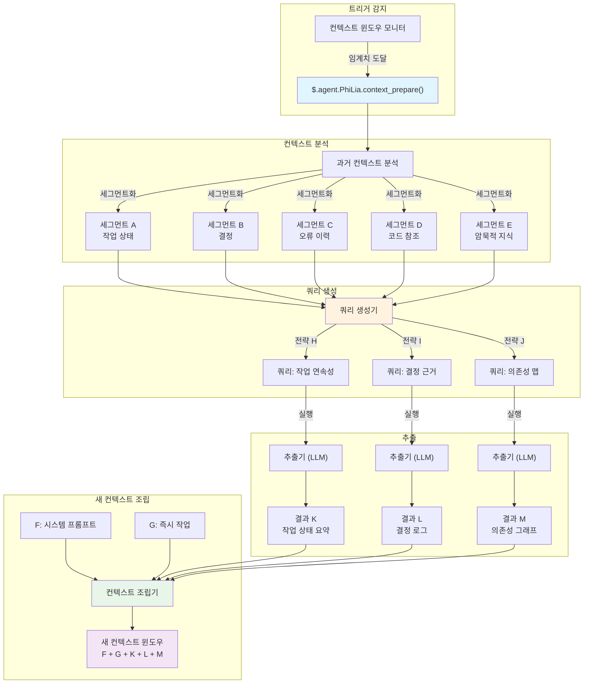
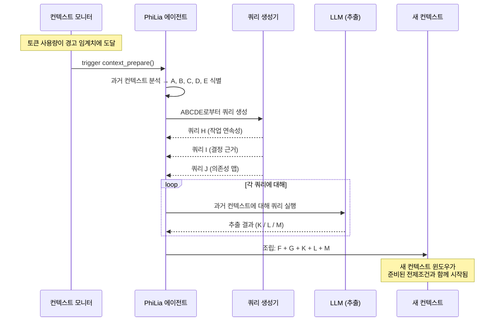

# 컨텍스트 준비 메커니즘

## 개요

컨텍스트 준비는 전통적인 컨텍스트 압축을 대체하는 능동적 추출 메커니즘입니다. 오래된 대화 이력을 손실 있게 압축하는 대신, 기존 컨텍스트를 분석하고 대상 쿼리를 생성하며, 새 컨텍스트 윈도우에 시드할 정보를 정밀하게 추출합니다. 이 메커니즘은 PhiLia 에이전트가 소유하며 `$.agent.PhiLia.context_prepare()`를 통해 노출됩니다.

## 문제 정의

### 컨텍스트 윈도우 한계

LLM 에이전트는 유한한 컨텍스트 윈도우 내에서 작동합니다. 장기 실행 작업 — 다중 파일 리팩터링, 수십 개의 메시지에 걸친 디버깅 세션, 복잡한 다단계 워크플로우 — 은 결국 사용 가능한 토큰 예산을 고갈시킵니다. 이 경우 시스템은 무엇을 보존하고 무엇을 폐기할지 결정해야 합니다.

### 압축은 세부사항을 손실시킴

전통적인 컨텍스트 압축 방식(요약, 잘라내기, 슬라이딩 윈도우)은 본질적으로 손실이 있습니다. 압축기는 *다음* 컨텍스트가 무엇을 필요로 할지 알지 못하므로 추측해야 합니다. 중요한 세부사항이 불가피하게 폐기됩니다:

- 변수명과 현재 값
- 중간 결정과 그 근거
- 발생하여 부분적으로 해결된 오류 상태
- 작업 간 암묵적 의존성

근본적인 결함: **압축은 관련성이 아닌 간결성을 위해 최적화됩니다**.

### 작업 간 간섭

컨텍스트 윈도우가 여러 작업이나 주제를 포함할 때, 한 작업의 이력을 압축하면 종종 다른 작업이 필요로 하는 정보가 손상됩니다. 작업 A의 상태를 보존하는 요약은 작업 B의 중요한 오류 체인을 흐릴 수 있습니다. 가능한 모든 미래 요구를 충족하는 보편적 압축 전략은 존재하지 않습니다.

### 진짜 질문

> *다음* 컨텍스트 윈도우는 *현재* 컨텍스트에서 무엇을 알아야 하는가?

이것은 압축 질문이 아닙니다. 이는 **정보 검색** 질문입니다 — 그리고 답은 이전에 있던 것이 아닌 다음에 올 것에 달려 있습니다.

## 핵심 개념

### 능동적 추출 vs. 압축

| 측면 | 압축 | 컨텍스트 준비 |
| --- | --- | --- |
| 방향 | 과거 → 더 짧은 과거 | 과거 → 미래 대비 추출물 |
| 미래에 대한 지식 | 없음 | 쿼리가 다가올 필요를 예측 |
| 정보 손실 | 불가피, 비대상적 | 대상적, 의도적 |
| 비유 | 파일 압축 | 데이터베이스 검색 |
| 품질 상한 | 요약 품질 | 추출 정밀도 |

컨텍스트 준비는 오래된 컨텍스트를 **데이터 소스**로 취급합니다 — RAG가 외부 문서 말뭉치를 다루는 방식과 유사하게 — 그러나 말뭉치는 대화 그 자체입니다. 모든 것을 요약으로 압축하는 대신, 오래된 컨텍스트에 대상 질문을 던지고 답을 수집합니다.

### ABCDE/KLM 모델

이 메커니즘은 문자 기반 표기법을 사용하여 정보 흐름을 기술합니다:

```text
과거 컨텍스트:  A + B + C + D + E
                     ↓ (분석)
쿼리:       ABCDE+H  ABCDE+I  ABCDE+J
                     ↓ (추출)
결과:            K        L        M
                     ↓ (조립)
새 컨텍스트:  F + G + K + L + M
```

- **A–E**: 과거 컨텍스트의 구별되는 세그먼트/측면 (작업 상태, 결정, 오류 이력, 코드 참조, 암묵적 지식)
- **H, I, J**: A–E의 핵심 요소 분석에서 파생된 쿼리 전략. 각 전략은 서로 다른 정보 요구 대상을 목표로 함
- **K, L, M**: 추출 결과 — 각 쿼리에 대한 정밀한 답변
- **F, G**: 새 윈도우를 위한 새 시스템 프롬프트와 즉시 작업 컨텍스트
- **새 컨텍스트**는 전체 A–E 이력을 건너뛰고 F + G (신규) + K + L + M (추출)을 받음

### 이것이 압축을 대체하는 이유

컨텍스트 준비가 존재하면, 다음과 같은 이유로 전통적인 압축은 불필요해집니다:

1. **추측으로 인한 정보 손실 없음** — 쿼리는 새 컨텍스트가 실제로 필요로 할 것에 기반하여 생성됨
1. **추출은 구조적으로 결정적** — 동일한 쿼리 전략이 항상 동일한 답변 범주를 생성
1. **다중 각도가 커버리지 보장** — H/I/J 쿼리가 서로 다른 차원(작업 상태, 오류 컨텍스트, 결정 근거)을 커버
1. **과거 컨텍스트는 접근 가능한 상태로 유지** — 폐기되지 않고 준비 단계 동안 *필요 시 쿼리*됨

## 아키텍처

### 상위 수준 흐름



### 시퀀스 다이어그램



## API 설계

### `$.agent.PhiLia.context_prepare()`

주 진입점. 컨텍스트 윈도우 모니터가 토큰 사용량이 경고 임계치에 도달했음을 감지할 때 호출됩니다.

```typescript
interface ContextPrepareRequest {
    old_context: string;
    current_task: string;
    warning_threshold: number;
    current_usage: number;
    max_tokens: number;
}

interface ContextPrepareResult {
    segments: ContextSegment[];
    queries: GeneratedQuery[];
    extractions: ExtractionResult[];
    prepared_context: string;
    metadata: {
        old_context_tokens: number;
        prepared_context_tokens: number;
        compression_ratio: number;
        queries_executed: number;
        extraction_time_ms: number;
    };
}

// PhiLia API 엔드포인트
$.agent.PhiLia.context_prepare(request: ContextPrepareRequest): ContextPrepareResult
```

### `$.agent.PhiLia.context_query()`

컨텍스트에 대해 개별 쿼리를 실행하기 위한 하위 수준 API. `context_prepare()`에 의해 내부적으로 사용되지만, 임시 쿼리에도 사용 가능합니다.

```typescript
interface ContextQueryRequest {
    context: string;
    query: string;
    strategy: "task_continuity" | "decision_rationale" | "dependency_map" | "custom";
    max_result_tokens: number;
}

interface ContextQueryResult {
    result: string;
    confidence: number;
    source_segments: string[];
    tokens_used: number;
}

$.agent.PhiLia.context_query(request: ContextQueryRequest): ContextQueryResult
```

### `$.agent.PhiLia.context_segment()`

컨텍스트를 분석하고 레이블된 세그먼트(A–E)로 분해합니다.

```typescript
interface SegmentRequest {
    context: string;
    max_segments: number;
}

interface Segment {
    id: string;           // "A", "B", "C" 등
    label: string;        // "작업 상태", "결정" 등
    content: string;
    token_count: number;
    importance_rank: number;
}

$.agent.PhiLia.context_segment(request: SegmentRequest): Segment[]
```

## 쿼리 전략

### H/I/J 쿼리 생성 방식

쿼리 생성 프로세스는 세그먼트화된 과거 컨텍스트(A–E)를 가져와 세 가지 범주의 쿼리를 생성하며, 각각은 새 컨텍스트가 필요로 하는 정보의 서로 다른 차원을 대상으로 합니다.

### 전략 H: 작업 연속성

**목적**: 새 컨텍스트가 진행 상황 손실 없이 현재 작업을 재개할 수 있도록 보장.

**생성 로직**:

1. 세그먼트 A와 E에서 활성 작업 식별 (작업 상태 + 암묵적 지식)
1. 현재 진행 지표 추출 (완료된 것, 진행 중인 것, 차단된 것)
1. 다음을 묻는 쿼리 생성: *"모든 활성 작업의 현재 상태와 다음 단계는 무엇인가?"*

**예시 쿼리**:

```text
주어진 대화 이력에서 식별하시오:
1. 현재 진행 중인 모든 작업과 완료 상태
2. 차단 요소나 해결되지 않은 오류
3. 취하려고 했던 정확한 다음 단계
4. 현재 수정 중인 파일 경로와 줄 번호
```

### 전략 I: 결정 근거

**목적**: *무엇*이 아닌 결정의 *이유* 보존.

**생성 로직**:

1. 세그먼트 B와 C에서 선택 지점 검색 (결정 + 오류 이력)
1. 대안이 고려되고 거부된 결정 식별
1. 다음을 묻는 쿼리 생성: *"어떤 결정이 내려졌고, 어떤 대안이 거부되었으며, 그 이유는 무엇인가?"*

**예시 쿼리**:

```text
이 대화에서 추출하시오:
1. 내려진 모든 아키텍처 또는 구현 결정
2. 각 결정에 대해: 고려된 대안
3. 각 결정에 대해: 선택된 접근 방식이 선호된 구체적 이유
4. 이러한 선택에 영향을 미친 제약 조건이나 요구사항
```

### 전략 J: 의존성 맵

**목적**: 코드 요소, 파일, 개념 간 관계 포착.

**생성 로직**:

1. 세그먼트 D와 E에서 엔터티 관계 검색 (코드 참조 + 암묵적 지식)
1. 어떤 파일이 어떤 것에 의존하는지, 어떤 함수가 어떤 것을 호출하는지, 어떤 개념이 관련되는지 매핑
1. 다음을 묻는 쿼리 생성: *"논의된 엔터티 간 핵심 의존성과 관계는 무엇인가?"*

**예시 쿼리**:

```text
대화를 분석하고 매핑하시오:
1. 언급된 모든 파일/모듈과 그 관계
2. 논의되거나 수정된 함수 호출 체인
3. 컴포넌트 간 데이터 흐름
4. 구성 값과 사용 위치
5. 직접 언급되지 않았지만 작업에 의해 암시된 암묵적 의존성
```

### 확장성

세 가지 전략(H, I, J)이 기본 세트입니다. 시스템은 사용자 정의 전략을 지원합니다:

```typescript
interface QueryStrategy {
    id: string;
    name: string;
    description: string;
    source_segments: string[];     // 분석할 세그먼트
    query_template: string;        // {segment_X} 플레이스홀더가 있는 템플릿
    priority: number;              // 실행 우선순위
    max_result_tokens: number;
}
```

새 전략은 구성을 통해 등록할 수 있으며, 도메인별 추출 패턴을 허용합니다.

## 통합 지점

### 컨텍스트 윈도우 모니터

컨텍스트 준비의 트리거는 컨텍스트 윈도우 모니터링 서브시스템에 존재합니다. 토큰 사용량이 경고 임계치(기본값: 최대의 80%)를 초과하면, 모니터가 `$.agent.PhiLia.context_prepare()`를 호출합니다.

```rust
// 컨텍스트 윈도우 모니터 내 (개념적)
fn check_context_health(&mut self) {
    let usage_ratio = self.current_tokens as f64 / self.max_tokens as f64;
    if usage_ratio >= self.warning_threshold {
        let result = philia.context_prepare(ContextPrepareRequest {
            old_context: self.get_full_context(),
            current_task: self.get_current_task_description(),
            warning_threshold: self.warning_threshold,
            current_usage: self.current_tokens,
            max_tokens: self.max_tokens,
        });
        self.spawn_new_context(result.prepared_context);
    }
}
```

### skill_chain.rs 통합

스킬 체인 실행기는 컨텍스트 준비를 인식해야 합니다. 스킬 체인이 여러 컨텍스트 윈도우에 걸칠 때, 준비 메커니즘은 다음을 보장합니다:

1. 스킬 체인 상태가 세그먼트 A (작업 상태)에 포착됨
1. 현재 스킬의 입력/출력이 세그먼트 D (코드 참조)에 포착됨
1. 체인의 남은 단계가 추출 결과 K (작업 연속성)에 보존됨

```rust
// skill_chain.rs (개념적 통합)
impl SkillChainExecutor {
    fn execute_step(&mut self, step: ChainStep) -> Result<StepResult> {
        // 실행 전 컨텍스트 준비 필요 여부 확인
        if self.context_monitor.should_prepare() {
            let prepared = self.philia.context_prepare(
                self.build_prepare_request()
            )?;
            self.context = prepared.prepared_context;
        }
        // 단계 실행 계속
        self.execute_with_context(step, &self.context)
    }
}
```

### PhiLia 에이전트 소유권

컨텍스트 준비는 PhiLia 소유 기능입니다. 이는 다음을 의미합니다:

- `$.agent.PhiLia.context_prepare()` API가 PhiLia 스킬로 등록됨
- PhiLia가 쿼리 생성 템플릿과 추출 전략을 관리
- 다른 에이전트는 표준 스킬 호출 프로토콜을 통해 PhiLia에 컨텍스트 준비 요청
- PhiLia는 지식 저장소를 활용하여 역사적 패턴으로 쿼리 풍부화 가능

### 컨텍스트 스포닝

시스템이 새 컨텍스트 윈도우를 스폰할 때, 준비된 컨텍스트(F + G + K + L + M)가 전통적인 압축 요약을 대체합니다:

```rust
fn spawn_new_context(&mut self, prepared: ContextPrepareResult) {
    let system_prompt = self.build_system_prompt();      // F
    let immediate_task = self.get_current_task();         // G
    let new_context = format!(
        "{}\n\n{}\n\n---\n## 컨텍스트 준비 결과\n### 작업 상태\n{}\n### 결정 로그\n{}\n### 의존성\n{}\n",
        system_prompt,    // F
        immediate_task,   // G
        prepared.extractions[0].result,  // K
        prepared.extractions[1].result,  // L
        prepared.extractions[2].result,  // M
    );
    self.launch_context(new_context);
}
```

## 구현 단계

### 1단계: 기초 (MVP)

- `$.agent.PhiLia.context_segment()` 구현 — 컨텍스트 분석 및 세그먼트화
- 세 가지 기본 쿼리 전략 구현 (H: 작업 연속성, I: 결정 근거, J: 의존성 맵)
- `$.agent.PhiLia.context_prepare()` 구현 — segment → query → extract → assemble 오케스트레이션
- 컨텍스트 윈도우 모니터 트리거와 통합
- 단일 작업 대화로 검증

### 2단계: 견고성

- 추출 결과에 신뢰도 점수 추가
- 추출 신뢰도가 낮을 때의 대체 전략 구현
- 대규모 컨텍스트에 대한 스트리밍 지원 추가
- 성능 최적화: 병렬 쿼리 실행
- 임시 쿼리를 위한 `$.agent.PhiLia.context_query()` 추가

### 3단계: 지능

- 역사적 준비 결과로부터 최적 쿼리 전략 학습
- 작업 유형에 따른 적응적 세그먼트 가중치
- 교차 컨텍스트 참조 해석 (여러 스폰에 걸친 준비 결과 연결)
- 장기 보존을 위한 메모리 침전과 통합

### 4단계: 완전 대체

- 레거시 컨텍스트 압축 코드 경로 제거
- 컨텍스트 준비가 컨텍스트 전환의 유일한 메커니즘이 됨
- 완전한 원격 측정 및 품질 지표
- 사용자 정의 에이전트를 위한 문서화 및 마이그레이션 가이드

## 예시

### 예시 1: 다중 파일 리팩터링

**시나리오**: 에이전트가 Rust crate를 리팩터링하며, 3개 모듈에 걸쳐 15개 파일을 수정 중. 파일 10 수정 후 컨텍스트 윈도우가 가득 참.

**과거 컨텍스트 (A–E)**:

- **A** (작업 상태): 10/15 파일 수정됨, `auth` 및 `storage` 모듈 완료, `api` 진행 중
- **B** (결정): 열거형 디스패치 대신 트레이트 기반 추상화 선택; `#[deprecated]`로 하위 호환성 유지
- **C** (오류): `storage/mod.rs:142`에서 라이프타임 이슈 발생, `Arc<Mutex<>>`로 해결
- **D** (코드 참조): `auth/traits.rs`, `storage/mod.rs:142`, `api/handler.rs:38-56`
- **E** (암묵적): `User` 구조체는 하위 크레이트를 위해 `Clone` 유지 필요; 테스트 커버리지 추적 중

**생성된 쿼리**:

- **H** (작업 연속성): "수정이 남은 파일은 무엇이며, 적용 중인 패턴은 무엇이고, 리팩터링할 다음 파일은 무엇인가?"
- **I** (결정 근거): "열거형 디스패치 대신 트레이트 기반 추상화가 선택된 이유와 어떤 하위 호환성 제약이 존재하는가?"
- **J** (의존성 맵): "모듈 경계를 넘나드는 구조체/트레이트에 주목하여 `auth`, `storage`, `api` 모듈 간 의존성을 매핑하시오."

**추출 결과 (K, L, M)**는 새 시스템 프롬프트(F)와 다음 작업 지시(G)와 함께 조립됩니다.

### 예시 2: 디버깅 세션

**시나리오**: 여러 가설과 테스트 시도에 걸친 WebSocket 연결 문제 디버깅.

**과거 컨텍스트 (A–E)**:

- **A** (작업 상태): 이슈가 핸드셰이크 단계로 좁혀짐; 하트비트는 원인 아님
- **B** (결정): TLS 오설정 배제; 프록시 간섭 배제; 현재 가설은 헤더 순서
- **C** (오류): 3초 지점 `ConnectionReset`, curl로는 일관되게 재현되나 브라우저로는 아님
- **D** (코드 참조): `ws/handshake.rs:67-89`, `headers/mod.rs:23`, 테스트 파일 `tests/ws_test.rs`
- **E** (암묵적): 서버가 nginx 뒤에 있음; 이슈가 로컬 개발이 아닌 프로덕션에서만 발생

**생성된 쿼리**는 디버깅 상태, 배제된 가설, 남은 조사 경로를 새 컨텍스트로 추출합니다.

### 예시 3: 교차 에이전트 스킬 체인

**시나리오**: PhiLia가 작업 체인을 Skemma(스키마 설계)에 이어 Logos(문서화)에 위임. Logos 작업 중 컨텍스트가 가득 참.

**과거 컨텍스트 (A–E)**:

- **A** (작업 상태): 스키마 설계 완료, 문서화 60% 완료
- **B** (결정): PhiLia의 아키텍처 지침에 따라 스키마가 M:N 관계에 접합 테이블 사용
- **C** (오류): Skemma가 `user_roles` 카디널리티 모호성 보고, `UNIQUE` 제약 추가로 해결
- **D** (코드 참조): `schema.sql:45-67`, `docs/api/endpoints.md:12-34`
- **E** (암묵적): 문서화는 프로젝트 전반에서 사용되는 OpenAPI 3.0 명세 형식을 준수해야 함

준비는 Logos의 새 컨텍스트가 전체 Skemma 설계 대화 없이도 스키마 결정과 문서화 형식 제약을 받도록 보장합니다.
