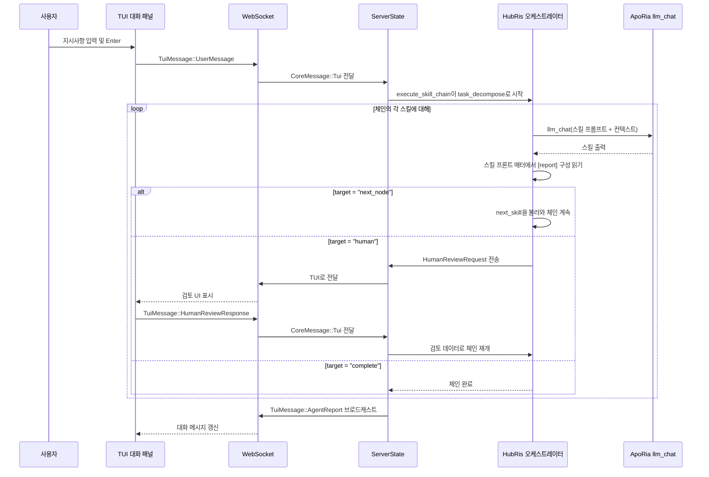

# 대화 오케스트레이션 설계 (HubRis + ApoRia)

## 배경

HubRis는 "순수 스킬 에이전트(Pure Skill Agent)"입니다 — 모든 기능은
ApoRia `llm_chat`을 통해 호출되는 프롬프트 전용 스킬입니다. 보고서 라우팅
레이어 구현 후, 스킬은 `[report]` 섹션을 통해 TOML 프론트 매터에 라우팅
동작을 선언하여 하드코딩된 오케스트레이션 로직을 대체합니다.

## 목표

1. 스킬이 프론트 매터에 라우팅 동작을 선언 (하드코딩이 아님).
1. 제네릭 스킬 체인 실행기가 하드코딩된 2단계 파이프라인을 대체.
1. 인간 검토가 일급 라우팅 대상이 됨.
1. 프롬프트 언어 정리: 스킬/MCP 플랫 파일은 영어 전용.

## 스킬 보고서 구성 (TOML 프론트 매터)

```toml
[report]
target = "next_node"              # "next_node" | "parent" | "human" | "complete"
next_skill = "workplan_generate"  # target = "next_node"인 경우 필수
```

## HubRis 스킬 체인

```text
task_decompose → workplan_generate → operator → workplan_execute → submit_report → human
```

## 종단 간 흐름



## 보고서 라우팅 대상

| 대상         | 동작                                                              |
| --- | --- |
| `next_node`  | 실행기가 `next_skill`에 명명된 스킬을 불러와 실행.                   |
| `parent`     | 제어를 부모 오케스트레이터에 반환 (중첩 체인용으로 예약).             |
| `human`      | 체인을 일시 중지, `HumanReviewRequest`를 TUI로 전송, `HumanReviewResponse`에 재개. |
| `complete`   | 체인을 종료하고 누적된 `AgentReport` 반환.                           |

## 파일 구조 (1단계)

```text
res/prompts/agents/hubris/skills/
  task_decompose.md
  workplan_generate.md
  operator.md
  workplan_execute.md
  submit_report.md
```

각 파일은 TOML 프론트 매터에 `[report]` 섹션과 기타 스킬 메타데이터를
포함하는 평면 Markdown 문서이며, 영어 전용입니다.

## 인간 언어 구성

에이전트 런타임 구성에는 네이티브 언어명(예: `"中文"`, `"English"`,
`"日本語"`)을 사용하는 `human_language` 필드가 포함됩니다. 이는 영어 전용
스킬 프롬프트 파일에 영향을 주지 않고 모든 사용자 대상 출력의 언어를 제어합니다.

## 기본 모델 정책

시작 시 `glm-4.7-flash`를 정규화된 환경 기본 모델로 사용합니다.
ApoRia `llm_chat`은 개발 및 테스트 비용을 낮게 유지하기 위해 기본적으로
해당 모델을 사용합니다.

## 실패 대체 정책

1. 스킬 실패 시: 실패 메시지를 반환하고 현재 체인 종료.
1. ApoRia 오프라인 시: `Agent not ready` 메시지 반환.
1. 인간 검토 시간 초과 시: 후속 채팅을 차단하지 않고 시간 초과 알림 반환.
