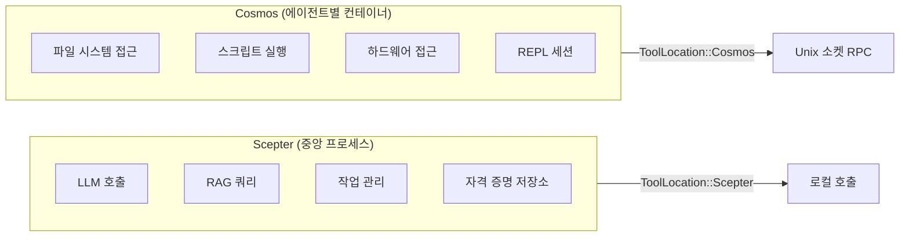
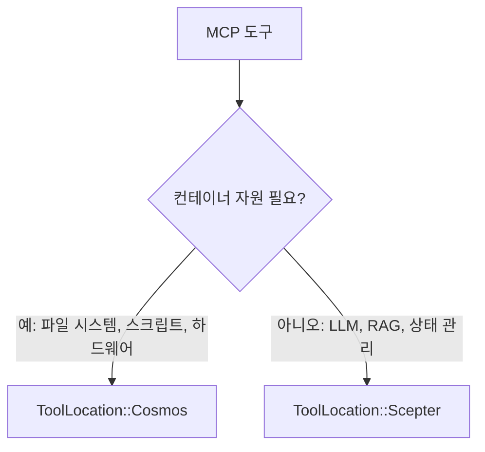
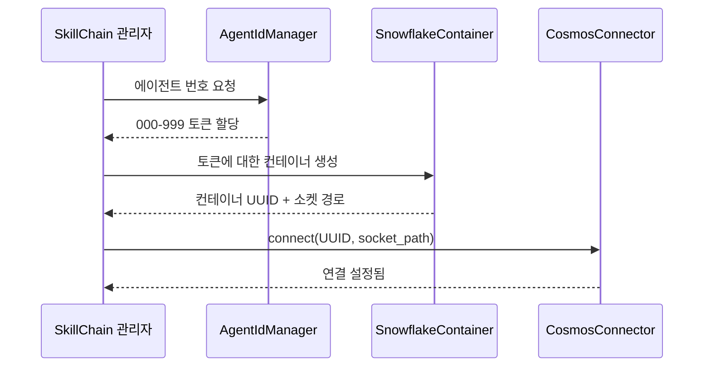
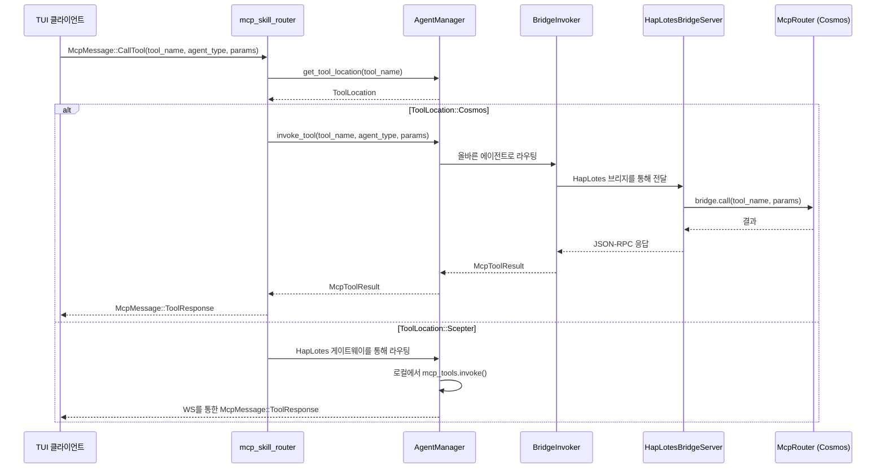
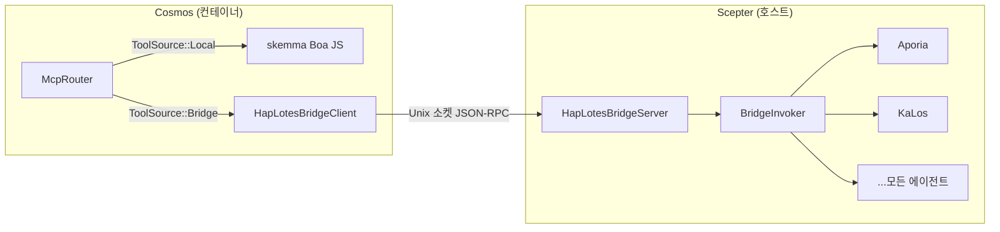
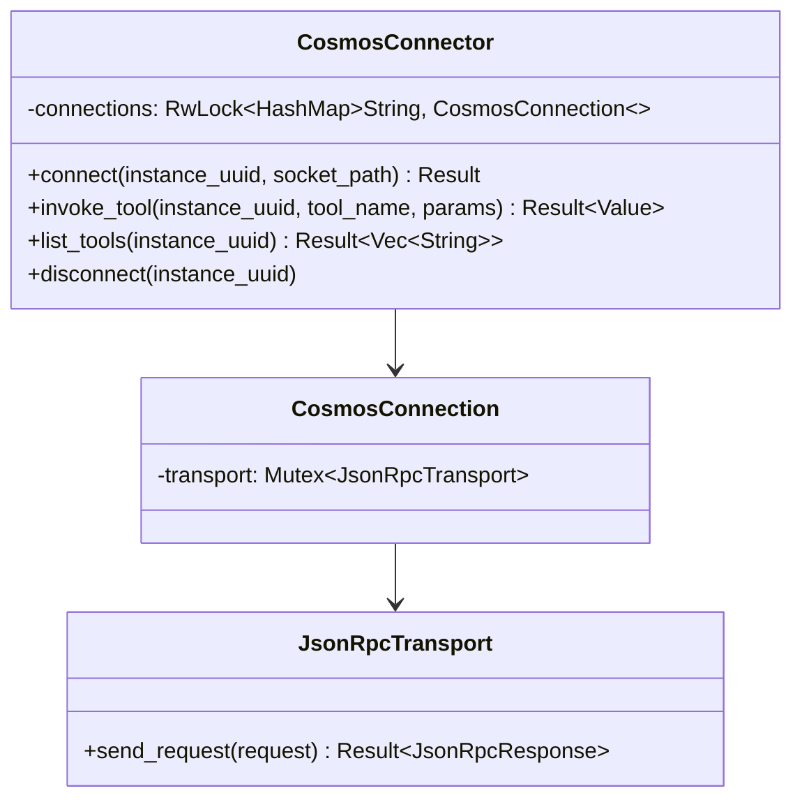
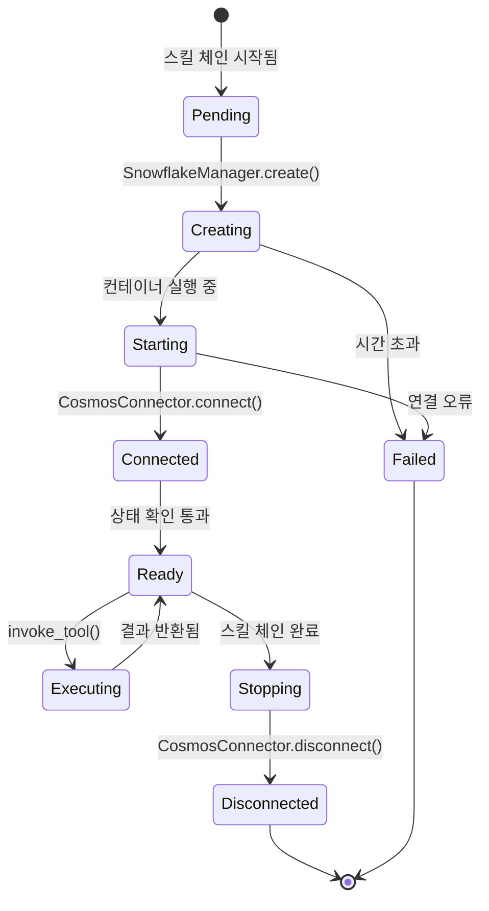
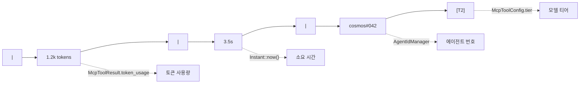
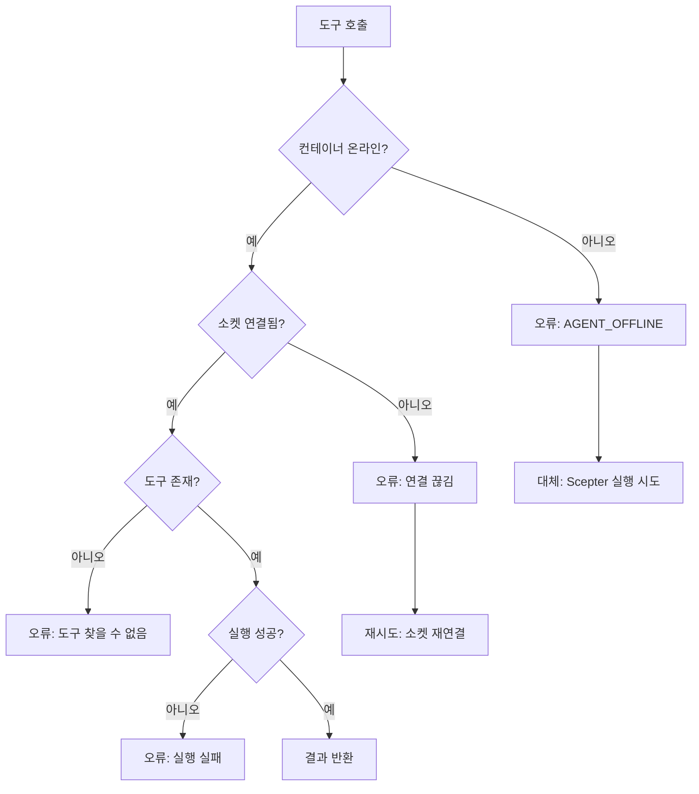

# Cosmos 컨테이너 스케줄링 및 토큰 라우팅 설계

## 개요

본 문서는 Cosmos 컨테이너 스케줄링 아키텍처를 기술합니다: `ToolLocation::Cosmos`로 표시된 MCP 도구가 Unix 소켓 JSON-RPC를 통해 해당 컨테이너로 라우팅되는 방식과, 토큰(에이전트 번호) 시스템이 컨테이너 식별 및 라우팅과 어떻게 연결되는지를 설명합니다.

## I. 도구 위치 모델

### 이중 실행 환경



### ToolLocation 열거형

| 변형 | 실행 위치 | 전송 방식 |
| --- | --- | --- |
| `Scepter` (기본값) | `McpToolInvoker`를 통한 프로세스 내 | 직접 함수 호출 |
| `Cosmos` | `CosmosConnector`를 통한 컨테이너 내 | Unix 소켓 JSON-RPC |

### 위치 결정 기준



컨테이너 자원(파일 시스템, 스크립트 실행, 하드웨어 접근)이 필요한 도구는 `Cosmos`로 표시됩니다. 중앙 집중식 서비스(LLM, RAG, 작업 관리, 인간 상호작용)는 `Scepter`에 남습니다.

## II. 토큰 시스템과 컨테이너 식별

### 에이전트 번호 할당



### 토큰 속성

| 속성 | 설명 |
| --- | --- |
| 형식 | 세 자리 숫자: `000`-`999` |
| 할당기 | 스킬 체인의 `AgentIdManager` |
| 바인딩 | 스킬 체인 패널당 하나의 토큰 |
| 표시 | TUI 통계 줄에 `cosmos#NNN`으로 표시 |
| 영속성 | 에이전트 재시작 간에도 유지 |

## III. 요청 라우팅 흐름

### TUI 발생 MCP 호출



### 핵심 라우팅 로직

라우팅 결정은 `mcp_skill_router.rs`에서 발생합니다:

1. `agent_manager.get_tool_location(tool_name)` 확인
1. `ToolLocation::Cosmos`이고 컨테이너화 모드 활성 시:

   - `agent_manager.invoke_tool()`을 호출하여 `BridgeInvoker` → HapLotes 브리지 → Cosmos의 `McpRouter`로 라우팅
   - Cosmos의 `McpRouter`가 로컬(skemma)로 디스패치하거나 원격 에이전트를 위해 브리지를 통해 Scepter로 다시 디스패치
   - `McpMessage::ToolResponse`를 TUI로 직접 반환

1. 그렇지 않으면: HapLotes 게이트웨이를 통해 에이전트 프로세스로 라우팅

## IV. CosmosConnector / 브리지 아키텍처

### HapLotes 브리지 (현재)

HapLotes 브리지는 Scepter와 Cosmos 컨테이너 간 **유일한 통신 채널**입니다.



### 연결 풀 (CosmosConnector — Scepter 측)



### JSON-RPC 프로토콜

모든 메서드명은 컴파일 타임 타입 안전성을 위해 `UnixMethod` 열거형을 사용합니다:

| UnixMethod 변형 | 방향 | 매개변수 |
| --- | --- | --- |
| `UnixMethod::McpCall` | Scepter → Cosmos | `{ tool_name, parameters }` |
| `UnixMethod::McpListTools` | Scepter → Cosmos | 없음 |
| `UnixMethod::ReplSnapshot` | Scepter → Cosmos | `{ path }` |
| `UnixMethod::ReplRestore` | Scepter → Cosmos | `{ path }` |
| `UnixMethod::BridgeCall` | Cosmos → Scepter | `{ tool_name, parameters }` |
| `UnixMethod::BridgeListTools` | Cosmos → Scepter | 없음 |

### 응답 형식

```json
{
  "success": true,
  "data": { ... },
  "error": null
}
```

## V. 컨테이너 생명주기



### 컨테이너 에이전트

Cosmos 컨테이너 내부에서는 skemma만 로컬로 실행됩니다(Boa JS 엔진). 다른 모든 에이전트 도구는 HapLotes 브리지를 통해 Scepter로 다시 라우팅됩니다:

| 에이전트 | 역할 | Cosmos 내? |
| --- | --- | --- |
| SkeMma | 스크립트 실행 (Boa JS) | **로컬** (인프로세스) |
| Aporia | LLM 채팅 | 브리지 → Scepter 통해 |
| KaLos | 파일 I/O | 브리지 → Scepter 통해 |
| NeiKos | 컨테이너 관리 | 브리지 → Scepter 통해 |
| EleOs | 웹 검색 | 브리지 → Scepter 통해 |
| 기타 모두 | 다양함 | 브리지 → Scepter 통해 |

## VI. 통계 줄 통합

### 표시 형식

TUI AgentDetailPage에서 통계 줄은 다음을 표시합니다:



| 세그먼트 | 출처 |
| --- | --- |
| `1.2k tokens` | `McpToolResult.token_usage` |
| `3.5s` | `Instant::now()`로부터의 소요 시간 |
| `cosmos#042` | `AgentIdManager`의 에이전트 번호 |
| `[T2]` | `McpToolConfig.tier`의 모델 티어 |

## VII. 오류 처리

### 실패 모드



### 점진적 성능 저하

컨테이너를 사용할 수 없는 경우, 도구에 로컬 구현이 등록되어 있으면 시스템이 선택적으로 `Scepter`-로컬 실행으로 대체할 수 있습니다.

## VIII. 향후 확장

| 기능 | 설명 | 우선순위 |
| --- | --- | --- |
| 컨테이너 풀링 | 스킬 체인 간 컨테이너 재사용 | 중간 |
| 상태 모니터링 | 주기적 컨테이너 상태 확인 | 높음 |
| 자원 제한 | 컨테이너별 CPU/메모리 제한 | 높음 |
| 다중 컨테이너 도구 | 여러 컨테이너에 걸친 도구 | 낮음 |
| 컨테이너 마이그레이션 | 호스트 간 실행 중인 컨테이너 이동 | 낮음 |
