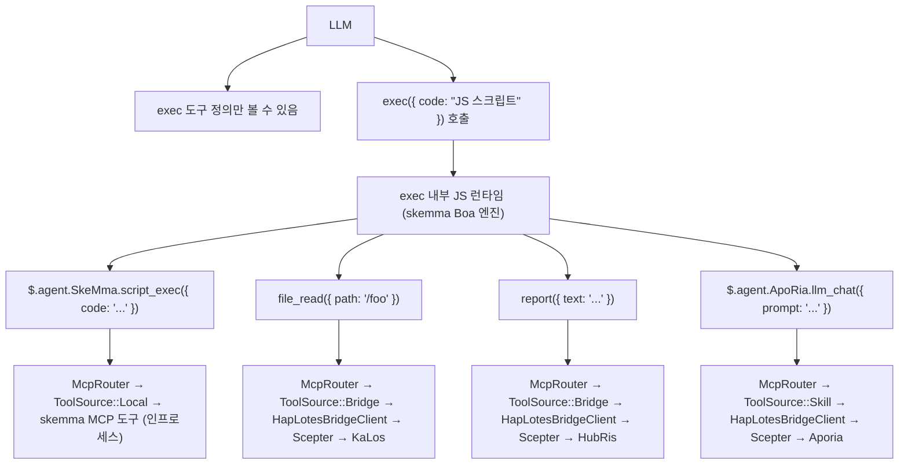
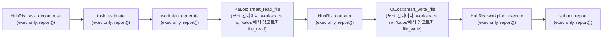
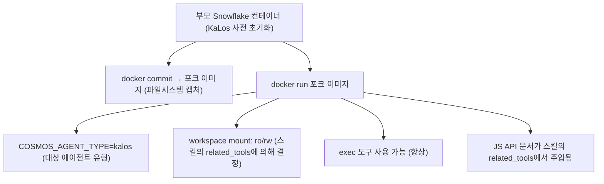

# 크로스 에이전트 스킬 라우팅 아키텍처

## 문제

스킬 체인(`execute_skill_chain`)은 exec-only 마이크로커널 아키텍처를 사용합니다. LLM은 `exec`, `write_to_var`, `write_to_var_json`의 세 가지 도구만 볼 뿐, 에이전트별 도구 화이트리스트나 스킬별 도구 정의가 없습니다. 모든 MCP 도구 호출은 ES 모듈 임포트와 `file_read()`와 같은 크로스 에이전트 TS API를 통해 TypeScript 런타임(IEPL 엔진) 내부에서 발생합니다.

## 설계 원칙

1. **Exec-only 마이크로커널** — LLM은 MCP 도구 정의를 직접 받지 않습니다. `exec`, `write_to_var`, `write_to_var_json` 세 가지 도구만 가집니다. 모든 도구 호출은 IEPL 엔진의 TS 런타임 내부에서 발생합니다.
1. **`related_tools`가 모든 것을 주도** — 스킬은 TOML 프론트매터에 `related_tools`를 선언합니다. 이 이름들은 LLM 프롬프트에 주입되는 TS API 문서가 됩니다(예: `file_read()`, `report()`).
1. **TS API → McpRouter를 통한 라우팅** — `exec`의 IEPL 런타임 내부에서, ES 모듈 임포트가 `McpRouter`를 통해 올바른 MCP 도구 구현으로 라우팅됩니다. `file_read()`와 같은 크로스 에이전트 호출은 KaLos 에이전트의 `file_read` 구현으로 해석됩니다.
1. **컨테이너 격리** — 자식 컨테이너가 `docker commit` 포크를 통해 부모 파일시스템을 상속받습니다. 워크스페이스는 스킬의 `related_tools`에 기반하여 읽기 전용 또는 읽기-쓰기로 마운트됩니다.
1. **`related_tools`가 읽기/쓰기 모드 결정** — `skill_needs_write_access()`가 포크 컨테이너의 마운트 모드를 결정하기 위해 쓰기 도구명(`file_write`, `file_edit` 등)에 대해 `related_tools`를 검사합니다.

## 아키텍처

### Exec-Only 마이크로커널 흐름



### 스킬 체인 실행 흐름



### 컨테이너 포크 메커니즘



## 구현 세부사항

### 핵심 컴포넌트

| 컴포넌트 | 파일 | 책임 |
| --- | --- | --- |
| `skill_to_agent_name()` | `skill_chain.rs` | 주어진 스킬을 소유한 에이전트명 조회 |
| `skill_needs_write_access()` | `skill_chain.rs` | 포크 컨테이너 마운트 모드 결정을 위해 쓰기 도구명에 대해 `related_tools` 검사 |
| `fork_for_sub_skill()` | `snowflake_manager.rs` | `docker commit` + `docker run` 수행; `skill_needs_write_access()`에 따라 워크스페이스를 ro/rw로 마운트 |
| `find_by_agent_type()` | `snowflake_manager.rs` | 역순 검색, 가장 최근 포크 컨테이너 반환 |
| `McpRouter` | `packages/cosmos/src/bin/cosmos/mcp_router.rs` | ES 모듈 임포트 호출 라우팅: `ToolSource::Local` → skemma, `ToolSource::Bridge` → HapLotes |
| `HapLotesBridgeClient` | `packages/agents/haplotes/src/bridge/client.rs` | Cosmos → Scepter 브리지: `bridge_call()`, `bridge_list_tools()` |
| `BridgeInvoker` | `packages/scepter/src/agent_manager/bridge_invoker.rs` | Scepter 측: 도구 호출을 올바른 등록된 에이전트로 라우팅 |
| `build_js_api_docs()` | `skill_chain.rs` | 프롬프트 주입을 위해 스킬의 `related_tools`에서 JS API 문서 생성 |
| `build_skill_user_prompt(agent_name, ...)` | `skill_chain.rs` | 주입된 JS API 문서와 함께 스킬 프롬프트 조립 |

### JS API 문서 생성 방식

스킬의 TOML 프론트매터가 `related_tools`를 선언합니다:

```toml
# smart_read_file.md
related_tools = ["file_read", "file_list", "file_exists"]
```

시스템이 각 도구를 소유 에이전트로 해석하고 `.d.ts` 선언에서 TS API 문서를 생성합니다:

```typescript
// 사용 가능한 API로 LLM 프롬프트에 주입됨 (.d.ts의 타입 선언 포함):
file_read({ path: string }): Promise<string>
file_list({ dir: string }): Promise<string[]>
file_exists({ path: string }): Promise<boolean>
report({ text: string }): Promise<void>
```

LLM은 `exec` 코드 내부에서 이 API를 호출합니다; McpRouter가 올바른 에이전트의 MCP 도구 구현으로 디스패치합니다.

### 포크 생명주기

1. **생성**: `docker commit` 부모 컨테이너 → 포크 이미지 → `docker run` 자식 컨테이너
1. **연결**: CosmosConnector가 자식 컨테이너의 Unix 소켓에 연결
1. **브리지**: 포크 컨테이너 내부의 HapLotesBridgeClient가 Scepter의 HapLotesBridgeServer에 연결
1. **실행**: LLM이 JS 코드로 `exec` 호출; JS 런타임이 McpRouter → 브리지 → Scepter 에이전트 사용
1. **정리**: 체인 종료 시 `snowflake.remove()`가 컨테이너 파괴 + `docker rmi`가 이미지 정리

### 워크스페이스 마운트 전략

| 스킬 유형 | `related_tools` 특성 | 워크스페이스 마운트 |
| --- | --- | --- |
| 읽기 전용 (smart_read_file) | file_read, file_list, file_exists만 | `:ro` (읽기 전용) |
| 쓰기 (smart_write_file) | file_write, file_edit, file_delete 포함 | `:rw` (읽기-쓰기) |

### 크로스 에이전트 도구 라우팅

`exec`의 JS 런타임 내부에서, McpRouter가 HapLotes 브리지를 통해 도구 호출을 해석합니다:

```mermaid
flowchart TB
    subgraph Bridge["브리지 호출"]
        A1["exec({ code: &quot;file_read({path:'/foo'})&quot; })"] --> B1["McpRouter가 &quot;kalos&quot; + &quot;file_read&quot; 해석"]
        B1 --> C1["tool_to_source → ToolSource::Bridge"]
        C1 --> D1["HapLotesBridgeClient → bridge.call(&quot;kalos.file_read&quot;, params)"]
        D1 --> E1["Scepter의 HapLotesBridgeServer → BridgeInvoker"]
        E1 --> F1["KaLos 에이전트 → file_read MCP 도구로 라우팅"]
    end
    subgraph Local["로컬 호출"]
        A2["exec({ code: &quot;$.agent.SkeMma.script_exec({code:'1+1'})&quot; })"] --> B2["McpRouter가 &quot;skemma&quot; + &quot;script_exec&quot; 해석"]
        B2 --> C2["tool_to_source → ToolSource::Local"]
        C2 --> D2["skemma MCP 도구 직접 호출 (인프로세스 Boa 엔진)"]
    end
```



### 쓰기 접근 감지

```rust
fn skill_needs_write_access(skill: &Skill) -> bool {
    const WRITE_TOOLS: &[&str] = &["file_write", "file_edit", "file_delete", "file_rename"];
    skill.related_tools.iter().any(|t| WRITE_TOOLS.contains(&t.as_str()))
}
```

이 함수는 스킬의 TOML 프론트매터에서 `related_tools`를 읽습니다. 쓰기 도구가 하나라도 있으면, 포크 컨테이너의 워크스페이스가 읽기-쓰기로 마운트됩니다.

## 구성

### 스킬 TOML 프론트매터

```toml
# smart_read_file.md
+++
related_tools = ["file_read", "file_list", "file_exists"]

[[next_action]]
agent = "hubris"
name = "operator"
+++

# smart_write_file.md
+++
related_tools = ["file_write", "file_edit"]

[[next_action]]
agent = "hubris"
name = "workplan_execute"
+++
```

### next_action 체인 (스킬 TOML)

```toml
# workplan_generate.md
[[next_action]]
agent = "kalos"
name = "smart_read_file"

# smart_read_file.md
[[next_action]]
agent = "hubris"
name = "operator"

# operator.md
[[next_action]]
agent = "kalos"
name = "smart_write_file"

# smart_write_file.md
[[next_action]]
agent = "hubris"
name = "workplan_execute"
```

## 스킬 JS API 참조

| 스킬 | 에이전트 | JS API (`related_tools`에서) | 상태 |
| --- | --- | --- | --- |
| `smart_read_file` | KaLos | `file_read()`, `file_list()`, `file_exists()` | ✅ 구현됨 |
| `smart_write_file` | KaLos | `file_write()`, `file_edit()` | ✅ 구현됨 |
| `exec_script` | SkeMma | `$skeMma.script_exec()` | 보류 |
| `smart_command` | SkoPeo | `$skoPeo.smart_command_execute()` | 보류 |

## 위험 및 고려사항

1. **컨테이너 자원** — 각 포크가 새 Docker 컨테이너를 생성; 체인 종료 시 컨테이너가 자동으로 정리됨.
1. **토큰 비용** — 각 포크가 자체 독립 LLM 컨텍스트를 가짐; JS API 문서가 스킬당 적당한 오버헤드 추가.
1. **포크 체인 깊이** — 현재 깊이 제한 없음; `step_index > 1`일 때만 포크 발생.
1. **컨텍스트 전달** — 부모 → 자식이 보고서 콘텐츠를 통해 전달; 잘라내기 전략이 필요할 수 있음.
1. **병렬 안전성** — 여러 체인이 동일한 에이전트 유형을 동시에 포크할 때, 역순 검색이 각자가 최신 포크를 사용하도록 보장.
1. **API 표면 제어** — LLM은 주입된 문서에 나열된 JS API만 호출 가능; McpRouter가 알 수 없는 도구명 거부.
