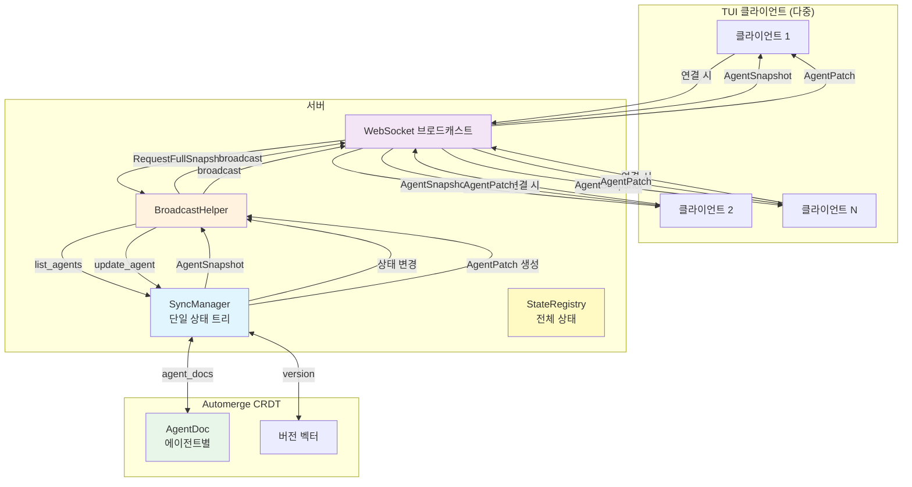
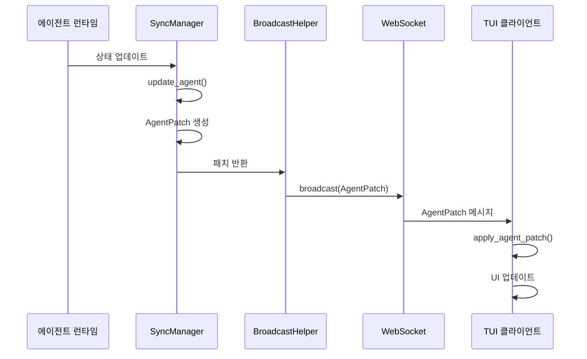
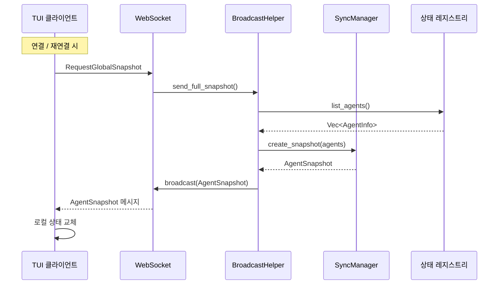
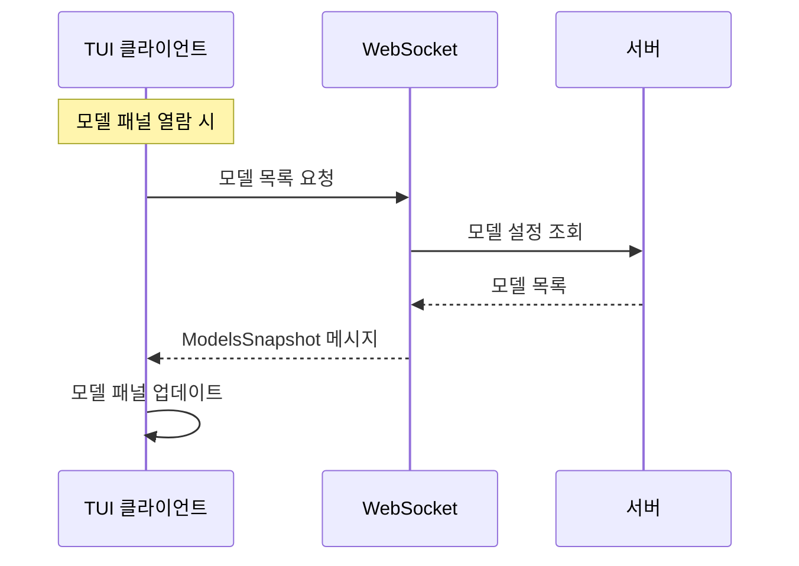
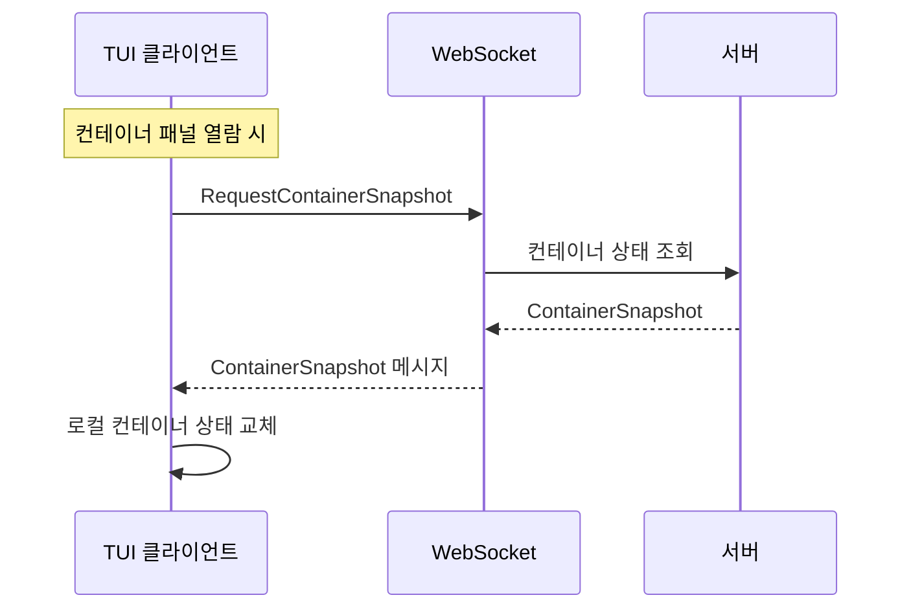
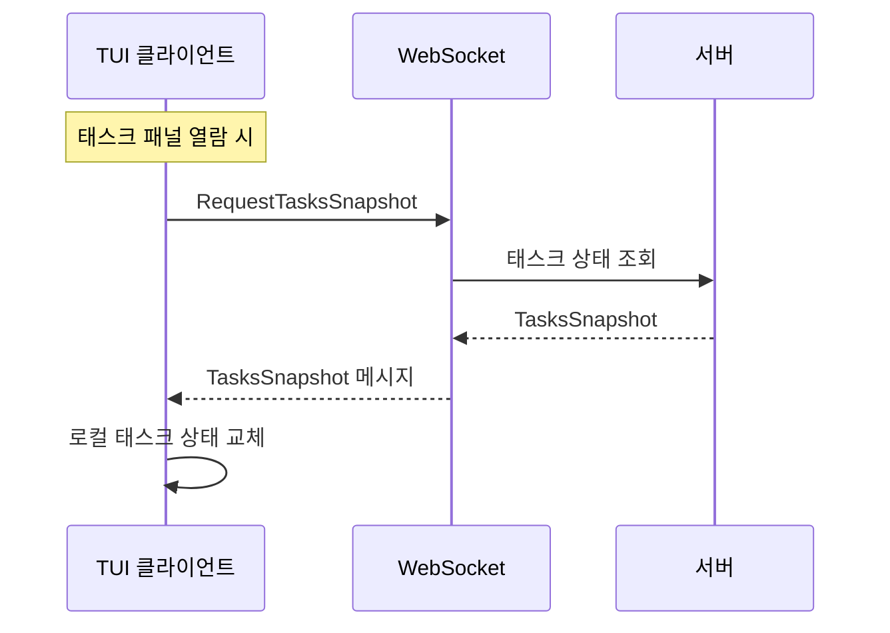

# 증분 동기화 아키텍처

## 개요

Automerge CRDT 기반의 다중 클라이언트 상태 증분 동기화 메커니즘으로, 연결/재연결 시 실시간 증분 업데이트 및 전체 동기화를 지원하며 모든 TUI 패널을 포괄합니다.

## 아키텍처 다이어그램



## 동기화 전략 매트릭스

| 패널 | 동기화 방식 | 트리거 | 빈도 | 메시지 유형 |
| --- | --- | --- | --- | --- |
| **에이전트 타임라인** | 증분 + 전체 | 연결 시 동기화 + 실시간 푸시 | 연결 시 / 실시간 | `AgentPatch` / `GlobalSnapshot` |
| **컨테이너** | 증분 + 전체 | 연결 시 동기화 + 실시간 푸시 | 연결 시 / 실시간 | `ContainerPatch` / `GlobalSnapshot` |
| **태스크** | 증분 + 전체 | 연결 시 동기화 + 실시간 푸시 | 연결 시 / 실시간 | `TaskPatch` / `GlobalSnapshot` |
| **모델 목록** | 전체 | 클라이언트 능동 요청 | 패널 열람 시 | `ModelsSnapshot` |
| **프로바이더 설정** | 전체 | 클라이언트 능동 요청 | 패널 열람 시 | `ProvidersSnapshot` |

## 메시지 흐름

### 증분 업데이트 흐름 (에이전트)



### 전체 동기화 흐름



### 모델 목록 동기화 흐름



### 컨테이너 전체 동기화 흐름



### 태스크 전체 동기화 흐름



## 데이터 구조

### AgentPatch (증분 업데이트)

```rust
pub struct AgentPatch {
    pub agent_id: String,
    pub version: u64,
    pub llm_working_changed: Option<bool>,
    pub work_status: Option<String>,
    pub current_model: Option<String>,
    pub token_usage_delta: Option<(u32, u32)>,
    pub token_usage_absolute: Option<(u32, u32)>,
    pub request_state: Option<RequestState>,
    pub cpu_usage: Option<f64>,
    pub memory_mb: Option<u64>,
}
```

### AgentSnapshot (전체 스냅샷)

```rust
pub struct AgentSnapshot {
    pub version: u64,
    pub timestamp: i64,
    pub agents: Vec<TuiAgentInfo>,
}
```

### GlobalSnapshot (전역 스냅샷)

```rust
pub struct GlobalSnapshot {
    pub version: u64,
    pub timestamp: i64,
    pub agents: Vec<TuiAgentInfo>,
    pub models: Vec<ModelInfo>,
    pub providers: Vec<ProviderInfo>,
    pub active_tasks: Vec<TaskInfo>,
}
```

### ModelsSnapshot (모델 목록)

```rust
pub struct ModelsSnapshot {
    pub models: Vec<ModelInfo>,
}
```

### ContainerPatch (컨테이너 상태 증분)

```rust
pub struct ContainerPatch {
    pub container_id: String,
    pub version: u64,
    pub status_changed: Option<String>,
    pub cpu_usage_changed: Option<f64>,
    pub memory_usage_changed: Option<u64>,
}
```

### ContainerSnapshot (컨테이너 상태 전체)

```rust
pub struct ContainerSnapshot {
    pub version: u64,
    pub timestamp: i64,
    pub containers: Vec<ContainerInfo>,
}
```

### TaskPatch (태스크 상태 증분)

```rust
pub struct TaskPatch {
    pub task_id: Uuid,
    pub version: u64,
    pub status_changed: Option<String>,
    pub progress_changed: Option<u8>,
}
```

### TasksSnapshot (태스크 상태 전체)

```rust
pub struct TasksSnapshot {
    pub version: u64,
    pub timestamp: i64,
    pub tasks: Vec<TaskInfo>,
}
```

## 동기화 전략

| 유형 | 방향 | 트리거 | 빈도 |
| --- | --- | --- | --- |
| 에이전트 증분 업데이트 | 서버 → 클라이언트 | 상태 변경 | 실시간 |
| 에이전트 전체 동기화 | 서버 → 클라이언트 | 연결 시 | 연결 / 재연결 시 |
| 컨테이너 증분 | 서버 → 클라이언트 | 상태 변경 | 실시간 |
| 컨테이너 전체 동기화 | 서버 → 클라이언트 | 연결 시 | 연결 / 재연결 시 |
| 태스크 증분 | 서버 → 클라이언트 | 상태 변경 | 실시간 |
| 태스크 전체 동기화 | 서버 → 클라이언트 | 연결 시 | 연결 / 재연결 시 |
| 모델 목록 | 클라이언트 → 서버 | 능동 요청 | 패널 열람 시 |
| 프로바이더 설정 | 클라이언트 → 서버 | 능동 요청 | 패널 열람 시 |

## 주요 기능

- **단일 상태 트리**: 서버는 하나의 `SyncManager`를 유지하며, 모든 클라이언트가 동일한 상태 업데이트를 수신합니다
- **CRDT 충돌 해결**: Automerge 기반의 자동 충돌 해결
- **증분 업데이트**: 변경된 필드만 전송하여 네트워크 트래픽 감소
- **최종 일관성**: 연결 시 전체 동기화로 최종 일관성 보장
- **요청형 풀**: 모델 및 프로바이더는 패널 열람 시점에 요청형으로 조회하여 불필요한 네트워크 전송 방지
- **홈 페이지 동기화**: 에이전트, 컨테이너, 태스크는 홈 페이지에 표시되므로 연결 시 동기화됩니다

## 구현 현황

- ✅ 에이전트 증분/전체 동기화
- ✅ 모델 목록 동기화
- ✅ 프로바이더 설정 동기화
- ✅ 컨테이너 증분/전체 동기화
- ✅ 태스크 증분/전체 동기화
- ✅ 상태 영속화 (/tmp 저장소, 재시작 시 재로드)
