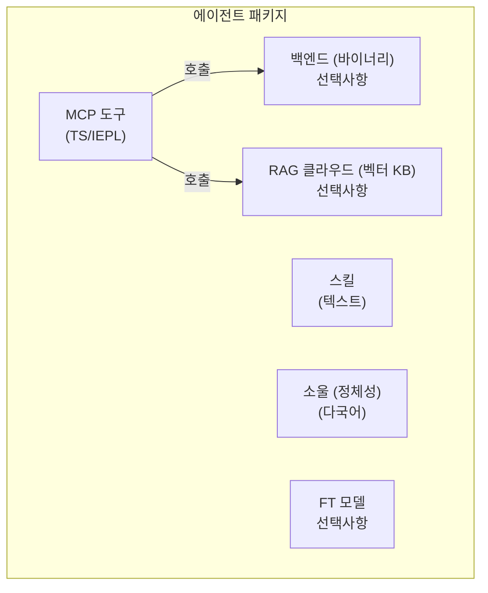

# 레이어 2/3 에이전트 패키지 명세

> **상태**: 초안 v1 — 2026-06-26
> **범위**: 레이어 2 및 레이어 3 에이전트를 위한 자기 완결형 패키지 형식을 정의합니다.

## 개요

레이어 2/3 에이전트는 최대 다섯 개의 구성 요소로 이루어진 **자기 완결형 패키지**입니다. 패키지는 배포의 단위로서, 독립적으로 설치, 갱신, 제거할 수 있습니다.



## 다섯 가지 구성 요소

### 1. MCP 도구 (IEPL TypeScript)

주요 도구 인터페이스입니다. IEPL 샌드박스(Boa JS 런타임)에서 실행되는 TypeScript 소스로 작성됩니다. 각 도구 파일은 함수를 내보냅니다:

```typescript
// mcp/memory_store.ts
import type { McpResult } from '@entecheia/sdk';

export async function memory_store(params: {
  text: string;
  node_type: string;
  entity_type?: string;
  properties?: Record<string, string>;
}): Promise<McpResult> {
  // 도구 로직 — 백엔드 프리미티브 호출, 다른 도구 합성,
  // 또는 클라우드 서비스로의 HTTP 요청이 가능합니다.
  const result = await backend.memory_store(params);
  return { ok: true, data: result };
}
```

도구는 다음과 같이 분류됩니다:

- **순수 TS**: 로직 전용, 다른 도구를 합성하거나 데이터 변환
- **백엔드 지원**: MCP 백엔드가 제공하는 프리미티브 호출
- **클라우드 지원**: 원격 API 호출 (RAG, 모델, 외부 서비스)

TypeScript 소스는 순수 텍스트이므로, 컴파일 없이 버전 관리, 리뷰, 배포가 가능합니다. 셀프 서비스 패키징 도구는 효율적인 로딩을 위해 여러 `.ts` 파일을 단일 `bundle.js`로 선택적으로 묶을 수 있습니다.

### 2. MCP 백엔드 (선택적 바이너리)

일부 도구는 IEPL 샌드박스를 넘어서는 기능(파일 I/O, 하드웨어 접근, 데이터베이스 연결)이 필요합니다. 이는 **바이너리 백엔드** — scepter 프로세스와 함께 실행되는 Rust 바이너리 — 를 통해 제공됩니다.

- 백엔드는 Docker 이미지에 컴파일되어 scepter의 "포켓"( `/workspace-base/target/` 디렉터리)에 포함됩니다.
- 런타임에 scepter는 `backend` 모듈 임포트를 통해 IEPL 환경에 바이너리 경로를 동적으로 전달합니다.
- 백엔드는 프리미티브 연산을 노출하며, 모든 합성과 오케스트레이션은 TS 레이어에서 이루어집니다.

백엔드 인터페이스 예시 (Rust로부터 자동 생성):

```typescript
// Rust 백엔드로부터 자동 생성
declare module 'backend' {
  export function memory_store_raw(params: {...}): Promise<McpResult>;
  export function memory_query_raw(query: string): Promise<McpResult>;
}
```

### 3. 스킬 (순수 텍스트)

스킬 프롬프트는 TOML 프론트매터가 포함된 마크다운 파일입니다. 에이전트가 태스크를 **어떻게** 실행할지 — 시스템 프롬프트, 도구 화이트리스트, 실행 모드, 파이프라인 구조 — 를 정의합니다.

```markdown
+++
name = "memory_consolidate"
agent = "philia"
related_tools = ["memory_consolidate", "memory_query"]
location = "scepter"
execution_mode = "read"

[features]
tier = "worker"
+++

# memory_consolidate

메모리 노드를 구조화된 회상을 위한 에피소드로 통합합니다...
```

스킬은 언어에 구애받지 않습니다(`#` 본문은 프롬프트 템플릿입니다). 순수 텍스트이며, 컴파일이나 바이너리가 필요하지 않습니다.

### 4. RAG 데이터베이스 (선택적, 클라우드 호스팅)

에이전트에게 도메인별 지식을 제공하는 벡터 지식 베이스입니다. Entelecheia의 클라우드 인프라에 호스팅됩니다.

- 선택 사항: 에이전트는 RAG 없이도 작동할 수 있습니다(기능 축소).
- 쿼리 제한: 할당량이 소진되면 쿼리는 빈 값을 반환하며, 에이전트는 정상적으로 성능이 저하됩니다.
- 패키지에 번들되지 않고 매니페스트에서 URL + API 키로 참조됩니다.

### 5. 파인튜닝 모델 (선택적, 클라우드 호스팅)

에이전트의 특정 도메인에 맞게 파인튜닝된 모델입니다. 역시 클라우드 호스팅됩니다.

- 선택 사항: 에이전트는 기본적으로 플랫폼의 범용 모델(예: GLM-5)을 사용합니다.
- 향후 자체 호스팅을 위해 오픈 웨이트로 제공될 수 있습니다.
- 매니페스트에서 모델 ID로 참조됩니다.

## 패키지 디렉터리 구조

```text
packages/agents/{agent_name}/
├── manifest.toml           # 패키지 메타데이터 및 설정
├── mcp/
│   ├── *.ts                # TypeScript 도구 구현 (IEPL)
│   └── *.md                # 도구 문서 (매개변수, 반환값)
├── backend/                # 선택적 Rust 백엔드
│   ├── Cargo.toml
│   └── src/
│       └── lib.rs
├── skills/
│   └── *.md                # 스킬 프롬프트
├── soul/
│   └── {lang}.md           # 언어별 에이전트 개성
├── rag.toml                # 선택적: RAG 데이터베이스 참조
└── model.toml              # 선택적: 파인튜닝 모델 참조
```

## manifest.toml 형식

```toml
[package]
name = "philia"              # 디렉터리 이름과 일치해야 함
version = "0.2.0"
description = "인지 메모리 시스템 — 저장, 조회, 통합"
layer = 2                    # 2 = 플랫폼 에이전트, 3 = 확장
category = "complex_tool"    # simple_tool | complex_tool | coordinator

[dependencies]
# 이 에이전트가 호출하는 다른 에이전트 패키지의 도구
aporia = "0.2.0"

[backend]
# 순수 TS 에이전트의 경우 완전히 생략
type = "rust"
binary = "philia"            # /workspace-base/target/debug/ 내 바이너리 이름
provides = [                 # TS 레이어에 노출되는 프리미티브
  "memory_store_raw",
  "memory_query_raw",
  "memory_consolidate_raw",
]

[rag]
# 클라우드 RAG를 사용하지 않는 경우 생략
provider = "entelecheia-cloud"
database_id = "philia-knowledge-v1"
endpoint = "https://rag.entelecheia.ai/v1"

[model]
# 기본 플랫폼 모델을 사용하는 경우 생략
provider = "entelecheia-cloud"
model_id = "philia-ft-v1"
endpoint = "https://model.entelecheia.ai/v1"
```

## TS SDK (`@entecheia/sdk`)

SDK는 도구 작성자를 위한 타입과 유틸리티를 제공합니다:

```typescript
// @entecheia/sdk — 타입
export interface McpResult {
  ok: boolean;
  data?: unknown;
  error?: string;
}

export interface McpToolParams {
  [key: string]: unknown;
}

// @entecheia/sdk — 유틸리티
export function rag_search(query: string): string;        // RAG 검색 (동기, 캐시됨)
export function llm_chat(prompt: string): Promise<string>; // LLM 호출
export function vars_get(key: string): unknown;           // 스킬 간 상태
export function vars_set(key: string, value: unknown): void;
```

`backend` 모듈은 매니페스트의 `[backend].provides` 목록을 기반으로 에이전트별로 자동 생성됩니다. 바이너리 프리미티브에 대한 타입화된 래퍼를 제공합니다.

## 레이어 아키텍처

| 레이어 | 에이전트 | 배포 방식 | 패키지? | 컨테이너? |
| --- | --- | --- | --- | --- |
| L1 | SkeMma, HapLotes, HubRis, KaLos, NeiKos, ApoRia, EleOs, EpieiKeia, OreXis, PhiLia, PoleMos, SkoPeo | 이미지 내장 | 백엔드 전용 (Rust 크레이트) | 아니오 (인프로세스) |
| L2 | ClassicSoftwareEngineering, WebAutomation, WebUiPanel, IndustrialIoT | 이미지 내장 | **전체 패키지** (TS + 스킬 + 소울) | 예 (e-skemma) |
| L3 | 사용자 설치 확장 | 동적 설치 | **전체 패키지** | 예 (e-skemma) |

- **레이어 1** (12개 에이전트): 핵심 플랫폼 에이전트입니다. 이들의 Rust 크레이트는 프리미티브 연산(파일 I/O, 메모리, 컨테이너, 하드웨어 등)을 제공합니다. 이들은 패키지가 아닙니다 — 플랫폼 자체입니다. 이들의 도구는 임포트 가능한 모듈로 노출됩니다(예: `import { file_write } from 'kalos'`).
- **레이어 2** (4개 에이전트): 첫 번째 실제 패키지입니다. **바이너리 백엔드가 없으며**, 레이어 1 프리미티브의 순수 TS/IEPL 합성체입니다. 패키지 형식의 예시로 이미지와 함께 배포됩니다.
- **레이어 3**: 사용자 설치 패키지입니다. L2와 동일한 형식이지만 동적으로 로드됩니다. 선택적으로 바이너리 백엔드를 선언할 수 있습니다(사용자가 컴파일, scepter를 통해 주입).

## 마이그레이션 경로

기존 Rust 에이전트 크레이트(`packages/agents/*/src/`)는 **백엔드**가 됩니다. MCP 도구 문서(`res/prompts/agents/*/mcp/*.md`)는 패키지로 이동합니다. 스킬 프롬프트(`res/prompts/agents/*/skills/*.md`)는 패키지로 이동합니다. 소울 파일(`res/prompts/soul/`)은 패키지로 이동합니다.

이전 `shared/plugin_host`(wasm 기반)는 이미 `shared/iepl`에 존재하는 IEPL TS 런타임으로 대체됩니다. wasm 컴파일이 필요하지 않습니다.
