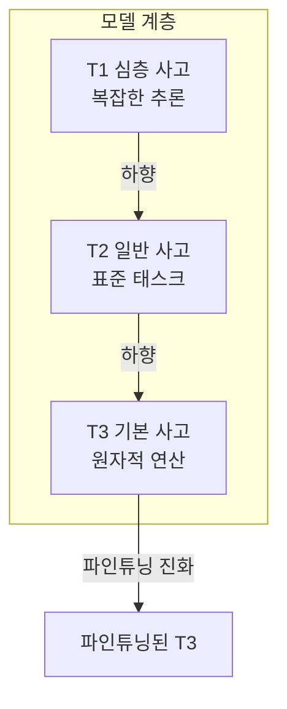
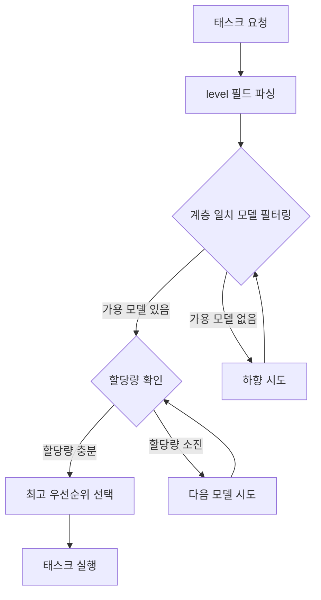
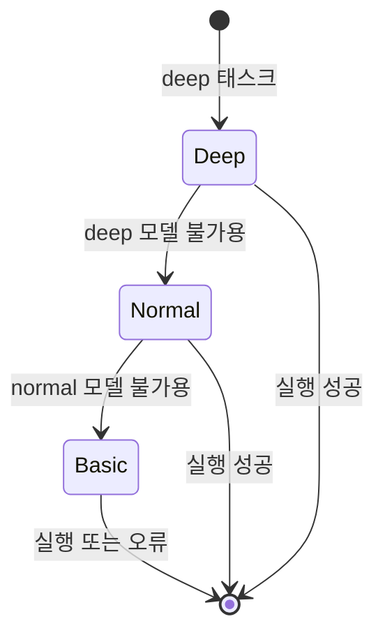
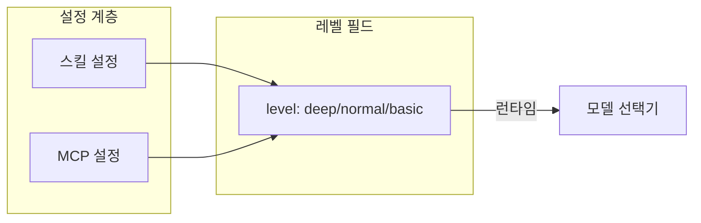
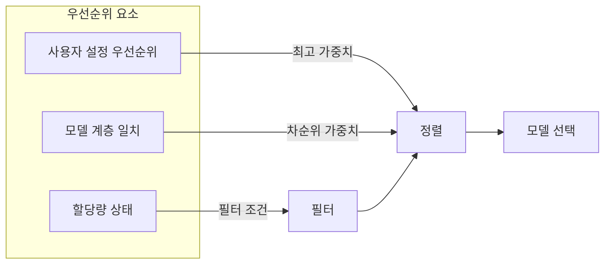
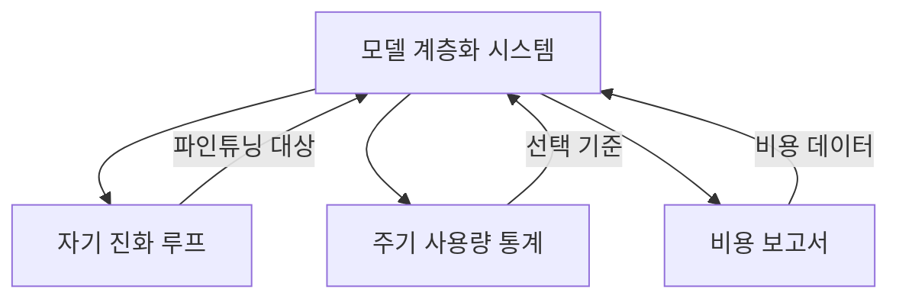

# 모델 계층화 시스템 설계

## 개요

모델 계층화 시스템은 태스크 복잡도에 따라 적절한 모델 계층을 할당하는 지능형 모델 선택 메커니즘으로, 품질을 보장하면서 자원 활용을 극대화합니다.

> **관련 문서**: 본 문서에서 정의된 3계층 모델 시스템은 [자기 진화 루프 시스템](04-self-evolution-loop.md)의 기반입니다.

## 핵심 원칙

### 3계층 모델 시스템

### 계층 비교

| 계층 | 포지셔닝 | 비용 | 대표적 시나리오 |
| --- | --- | --- | --- |
| T1 (심층) | 복잡한 추론, 의사 결정 | 최고 | 아키텍처 설계, 문제 분석 |
| T2 (일반) | 표준 태스크 | 중간 | 코드 작성, 문서 생성 |
| T3 (기본) | 원자적 연산 | 최저 | 파일 읽기, 형식 변환 |

## 모델 선택 메커니즘

### 선택 프로세스

### 하향 전략

## 설정 메커니즘

### 스킬/MCP 계층 어노테이션

각 스킬과 MCP 도구는 `level` 필드를 통해 필요한 모델 계층을 선언합니다:

### 우선순위 제어

## 다른 모듈과의 관계

## 설계 고려 사항

### 비용 최적화

- 하위 계층 모델 우선 사용
- 자동 하향으로 태스크 실패 방지
- 할당량 모니터링 알림

### 품질 보증

- 복잡한 태스크는 높은 계층 요구
- 하향 시 실행 가능성 검증 필요
- 실패 시 자동 재시도

### 확장성

- 사용자 정의 계층 지원
- 유연한 우선순위 구성
- 플러그인 가능한 선택 전략
