# 사용 기간 통계 시스템 설계

## 개요

사용 기간 통계 시스템은 기간별 LLM 토큰 사용량을 관리하고 추적하며, 여러 기간 유형(5시간, 7일, 30일, 사용자 정의)을 지원하여 비용 제어 및 할당량 관리를 위한 데이터 기반을 제공합니다.

## 핵심 원칙

### 시간 윈도우 집계

시스템은 슬라이딩 윈도우 집계 메커니즘을 사용하여 데이터베이스 뷰를 통해 모든 시간 범위에 대한 사용 통계를 실시간으로 계산합니다:


### 데이터 흐름

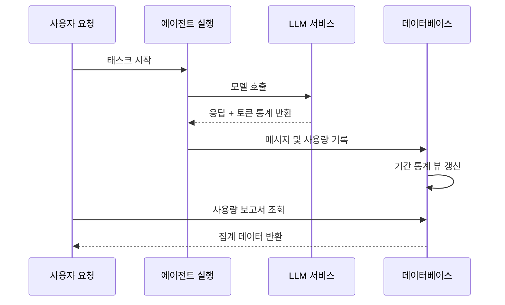

## 기간 유형

| 기간 유형 | 기간 | 대표적 용도 |
| --- | --- | --- |
| 단기 | 5시간 | 빠른 반복 개발 |
| 중기 | 7일 | 주간 할당량 제어 |
| 장기 | 30일 | 월간 비용 회계 |
| 사용자 정의 | 임의 | 유연한 비즈니스 요구 |

## 아키텍처 설계

### 뷰 집계 아키텍처

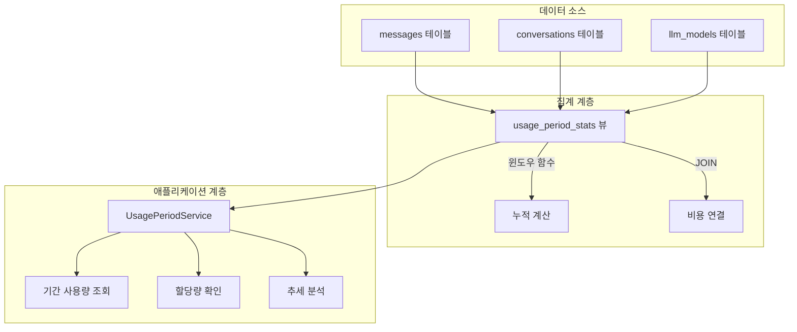

### 핵심 계산 로직

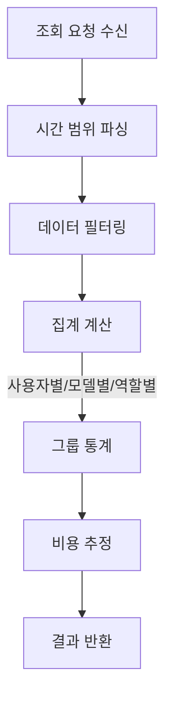

## 할당량 제어 메커니즘

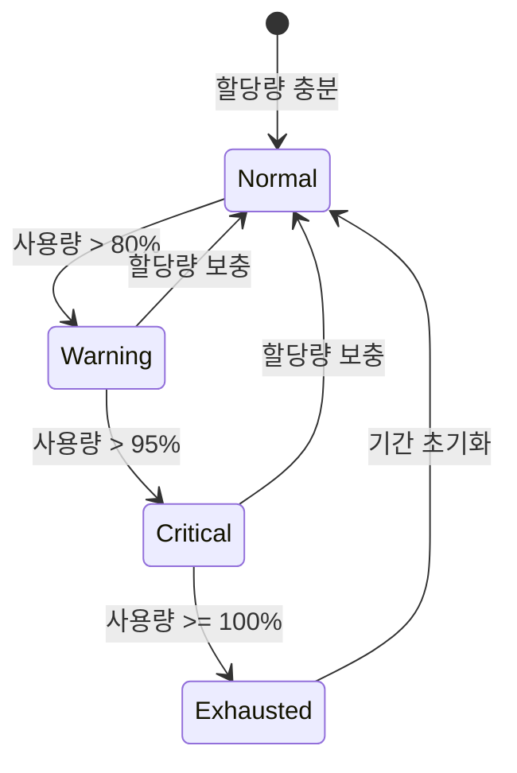

## 다른 모듈과의 관계

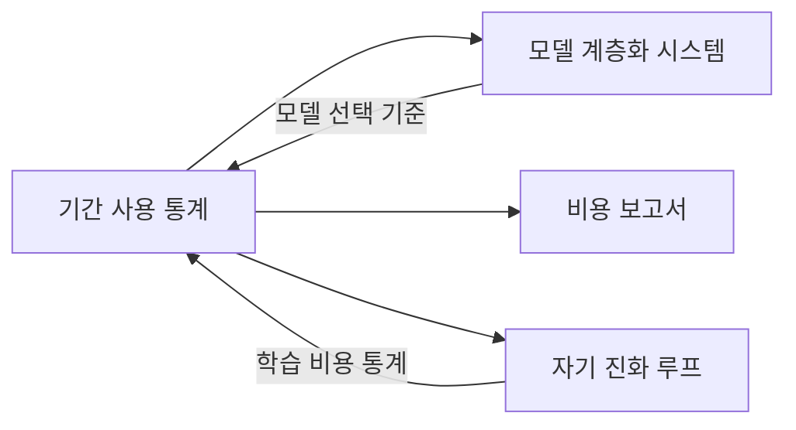

## 설계 고려 사항

### 성능 최적화

- 사전 집계를 위해 데이터베이스 뷰 사용
- 윈도우 함수로 중복 계산 방지
- 시간 인덱스가 범위 쿼리 가속화

### 확장성

- 새로운 기간 유형 지원
- 확장 가능한 집계 차원
- 유연한 비용 계산 모델

### 데이터 일관성

- 읽기 전용 뷰로 데이터 무결성 보장
- 타임스탬프는 UTC로 통일
- 트랜잭션으로 쓰기 원자성 보장

# LLM 설정 흐름 설계

## 개요

이 문서는 LLM 프로바이더를 구성하기 위한 사용자의 전체 흐름을 설명합니다. 설정 인터페이스 상호작용, 데이터 전송, 서버 측 처리, 대화 사용을 포함합니다.

## 설정 흐름 아키텍처

```text
### 전체 흐름

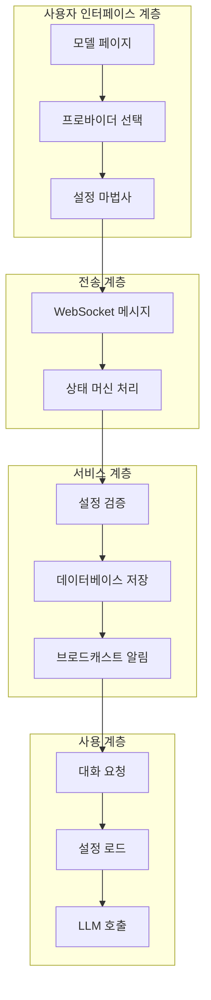

```text

## 프로바이더 설정 흐름

### 설정 단계 순서

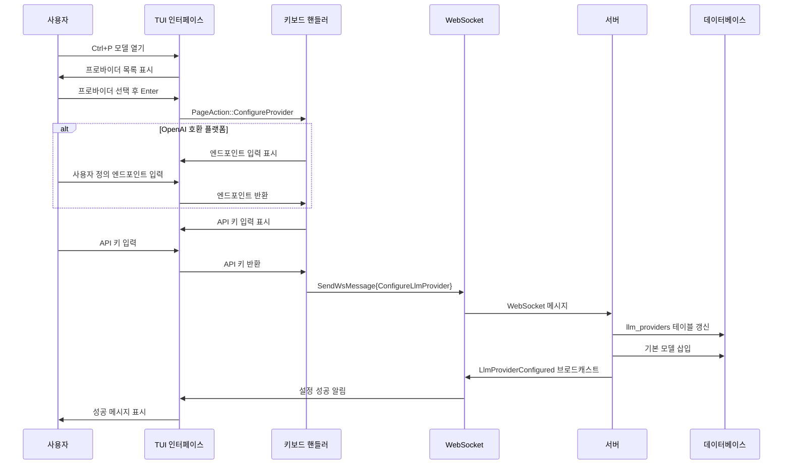

### 설정 상태 머신

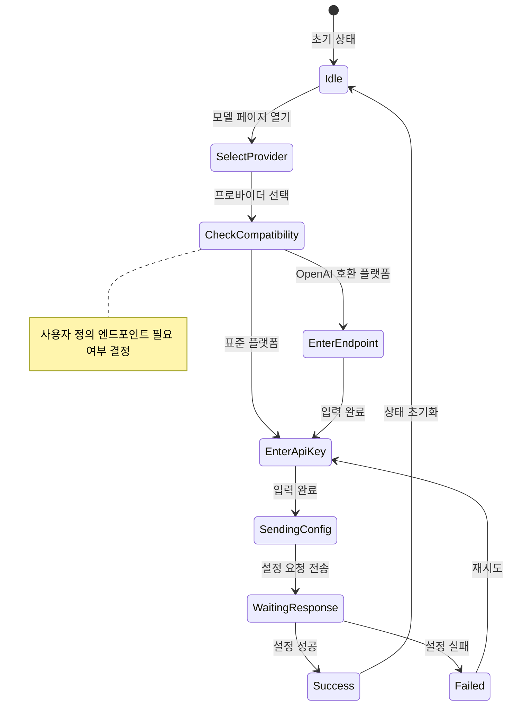

## 대화 사용 흐름

### LLM 호출 순서

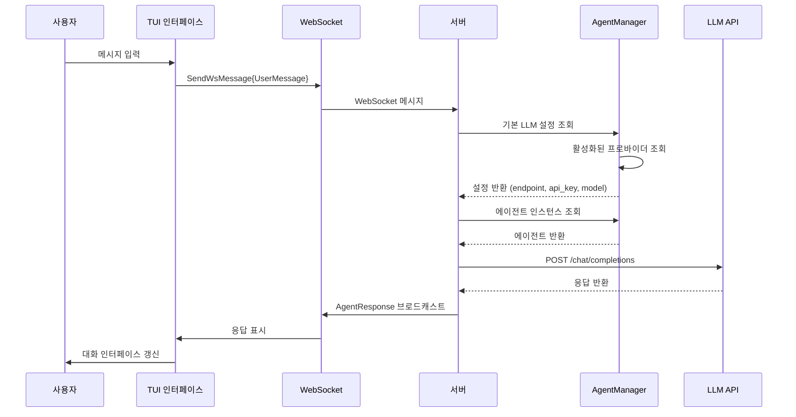

## 주요 설계 결정

### 2단계 설정 흐름

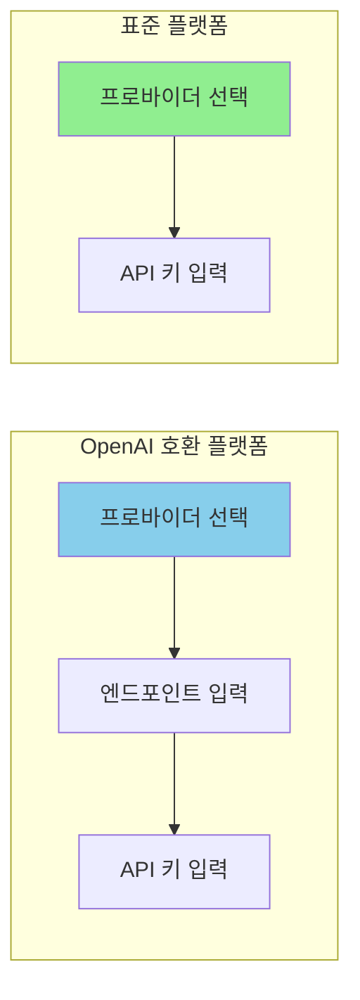

| 플랫폼 유형 | 설정 단계 | 이유 |
| --- | --- | --- |
| OpenAI 호환 | 엔드포인트 + API 키 | 사용자 정의 서비스 엔드포인트 필요 |
| 표준 플랫폼 | API 키만 | 공식 엔드포인트 사용 |

### 설정 상태 관리

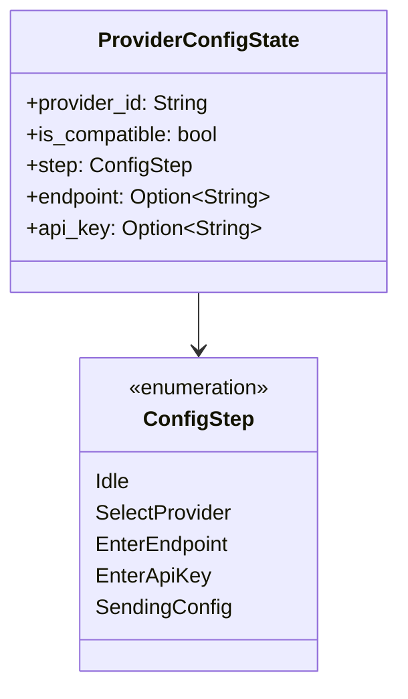

### 기본 모델 자동 삽입

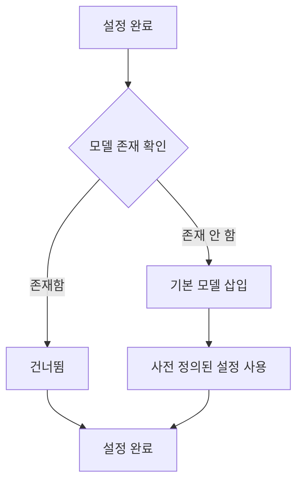

## 성능 최적화

### 설정 캐시 전략

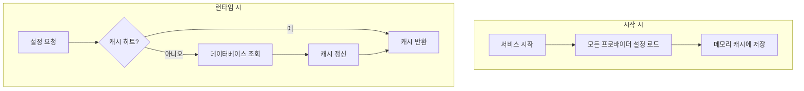

### 연결 풀 관리

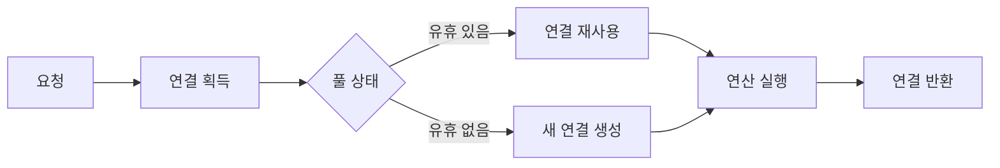

## 오류 처리

### 사용자 입력 검증

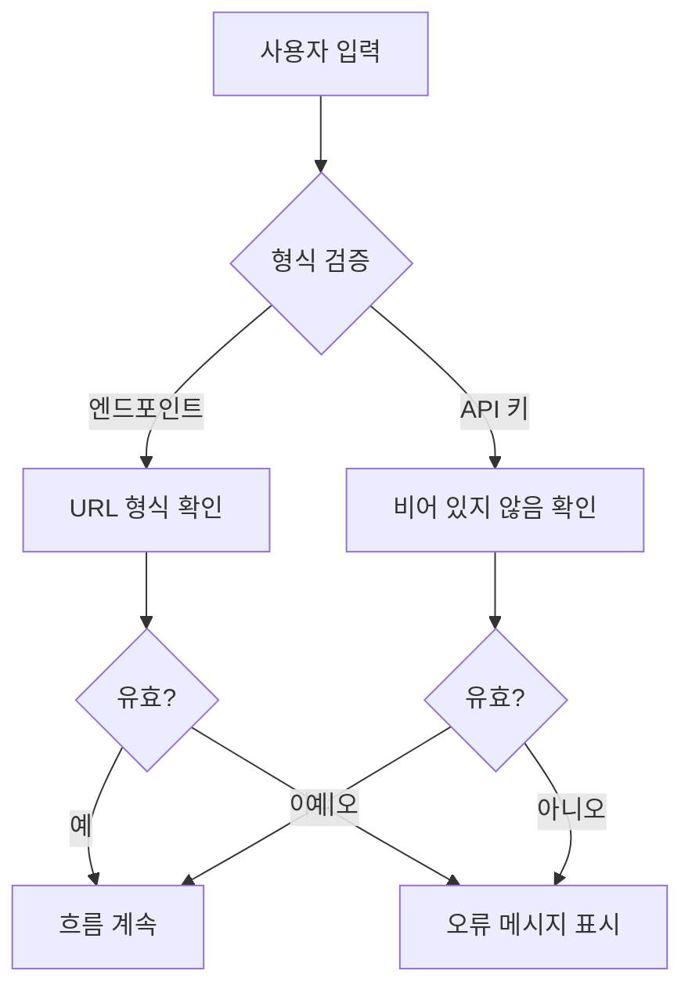

### 네트워크 오류 처리

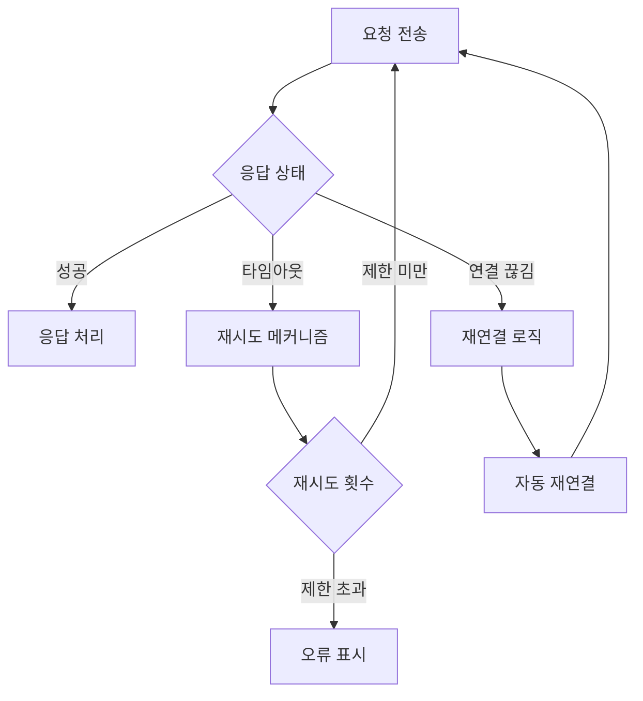

## 보안 고려 사항

### API 키 보호

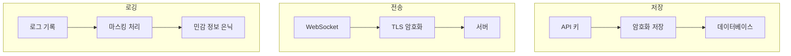

### 보안 조치

| 단계 | 조치 | 설명 |
| --- | --- | --- |
| 저장 | 암호화 저장 | 데이터베이스 내 API 키 암호화 |
| 전송 | TLS 암호화 | WebSocket은 암호화 채널 사용 |
| 로깅 | 마스킹 | 평문 키를 로그에 기록하지 않음 |
| 입력 | 매개변수화 쿼리 | SQL 주입 방지 |

## 확장성 설계

### 새 프로바이더 추가


### 다중 프로바이더 지원

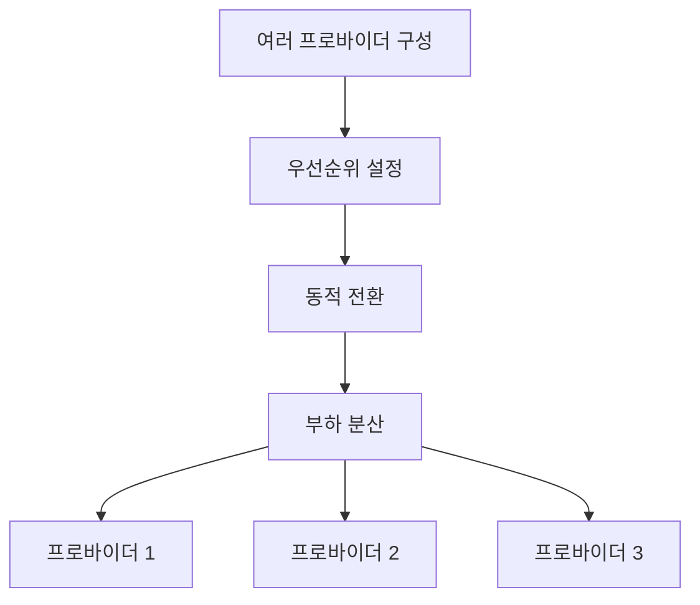

## 메시지 유형 정의

### WebSocket 메시지

| 메시지 유형 | 방향 | 설명 |
| --- | --- | --- |
| ConfigureLlmProvider | TUI → 서버 | 설정 요청 |
| LlmProviderConfigured | 서버 → TUI | 설정 결과 |
| UserMessage | TUI → 서버 | 사용자 대화 |
| AgentResponse | 서버 → TUI | 에이전트 응답 |

## 향후 계획

| 기능 | 설명 | 우선순위 |
| --- | --- | --- |
| 설정 임포트/익스포트 | 설정 파일 마이그레이션 지원 | 높음 |
| 프로바이더 상태 확인 | 주기적 프로바이더 가용성 감지 | 중간 |
| 자동 페일오버 | 프로바이더 불가용 시 자동 전환 | 중간 |
| 사용 통계 통합 | 사용 통계 시스템과 연동 | 낮음 |

# MCP 프롬프트 주입 및 컨텍스트 압축 메커니즘

## 개요

이 문서는 두 가지 주요 아키텍처 설계를 설명합니다: MCP 도구 강제 프롬프트 주입 메커니즘과 Todo 마커 기반 컨텍스트 압축 메커니즘입니다. 이 두 메커니즘은 함께 작동하여 에이전트 행동을 표준화하고 긴 대화 시나리오에서 컨텍스트 관리를 최적화합니다.

## I. MCP 도구 문서 주입 (Exec-Only)

### 핵심 개념

exec-only 마이크로커널 아키텍처에서, LLM은 **세 개의 도구 정의**만 받습니다: `exec`, `write_to_var`, `write_to_var_json`. MCP 도구는 exec의 JS 런타임을 통해 호출되는 내부 API입니다. MCP 도구 문서는 `related_tools` 메커니즘을 통해 JS API 문서로서 스킬 프롬프트에 주입되며, LLM에 전송되는 별도의 도구 정의가 아닙니다.

```mermaid
flowchart LR
    A[스킬 related_tools] --> B[McpToolDocLoader]
    B --> C[TOML 매개변수 + MD 설명 읽기]
    C --> D[JS API 문서로 포맷]
    D --> E[시스템 프롬프트에 주입]

    style D fill:#90EE90
```

### 주요 특성

| 특성 | 설명 |
| --- | --- |
| Exec-only 표면 | LLM은 `exec`, `write_to_var`, `write_to_var_json`만 봅니다; MCP 도구는 도구 정의로 노출되지 않습니다 |
| 스킬 범위 | 도구 문서는 `related_tools`를 통해 스킬별로 주입되며, 전역적이지 않습니다 |
| JS API 형식 | 문서는 `ES module import API reference — description`으로 포맷됩니다 |
| 내부 라우팅 | McpToolRegistry는 에이전트별이지만 내부 디스패치에만 사용됩니다 |

### 설계 동기

```mermaid
flowchart TB
    subgraph 문제 시나리오
        A[너무 많은 도구 정의가 컨텍스트를 팽창]
        B[도구별 프롬프트 주입이 취약]
        C[LLM이 도구 확산에 혼란]
    end

    subgraph 해결책
        D[세 도구 표면: exec, write_to_var, write_to_var_json]
        E[MCP 문서를 JS API 참조로]
        F[스킬 범위 related_tools 주입]
    end

    A --> D
    B --> E
    C --> F
```

### 주입 흐름

```mermaid
sequenceDiagram
    participant Skill as 스킬 (related_tools)
    participant Loader as McpToolDocLoader
    participant MCP as MCP 도구 설정 (TOML + MD)
    participant Prompt as 시스템 프롬프트

    Skill->>Loader: 관련 도구명 목록
    Loader->>MCP: TOML 매개변수 + MD 설명 읽기
    MCP-->>Loader: 도구 메타데이터

    Loader->>Loader: ES module import API reference — description으로 포맷
    Loader->>Prompt: 시스템 프롬프트의 스킬 섹션에 주입

    Note over Prompt: LLM은 exec 도구만 봄<br/>MCP 문서는 JS API 참조로 표시됨
```

### 주입 형식

각 MCP 도구의 문서는 JS API 참조로 포맷됩니다:

$agent.todo_list_view() — 현재 할일 트리 구조 보기
$agent.todo_create({ title: String, description: String }) — 새 할일 항목 생성
$agent.todo_update_status({ `todo_id`: String, status: String }) — 할일 항목 상태 갱신

### 설정 예시

```mermaid
flowchart TB
    subgraph 스킬 related_tools
        A[스킬 TOML: related_tools 필드]
        A --> A1["[tool_name]"]
        A1 --> B[todo_list_view]
        A1 --> C[todo_create]
        A1 --> D[todo_update_status]
    end

    subgraph McpToolDocLoader
        E[TOML 매개변수 읽기]
        F[MD 설명 읽기]
        G[JS API 문서로 포맷]
    end

    B --> E
    C --> E
    D --> E
    E --> F --> G
```

### 권한 수준

각 `[[related_tools]]` 항목은 선택적으로 `access_mode`를 선언할 수 있습니다:

[[`related_tools`]]
`agent_name` = "polemos"
`tool_name` = "`node_execute`"
`access_mode` = "read"       # 스킬이 읽기 수준 접근만 필요 (기본값: "read")

이중 인가 게이트웨이는 다음을 확인합니다:

1. 도구의 선언된 `ToolCapability`가 요청된 `access_mode`를 지원하는지
1. 대상 노드의 `TrustLevel`이 해당 연산을 허용하는지
1. 외부 노드의 경우 추가 위험 수준 게이팅이 적용됩니다

전체 내용은 `docs/design/en/22-mcp-tool-permission-model.md`를 참조하십시오.

### 장점과 트레이드오프

```mermaid
graph TB
    subgraph 장점
        A[최소한의 도구 표면]
        B[스킬 범위 문서화]
        C[일관된 API 형식]
        D[내부 라우팅 유연성]
    end

    subgraph 트레이드오프
        E[LLM이 JS 호출을 구성해야 함]
        F[디버깅에 exec 추적 필요]
        G[related_tools 유지 관리 필요]
    end
```

## II. Todo 마커 기반 컨텍스트 압축 메커니즘

### 핵심 개념

기존 압축은 텍스트 요약에 의존하여 주요 세부 사항을 손실합니다. 새로운 메커니즘은 주요 Todo 항목을 마킹하고 원본 세부 사항을 사용자 입력으로 보존하여 원본 스킬 실행을 직접 계속합니다.

```mermaid
flowchart LR
    subgraph 기존 방식
        A1[컨텍스트] --> B1[요약 텍스트]
        B1 --> C1[새 대화]
        C1 --> D1[세부 사항 손실 가능]
    end

    subgraph Todo 마커 방식
        A2[컨텍스트] --> B2[주요 Todo 마킹]
        B2 --> C2[원본 세부 사항 보존]
        C2 --> D2[정보 손실 없음]
    end
```

### 설계 동기 비교

| 기존 방식 문제점 | Todo 마커 장점 |
| --- | --- |
| 정보 손실 | 원본 보존 |
| 의미 드리프트 | 추적 가능 |
| 검증 불가능 | 검증 가능 |
| 스킬 무효화 | 스킬 연속성 |

### 압축 흐름

```mermaid
sequenceDiagram
    participant User as 사용자
    participant Agent as 원본 에이전트
    participant Marker as Todo 마커
    participant NewAgent as 새 에이전트
    participant TodoMCP as Todo MCP

    User->>Agent: 컨텍스트 압축 요청
    Agent->>Marker: 주요 Todo 항목 가져오기

    Note over Marker: 마킹 전략 적용

    Marker-->>Agent: 마킹된 항목 목록
    Agent->>TodoMCP: 일괄 세부 정보 가져오기
    TodoMCP-->>Agent: Todo 세부 정보

    Agent->>NewAgent: 새 세션 시작

    Note over NewAgent: 시스템 프롬프트 = 원본 스킬<br/>사용자 입력 = Todo 세부 정보

    NewAgent->>TodoMCP: Todo 트리 보기
    Note over NewAgent: 입력에 세부 정보가 이미 있음 발견<br/>직접 계속
```

### 마킹 전략

```mermaid
flowchart TB
    subgraph 전략 유형
        A[수동 마킹]
        B[AutoCritical 주요 경로]
        C[AutoUnfinished 미완료 태스크]
        D[하이브리드 전략]
    end

    A --> A1[사용자가 주요 항목 선택]
    B --> B1[주요 태스크 체인 자동 식별]
    C --> C1[모든 미완료 항목 마킹]
    D --> D1[여러 전략 결합]
```

### 전략 비교

| 전략 | 마킹 내용 | 적용 시나리오 |
| --- | --- | --- |
| 수동 | 사용자 지정 | 정밀 제어 |
| AutoCritical | 주요 태스크 체인 + 차단 태스크 | 복잡한 태스크 |
| AutoUnfinished | 모든 미완료 태스크 | 단순 복구 |
| 하이브리드 | 결합 + 사용자 마크 | 일반 시나리오 |

### 마킹된 항목 구조

```mermaid
classDiagram
    class MarkedTodoItem {
        +todo_id: String
        +include_depth: u32
        +include_ancestors: bool
        +include_artifacts: bool
    }

    class MarkerStrategy {
        <<enumeration>>
        Manual
        AutoCritical
        AutoUnfinished
        Hybrid
    }

    class TodoMarker {
        +marked_items: List~MarkedTodoItem~
        +marker_strategy: MarkerStrategy
        +mark_critical_todos()
    }

    TodoMarker --> MarkedTodoItem
    TodoMarker --> MarkerStrategy
```

## III. 두 메커니즘의 협업

### 협업 흐름

```mermaid
sequenceDiagram
    participant User as 사용자
    participant OldAgent as 기존 에이전트
    participant Marker as Todo 마커
    participant Loader as McpToolDocLoader
    participant NewAgent as 새 에이전트

    Note over OldAgent: 컨텍스트 한계 근접

    User->>OldAgent: 컨텍스트 압축
    OldAgent->>Marker: 주요 Todo 마킹
    Marker-->>OldAgent: 마킹된 항목 목록

    OldAgent->>NewAgent: 새 세션 생성

    Note over NewAgent: 시스템 프롬프트 = 소울 + 스킬<br/>McpToolDocLoader가 related_tools 로드

    NewAgent->>Loader: related_tools에 대한 도구 문서 로드
    Loader-->>NewAgent: 포맷된 JS API 문서

    Note over NewAgent: 시스템 프롬프트 포함 내용:<br/>1. 소울 정체성<br/>2. 스킬 템플릿 + related_tools 문서<br/>3. 세 도구: exec, write_to_var, write_to_var_json

    NewAgent->>NewAgent: exec JS 런타임으로 실행
    Note over NewAgent: MCP 도구는 내부 API<br/>입력에 세부 정보가 이미 있음 발견

    NewAgent-->>User: 원활한 태스크 계속
```

### 주요 협업 포인트

```mermaid
flowchart TB
    subgraph 협업 메커니즘
        A[McpToolDocLoader가 JS API 문서 주입]
        B[마커가 완전한 컨텍스트 제공]
        C[소울 + 스킬 프롬프트 보존됨]
    end

    A --> D[스킬이 MCP 도구에 대한 JS API 참조 보유]
    B --> E[충분한 완전 정보 제공됨]
    C --> F[행동 일관성 유지됨]

    D --> G[원활한 태스크 계속]
    E --> G
    F --> G
```

## IV. 구현 로드맵

```mermaid
flowchart LR
    subgraph 1단계 높은 우선순위
        A[MCP 프롬프트 주입]
        A --> A1[데이터 구조]
        A --> A2[주입 로직]
        A --> A3[설정 관리]
    end

    subgraph 2단계 중간 우선순위
        B[Todo 마커 메커니즘]
        B --> B1[마킹 전략]
        B --> B2[압축 복구]
        B --> B3[수동 마킹]
    end

    subgraph 3단계 낮은 우선순위
        C[스마트 전략]
        C --> C1[AutoCritical]
        C --> C2[하이브리드]
        C --> C3[스마트 제안]
    end
```

## V. 위험 평가 및 완화

### 위험 매트릭스

| 위험 | 영향 | 완화 조치 |
| --- | --- | --- |
| 토큰 오버헤드 과다 | 성능 저하 | 마킹 수 제한, 압축 수준 설정 |
| 프롬프트가 너무 엄격 | 유연성 감소 | 우회 메커니즘 제공, 예외 처리 안내 |
| 마킹 전략 부정확 | 정보 누락 | 수동 재정의, 시각적 확인 |

### 오류 처리 흐름

```mermaid
flowchart TB
    A[연산 실패] --> B{실패 유형}
    B -->|토큰 초과| C[비주요 항목 제거]
    B -->|전략 실패| D[수동 모드로 폴백]
    B -->|주입 실패| E[기본 동작 사용]

    C --> F[연산 재시도]
    D --> F
    E --> F
```

## VI. 설정 통합

### 전체 설정 구조

```mermaid
flowchart TB
    subgraph 스킬 설정
        A[related_tools]
        B[tool_names 목록]
    end

    subgraph 압축 설정
        C[enabled]
        D[default_strategy]
        E[trigger_threshold]
    end

    subgraph 전략 설정
        F[include_critical_path]
        G[include_unfinished]
        H[max_marked_items]
    end

    A --> I[JS API 문서 생성]
    C --> J[압축 제어]
    F --> K[마킹 규칙]
```

## VII. 향후 확장

| 기능 | 설명 | 우선순위 |
| --- | --- | --- |
| 동적 프롬프트 생성 | 태스크 복잡도에 따라 제약 조정 | 중간 |
| 멀티 세션 공유 | 여러 에이전트가 Todo 마커 공유 | 중간 |
| 스마트 마킹 제안 | 마킹 항목 자동 추천 | 낮음 |
| 시각적 마킹 도구 | 그래픽 마킹 인터페이스 | 낮음 |

## VIII. 보완적 RAG 컨텍스트 주입 (v2.1+)

I-VII절에서 설명된 MCP 도구 주입은 LLM에게 **API 참조**를 제공합니다 — LLM에게 도구를 *호출하는 방법*을 알려줍니다. 보완 메커니즘인 RAG 컨텍스트 주입은 LLM에게 **사전 계산된 지식**을 제공합니다 — RAG 쿼리의 *결과*를 시스템 프롬프트에 직접 주입합니다.

| 측면 | MCP 도구 주입 | RAG 컨텍스트 주입 |
| --- | --- | --- |
| LLM이 받는 것 | API 참조 문서 (ES 모듈 임포트) | 실제 지식 콘텐츠 (메모리 노드, 워크스페이스 문서) |
| 주입 시점 | `related_tools` 기반, 스킬별 | 스킬 컨텍스트 기반, 스킬 단계별 |
| LLM 관여 | LLM이 도구를 호출해야 함 | LLM 관여 없음 — 사전 계산됨 |
| 지연 영향 | N회 왕복 (호출당 1회) | 스킬 단계당 1회 사전 계산 |
| IEPL 모듈 | `{agent}` (MCP 디스패치) | `rag/{philia,aporia}` (버퍼 읽기) |

두 메커니즘은 공존합니다: MCP 도구는 사전 계산된 컨텍스트가 다루지 않는 쿼리에 대한 폴백으로 사용 가능합니다. 전체 설계는 `docs/design/en/26-rag-context-injection.md`를 참조하십시오.

# 에이전트 이중 신원 및 가시성 경계 설계

## 목표

- 가시적 스킬 실행 인스턴스와 내부 MCP/LLM 도구 프로바이더를 완전히 분리합니다.
- 스킬 호출만 3자리 배지를 가진 임시 가시적 에이전트를 생성하도록 허용합니다.
- MCP/LLM 모델 및 토큰 사용량을 추가적인 가시적 에이전트 생성 없이 부착된 스킬 인스턴스에 귀속시킵니다.
- 런타임 UUID 신원을 감사, 이력, 재생을 위해 유지하되 TUI 타임라인에 누출되지 않도록 합니다.

## 신원 계층

- `agent_number`: UI 표시용 3자리 배지이자 가시적 타임라인 노드의 안정적 키.
- `agent_uuid`: 레지스트리, 감사, 이력에 사용되는 런타임 UUID.
- `agent_id`: 호환성 필드.
  - 가시적 TUI 페이로드에서 `agent_id`는 패널 표시용 `agent_number`와 일치해야 합니다.
  - 내부 레지스트리 및 MCP 실행 경로에서 `agent_id`는 UUID 스타일로 유지될 수 있습니다.

## 가시성 및 인스턴스화 규칙

- 스킬 호출만 임시 가시적 에이전트 인스턴스를 생성합니다.
- SimpleTool/MCP 프로바이더는 해당 도구 중 하나가 호출되었다는 이유만으로 추가 가시적 에이전트를 생성해서는 안 됩니다.
- 스킬이 MCP 도구나 내부 `llm_chat` 호출을 사용할 때, 해당 호출은 그 스킬 인스턴스 아래의 하위 실행으로 남습니다.
- 예: HubRis가 ApoRia `llm_chat`을 호출하는 경우, ApoRia는 내부 실행자로 남아 있으며 우측 상단 타임라인에 두 번째 가시적 노드로 나타나서는 안 됩니다.

## MCP 및 LLM 귀속 규칙

- MCP/LLM 호출이 가시적 스킬 인스턴스에 속하는 경우, 해당 모델명과 토큰 사용량은 그 스킬 인스턴스에 귀속되어야 합니다.
- 내부 프로바이더는 자체 감사나 전역 계정을 유지할 수 있지만, 그러한 내부 통계는 TUI 노드 생성을 트리거해서는 안 됩니다.
- MCP 로그와 컨텍스트는 다음을 보존해야 합니다:
  - `agent_number`
  - `agent_uuid`
  - `tool_name`
  - `phase` (`start`/`finish`)
  - `success` 및 `error`

## TUI 렌더링 계약

- TUI는 명시적 3자리 패널 ID에 대해서만 타임라인 노드를 생성합니다.
- 가시적 `agent_number`가 없는 페이로드는 전역 모델/토큰 통계만 갱신할 수 있으며 가시적 에이전트 노드를 생성해서는 안 됩니다.
- 표시 레이블과 노드 키는 절대 `agent_id` 내부에서 발견된 UUID나 임의 숫자로부터 가시적 배지를 파생해서는 안 됩니다.
- 가시적 노드의 경우:
  - `agent_number`는 표시 및 상호작용에 사용됩니다.
  - `agent_uuid`는 감사, 이력, 디버깅에만 유지됩니다.

## 배지 할당 및 수명 주기

- `agent_number`는 순차 할당이 아닌 가용 `000`-`999` 풀에서 무작위로 할당됩니다.
- 해제된 번호는 재사용 가능합니다.
- 1000개의 배지가 모두 활성화된 경우, 할당자는 무작위 재사용으로 폴백할 수 있으며, 이때 이력적 구분은 `agent_uuid`에 의존해야 합니다.
- 가시적 인스턴스 정리 및 배지 회수는 스킬 수명 주기 관리자가 처리합니다.

## 호환성 제약

- `agent_id`만 전달하는 레거시 페이로드는 내부적으로 파싱될 수 있지만, 가시적 UI는 UUID 스타일 ID로부터 새 노드를 합성해서는 안 됩니다.
- `agent_number`와 `agent_uuid`가 모두 존재하는 경우 이중 신원 모델이 적용됩니다:
  - `agent_number`는 표시 및 상호작용용.
  - `agent_uuid`는 감사 및 이력용.

# 요청 동시성 아키텍처

## 개요

Scepter는 두 개의 독립적인 동시성 계층을 관리합니다:

```mermaid
flowchart LR
    User["사용자 요청"] --> Semaphore["요청 세마포어"]
    Semaphore --> Cosmos["Cosmos 컨테이너"]
    Cosmos --> Queue["계층 큐 (RequestPool)"]
    Queue --> LLM["LLM API"]
```

## 비유

레스토랑으로 생각해 보십시오:

- **고객** (사용자 요청)이 도착하여 동시에 주문합니다
- **테이블** (Cosmos 컨테이너)이 요청별로 생성됩니다 — 각각 자체 워크스페이스를 가집니다
- **주방 스테이션** (LLM 프로바이더 동시성)은 제한되어 있습니다 — 예를 들어 총 3개
- **티켓 시스템** (`RequestPool` 계층 큐)이 계층별 FIFO 순서를 관리합니다

30명의 고객이 한 번에 주문할 수 있지만(scepter가 여러 요청을 수락), 주방은 한 번에 3개의 요리만 할 수 있습니다(LLM API 속도 제한).

## 계층 1: 요청 세마포어

**위치**: `state_machine/domains/control_domain.rs` — `concurrent_request_semaphore`

scepter가 동시에 수락하는 사용자 요청 수를 제어합니다. 각 요청은 자체 LLM 핸들을 가진 독립적인 Cosmos 컨테이너를 생성합니다.

```mermaid
flowchart LR
    User1["사용자 메시지"] -->|"N = 모든 모델 max_concurrent의 합"| Semaphore["Semaphore(N)"]
    User2["사용자 메시지"] --> Semaphore
    User3["사용자 메시지"] --> Semaphore
    Semaphore --> Container1["Cosmos 컨테이너 + LLM 핸들"]
    Semaphore --> Container2["Cosmos 컨테이너 + LLM 핸들"]
    Semaphore --> Container3["Cosmos 컨테이너 + LLM 핸들"]
```

N = 활성화된 모든 모델의 총 동시 슬롯 수. 모델 A (3슬롯) + B (2슬롯) = 5 동시 요청.

이전에는 `AtomicBool` (N=1)이었으나, 현재는 `Semaphore(N)`입니다.

## 계층 2: 계층 큐 (RequestPool)

**위치**: `infra/request_pool.rs` — `RequestPool`

모델별 세마포어가 있는 계층별 FIFO 큐. 계층 내에서:

1. 수신 LLM 요청이 계층 큐에 진입합니다
1. 먼저 최우선 모델의 슬롯을 획득하려고 시도합니다
1. 바쁜 경우 우선순위 순서대로 다음 모델을 시도합니다
1. 모두 바쁜 경우 FIFO 큐에서 대기 — 어떤 모델이든 먼저 해제되면 다음 요청을 서비스합니다

```mermaid
flowchart TB
    subgraph Tier["계층: 'normal'"]
        direction TB
        Queue["FIFO 큐: req1 → req2 → req3 → req4"]
        MA["모델 A (우선순위 10): Semaphore(3) ■■□"]
        MB["모델 B (우선순위 5):  Semaphore(2) □□"]
        MC["모델 C (우선순위 1):  Semaphore(1) ■"]
        Queue -->|"req1 → 모델 A (가용)"| MA
        Queue -->|"req2 → 모델 B (가용, A 바쁨)"| MB
        Queue -->|"req3 → 대기... 모델 A 해제 → 서비스"| MA
        Queue -->|"req4 → 대기... 모델 C 해제 → 서비스"| MC
    end
```

### 주요 속성

- **프로바이더별 격리**: 각 모델의 `max_concurrent`는 독립적입니다
- **우선순위 정렬**: 가용 시 더 높은 우선순위 모델이 선호됩니다
- **폴백**: 고우선순위 모델이 포화 상태면 낮은 우선순위 모델이 즉시 서비스합니다
- **FIFO 공정성**: 대기 요청은 도착 순서대로 서비스됩니다

### 설정

\# provider_config.toml
[[models]]
id = "gpt-5.4"
tier = "normal"
priority = 10
`max_concurrent` = 3        # 이 모델에 대한 3개의 동시 API 호출

[[models]]
id = "gpt-4o-mini"
tier = "normal"
priority = 5
`max_concurrent` = 5        # 5개의 동시 API 호출

[[models]]
id = "deepseek-v3"
tier = "deep"
priority = 8
`max_concurrent` = 2

이 설정으로:

- `normal` 계층: 모델 A (3슬롯) + 모델 B (5슬롯) = 8개 동시 normal 계층 LLM 호출
- `deep` 계층: 모델 C (2슬롯) = 2개 동시 deep 계층 LLM 호출
- 요청 세마포어: 3 + 5 + 2 = 10개 동시 사용자 요청

## 흐름: 사용자 메시지 → LLM 응답

```text
    1. 사용자가 TUI/CLI/소켓을 통해 메시지 전송
    1. `handle_user_message`():

a. 요청 세마포어에서 `try_acquire`() (계층 1)

          - 슬롯이 없으면: "busy" 오류 반환
          - 각 슬롯 → 독립적 Cosmos 컨테이너

b. `execute_skill_chain`() → `invoke_aporia_llm_chat`()

    1. `invoke_aporia_llm_chat`():

a. RequestPool에서 `acquire_tier`("normal", `excluded_models`) (계층 2)

          - 우선순위 순서로 각 모델 시도 (비차단)
          - 모두 바쁨: 어떤 모델 슬롯이든 해제될 때까지 FIFO 대기
          - TierPermit { `model_id`, `display_name` } 반환

b. `chat_loop` → llm_backend.chat() → LlmService::`chat_with_tools`()

          - 선택된 모델로 API 호출

c. TierPermit 해제 → 세마포어 슬롯 릴리스

    1. `finish_handling`():

a. 요청 세마포어 허용 반환
b. Cosmos 컨테이너 정리 (또는 재사용)

```

## E2E 테스트

테스트는 절대적 데드라인이 아닌 유휴 타임아웃을 사용합니다. 모든 의미 있는 이벤트마다 타이머가 초기화됩니다:

\# 활동이 유휴 타이머를 초기화 — 체인은 활성 상태인 한 무기한 실행 가능
ACTIVE_METHODS = {
"Tui.`OrchestrationStatus`",
"Tui.`McpToolResult`",
"Tui.`AgentReport`",
"Tui.`AgentStreamingChunk`",
"Tui.`TaskStatusUpdate`",
"Tui.`AskHumanRequest`",
"Tui.AgentPatch",
"Tui.`ContainerSnapshot`",
}

이로써 다음이 보장됩니다:

- 짧은 유휴 타임아웃(120초)이 실제로 정체된 체인을 감지
- 오래 실행되지만 활성 상태인 체인(복잡한 멀티 스킬)은 조기에 종료되지 않음

# 임베디드 개발 DB 및 기능 게이트 생산 격리

## 개요

entelecheia는 두 가지 목적으로 [pglite-oxide](https://crates.io/crates/pglite-oxide)를 임베디드 PostgreSQL로 사용합니다:

1. **로컬 개발**: `DATABASE_URL`이 설정되지 않은 경우, scepter가 pgvector 지원이 포함된 인프로세스 PostgreSQL (WASM/wasmer를 통한 PG 17.5)을 자동으로 시작합니다.
1. **통합 테스트**: PG 통합 테스트는 Docker/testcontainers 대신 pglite-oxide를 사용합니다.

프로덕션(Docker)에서는 `embedded-db` 기능이 제외되고, scepter는 실제 PostgreSQL 컨테이너에 연결합니다.

## 설계 동기

이전에는 로컬 개발에 Docker Compose 또는 수동 PostgreSQL 설치가 필요했습니다. 통합 테스트는 `testcontainers`에 의존하여 CI에서 Docker-in-Docker 복잡성을 추가했습니다. pglite-oxide는 두 요구 사항을 제거합니다 — `cargo run`이 로컬 개발에서 "그냥 작동"하고, `cargo test`는 Docker 없이 실행됩니다.

## 기능 게이트 아키텍처

```mermaid
flowchart TB
    Cargo["scepter Cargo.toml<br/>[features] default = ['all-agents', 'embedded-db']  ← dev<br/>embedded-db = ['dep:pglite-oxide']<br/>[dependencies] pglite-oxide = { workspace = true, optional = true }"]

    Cargo -->|"cargo build (기본)"| Dev["pglite-oxide + wasmer WASM<br/>포함됨"]
    Cargo -->|"Dockerfile<br/>--no-default-features<br/>--features all-agents"| Prod["pglite 없음, wasmer 없음<br/>(프로덕션)"]
```

| 빌드 컨텍스트 | 명령 | pglite-oxide | wasmer | DATABASE_URL |
| --- | --- |  ---  |  ---  | --- |
| `cargo run` (로컬 개발) | 기본 기능 | ✓ | ✓ | 선택 — 없으면 임베디드 PG 자동 시작 |
| `cargo test` (테스트) | 기본 기능 | ✓ | ✓ | 테스트 하네스에 의해 자동 시작 |
| `just build` (릴리스) | `--no-default-features --features all-agents` | ✗ | ✗ | 필수 |
| Docker `Dockerfile` | `--no-default-features --features all-agents` | ✗ | ✗ | 필수 (PG 컨테이너 지정) |

## 런타임 DB 해결 순서

```rust
// packages/scepter/src/app/setup.rs
let `db_url` = if let Ok(url) = std::env::var("DATABASE_URL") {
// 1. 환경 변수 (프로덕션: Docker PG, 개발: .env 파일)
url
} else if !user_config.database.url.is_empty() {
// 2. 사용자 설정 파일 (~/.config/entelecheia/config.toml)
user_config.database.url.clone()
} else {
// 3. 임베디드 pglite-oxide (기능 게이트)
#[cfg(feature = "embedded-db")]
{
let server = `PgliteServer`::builder()
.extension(`pglite_oxide`::extensions::VECTOR)  // pgvector 지원
.start()?;
let url = server.database_url();
std::mem::forget(server);  // 프로세스 수명 동안 유지
url
}
#[cfg(not(feature = "embedded-db"))]
{
return Err(/* "DATABASE_URL이 설정되지 않음" */);
}
};
```

## 테스트 하네스 패턴

```no_run
// tests/pg_integration/auth_test.rs
static PG: OnceCell<(String, PgliteServer)> = OnceCell::const_new();

# [test]
fn pg_integration_tests() {
    let rt = tokio::Runtime::new().unwrap();
    rt.block_on(async {
        let url = ensure_pg_url().await;
        let db = connect_db(&url).await;  // max_connections=1
        pg_user_crud(&db).await;
        pg_unique_username(&db).await;
        pg_rbac_role_persistence(&db).await;
        pg_rbac_audit_log(&db).await;
    });
    std::process::exit(0);  // sqlx 풀 정지 우회
}
```

## 생성되는 테이블

23개 테이블 + 1개 스키마 범위 테이블 + 4개 뷰가 모두 SeaORM 마이그레이션을 통해 생성됩니다:

**코어**: `users`, `rbac_user_roles`, `rbac_audit_log`, `agents`, `conversations`, `messages`, `tasks`
**목표**: `goals`, `tracks`, `goal_tasks`
**지식**: `knowledge_bases`, `knowledge_documents` (pgvector 임베딩), `rag_subscriptions`
**합의**: `consensus_records`, `consensus_references`, `consensus_verifications`
**인프라**: `credentials`, `ssh_credentials`, `container_snapshots`, `model_usage_stats`
**워크스페이스**: `workspace_registry`, `todo_items`, `workspace_bindings`
**로깅**: `log.entries` (별도 `log` 스키마)
**뷰**: `usage_period_stats`, `usage_model_stats`, `usage_role_stats`, `usage_session_stats`

## PGlite 제약

```text
| 제약 | 영향 | 완화 |
| --- | --- | --- |
| `max_connections=1` | 한 번에 하나의 풀만 | 서브 테스트 간 DB 연결 공유; 테스트 간 `db.close()` 없음 |
| 엄격한 타입 캐스팅 | `uuid = text` 실패 | 항상 타입화된 값 전달 (예: UUID 열에 `String`이 아닌 `Uuid`) |
| 동시 접근 불가 | 테스트는 순차적이어야 함 | 모든 서브 테스트가 인라인된 단일 `#[test]` 러너 |
| sqlx 풀 백그라운드 태스크 | `close()`가 무기한 정지 | 모든 테스트 완료 후 `std::process::exit(0)` |
```
## Docker 빌드 강화

모든 프로덕션 Dockerfile은 embedded-db를 제외합니다:

\# Dockerfile
RUN cargo build --release -p scepter \
--no-default-features --features all-agents

이로써 프로덕션 이미지에 wasmer/pglite 코드가 전혀 포함되지 않아, 바이너리 크기를 최소화하고 공격 표면을 줄입니다.
