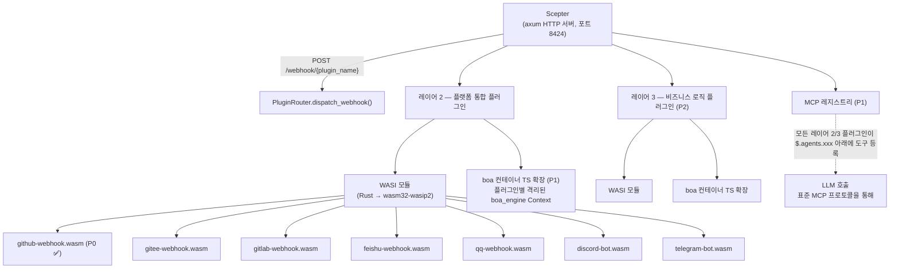
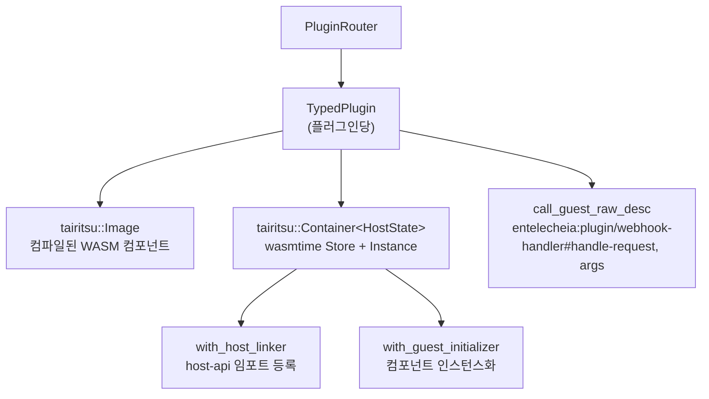

# 25 — WASI 플러그인 시스템 설계

## 개요

WASI 플러그인 시스템은 이전 Python/TypeScript 웹훅 스캐폴딩을 **WASM 컴포넌트 모델** 플러그인으로 대체하여, 샌드박스형 언어 독립적 플랫폼 통합(레이어 2) 및 비즈니스 로직 확장(레이어 3)을 제공합니다. 주요 설계 목표:

1. **이중 확장 메커니즘**: 레이어 2(플랫폼 통합) 및 레이어 3(비즈니스 로직) 모두 WASI 모듈과 boa TS 확장을 지원합니다.
1. **통합 MCP 등록**: 모든 플러그인이 구현 언어와 관계없이 `$.agents.xxx` 아래에 도구를 등록합니다.
1. **호스트 관리 I/O**: 호스트(Scepter axum 서버)가 HTTP 라우팅, WebSocket, 장수명 연결을 처리하며, 플러그인은 로직만 처리합니다.
1. **강력한 샌드박싱**: WASM 모듈은 연료 제한 및 에포크 중단이 적용된 wasmtime에서 실행됩니다.

## 아키텍처



## WIT 인터페이스 정의

`packages/shared/plugin_host/wit/plugin.wit`에 위치:

```wit
package entelecheia:plugin;

interface host-api {
    http-request:  func(method: string, url: string, headers: string, body: string) -> result<string, string>;
    forward-event: func(event-json: string) -> result<_, string>;
    query-ai:      func(message: string, context: option<string>) -> result<string, string>;
    log:           func(level: string, message: string);
    config-get:    func(key: string) -> option<string>;
    kv-get:        func(key: string) -> option<string>;
    kv-set:        func(key: string, value: string) -> result<_, string>;
    register-mcp-tool: func(tool-name: string, description: string, schema: string) -> result<_, string>;
}

interface webhook-handler {
    name: func() -> string;
    handle-request: func(method: string, path: string, headers: string, body: string) -> result<string, string>;
}

interface bot-handler {
    name: func() -> string;
    on-message: func(platform: string, message: string) -> result<option<string>, string>;
}

world layer2-plugin {
    import host-api;
    export webhook-handler;
}

world layer2-bot {
    import host-api;
    export bot-handler;
}
```

### 호스트 측 API 등록

호스트는 컴포넌트 인스턴스화 전에 wasmtime의 `component::Linker::func_wrap`을 사용하여 모든 `host-api` 함수를 등록합니다:

```rust
let mut instance = linker.root().instance("entelecheia:plugin/host-api")?;

instance.func_wrap("http-request",
    |_: StoreContextMut<'_, HostState>,
     (method, url, headers, body): (String, String, String, String)| {
        Ok::<(Result<String, String>,), wasmtime::Error>(
            (api.http_request(method, url, headers, body),)
        )
    }
)?;
```

### 게스트 측 바인딩

플러그인은 `wit_bindgen::generate!()`를 사용하여 게스트 측 바인딩을 생성합니다:

```rust
wit_bindgen::generate!({
    path: "wit",
    world: "layer2-plugin",
});

struct GithubWebhookPlugin;
impl exports::entelecheia::plugin::webhook_handler::Guest for GithubWebhookPlugin {
    fn name() -> String { "github-webhook".to_string() }
    fn handle_request(method: String, path: String, headers: String, body: String)
        -> Result<String, String> { /* ... */ }
}
export!(GithubWebhookPlugin);
```

## 플러그인 호스트 아키텍처

### 크레이트: `_shared_plugin_host` (`packages/shared/plugin_host/`)

| 모듈 | 역할 |
| --- | --- |
| `plugin_state.rs` | `HostFunctions` — 모든 `host-api` 함수(HTTP, KV, 설정, 이벤트) 구현 |
| `plugin_loader.rs` | `TypedPlugin` — wasmtime 컨테이너 빌드, 호스트 임포트 등록, 동적 `call_guest_raw_desc`를 통해 게스트 익스포트 호출 |
| `plugin_router.rs` | `PluginRouter` — 로드된 플러그인 관리, 웹훅/봇 요청 디스패치, `plugins/` 디렉터리 자동 스캔 |
| `host_functions.rs` | `HostFunctions` 및 `HostApiProvider` 트레이트 재수출 |

### 런타임 스택



### 게스트 익스포트 이름

게스트 측의 `wit_bindgen::generate!`가 WIT 인터페이스 이름 아래에 함수를 익스포트하므로, 호스트는 동적 호출을 위해 완전 수식명을 사용합니다:

```text
entelecheia:plugin/webhook-handler#name
entelecheia:plugin/webhook-handler#handle-request
entelecheia:plugin/webhook-handler#on-message
```

### 비동기 브리지

호스트 함수는 동기적이지만(wasmtime 요구 사항), 구현은 비동기적(HTTP, 데이터베이스)이어야 합니다. 브리지는 `tokio::task::block_in_place` + `Handle::block_on`을 사용합니다:

```rust
instance.func_wrap("kv-get",
    move |_: StoreContextMut<'_, HostState>, (key,): (String,)| {
        let result = tokio::task::block_in_place(|| {
            let handle = tokio::runtime::Handle::current();
            handle.block_on(api.kv_get(&key))
        });
        Ok::<(Option<String>,), wasmtime::Error>((result,))
    }
)?;
```

Scepter의 웹훅 핸들러는 비동기 axum 핸들러에서 동기 WASM 메서드를 호출하기 위해 `tokio::task::spawn_blocking`을 사용합니다.

## Scepter 통합

### 라우트 등록

`packages/scepter/src/app/setup.rs` — axum 라우터에 추가:

```rust
.merge(crate::api::plugin_webhook::create_plugin_webhook_routes())
```

### 웹훅 핸들러

`packages/scepter/src/api/plugin_webhook.rs`:

- `POST /webhook/{plugin_name}` — 경로, 헤더, 본문 추출
- `tokio::task::spawn_blocking` 내에서 `PluginRouter::dispatch_webhook()` 호출
- 플러그인의 응답 또는 오류 반환

### 플러그인 자동 로딩

시작 시, Scepter는 `PluginRouter`를 생성하고 `plugins/` (또는 `$PLUGIN_DIR`)에서 `.wasm` 파일을 스캔합니다:

```rust
let plugin_dir = std::path::PathBuf::from(
    std::env::var("PLUGIN_DIR").unwrap_or_else(|_| "plugins".to_string()),
);
router.scan_and_load_dir(&plugin_dir)?;
```

## 플러그인 개발 가이드

### WASI 플러그인 생성

1. `plugins/` 아래에 새 크레이트 초기화:

```toml
# plugins/my-platform/Cargo.toml
[package]
name = "plugin-my-platform"
version = "0.1.0"
edition = "2024"

[lib]
crate-type = ["cdylib", "rlib"]

[dependencies]
wit-bindgen = "0.57"
serde = { version = "1", features = ["derive"] }
serde_json = "1"
```

1. WIT 파일 복사:

```text
plugins/my-platform/wit/plugin.wit  ← packages/shared/plugin_host/wit/에서 심볼릭 링크 또는 복사
```

1. `Guest` 트레이트 구현:

```rust
// plugins/my-platform/src/lib.rs
wit_bindgen::generate!({ path: "wit", world: "layer2-plugin" });

use exports::entelecheia::plugin::webhook_handler::Guest;

struct MyPlatformPlugin;

impl Guest for MyPlatformPlugin {
    fn name() -> String { "my-platform".to_string() }
    fn handle_request(method: String, path: String, headers: String, body: String)
        -> Result<String, String> {
        // host-api 함수 사용: log(), http-request(), kv-get() 등
        log("info", &format!("{} 요청 수신됨", method));
        Ok(r#"{"status":"ok"}"#.to_string())
    }
}

export!(MyPlatformPlugin);
```

1. `.cargo/config.toml` 구성:

```toml
[target.wasm32-wasip2]
rustflags = ["--cfg=unstable_wasi_extension", "--cfg=unstable_wasi_export_wasi_reactor"]
```

1. 빌드:

```bash
cargo build --target wasm32-wasip2 --release -p plugin-my-platform --lib
```

1. 배포: `.wasm` 파일을 `plugins/` 디렉터리에 복사 (또는 `PLUGIN_DIR` 설정).

## 호스트 함수 참조

| 함수 | 시그니처 | 설명 |
| --- | --- | --- |
| `http-request` | `(method, url, headers, body) → result<string, string>` | HTTP 요청 수행 (외부 플랫폼 응답용) |
| `forward-event` | `(event-json) → result<_, string>` | 구조화된 이벤트를 Scepter로 전달 |
| `query-ai` | `(message, context?) → result<string, string>` | AI 파이프라인 쿼리 (아직 연결 안 됨) |
| `log` | `(level, message)` | Scepter의 추적을 통해 구조화된 로그 출력 |
| `config-get` | `(key) → option<string>` | 플러그인 설정 읽기 |
| `kv-get` | `(key) → option<string>` | 영속적 KV 저장소 (OAuth 토큰 등) |
| `kv-set` | `(key, value) → result<_, string>` | 영속적 KV 저장소에 쓰기 |
| `register-mcp-tool` | `(name, description, schema) → result<_, string>` | MCP 도구 등록 (P1) |

## 보안 모델

| 메커니즘 | 구현 |
| --- | --- |
| **샌드박스** | wasmtime 컴포넌트 모델 샌드박스 — 기본적으로 파일시스템, 네트워크 접근 없음 |
| **리소스 제한** | tairitsu Container 빌더를 통한 연료 계량(명령어별 계정) + 에포크 중단(타임아웃) |
| **호스트 전용 I/O** | 모든 I/O는 호스트 함수를 통해 이루어집니다; 플러그인은 소켓이나 파일을 열 수 없음 |
| **플러그인 격리** | 각 플러그인은 자체 메모리를 가진 별도 wasmtime 인스턴스, 플러그인 간 공유 없음 |
| **TS 샌드박스 (P1)** | skemma의 COMPUTE_TIMEOUT (120초) / ABSOLUTE_CEILING (600초)을 적용한 boa_engine Context |

## 구현 현황

| 단계 | 구성 요소 | 상태 |
| --- | --- | --- |
| **P0** | GitHub 웹훅 WASI 플러그인 | ✅ 완료 |
| **P0** | PluginRouter + Scepter 통합 | ✅ 완료 |
| **P0** | HostFunctions (8개 host-api 함수 모두) | ✅ 완료 |
| **P1** | boa TS 확장 인프라 | 미시작 |
| **P1** | `$.agents.xxx`를 통한 MCP 도구 등록 | 미시작 |
| **P2** | 나머지 플랫폼 플러그인 (Gitee, GitLab, Feishu, QQ, Discord, Telegram) | 미시작 |
| **P2** | 레이어 3 비즈니스 로직 플러그인 | 미시작 |

## 주요 파일

| 파일 | 목적 |
| --- | --- |
| `packages/shared/plugin_host/Cargo.toml` | wasmtime 43, tairitsu 런타임, reqwest |
| `packages/shared/plugin_host/wit/plugin.wit` | 표준 WIT 인터페이스 정의 |
| `packages/shared/plugin_host/src/plugin_state.rs` | HostFunctions, HostApiProvider 트레이트 |
| `packages/shared/plugin_host/src/plugin_loader.rs` | TypedPlugin, 호스트 함수 등록 |
| `packages/shared/plugin_host/src/plugin_router.rs` | PluginRouter, 디스패치, scan_and_load_dir |
| `packages/scepter/src/api/plugin_webhook.rs` | Axum 웹훅 라우트 핸들러 |
| `packages/scepter/src/app/setup.rs` | 라우트 등록 + PluginRouter 초기화 |
| `plugins/github-webhook/` | 참조 구현 |
| `plugins/github-webhook/src/lib.rs` | GitHub 웹훅 플러그인 (이슈, PR, 푸시, 코멘트) |
