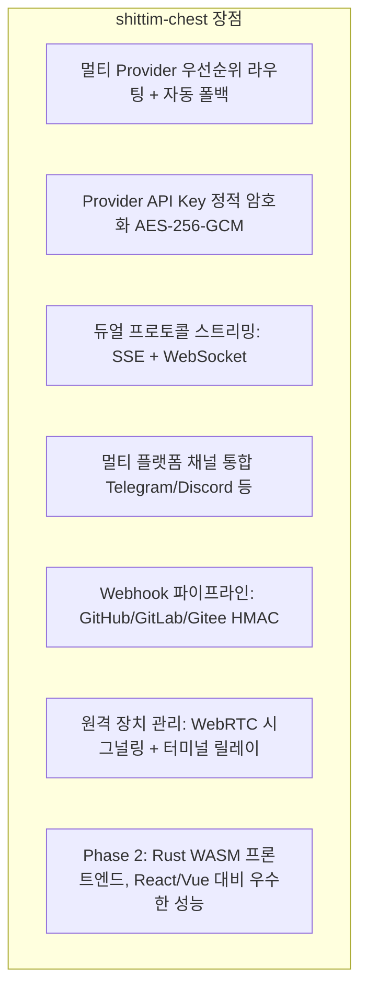

# 제품 포지셔닝 및 경쟁 구도

## 개요

shittim-chest는 느슨하게 결합된 LLM WebUI 플랫폼이며, 직접적인 경쟁 제품으로는 Open WebUI, LobeChat 등이 있다. entelecheia와의 통합은 선택적 기능이며, 아키텍처 전제 조건이 아니다.

## 핵심 포지셔닝

| 차원 | 설명 |
| --- | --- |
| 본질 | 독립형 멀티 Provider LLM 채팅 WebUI |
| 경쟁 제품 | Open WebUI, LobeChat, NextChat |
| entelecheia와의 관계 | 느슨한 결합: JWT 프록시를 통한 선택적 통합 |
| 독립성 | entelecheia 없이도 완전한 채팅 경험 제공 |

## Open WebUI와의 차별화

## entelecheia와의 경계

| shittim-chest | entelecheia |
| --- | --- |
| 사용자 인증 (argon2 + JWT) | 사용자 식별 + 권한 (RBAC) |
| 세션 관리 | Agent 오케스트레이션 (scepter) |
| 채팅 데이터 (대화/메시지) | Cosmos 컨테이너 런타임 |
| LLM Provider 관리 + 키 암호화 | IEPL TypeScript 실행 엔진 |
| Webhook 수신 (HMAC 검증 + 전달) | Agent 도구 호출 |
| 프론트엔드 렌더링 (arona) | WebSocket Agent 채널 |
| 원격 장치 세션 + 시그널링 릴레이 | polemos 장치 Agent |
| 멀티 플랫폼 채널 구성 | — |

**핵심 원칙**: shittim-chest는 "사용자 측" 데이터만 보유하고, entelecheia는 "Agent 측" 데이터만 보유한다. 양측은 JWT 인증 HTTP/WebSocket을 통해 통신하며, 서로의 데이터베이스에 접근하지 않는다.

## 아키텍처 진화 로드맵

| 단계 | 상태 | 내용 |
| --- | --- | --- |
| P1-P6 | 완료 | 독립형 채팅, 인증, Provider 관리, Webhook, 프록시 브리징, 장치 관리 |
| P7 | 계획 | 음성 입력/출력 (STT Docker 컨테이너 + TTS 프록시) |
| P8 | 계획 | PWA 모바일 + Tauri Mobile |
| P9 | 계획 | Rust WASM 프론트엔드 마이그레이션 (arona → Tairitsu) |

## 설계 철학

1. **독립형 우선**: 모든 핵심 기능은 entelecheia에 의존하지 않는다. `LLM_DEFAULT_PROVIDER_*` 환경 변수만으로 독립적으로 채팅을 실행할 수 있다.
1. **느슨한 결합 통합**: entelecheia 통합은 선택적 프록시 계층이다. 사용자는 LLM 채팅만 사용하거나, entelecheia를 통한 Agent 오케스트레이션을 활성화할 수 있다.
1. **점진적 WASM**: Vue 3 프론트엔드를 "살아있는 명세"로 먼저 제공하며, WASM 마이그레이션은 명확한 의사 결정 기준(프레임워크 성숙도, 생태계 적용 범위, 개발 대역폭)을 갖는다.
1. **Docker 네이티브**: 모든 서버 측 컴포넌트는 bollard Docker API를 통해 관리되며, docker-compose에 의존하지 않는다.
