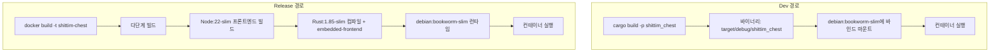

# 듀얼 모드 배포 경로: Dev vs Release

## 개요

shittim-chest는 두 가지 배포 모드를 지원한다: Dev(로컬 빠른 반복, Node 불필요, 이미지 빌드 불필요) 및 Release(프론트엔드 정적 파일이 내장된 전체 Docker 이미지). 두 모드는 동일한 컨테이너 토폴로지와 네트워크를 공유한다.

## 설계 동기

전체 Docker 이미지(Node 프론트엔드 빌드 + Rust 컴파일 + `embedded-frontend`)를 빌드하는 데 30초 이상이 소요되어, 일상적인 개발 반복에 적합하지 않다. Dev 모드는 호스트 머신의 증분 Rust 컴파일 캐시를 활용하여, 바이너리를 최소 런타임 컨테이너에 바인드 마운트하여 1초 미만의 재시작 시간을 달성한다.

## 경로 비교



| 차원 | Dev 모드 (`just dev`) | Release 모드 (`just up`) |
| --- | --- | --- |
| 프론트엔드 | Vite로 빌드, 백엔드가 `just dev`를 통해 제공 | 바이너리에 내장 (`embedded-frontend` 기능) |
| Node 필요 | 예 (Vite 빌드용) | 예 (Docker 내부) |
| 바이너리 소스 | 로컬 `cargo build` | Docker 내부에서 컴파일 |
| 컨테이너 베이스 이미지 | `debian:bookworm-slim` | `debian:bookworm-slim` (다단계 빌드 결과) |
| 재시작 속도 | < 5초 (증분 컴파일 후) | 30-60초 (전체 빌드) |
| 사용 사례 | 일상 개발, 디버깅 | CI/프로덕션 배포 |
| 컨테이너 실행 방식 | `Config.cmd = ["shittim_chest"]` | 이미지에 ENTRYPOINT 포함 |

## Dev 모드 구현 세부 사항

### 로컬 컴파일

```rust
async fn cargo_build() -> Result<()> {
    Command::new("cargo")
        .args(["build", "-p", "shittim_chest"])
        .status().await?;
}
```

컴파일 출력 경로는 `$PWD/target/debug/shittim_chest`로 고정된다 (디버그 프로필, 디버그 심볼 보존).

### 바인드 마운트 실행

```rust
let config = Config::<String> {
    image: Some("debian:bookworm-slim".into()),   // 최소 런타임
    cmd: Some(vec!["shittim_chest".to_string()]),
    host_config: Some(HostConfig {
        binds: Some(vec![
            format!("{bin_path}:/usr/local/bin/shittim_chest:ro")
        ]),
        network_mode: Some(NET.into()),
        port_bindings: ...,
        ..
    }),
    env: Some(container_env(password, port)),
    ..
};
```

주요 사항:

- 바이너리는 읽기 전용(`:ro`)으로 마운트되어 실수로 인한 컨테이너 내 수정을 방지한다
- 바이너리 위치는 `/usr/local/bin/shittim_chest`이며, 컨테이너 내부에서 직접 실행된다
- 베이스 이미지 `debian:bookworm-slim`이 필요한 glibc 런타임을 제공한다

### 마이그레이션 실행

마이그레이션은 원샷 컨테이너를 통해 실행된다:

```bash
docker run --rm --network shittim-chest \
  -v $PWD/target/debug/shittim_chest:/usr/local/bin/shittim_chest:ro \
  -e SHITTIM_CHEST_DATABASE_URL=... \
  debian:bookworm-slim \
  shittim_chest db-migrate
```

PG가 아직 완전히 준비되지 않은 경우를 처리하기 위해 자동으로 최대 5회(2초 간격) 재시도한다.

## Release 모드 구현 세부 사항

### Dockerfile 다단계 빌드

```dockerfile
# Stage 1: 프론트엔드 → Node:22-slim + pnpm → pnpm build:all → /app/dist/
# Stage 2: 빌더   → Rust:1.85-slim + COPY dist/ → cargo build --features embedded-frontend
# Stage 3: 런타임  → debian:bookworm-slim + ca-certificates + COPY 바이너리
```

### embedded-frontend 기능

```rust
# [cfg(feature = "embedded-frontend")]
{
    static FRONTEND_DIR: Dir<'_> = include_dir!("$CARGO_MANIFEST_DIR/../dist");
    // Axum 라우터에 /static/* 경로로 마운트됨
}
```

이 기능은 `include_dir!` 매크로를 사용하여 컴파일 시점에 프론트엔드 빌드 아티팩트를 바이너리에 내장한다. Release 모드에서는 추가 리버스 프록시 없이 전체 SPA를 제공할 수 있다.

## 마이그레이션 및 실행 함수 명명

혼동을 피하기 위해 코드는 명시적으로 두 함수 집합을 구분한다:

| Dev 경로 | Release 경로 |
| --- | --- |
| `run_migrate_dev()` | `run_migrate_release()` |
| `start_app_dev()` | `start_app_release()` |
| `cargo_build()` | `build_image()` |

## 프론트엔드 개발

Dev 모드에서 `dev.py`는 파일 변경 시 프론트엔드 에셋을 다시 빌드한다. 백엔드는 동일한 포트에서 정적 파일과 API를 모두 제공한다 (개발: `:3000`, 프로덕션: `:80`).
