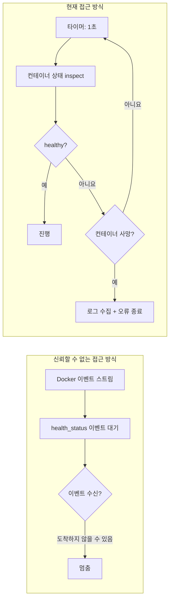

# PostgreSQL 헬스 체크 전략

## 개요

CLI 래퍼는 애플리케이션 컨테이너를 시작하기 전에 PostgreSQL이 준비되었는지 확인해야 한다. 이 문서는 Docker 이벤트(신뢰할 수 없음)와 고정 타임아웃(유연하지 않음)을 거부하는 수동 폴링 헬스 체크 전략의 설계 결정을 정의한다.

## Docker 이벤트를 사용하지 않는 이유



Docker 이벤트 스트림에서 `container` 필터는 `health_status` 이벤트에 대해 신뢰할 수 없으며, 특히 PG 컨테이너 재시작 후에는 이벤트가 전혀 발생하지 않아 CLI가 무기한 대기할 수 있다.

## 폴링 전략

```text
while true:
    sleep 1s
    state = docker.inspect_container(PG)
    if state.health.status == HEALTHY:
        break
    if !state.running:
        bail!(collect_logs(PG))
```

| 매개변수 | 값 | 근거 |
| --- | --- | --- |
| 폴링 간격 | 1초 | 충분한 응답성, inspect 오버헤드 없음 |
| 타임아웃 | 없음 | 하드 타임아웃 없음; PG는 콜드 스타트일 수 있음 |
| 사망 감지 | 매 폴링마다 | 컨테이너 없음 → 즉시 오류 및 마지막 50줄 로그 덤프 |

## PostgreSQL 컨테이너 헬스 구성

```rust
HealthConfig {
    test:        ["CMD-SHELL", "pg_isready -U shittim_chest"],
    interval:    5_000_000_000,   // 5초 (나노초)
    timeout:     5_000_000_000,   // 5초
    retries:     10,
    start_period: 30_000_000_000, // 30초 초기 유예 기간
}
```

| 매개변수 | 값 | 근거 |
| --- | --- | --- |
| `pg_isready` | 사용자 레벨 | TCP 포트 감지보다 더 신뢰성 있음; PG가 완전히 연결을 수락하는지 확인 |
| `interval: 5s` | 보통 | 빈번한 재시도와 로그 노이즈 방지 |
| `retries: 10` | 높음 | 마이그레이션 및 initdb에 시간이 소요될 수 있음; 충분한 재시도 |
| `start_period: 30s` | 길게 | pg18 initdb 최초 시작이 느릴 수 있음 |

## 데이터 볼륨 마운트 경로

```rust
Mount {
    target: "/var/lib/postgresql",     // pg18 새 경로
    source: "shittim-chest-pgdata",
    typ: MountTypeEnum::VOLUME,
}
```

pg18은 데이터 디렉터리를 `/var/lib/postgresql/data`에서 `/var/lib/postgresql`로 변경했다. 잘못된 경로를 사용하면 시작 후 PG가 데이터를 찾지 못한다.

## 마이그레이션 재시도

데이터베이스 마이그레이션은 독립적인 5회 재시도 로직을 갖는다:

```text
for retry in 0..5:
    execute docker run --rm ... shittim_chest db-migrate
    if success: break
    sleep 2s
```

`wait_healthy`가 반환된 후에도 PG가 여전히 복구를 완료하는 중이어서 마이그레이션이 실패할 수 있다. 짧은 재시도가 이 임계 구간을 처리한다.

## 로그 수집

컨테이너가 충돌하면 마지막 50줄의 로그가 자동으로 수집된다:

```rust
async fn collect_logs(docker: &Docker, name: &str) -> String {
    docker.logs(name, LogsOptions { tail: "50", stdout: true, stderr: true, .. })
}
```

이는 PG 시작 실패 디버깅에 매우 중요하다 — initdb 오류, 권한 문제, 포트 충돌 등은 컨테이너 로그에서만 확인할 수 있다.
