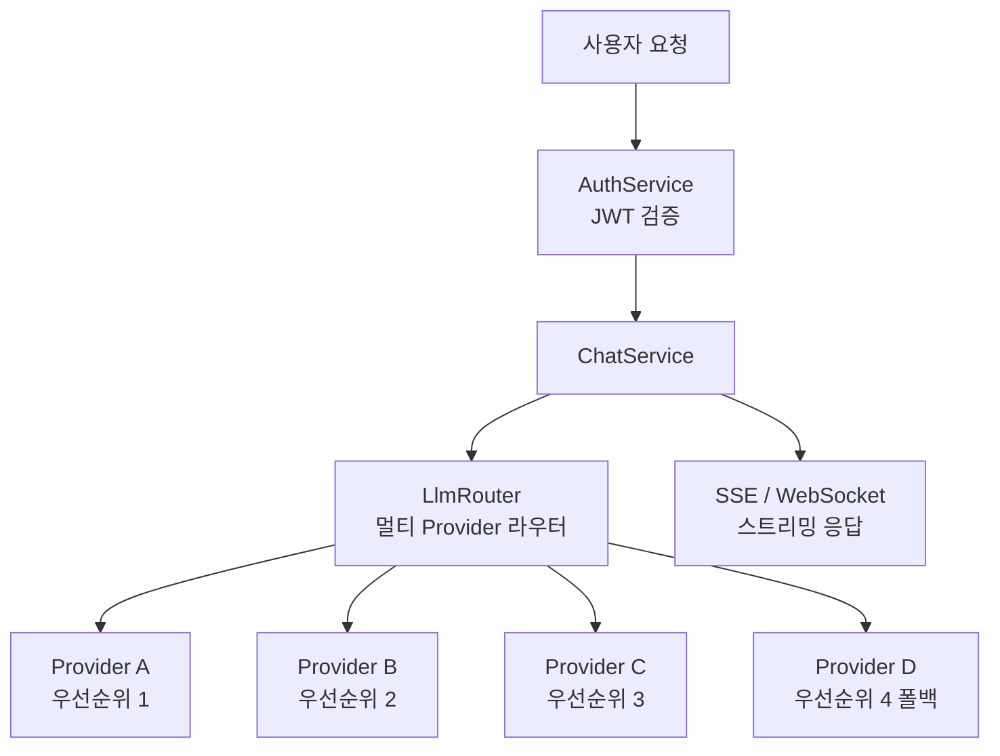
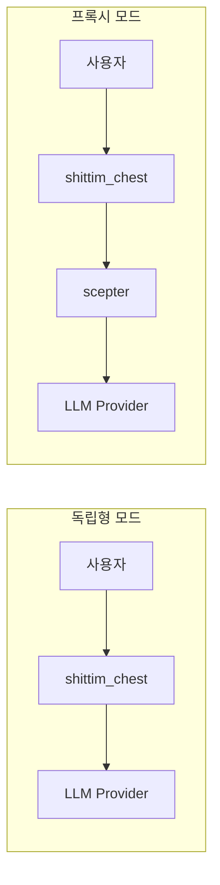

# 독립형 LLM 아키텍처

## 개요

shittim-chest는 entelecheia에 의존하지 않는 완전히 독립적인 LLM 라우팅 계층을 갖추고 있다. 사용자는 여러 LLM Provider를 구성할 수 있으며, 내장 라우터가 우선순위와 가용성에 따라 자동으로 선택한다. 이는 shittim-chest가 Open WebUI 대비 갖는 핵심 차별화 기능이다.

## 아키텍처



## 핵심 기능

### 1. 멀티 Provider 우선순위 라우팅

```text
각 Provider는 우선순위 필드를 가진다 (낮은 숫자 = 높은 우선순위).
요청은 높은 우선순위부터 낮은 순서로 시도된다:
  → Provider A (priority=1) 사용 가능 → 사용
  → 사용 불가 → Provider B (priority=2) 사용 가능 → 사용
  → 사용 불가 → ... → 오류 반환
```

### 2. 자동 폴백

더 높은 우선순위의 Provider가 오류(타임아웃, 속도 제한, 연결 불가)를 반환하면, 라우터는 자동으로 다음 사용 가능한 Provider로 전환하며, 이는 사용자에게 투명하게 이루어진다.

### 3. API 키 암호화 저장

모든 Provider API 키는 AES-256-GCM으로 정적 암호화되어 `shittim_chest_db`에 저장된다. 암호화 키는 `ENCRYPTION_KEY` 환경 변수를 통해 제공된다. 데이터베이스가 유출되더라도 API 키는 읽을 수 없다.

### 4. 듀얼 프로토콜 스트리밍

| 프로토콜 | 엔드포인트 | 사용 사례 |
| --- | --- | --- |
| SSE | `/api/chat/stream` | 간단한 HTTP 스트리밍, 프록시 호환, 브라우저 네이티브 지원 |
| WebSocket | `/ws/chat/stream` | 양방향 통신, 취소 및 실시간 상호작용 지원 |

### 5. OpenAI 호환성

모든 Provider 인터페이스는 OpenAI `/v1/chat/completions` 형식을 따르므로, 모든 OpenAI API 호환 서비스(DeepSeek, OpenAI, 로컬 Ollama/LM Studio 등)와 통합할 수 있다.

## Provider 관리

### 구성 소스

| 방법 | 사용 사례 |
| --- | --- |
| 환경 변수 (`LLM_DEFAULT_PROVIDER_*`) | 빠른 시작, 단일 Provider 시나리오 |
| 데이터베이스 CRUD (`/api/providers/*`) | 멀티 Provider, 동적 관리 |
| arona 관리자 패널 | 그래픽 관리 |

### 시드 Provider

최초 시작 시 `LLM_DEFAULT_PROVIDER_*` 환경 변수가 설정되어 있으면 `db-init`이 자동으로 시드 Provider를 생성한다. 추가 Provider는 이후 arona 관리자 패널을 통해 추가할 수 있다.

## 독립형 모드 vs 프록시 모드



| 모드 | 조건 | 동작 |
| --- | --- | --- |
| 독립형 | scepter 미구성 (또는 `Proxy: disabled`) | LLM Provider 직접 호출 |
| 프록시 | scepter URL 구성됨 | 프록시 계층을 통해 entelecheia Agent 처리로 전달 |

독립형 모드는 완전한 채팅 경험(대화 관리, 메시지 영속성, 검색, 내보내기)을 완벽하게 제공한다. 프록시 모드는 Agent 오케스트레이션 기능을 추가한다.

## 기술 구현

- **라우터**: `packages/shittim_chest/src/llm/router.rs`, 우선순위 선택 + 폴백 지원
- **클라이언트**: `packages/shittim_chest/src/llm/client.rs`, `reqwest` + `rustls` 기반 (OpenSSL 의존성 없음)
- **Provider CRUD**: `packages/shittim_chest/src/api/providers.rs`, 표준 REST 엔드포인트
- **암호화**: `aes-gcm` 크레이트, `ENCRYPTION_KEY` 환경 변수
