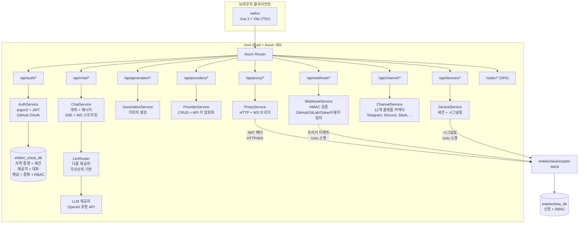
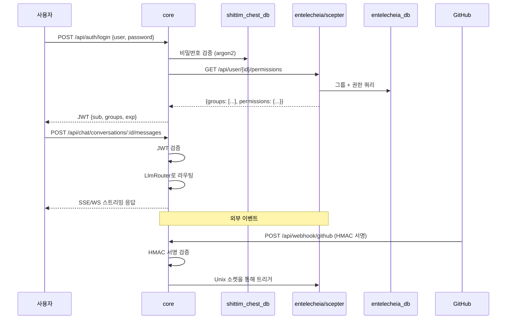

# 아키텍처

> **버전**: 0.1.0 — 활발한 개발 중.
> **최종 검증**: 2026-06-14
> 본 프로젝트는 [entelecheia](https://github.com/celestia-island/entelecheia)의 사용자 대면 셸입니다.

## 범위

shittim-chest는 하이브리드 Cargo + pnpm 모노레포입니다. entelecheia의 에이전트 오케스트레이션 코어를 감싸는 사용자 대면 계층을 소유합니다. 두 프로젝트는 JWT 인증 HTTP/WebSocket을 통해 통신하며 — shittim-chest는 에이전트 작업을 위해 entelecheia의 데이터베이스에 직접 접근하지 않습니다.

| 구성 요소 | 기술 | 역할 | 상태 |
| --- | --- | --- | --- |
| **core** | Rust + Axum | 통합 백엔드: 인증(JWT + OAuth), 독립적 LLM 라우팅, 채팅 API, 이미지 생성, 웹훅 수신, scepter 프록시, 원격 장치 시그널링, 채널 통합, 결제, RBAC, 워크스페이스 | 🟢 구현됨 |
| **cli** | Rust | Docker 오케스트레이터: dev, up, down, migrate, logs, status | 🟢 구현됨 |
| **webui** | Vue 3 + Vite (TSX) | 프론트엔드: 채팅 화면, 관리자 패널(20개 이상 뷰), 2D SCADA 토폴로지, 3D 홀로그래픽 미리보기 | 🟡 일부 |
| **프로토콜 타입** | Rust (`arona` 크레이트) + ts-rs | 외부 `arona` git 크레이트가 제공하는 JSON-RPC 2.0 프로토콜 타입; TS 바인딩은 webui에서 소비 | 🟢 구현됨 |
| **IDE 플러그인** | TS + Kotlin + Rust + Lua | VS Code, IntelliJ, Zed, Neovim, LSP 브리지 | 🟡 작동 |
| **Tauri 앱** | Rust + Tauri | 데스크톱, 모바일, 공유 DTO | 🟡 작동 |
| **harmony** | ArkTS | HarmonyOS 앱 | 🟡 작동 |

## 아키텍처 다이어그램

### core 백엔드 상세



### 프로젝트 간 통신



## 백엔드 모듈

모든 모듈은 `packages/core/src/` 아래에 있습니다. 백엔드는 135개 Rust 파일(테스트 파일 포함 138개)에 걸쳐 약 34K 라인입니다.

### 인증 (`packages/core/src/auth/`)

완전히 구현됨:

- argon2 해싱을 통한 사용자명/비밀번호 등록 및 로그인
- 순환 방식의 JWT 액세스 + 리프레시 토큰 시스템
- GitHub OAuth 2.0 통합 (리다이렉트 + 콜백, 사용자 자동 생성)
- 세션 관리 (`sessions` 테이블에 대한 CRUD)
- 모든 라우트에서 사용되는 토큰 검증 미들웨어

### 채팅 (`packages/core/src/chat/`)

완전히 구현됨:

- 대화 CRUD (생성, 목록, 조회, 업데이트, 삭제)
- LLM 라우팅을 통한 메시지 전송/수신
- SSE (Server-Sent Events) 스트리밍 응답 (`/api/chat/stream`)
- WebSocket 스트리밍 (`/ws/chat/stream`)
- ILIKE를 사용한 메시지 검색 (`/api/chat/search?q=`)
- 대화 내보내기 (`/api/chat/conversations/:id/export?format=json|md`)

### LLM (`packages/core/src/llm/`)

완전히 구현됨:

- 채팅 및 이미지 생성을 위한 OpenAI 호환 HTTP 클라이언트
- 우선순위 기반 선택 및 폴백이 있는 다중 제공자 라우터
- API 키 암호화(AES-256-GCM)가 있는 제공자 CRUD
- 모델 목록 및 제공자 테스트 엔드포인트
- 요청 타임아웃 및 스트리밍 버퍼 설정

### 생성 (`packages/core/src/generation/`)

완전히 구현됨:

- 이미지 생성 엔드포인트 (`/api/generation/images`, `/api/generation/models`)
- 구성된 LLM 제공자 사용

### 웹훅 (`packages/core/src/webhook.rs`)

완전히 구현됨 (~1,000+ 라인):

- HMAC-SHA256 검증이 있는 GitHub 웹훅
- 토큰 검증이 있는 GitLab 웹훅
- HMAC + 토큰 폴백이 있는 Gitee 웹훅
- 사용자 정의 웹훅 엔드포인트 (`/api/webhook/custom/{name}`)
- 중복 배달 감지 (LRU 캐시, 최대 10,000 ID)
- 목록 API가 있는 배달 로그
- 웹훅 소스를 위한 IP 화이트리스트 시스템 (별도 `webhook_ip_whitelist.rs`)
- Unix 소켓을 통한 scepter로의 트리거 전달

### 장치 (`packages/core/src/devices/`)

시그널링 릴레이 구현됨 (WebRTC 핸드셰이크에 외부 scepter 필요):

- 장치 목록, 상세, 세션 CRUD를 위한 REST 엔드포인트
- WebRTC용 WebSocket 시그널링 릴레이 — SDP offer/ICE candidate를 Unix 소켓을 통해 scepter로 전달; SDP answer는 scepter에서 와야 함(scepter 연결 불가 시 `forward_sdp_to_scepter`가 빈 문자열 반환)
- 터미널 릴레이 (WebSocket에서 xterm.js로) — 키 입력을 scepter로 전달
- 데스크톱 프레임 릴레이
- SFTP 파일 브라우저 백엔드
- 설정 가능: 사용자당 최대 세션, 프레임 버퍼 크기, ICE 서버
- 장치 모델 관리 (`device_models/` 모듈)

> **공백:** 릴레이는 실제이나 실행 중인 scepter 인스턴스 없이는 WebRTC 핸드셰이크를 완료할 수 없습니다. scepter가 다운되면 SDP answer가 비고 WebRTC는 정상적으로 실패합니다.

### 채널 (`packages/core/src/channel/`)

완전히 구현됨 (22개 모듈 파일 + `mod.rs`):

- 12개 플랫폼 커넥터: Telegram, Discord, Slack, Lark/Feishu, QQ Bot, WeCom, IRC, Matrix, Mattermost, Google Chat, Microsoft Teams, LINE
- 플랫폼별 실제 API 클라이언트 구현
- DM 정책 제어 (`dm_policy.rs`)
- 속도 제한 (`rate_limit.rs`)
- 상태 확인 (`health_check.rs`)
- 채널 페어링 (`pairing.rs`)
- 플러그인 시스템 (`plugin.rs`)
- 암호화된 자격 증명 저장 (`crypto.rs`)
- 중앙 레지스트리 (`registry.rs`) 및 라우트 (`routes.rs`)

### 추가 백엔드 모듈

| 모듈 | 설명 |
| --- | --- |
| `proxy/` | Scepter HTTP/WS 브리지 (`ws_bridge.rs`는 코드베이스에서 가장 큰 단일 파일) |
| `rbac/` | 역할 기반 접근 제어 |
| `workspace/` | 워크스페이스 관리 |
| `oauth.rs` | OAuth 제공자 통합 |
| `billing.rs` | Stripe 결제 통합 (웹훅 HMAC 검증, 결제/구독 이벤트, 할당량 집행, 결제 중복 제거) |
| `container/` | Docker 컨테이너 관리 |
| `cruise/` | Cruise (자동화 워크플로우) 지원 |
| `audio/` | 오디오/음성 서비스 지원 |
| `skills.rs` | **스텁** — 빈 배열 반환; 데이터베이스 지원 또는 scepter 통합 아직 없음 |
| `tools.rs` | **스텁** — 빈 배열 반환; 데이터베이스 지원 또는 scepter 통합 아직 없음 |
| `system_settings.rs` | 시스템 설정 |
| `trigger_forward.rs` | 이벤트 트리거 전달 |
| `quota_guard.rs` / `resource_quotas.rs` | 리소스 할당량 집행 |
| `avatar_platforms.rs` | 아바타 플랫폼 통합 |

### 데이터베이스

SeaORM 1.x를 통한 PostgreSQL, **5개 마이그레이션** 및 **25개 엔티티 모델**:

`auth_users`, `avatar_platforms`, `channel_configs`, `channel_messages`, `channel_pairings`, `channel_plugins`, `conversations`, `cruise_history`, `device_models`, `device_sessions`, `llm_providers`, `messages`, `oauth_connections`, `payment_events`, `projects`, `rbac_grants`, `rbac_groups`, `rbac_user_groups`, `remote_devices`, `scene_configs`, `sessions`, `system_settings`, `webhook_deliveries`, `workspace_alias_registry`, `workspace_sessions`

## 프론트엔드

### webui (`packages/webui/`)

TSX로 작성된 Vue 3 + Vite 프론트엔드 (`@vitejs/plugin-vue-jsx`를 통해 — `.vue` SFC 파일 없음). npm 패키지: `@celestia-island/webui`. 약 31K 라인.

#### 뷰

| 뷰 그룹 | 설명 |
| --- | --- |
| `demiurge/` | 메인 채팅 화면 (DemiurgeView) — 스트리밍 응답, 에이전트 상태, 도구 호출 |
| `auth/` | LoginView, RegisterView, SetupView |
| `admin/` | 20개 이상의 관리자 뷰: 대시보드, 제공자, 에이전트, RBAC, 웹훅, 채널, 시스템, 장치 모델, 장치 설정, 스킬, MCP 도구, OAuth 제공자, 토큰 사용량, 워크스페이스, 음성 서비스, 리소스 할당량 등 |
| `topology/` | 2D SCADA 토폴로지: TopologyOverview, TopologyBoxDetail, TopologyDeviceDetail. 전송은 실제(WS JSON-RPC가 scepter로 전달됨); **scepter 없이 TopologyOverview는 하드코딩된 `SIMULATED_DEVICES`(19개 데모 장치)와 중국어 텔레메트리 칩으로 폴백; TopologyBoxDetail은 빈 상태 표시** |
| `holographic/` | 3D 홀로그래픽 미리보기: HolographicOverview, HolographicBoxZoom, HolographicModelDetail. **3D 모델 로딩은 실제**(로컬 백엔드에서 실제 GLB 파일, 프로젝트, 장면 구성 로드); 텔레메트리 매개변수 칩은 scepter 필요, 실패 시 빈 상태로 폴백 |

#### 구성 요소 시스템

| 디렉터리 | 설명 |
| --- | --- |
| `base/` | 50개 이상의 `S` 접두사 디자인 시스템 구성 요소 (SButton, SCard, SModal, STable, STabs, STimeline, STreeView, SMarkdownRenderer, SMorphingTabs 등) |
| `chat/` | 채팅 전용 구성 요소 (ChatBubble, AgentStatusBar, FloatingChatBar, ThinkingDots, ReportViewer, NodeMinimap 등) |
| `header/` | 헤더 구성 요소 (breadcrumb 바, 모드 전환) |
| `layout/` | 앱 셸 (SAppShell, SSidebar, SDrawer, SWallpaperRenderer 등) |
| `preview/` | SCADA 심볼 라이브러리, 토폴로지, 홀로그래픽 구성 요소 |
| `cruise/` | Cruise 워크플로우 구성 요소 |
| `panels/`, `popups/`, `shared/` | 지원 UI |

#### 애니메이션 시스템

webui의 모든 CSS 구동 모션과 프레임별 샘플링은 `packages/webui/src/theme/animationBus.ts`가 소유한 **하나의 공유 rAF 루프**를 통해 실행됩니다 — 모든 대화상자, 모달, 팝업, 드로어, 토스트, 목록 전환이 등록해야 하는 "애니메이션 컨텍스트"입니다. 버스는 프로세스 수준 싱글톤입니다; 유휴 시 자체 종료되며 진행 중인 작업이 있을 때만 회전하므로, 유휴 탭은 프레임을 소비하지 않습니다.

버스는 네 가지 작업 등록 API와 두 개의 부채널 플래그를 노출합니다:

| API | 목적 | 프레임 모델 |
| --- | --- | --- |
| `onFrame(cb, priority?)` | 프레임별 콜백 등록. `priority` ∈ `sync` / `normal` / `idle`. `{ disconnect() }` 반환. | 매 프레임 호출(sync), ~30 Hz 예산으로 스로틀(normal), 또는 ~0.5 Hz 예산(idle). |
| `onceFrame(cb)` | 다음 프레임에 콜백 실행 후 자동 연결 해제. Fire-and-forget (취소 핸들 없음). | 일회성. |
| `scheduleFrame(cb)` | 다음 프레임에 콜백 실행; 실행 전 취소할 `{ disconnect() }` 반환. "많은 호출을 하나의 포스트 프레임 콜백으로 통합"하는 스로틀 패턴용(수동 `if(rafId)cancel; rafId=rAF(cb)` 관용구 대체). | 일회성 (취소 가능). |
| `reportTransition(durationMs)` | **선언적**: 프레임별 콜백 없이 "N 지속 시간의 CSS 트랜지션이 진행 중"임을 선언. 버스는 관찰자가 `onFrame`을 샘플링할 때 트랜지션 중간에 중단되지 않도록 해당 기간 동안 루프를 유지함. | 프레임당 비용 없음; 상태 전용. |
| `notifyScrollStart()` | 150ms 스크롤 기간 동안 `normal` 우선순위 콜백 억제(전력 절약; sync와 idle은 영향 없음). | 부채널 플래그. |
| `setReducedMotion(flag)` | 사용자의 `prefers-reduced-motion` / `html.reduce-motion` 클래스 존중 — 설정된 동안 **애니메이션** 루프 중단. 일회성(`onceFrame` / `scheduleFrame`)은 유틸리티 작업(측정, 플러시)이므로 애니메이션이 아니며 별도 드레이너 rAF에서 계속 소진되고 절대 일시 중지되지 않음. | 부채널 플래그. |

버스 위의 컴포저블 계층은 `packages/webui/src/composables/useReportedTransition.ts`입니다. **공유 `--duration-*` 토큰을 사용하여 CSS `transition` / `animation`을 실행하는 모든 구성 요소에 선호되는 인터페이스입니다.** 구성 요소 언마운트 시 자동 취소되고 빠른 토글을 통합합니다. 버스는 타임라인을 추적하고; CSS는 시각적 작업을 수행하며; 둘은 공유 토큰을 통해 동기화를 유지합니다.

```ts
// 단일 트랜지션 구성 요소 (대화상자 열기 또는 닫기 — 상호 배타적)
const anim = useReportedTransition(300);
function onBeforeEnter() { anim.run(); }
function onAfterEnter()  { anim.cancel(); }

// 중첩 트랜지션 (예: 항목이 동시에 들어오고 나가는 TransitionGroup)
// — 트랙별 분할로 나가기의 run()이 진행 중인 들어오기의 report를 취소하지 않도록:
const anim = useReportedTransition(300);
const enter = anim.track("enter");
const leave = anim.track("leave");
//   onBeforeEnter={enter.run} onAfterEnter={enter.cancel}
//   onBeforeLeave={leave.run} onAfterLeave={leave.cancel}
```

DOM 버스는 의도적으로 three.js 렌더 파이프라인을 위한 자체 rAF 루프를 소유한 **`packages/webui/src/composables/three/animationBus3D.ts`**와 분리되어 있습니다. 3D 프레임 타이밍이 DOM 트랜지션 스케줄링에 절대 영향을 주지 않아야 하며 그 반대도 마찬가지입니다; 둘은 독립적으로 일시 중지 또는 디버그할 수 있습니다. 둘 다 동일한 `onFrame → { disconnect }` 형태를 노출합니다.

**모션 토큰** (`packages/webui/src/theme/theme.scss`)은 지속 시간/이징의 단일 진실 소스입니다: 이동용 `--duration-instant/short/normal/long`, 불투명도/색상 페이드용 `--duration-fade`, 곡선용 `--ease-spring/out-expo/in-expo/standard`. `prefers-reduced-motion` / `html.reduce-motion`은 이동 토큰을 `0s`로 축소하나 **의도적으로 `--duration-fade`를 0이 아닌 값으로 유지**합니다 — 전정 기관을 자극하는 *이동*을 억제하되 상태 변화 불투명도는 억제하지 않는 것이 접근성 측면에서 올바른 동작입니다. 항상 `reportTransition(--duration-*)`를 사용하여 CSS 트랜지션의 버스 타임라인이 시각적 타임라인과 일치하도록 하십시오.

**적용 범위**: webui의 모든 2D-DOM rAF 지연이 이제 버스를 통합니다 — 연속 애니메이션용 `onFrame` / `reportTransition`, 일회성 유틸리티 지연(측정, 스로틀 재계산, 배치 플러시)용 `onceFrame` / `scheduleFrame`. 유일하게 남은 원시 `requestAnimationFrame` 호출 지점은 3D 파이프라인(자체 `animationBus3D.ts`가 있는 `composables/three/*`)과 버스 자체의 내부 루프 스케줄링입니다; 둘 다 의도적입니다. 새로운 작업은 절대 `requestAnimationFrame`을 직접 호출하지 말고 적절한 버스 API를 선택하십시오.

#### 임포트 경로

webui는 **두 개의 의도적으로 구별된 경로 별칭**(둘 다 `vite.config.ts` + `tsconfig.json`에서 선언)을 통해 자체 `src/`를 소비하며, 전체 코드베이스가 이 분할을 준수합니다:

| 별칭 | 해결 위치 | 사용 용도 |
| --- | --- | --- |
| `@/<path>` | `src/*` | **내부 딥 임포트** — 특정 모듈에 직접 접근 (`@/api/client`, `@/composables/useReportedTransition`, `@/theme/animationBus`). 약 600곳; 베어 배럴로 사용된 적 없음. |
| `@celestia-island/shared_ui` | `src/` (→ `src/index.ts` 배럴) | **큐레이션된 공개 API 표면만** — 항상 베어 지정자, 절대 코드 하위 경로 아님. 약 92곳. |

이 분할은 공개/비공개 경계를 강제합니다(패키지 `exports` 맵과 유사): 배럴(`src/index.ts`)만 "패키지로서" 임포트 가능하며, `@/`는 내부 코드가 구현 모듈에 접근할 수 있게 합니다. 배럴을 계약으로 취급하십시오 — 무언가를 공개로 만들 때 `src/index.ts`에 추가하십시오. 공유 디자인 시스템 자산(`theme/*.scss`, `res/*`)도 `shared_ui` 네임스페이스 아래에서 접근 가능합니다. 레거시 `@shared_ui` 별칭은 여전히 일부 SCSS `@use` 문에서 참조되는 `@celestia-island/shared_ui`의 중복입니다; 새로운 코드는 `@celestia-island/shared_ui`를 사용해야 합니다.

### 프로토콜 타입 (`arona` 크레이트)

JSON-RPC 2.0 프로토콜 타입과 공유 열거형은 외부 [`arona`](https://github.com/celestia-island/arona) Rust 크레이트가 제공하며, `Cargo.toml`에서 git 의존성으로 선언됩니다. 이 크레이트는 `ts-rs` 바인딩을 파생하여 `packages/webui/src/types/arona/`에 생성되고 `@celestia-island/arona` 경로 별칭을 통해 webui에서 소비됩니다.

### 관리자 패널

관리자 뷰는 `admin/` 라우트 그룹 아래 webui 내에 있습니다: 대시보드, 제공자 (CRUD + 제공자 추가 마법사), 에이전트, 에이전트 상세, RBAC (그룹 + 권한 부여), 웹훅, 채널, 시스템, 장치 모델, 장치 설정, 스킬, MCP 도구, OAuth 제공자, 토큰 사용량, 워크스페이스, 음성 서비스, 리소스 할당량.

### i18n

webui는 **`vue-i18n`**(사용자 정의 구현 아님)을 사용하며 **11개 선언된 로케일**: 아랍어 (`ar`), 독일어 (`de`), 영어 (`en`), 스페인어 (`es`), 프랑스어 (`fr`), 일본어 (`ja`), 한국어 (`ko`), 포르투갈어 (`pt`), 러시아어 (`ru`), 중국어 간체 (`zhs`), 중국어 번체 (`zht`).

각 로케일은 **17개 네임스페이스 JSON 파일**(admin, auth, chat, cmd, common, devices, errors, footer, help, logs, models, reports, skills, timeline, tokenUsage, tools, workspace)을 가집니다. 인앱 로케일 전환은 헤더 로케일 선택기를 통해 사용 가능합니다.

> **번역 완전성은 상당히 다양합니다** (950개 영어 참조 키 기준 감사):
> | 계층 | 로케일 | 영어 패스스루 | 키 공백 |
> |------|---------|-------------------|---------|
> | 잘 번역됨 | `ja`, `ko`, `zhs`, `zht` | ~5% | `zhs` 18개 키 누락; 기타 112개 누락 |
> | 대부분 번역됨 | `de`, `fr`, `pt`, `es`, `ar` | ~9–14% | 공유 112개 키 블록 누락 |
> | 사실상 미번역 | `ru` | **~76%** | 전체 키 동등하나 값이 그대로 영어 |
> 공유 112개 키 공백은 최신 기능을 다룹니다: `admin.agents.*`, `admin.deviceModels.*`, `admin.projects.*`, `admin.rbac.*`, `admin.resourceQuota.*`, `auth.protocol.*`, `chat.cruise.*`, `chat.voice_*`.

## RBAC 아키텍처

### 데이터 분할

데이터 소유권은 깨끗한 경계 유지를 위해 두 프로젝트 간에 분할됩니다:

| 데이터 | 데이터베이스 | 소유자 | 근거 |
| --- | --- | --- | --- |
| 사용자 자격 증명 (비밀번호 해시, OAuth, API 키) | shittim_chest_db | shittim-chest | 표현 계층이 로그인 흐름 소유 |
| 활성 세션, 리프레시 토큰 | shittim_chest_db | shittim-chest | 세션 관리는 프론트엔드 관심사 |
| 대화, 메시지 | shittim_chest_db | shittim-chest | 채팅 데이터는 사용자 대면 |
| LLM 제공자 설정 | shittim_chest_db | shittim-chest | 제공자 관리는 사용자 대면 |
| 채널 설정, 결제, 워크스페이스 | shittim_chest_db | shittim-chest | 사용자 대면 운영 데이터 |
| 사용자 신원, 그룹, 역할 할당 | entelecheia_db | entelecheia | 오케스트레이션 코어가 권한 집행 |
| GroupPermissions (제공자 할당량, 에이전트 화이트리스트) | entelecheia_db | entelecheia | 에이전트 수준 정책은 에이전트와 함께 |

### 인증 흐름

1. 사용자가 core를 통해 인증 (비밀번호 / OAuth)
1. core가 shittim_chest_db에 대해 자격 증명 검증 (비밀번호는 argon2)
1. core가 사용자의 그룹 권한을 entelecheia에 쿼리 (또는 TTL 캐시에서 읽음)
1. core가 `{ sub: user_id, groups: [...] }`를 포함한 JWT 발행
1. 모든 후속 요청이 JWT 전달 → core 검증 → 프록시 라우트에 대해 scepter로 전달
1. scepter가 JWT 검증 (환경 변수를 통한 공유 비밀키) 및 그룹 수준 권한 집행

## 프로젝트 간 의존성

### Rust 크레이트

shittim-chest는 celestia-island 생태계의 두 외부 크레이트에 의존합니다:

```toml
# 외부 프로토콜 크레이트 — shittim-chest와 entelecheia 간 공유
arona = { git = "https://github.com/celestia-island/arona.git", branch = "dev" }

# 버전화된 JSON 직렬화 (JSON/JSONB 열에 대한 읽기 시 마이그레이션)
hifumi = { path = "../hifumi/packages/types" }
```

`arona` 크레이트는 두 프로젝트에서 사용되는 JSON-RPC 프로토콜 타입과 공유 열거형을 제공합니다. `hifumi` 크레이트는 데이터베이스 열에 대한 버전화된 JSON 직렬화를 제공합니다.

### npm 패키지

webui는 `@celestia-island/arona` 경로 별칭을 통해 `arona` 크레이트의 TS 바인딩을 소비하며, 이는 `packages/webui/src/types/arona/`(`ts-rs` 출력이 도착하는 곳)를 가리킵니다. webui의 `@celestia-island/shared_ui`는 내부 임포트에 사용되는 `packages/webui/src/`로의 자체 별칭입니다.

## 현재 공백

> **본 섹션은 알려진 제한 사항과 미완성 영역을 문서화합니다.**

### Scepter 의존 기능

다음 기능은 shittim-chest에 실제 구현이 있으나 완전한 기능을 위해 실행 중인 [entelecheia/scepter](https://github.com/celestia-island/entelecheia) 인스턴스가 필요합니다:

| 기능 | 작동하는 것 | scepter가 필요한 것 |
| --- | --- | --- |
| 토폴로지 SCADA | WS 전송, SVG 렌더링, breadcrumb 탐색 | 실시간 텔레메트리 데이터 (scepter로 전달되는 `topology.*` RPC) |
| 홀로그래픽 3D | GLB 모델 로딩, 장면 구성, 카메라 제어 | 텔레메트리 매개변수 칩 |
| 장치 WebRTC | 시그널링 릴레이, JWT 인증, ICE 전달 | SDP answer 생성 |
| Cruise 대시보드 | 구성 요소 렌더링, WS 구독 | 실시간 에이전트 스트리밍 데이터 |
| Scepter 프록시 | HTTP/WS 브리지 (`ws_bridge.rs`, 2K 라인) | 모든 프록시된 에이전트 작업 |

scepter가 없으면 토폴로지는 `SIMULATED_DEVICES`(하드코딩된 데모 데이터)로 폴백; 홀로그래픽 칩과 장치 WebRTC는 빈/실패 상태 표시.

### i18n 공백

전체 감사는 위의 [i18n 섹션](#i18n)을 참조하십시오. 요약: `ru`는 구조적으로 완전하나 ~76% 영어 패스스루; 8개 로케일이 최신 기능의 112개 키 공백 공유.

### 테스트 커버리지

백엔드에는 인증, 채팅, 웹훅 HMAC 검증, 결제(8개 Stripe 서명 테스트), 워크스페이스 API에 대한 통합 테스트가 있습니다. 프론트엔드에는 컴포저블(`useToast`, `useConfirm`, `useSolarTime`, `useAsyncData`)과 유틸리티(검증, uuid, 오류)에 대한 단위 테스트가 있습니다.

**테스트되지 않은 영역:** 대부분의 CRUD 관리자 라우트, 채널 커넥터 API 호출(12개 커넥터 파일 모두 테스트 없음; `crypto.rs`와 `rate_limit.rs`만 테스트됨), 장치 시그널링 릴레이, 오디오 모듈(940라인, 테스트 없음), 토폴로지/홀로그래픽 페이지, IDE 플러그인 런타임, Tauri/HarmonyOS 앱 흐름. 약 65K 라인의 코드에 비해 커버리지가 얇습니다.

### 백엔드 스텁

`skills.rs`와 `tools.rs` REST 엔드포인트는 폴백 전용 스텁으로 남아 있으나(`[]` 반환), **기본 WS 경로는 완전히 연결됨** — `ws_bridge.rs`의 일반화된 알림-응답 브리지를 통해. 이 브리지는 webui 요청-응답 메서드를 scepter의 알림 스타일 페어링된 작업으로 변환합니다:

| WS 메서드 | Scepter 페어 | 상태 |
| --- | --- | --- |
| `skills.list` | `Skill.ListSkills` → `SkillsListResponse` | ✅ 브리지됨 (필드 매퍼) |
| `tools.list` | `Mcp.ListTools` → `ToolsListResponse` | ✅ 브리지됨 (필드 매퍼) |
| `layer2.agents.list` | `Tui.Layer2AgentList` → Response | ✅ 브리지됨 (신원) |
| `layer2.tools.list` | `Tui.Layer2AgentMcpTools` → Response | ✅ 브리지됨 (에이전트별 상관) |
| `layer2.skills.list` | `Tui.Layer2AgentSkills` → Response | ✅ 브리지됨 (에이전트별 상관) |

새로운 브리지 메서드를 추가하려면 `ws_bridge.rs`의 `NOTIFICATION_BRIDGES`에 항목을 추가하십시오 — 새로운 핸들러 함수가 필요하지 않습니다. REST 엔드포인트(`skills.rs`, `tools.rs`)는 WS를 사용할 수 없을 때 HTTP 폴백으로만 사용됩니다.

`chat.stop`은 이제 `request.cancel`을 scepter로 전달하여(클라이언트 측 스트림 표시 지우기뿐 아니라 `cancel_active_request()`를 통해 실행 중인 스킬 체인 중단).

### 모의 모드

백엔드에는 개발용으로 JWT 검증과 HMAC 검사를 건너뛰는 `SHITTIM_CHEST_MOCK_MODE` 환경 플래그(`config.rs`)가 있습니다. 이는 **보안 우회**이지 데이터 시뮬레이션 계층이 아닙니다 — 큰 경고를 출력하며 프로덕션에서 절대 사용해서는 안 됩니다.

## 라이선스

| 매개변수 | 값 |
| --- | --- |
| 상업 라이선스 | Business Source License 1.1 (BUSL-1.1) |
| 비상업적 사용 | Synthetic Source License 1.0 (SySL-1.0) |
| 추가 사용 허가 | 내부 프로덕션, 학술, 정부, 비상업적 사용 허용 |
| 제한 사항 | 제3자 호스팅/관리/재판매 서비스는 상업 라이선스 필요 |
