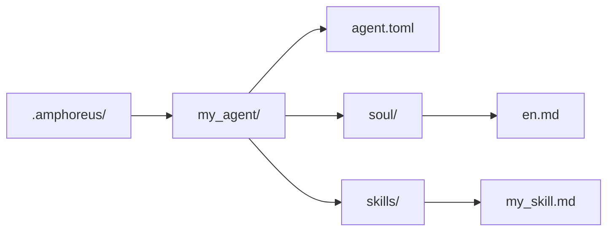

+++
title = "Agent 개발 튜토리얼"
description = """> 현재 저장소의 실제 구현을 기준으로 한 Agent 개발 설명"""
lang = "ko"
category = "guides"
subcategory = "core"
+++

# Agent 개발 튜토리얼

> 현재 저장소의 실제 구현을 기준으로 한 Agent 개발 설명

## 개요

현재 저장소에는 세 가지 실제 사용 가능한 확장 계층이 있습니다.

| 계층 | 현재 의미 |
| --- | --- |
| Layer1 | Rust crate으로 구현되어 workspace에 컴파일되는 핵심 Agent |
| Layer2 | Web Automation이라는 활성 내장 도메인 Agent와 일부 아카이브 또는 계획 자료 |
| Layer3 | 사용자 정의 Agent（계획 중, 아직 구현되지 않음） |

과거 문서에 등장하는 모든 Layer2 방안을 현재도 활성화된 내장 Agent로 이해해서는 안 됩니다.

## Layer3가 가장 간단한 확장 경로입니다

> **주의**: Layer3는 현재 설계 단계에만 있습니다. `.amphoreus/` 디렉터리, Agent 로더(`Layer3Workspace`) 및 구성 프레임워크는 아직 구현되지 않았습니다. 본 절에서는 향후 사용될 목표 설계를 설명합니다.

Entelecheia(현추)를 확장하고 싶지만 Rust workspace를 수정하지 않으려면, Layer3를 우선 사용하십시오(구현 후).

### 최소 구조

### Layer3가 현재 제공할 수 있는 것

- 프롬프트 기반 soul 파일
- 프롬프트 기반 skill
- 기존 플랫폼 도구 재사용
- 로드 시 사전 검사 스캔

### Layer3가 현재 자동으로 제공할 수 없는 것

- 새로운 Rust MCP 백엔드
- 완전한 샌드박스 보장
- 모든 skill/tool 경로의 생산 환경 사용 가능성

## 내장 Agent 개발

내장 Agent는 `packages/agents/<agent>/` 아래에 위치한 Rust crate입니다.

일반적인 구성 요소:

- `src/lib.rs`
- `src/state.rs`
- `src/skills.rs`
- `src/mcp/registry.rs`
- `src/mcp/tools/*.rs`

또한 `res/prompts/agents/<agent>/` 아래에 해당 문서를 유지 관리해야 합니다.

## 현재 Layer2에 대한 권장 사항

저장소에는 과거에 많은 Layer2 도메인 Agent 설계가 포함되어 있었습니다. 현재는 다음과 같이 이해해야 합니다:

- 현재 workspace에서 활성화된 내장 Layer2 crate은 Web Automation입니다
- 이전 Layer2 문서의 많은 부분은 설계 목표 또는 아카이브 자료를 설명합니다
- 새로운 내장 Layer2 개발은 실제 제품 개발로 간주되어야 하며, 단순히 문서 복원만으로 "활성화"할 수 있는 것이 아닙니다

## 현재 보안 안내

- 사전 검사 스캔은 존재하지만, 여전히 키워드 기반 규칙 스캔입니다.
- 도구의 사용 가능 여부는 해당 MCP 도구의 실제 구현에 따라 달라집니다.
- 문서에 언급된 일부 도구와 skill은 여전히 부분 구현 또는 스텁(stub)일 수 있습니다.

## 참조 경로

- `packages/shared/custom_agent/src/`
- `packages/agents/hubris/`
- `packages/agents/kalos/`
- `packages/agents/aporia/`
- `res/prompts/agents/`

## 테스트 권장 사항

현재는 다음에 대한 직접 검증을 더 권장합니다:

- Layer3의 구문 분석 및 로드
- skill 구문 분석
- Rust에서 MCP 도구의 직접 테스트
- 실제로 수정한 agent/tool 경로

이전 아키텍처 문서를 "특정 Layer2 경로가 이미 활성화되어 있다"는 증거로 간주해서는 안 됩니다.
