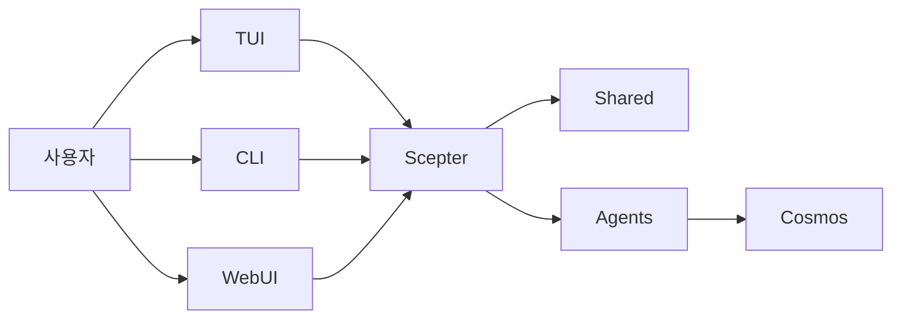

# 아키텍처

> 현재 런타임 구조를 기준으로 한 설명으로, 목표 상태의 상상도가 아닙니다

## 런타임 개요

현재 플랫폼의 핵심은 `packages/scepter`, `packages/shared`, `packages/tui`입니다.

## 현재 가장 성숙한 부분

- Scepter 서버 오케스트레이션
- Shared의 구성, 도구명, 프롬프트 및 상태 유형
- TUI 사용자 경로
- 컨테이너 기반 실행 경로

## 현재 부분 구현 상태인 부분

- CLI 명령 커버리지
- 고급 memory / RAG 통합
- 대부분의 도메인 특화 Layer2 방안

## 현재 활성 Agent 구조

### Layer1

workspace는 현재 12개의 Layer1 Agent를 컴파일하며, 메시지 라우팅, 계획, 파일, 컨테이너, 스크립트, 지식, 검색, 스케줄링, 보안, 메모리 및 장치 관련 기능을 다룹니다.

### Layer2

현재 workspace에는 두 개의 활성 내장 Layer2 crate이 있습니다: **Web Automation**(브라우저 자동화) 및 **클래식 소프트웨어 엔지니어링**(정적 분석, 코드 리뷰, 품질 측정, 리팩터링, LSP 진단/심볼/리팩터링). 이전 문서에 나열된 11개의 전용 Agent는 이 두 가지 외에 아카이브되었거나 계획 중인 내용을 설명합니다.

### Layer3

Layer3는 여전히 `.amphoreus/` 기반의 사용자 정의 Agent 확장 지점입니다(설계 단계, 아직 구현되지 않음).

## 실행 모델

### 모델 가시 도구

모델은 일반적으로 다음만 볼 수 있습니다:

- `exec`
- `write_to_var`
- `write_to_var_json`

내부 MCP 도구는 런타임을 통해 간접적으로 호출됩니다.

### 프로세스 내 경로와 컨테이너 경로

일부 로직은 Scepter 프로세스 내에서 실행되며, 다른 작업은 컨테이너화된 경로와 런타임 보조 모듈을 통해 완료됩니다.

### WebUI / IDE / Tauri

Web UI(arona), 관리 패널(malkuth), IDE 플러그인 및 Tauri 애플리케이션은 자매 프로젝트 **shittim-chest**로 이전되었으며 본 저장소에서 제거되었습니다. 본 저장소의 기본 인터페이스는 **TUI**이며, Web/IDE 계층은 shittim-chest에 위치하여 JWT + WebSocket/HTTP를 통해 Scepter와 통신합니다.

## Memory 및 지식 기능

RAG와 memory는 이전 개요보다 더 성숙하지만, 여전히 일부 통합 글루(glue) 코드가 보완되어야 합니다:

- 세 가지 임베딩 백엔드 구현: API(OpenAI 호환), 로컬 ONNX 추론(`FastEmbeddingService`, 기본 BGE-M3), SHA-256 해시 폴백
- 메모리 상태 벡터 문서와 **PgVector** 저장소(HNSW 인덱스) 모두 사용 가능
- 그래프 탐색 및 하이브리드 검색(RRF 융합) 사용 가능
- embedding→RAG 자동 연결 및 RAG 구독 동기화는 아직 통합 대기 중
