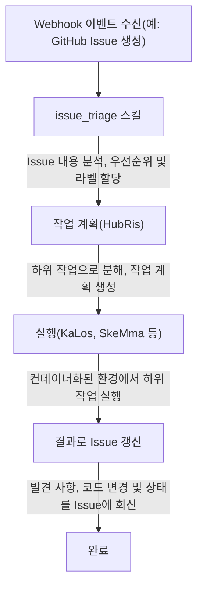

# Issue 추적 통합

> 외부 Issue 추적 시스템을 Entelecheia(현추)의 Agent 워크플로에 연결
> 현재 상태 설명: HubRis는 현재 실제로 issue 생성, 갱신, 검색 및 댓글 보조 기능을 제공하며, 저장소에도 webhook 통합이 존재합니다. 그러나 본 문서를 "완전히 통합된 크로스 플랫폼 issue 제품 표면이 이미 존재한다"고 이해해서는 안 됩니다.

---

## 목차

- [개요](#개요)
- [컨테이너 3계층 식별](#컨테이너-3계층-식별)
- [바인딩 ID 형식](#바인딩-id-형식)
- [Agent가 Issue와 상호 작용하는 방법](#agent가-issue와-상호-작용하는-방법)
- [Issue 기반 워크플로](#issue-기반-워크플로)
- [플랫폼 프리픽스 레지스트리](#플랫폼-프리픽스-레지스트리)
- [컨테이너 Fork 브랜치 네이밍](#컨테이너-fork-브랜치-네이밍)
- [WebUI 통합](#webui-통합)

---

## 개요

현재 Entelecheia의 issue 관련 기능은 주로 두 가지 방향에서 비롯됩니다:

- webhook 통합으로 외부 이벤트를 시스템에 전달 가능
- HubRis가 issue 스타일의 CRUD 보조 기능 제공

크로스 플랫폼 issue 자동화는 이미 존재하는 방향 및 부분 구현으로 볼 수 있지만, 본 문서의 모든 워크플로가 이미 완전히 폐쇄 루프를 형성했다고 기본적으로 가정해서는 안 됩니다.

---

## 컨테이너 3계층 식별

Entelecheia의 컨테이너는 서로 다른 컨텍스트에서 신원을 유지하기 위해 3계층 ID 시스템을 사용합니다:

| 계층 | 형식 | 수명 주기 | 용도 |
| --- | --- | --- | --- |
| UUID | 표준 UUID(예: `550e8400-e29b-41d4-a716-446655440000`) | 영구 | 데이터베이스 기본 키, 재시작 간 추적 |
| 바인딩 ID | `@platform#id`(예: `@github#234`) | 안정적 | 외부 자원 바인딩, 브랜치 네이밍 |
| 런타임 ID | `#xxx`(예: `#616`) | 세션별 | TUI 표시, Unix socket 라우팅 |

**바인딩 ID**는 컨테이너를 외부 플랫폼 자원에 연결합니다. 이는 Scepter 재시작 후에도 안정적으로 유지되며, 런타임 ID가 매번 시작 시 재할당되는 것과 다릅니다.

---

## 바인딩 ID 형식

바인딩 ID의 일반 형식:

```text
@platform#id[@#floor]
```

- `platform` — 플랫폼 프리픽스(예: `github`, `gitee`, `gitlab`)
- `id` — 플랫폼 상의 Issue 또는 자원 번호
- `@#floor` — 선택적 층수(floor) 번호, 중첩 참조용(예: 댓글)

### 예시

| 바인딩 ID | 의미 |
| --- | --- |
| `@github#123` | GitHub Issue #123 |
| `@gitee#456` | Gitee Issue #456 |
| `@gitlab#789` | GitLab Issue #789 |
| `@github#123@#5` | GitHub Issue #123의 5번째 댓글 |
| `@feishu#abc123` | Feishu 메시지 스레드 abc123 |

바인딩 ID의 용도:

- 컨테이너 라벨 및 메타데이터
- Issue 기반 개발의 브랜치 이름
- Agent 스킬 매개변수
- WebUI Issue 목록 필터링

---

## Agent가 Issue와 상호 작용하는 방법

Agent는 HubRis MCP 도구를 통해 외부 Issue와 상호 작용합니다. 이 도구들은 플랫폼별 API를 캡슐화합니다:

### 사용 가능한 Issue 작업

| 도구 | 설명 |
| --- | --- |
| `$.agent.HubRis.issue_create()` | 외부 플랫폼에 새 Issue 생성 |
| `$.agent.HubRis.issue_update()` | 기존 Issue 갱신(제목, 본문, 상태, 라벨) |
| `$.agent.HubRis.issue_search()` | 플랫폼 간 Issue 검색 및 필터 적용 |
| `$.agent.HubRis.issue_comment()` | 기존 Issue에 댓글 추가 |

### exec 코드에서 사용

```typescript
$.agent.HubRis.issue_create({
  platform: "github",
  repository: "celestia-island/entelecheia",
  title: "Fix WebSocket reconnection logic",
  body: "The WebSocket client does not retry on connection loss.",
  labels: ["bug", "priority:high"]
});
```

```typescript
$.agent.HubRis.issue_search({
  platform: "github",
  repository: "celestia-island/entelecheia",
  state: "open",
  labels: ["bug"]
});
```

```typescript
$.agent.HubRis.issue_comment({
  binding_id: "@github#123",
  body: "Investigation complete. Root cause identified in src/ws/client.rs:42."
});
```

---

## Issue 기반 워크플로

기본 Issue 기반 워크플로는 다음 파이프라인을 따릅니다:



### 단계별 예시

1. 개발자가 "Memory leak in container cleanup" 제목의 Issue `@github#42` 생성
1. GitHub Webhook이 이벤트를 Scepter에 전달
1. `issue_triage` 스킬이 이를 **bug**, 우선순위 **high**로 분류
1. HubRis가 작업 분해: (a) 누수 재현 (b) 근본 원인 찾기 (c) 수정 구현
1. KaLos가 관련 소스 파일 읽기, SkeMma가 진단 스크립트 실행
1. Agent가 수정 사항을 커밋하고 `@github#42`에 해결 방안 댓글 작성

---

## 플랫폼 프리픽스 레지스트리

플랫폼 프리픽스 매핑은 구성 가능합니다. 기본 레지스트리에는 다음이 포함됩니다:

| 프리픽스 | 플랫폼 | Issue URL 패턴 |
| --- | --- | --- |
| `github` | GitHub | `https://github.com/{repo}/issues/{id}` |
| `gitee` | Gitee | `https://gitee.com/{repo}/issues/{id}` |
| `gitlab` | GitLab | `https://gitlab.com/{repo}/-/issues/{id}` |
| `feishu` | Feishu / Lark | 내부 메시지 링크 |
| `discord` | Discord | 채널 메시지 링크 |
| `telegram` | Telegram | 채팅 메시지 링크 |

### 국제화 지원

플랫폼 프리픽스는 국제화된 이름을 지원합니다. 예를 들어, Feishu는 다음 방식으로 참조할 수 있습니다:

- `@feishu#123`(영문 이름)
- `@飞书#123`(중문 이름)

프리픽스 레지스트리는 내부적으로 이를 표준 프리픽스로 정규화합니다.

---

## 컨테이너 Fork 브랜치 네이밍

Agent가 Issue 기반 작업을 위해 브랜치를 생성할 때, 브랜치는 네이밍 규칙을 따릅니다:

### 형식

```text
cosmos-<binding_id>-<reason>
```

또는

```text
cosmos-<uuid8>-<reason>
```

### 예시

| 브랜치 이름 | 컨텍스트 |
| --- | --- |
| `cosmos-@github#42-fix-memory-leak` | GitHub Issue #42 수정 |
| `cosmos-@gitee#15-add-ci-pipeline` | Gitee Issue #15 기능 개발 |
| `cosmos-a1b2c3d4-refactor-auth-module` | UUID 프리픽스를 사용한 내부 작업 |

바인딩 ID 형식은 브랜치가 원래 Issue로 추적될 수 있도록 보장합니다.

---

## WebUI 통합

Entelecheia WebUI는 연결된 모든 플랫폼의 Issue를 통합된 뷰로 제공합니다.

### 좌측 사이드바 — 집계 Issue 목록

- 모든 플랫폼의 Issue를 단일 목록에 표시
- 각 레코드 표시: 플랫폼 아이콘, Issue 번호, 제목, 상태, 할당된 Agent
- Issue 클릭 시 상세 보기 열기

### 필터링

Issue는 다음 조건으로 필터링할 수 있습니다:

- **플랫폼**: GitHub, Gitee, GitLab 등만 표시
- **상태**: 열림, 닫힘, 진행 중
- **우선순위**: 높음, 중간, 낮음(라벨에서 파생)
- **할당된 Agent**: 현재 해당 Issue를 처리 중인 Agent로 필터링

### Issue 상세 보기

상세 보기는 다음을 표시합니다:

- 전체 Issue 제목 및 본문(Markdown에서 렌더링)
- 플랫폼 링크(브라우저에서 원본 Issue 열기)
- Agent 활동 로그(스킬 호출, 게시된 댓글)
- 연결된 컨테이너 및 브랜치

---

## 다음 단계

- [Webhook 플랫폼 설정](webhook-setup.md)을 읽고 플랫폼 연결하기
- [아키텍처](architecture.md)를 탐색하여 HubRis Agent 설계 이해하기
- IDE 통합은 [shittim-chest](https://github.com/celestia-island/shittim-chest) 형제 저장소로 이전되었습니다
