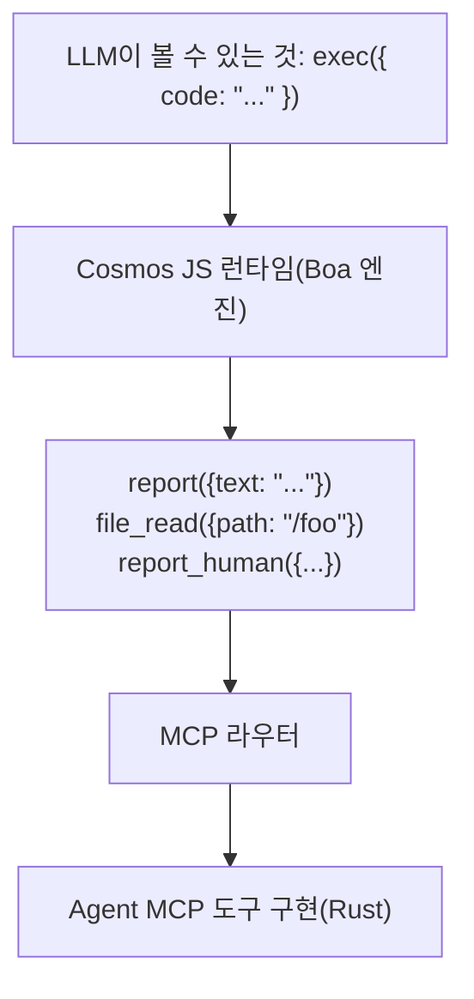
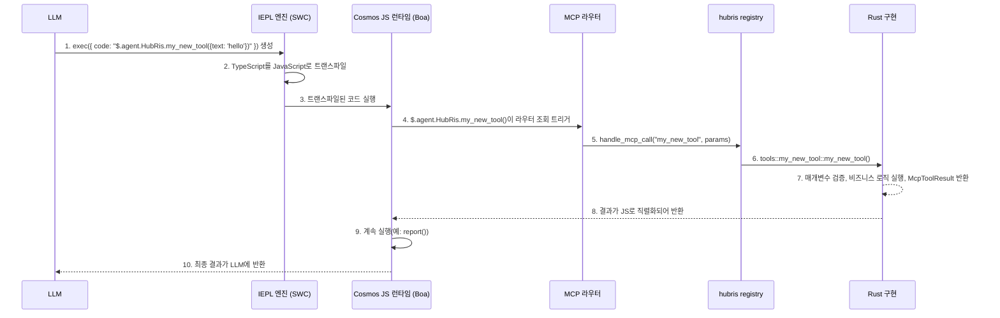

# MCP 도구 개발 튜토리얼

> Entelecheia(현추) 플랫폼에서 MCP 도구를 생성하고 등록하는 방법

---

## 목차

- [Exec-Only 마이크로커널](#exec-only-마이크로커널)
- [MCP 도구 구조](#mcp-도구-구조)
- [새로운 MCP 도구 추가](#새로운-mcp-도구-추가)
- [모범 사례](#모범-사례)
- [MCP 도구 테스트](#mcp-도구-테스트)

---

## Exec-Only 마이크로커널

Entelecheia는 도구 접근에 **마이크로커널 아키텍처**를 사용합니다. LLM은 `exec`, `write_to_var`, `write_to_var_json`의 세 가지 도구만 볼 수 있으며, 모든 실제 작업은 TypeScript 런타임(IEPL 엔진) 내부에서 수행됩니다.



**핵심 원칙**: LLM은 MCP 도구를 직접 호출하지 않습니다. 대신 ES 모듈 가져오기를 통해 도구 함수 API를 호출하는 TypeScript 코드를 생성하고(예: `import { report } from 'hubris'; report()`), IEPL 엔진이 이를 JavaScript로 트랜스파일하여 실제 Rust 구현으로 디스패치합니다.

- ES 모듈 가져오기 — 일반 패턴(예: `import { report } from 'hubris'; report()`, `file_read()`)
- `exec`, `write_to_var`, `write_to_var_json`은 모든 Agent에 등록된 유일한 세 가지 도구입니다(`packages/shared/domain_skills/src/tool_names.rs:265-283` 참조)

Skill의 TOML frontmatter에 있는 `related_tools` 선언은 LLM에 전송되는 프롬프트에서 어떤 ES 모듈 가져오기 API가 문서화될지 결정합니다.

---

## MCP 도구 구조

MCP 도구는 세 부분으로 구성됩니다:

1. **Rust 구현** — 실제 로직, `packages/agents/<agent>/src/mcp/tools/`에 위치
1. **Registry 디스패치** — 라우팅, `packages/agents/<agent>/src/mcp/registry.rs`에 위치
1. **도구 이름 상수** — 문자열 상수, `packages/shared/domain_skills/src/tool_names.rs`에 위치

### mcp/registry.rs의 도구 정의

각 Agent에는 도구 이름을 해당 구현으로 라우팅하는 `handle_mcp_call` 함수가 있습니다:

```rust
// packages/agents/kalos/src/mcp/registry.rs

use serde_json::Value;
use tracing::info;
use crate::{mcp::tools, state::KalosState};
use _shared::skills::{mcp_tools::McpToolResult, tool_names};

pub async fn handle_mcp_call(
    state: &std::sync::Arc<tokio::sync::RwLock<KalosState>>,
    tool_name: &str,
    parameters: Value,
) -> McpToolResult {
    info!("Calling Kalos MCP tool: {}", tool_name);

    match tool_name {
        tool_names::kalos::FILE_READ => tools::file_read(state, parameters).await,
        tool_names::kalos::FILE_WRITE => tools::file_write(state, parameters).await,
        tool_names::kalos::FILE_EDIT => tools::file_edit(state, parameters).await,
        // ...
        _ => McpToolResult::failure(format!("Unknown tool: {}", tool_name)),
    }
}
```

### validate_required_params를 사용한 매개변수 검증

필수 매개변수가 있는 도구의 경우, 공유 검증 보조 함수를 사용합니다:

```rust
use _shared::skills::mcp_tools::validate_required_params;

pub async fn my_tool(parameters: Value) -> McpToolResult {
    if let Some(failure) = validate_required_params(
        &parameters,
        &["title", "content"],  // 필수 매개변수 이름
        "my_tool",              // 오류 메시지에 사용할 도구 이름
    ) {
        return failure;
    }

    let title = parameters.get("title").unwrap().as_str().unwrap();
    // ...
}
```

`validate_required_params`는 각 필수 매개변수가 존재하며 비어 있지 않은 문자열인지 확인합니다. 모두 유효하면 `None`을 반환하고, 그렇지 않으면 설명적인 오류 정보가 포함된 `Some(McpToolResult::failure(...))`를 반환합니다.

참조: `packages/shared/domain_skills/src/mcp_tools.rs:12-41`.

### 반환값: McpToolResult

각 도구는 `McpToolResult`를 반환해야 합니다. 주요 생성자:

```rust
// 성공 및 임의의 JSON 데이터 반환
McpToolResult::success(serde_json::to_value(my_struct).unwrap_or_default())

// 성공 및 직렬화 가능한 구조체 반환
McpToolResult::success_struct(&my_result)

// 성공 및 일반 텍스트 반환
McpToolResult::success_text("Operation completed".into())

// 성공 및 LLM 사용량 추적 포함
McpToolResult::success_with_usage(
    "Result text".into(),
    Some("gpt-4".into()),
    Some((prompt_tokens, completion_tokens)),
)

// 실패 및 오류 메시지 반환
McpToolResult::failure("Missing required parameter: title".into())

// 실패 및 여러 오류 반환
McpToolResult::failure_lines(vec!["Error 1".into(), "Error 2".into()])
```

참조: `packages/shared/domain_skills/src/mcp_tools.rs:62-136`.

---

## 새로운 MCP 도구 추가

본 단계별 가이드는 HubRis를 예시로 하여 기존 Agent에 새 도구를 추가하는 방법을 보여줍니다.

### 단계 1: 도구 이름 상수 추가

`packages/shared/domain_skills/src/tool_names.rs` 편집:

```rust
/// HubRis tool names
pub mod hubris {
    pub const REPORT: &str = "report";
    pub const CREATE_TODO: &str = "create_todo";
    // ... 기존 도구 ...
    pub const MY_NEW_TOOL: &str = "my_new_tool";  // 이 줄 추가
}
```

### 단계 2: 도구 구현

새 파일 `packages/agents/hubris/src/mcp/tools/my_new_tool.rs` 생성:

```rust
use serde::Serialize;
use serde_json::Value;
use std::sync::Arc;
use tokio::sync::RwLock;

use crate::state::HubrisState;
use _shared::skills::mcp_tools::{validate_required_params, McpToolResult};

# [derive(Serialize, Debug, Clone)]
struct MyNewToolResult {
    id: String,
    message: String,
}

pub async fn my_new_tool(
    state: &Arc<RwLock<HubrisState>>,
    parameters: Value,
) -> McpToolResult {
    if let Some(failure) = validate_required_params(&parameters, &["text"], "my_new_tool") {
        return failure;
    }

    let text = parameters.get("text").and_then(|v| v.as_str()).unwrap();
    let id = uuid::Uuid::now_v7().to_string();

    let result = MyNewToolResult {
        id,
        message: format!("Processed: {}", text),
    };

    McpToolResult::success(serde_json::to_value(result).unwrap_or_default())
}
```

### 단계 3: 모듈에 등록

`packages/agents/hubris/src/mcp/tools/mod.rs` 편집:

```rust
pub mod report;
pub mod todo_ops;
pub mod my_new_tool;  // 이 줄 추가
```

### 단계 4: Registry 디스패치에 추가

`packages/agents/hubris/src/mcp/registry.rs` 편집:

```rust
pub async fn handle_mcp_call(
    state: &Arc<RwLock<HubrisState>>,
    todo_store: &Option<Arc<TodoStore>>,
    tool_name: &str,
    parameters: Value,
) -> McpToolResult {
    match tool_name {
        // ... 기존 도구 ...
        tool_names::hubris::MY_NEW_TOOL => {
            crate::mcp::tools::my_new_tool::my_new_tool(state, parameters).await
        },
        _ => McpToolResult::failure(format!(
            "HubRis does not provide tool: {}",
            tool_name
        )),
    }
}
```

### 단계 5: MCP 도구 문서 작성

`res/prompts/agents/hubris/mcp/my_new_tool.md` 생성:

```markdown
+++
name = "my_new_tool"
agent = "hubris"

[description]
en = "Process text and return a structured result."
zhs = "텍스트를 처리하고 구조화된 결과를 반환합니다."
+++

# my_new_tool

Process text and return a structured result.

## Parameters

- **text** (string, required): The text to process

## Returns

### Success

\`\`\`json
{ "id": "...", "message": "Processed: ..." }
\`\`\`

### Failure

\`\`\`text
Missing required parameter(s) for my_new_tool: text
\`\`\`
```

### 단계 6: Skill의 related_tools를 통해 노출

LLM이 도구를 인식할 수 있도록 Skill의 frontmatter에 추가합니다:

```toml
[[related_tools]]
agent_name = "hubris"
tool_name = "my_new_tool"
```

이렇게 하면 도구의 API 문서가 Skill 프롬프트에 주입되어 LLM이 `$.agent.HubRis.my_new_tool()`을 호출할 수 있게 됩니다.

### 단계 7: exec를 통한 사용(프롬프트 주입)

LLM이 `related_tools`에 `my_new_tool`이 나열된 Skill을 처리할 때, 다음과 같은 TypeScript 코드를 생성합니다:

```typescript
const result: { id: string; message: string } = await $.agent.HubRis.my_new_tool({ text: "some content to process" });
```

IEPL 엔진이 TypeScript를 JavaScript로 트랜스파일한 다음, Cosmos JS 런타임이 호출을 가로채 MCP 라우터를 통해 Rust 구현으로 디스패치하고 결과를 JavaScript 컨텍스트로 반환합니다.

### 전체 호출 체인



---

## 모범 사례

### 1. 다중 행 출력에는 항상 write_to_var 사용

`exec` 코드에서 다중 행 문자열을 구성할 때, `write_to_var`를 사용하여 Token 오버헤드가 큰 인라인 문자열을 피하십시오:

```typescript
// 권장하지 않음 — 대형 인라인 문자열
exec({ code: "report({text: 'line1\\nline2\\nline3\\n...very long...'})" })

// 권장 — 점진적 구축
exec({ code: `
  let output: string = '';
  $write_to_var('step1', 'First part of the content');
  $write_to_var('step2', 'Second part of the content');
  output = $read_var('step1') + '\\n' + $read_var('step2');
  report({text: output});
` })
```

### 2. env.aporia.language를 사용하여 출력 언어 설정

사용자 대상 텍스트를 생성하는 Skill은 구성된 출력 언어를 확인해야 합니다:

```typescript
const lang: string = env.aporia.language;  // 예: "en", "zhs", "ja"
const greeting: string = lang === "en" ? "Hello" : lang === "zhs" ? "你好" : "Hello";
```

Skill의 frontmatter에서 이 종속성을 선언할 수 있습니다:

```toml
config = ["user_language"]
```

### 3. TypeScript 사용, 항상 const/let 사용, 절대 var 사용 금지

`exec` 내의 모든 코드는 TypeScript 구문을 사용해야 합니다:

```typescript
// 올바름
const result = file_read({path: '/src/main.rs'});
let items: string[] = result.content.split('\n');

// 잘못됨
var result = file_read({path: '/src/main.rs'});
```

### 4. 객체를 점진적으로 구축

복잡한 매개변수 객체의 경우, 점진적으로 구축하십시오:

```typescript
let params: Record<string, unknown> = {};
params.title = "My Task";
params.description = "Detailed description";
params.priority = "high";

if (hasDueDate) {
    params.due_date = dueDate;
}

$.agent.HubRis.create_todo(params);
```

### 5. report()를 통해 결과 보고

각 Skill은 종료 전에 최소 한 번 `report()`를 호출해야 합니다. 이는 결과를 캡처하여 Skill 체인의 다음 단계로 라우팅하는 방법입니다:

```typescript
report({text: "Task decomposition complete. Found 3 sub-tasks."});
```

여러 번 호출하면 집계됩니다 — 모든 내용은 사고 단계 종료 시 병합됩니다.

### 6. 매개변수 네이밍 규칙

- 매개변수 이름은 `snake_case` 사용(예: `parent_id`, `due_date`, `workspace_id`)
- 문자열 ID는 UUID 형식을 사용해야 함
- 타임스탬프는 ISO 8601 / RFC 3339 형식을 사용해야 함
- 선택적 매개변수는 명확한 기본값을 문서화해야 함

### 8. IEPL 배치 우선 도구 설계(중요)

전통적인 MCP에서는 도구가 세분화되어 있습니다 — CPU, 메모리, 디스크에 대해 각각 다른 도구를 호출합니다. IEPL에서는 각 왕복이 LLM Token과 지연 시간을 소비합니다. **최대 1-2회 호출로 모든 관련 데이터를 반환하도록 도구를 설계하십시오.**

```rust
// 권장하지 않음: 장치 정보를 가져오는 세 개의 개별 도구
pub const CPU_INFO: &str = "cpu_info";
pub const MEMORY_INFO: &str = "memory_info";
pub const STORAGE_INFO: &str = "storage_info";

// 권장: 완전한 시스템 구성을 반환하는 단일 도구
pub const SYSTEM_INFO: &str = "system_info";
// 반환: { cpu: {...}, memory: {...}, storage: {...}, pci: [...], gpu: {...}, os: {...} }
```

외부 소스(장치, 프로토콜, 데이터베이스)에서 데이터를 읽는 도구의 경우, `scan` 또는 `ranges` 매개변수를 허용하여 배치 쿼리를 지원하십시오:

```typescript
// 배치 Modbus 읽기 — 한 번의 호출로 여러 레지스터 범위 읽기
const result = $.agent.SkeMma.modbus_read({
  endpoint: "/dev/ttyUSB0",
  scan: [
    { register_type: "holding", start_address: 0, count: 10 },
    { register_type: "input", start_address: 100, count: 5 }
  ]
});
```

**세분화된 도구는 다음 경우에만 허용됩니다**: 특정 주소에 대한 쓰기 작업, 또는 호출자가 명시적으로 좁은 범위의 데이터를 요청하는 쿼리.

### 7. 도구의 오류 처리

LLM이 자가 수정할 수 있도록 설명적인 오류 메시지를 반환하십시오:

```rust
// 권장 — 구체적이고 실행 가능함
McpToolResult::failure("Missing required parameter(s) for create_todo: title".into())

// 권장 — 컨텍스트 포함
McpToolResult::failure(format!("TODO item {} not found", id))

// 권장하지 않음 — 모호함
McpToolResult::failure("Error".into())
```

---

## MCP 도구 테스트

### 개별 도구 단위 테스트

`Value` 매개변수를 구성하고 `McpToolResult`를 어설션하여 각 도구 함수를 직접 테스트합니다:

```rust
# [tokio::test]
async fn test_report_success() {
    use std::sync::Arc;
    use tokio::sync::RwLock;

    let state = Arc::new(RwLock::new(HubrisState::new()));
    let params = serde_json::json!({
        "text": "Test report content"
    });

    let result = crate::mcp::tools::report::report(&state, params).await;

    assert!(result.success);
    assert!(result.data.get("summary").is_some());

    // 상태가 업데이트되었는지 확인
    let state = state.read().await;
    assert_eq!(state.pending_reports.len(), 1);
    assert_eq!(state.pending_reports[0], "Test report content");
}

# [tokio::test]
async fn test_report_empty_text() {
    let state = Arc::new(RwLock::new(HubrisState::new()));
    let params = serde_json::json!({
        "text": ""
    });

    let result = crate::mcp::tools::report::report(&state, params).await;

    assert!(!result.success);
    assert!(!result.error.is_empty());
}
```

### Registry 디스패치 테스트

registry가 도구 이름을 올바르게 라우팅하는지 테스트합니다:

```rust
# [tokio::test]
async fn test_registry_routes_known_tool() {
    let state = Arc::new(RwLock::new(HubrisState::new()));
    let params = serde_json::json!({"text": "hello"});

    let result = handle_mcp_call(&state, &None, "report", params).await;
    assert!(result.success);
}

# [tokio::test]
async fn test_registry_rejects_unknown_tool() {
    let state = Arc::new(RwLock::new(HubrisState::new()));
    let params = serde_json::json!({});

    let result = handle_mcp_call(&state, &None, "nonexistent_tool", params).await;
    assert!(!result.success);
    assert!(result.error[0].contains("does not provide tool"));
}
```

### 매개변수 검증 테스트

`validate_required_params` 보조 함수를 직접 테스트합니다:

```rust
# [test]
fn test_validate_required_params_all_present() {
    let params = serde_json::json!({"title": "test", "content": "body"});
    let result = validate_required_params(&params, &["title", "content"], "test_tool");
    assert!(result.is_none());
}

# [test]
fn test_validate_required_params_missing() {
    let params = serde_json::json!({"title": "test"});
    let result = validate_required_params(&params, &["title", "content"], "test_tool");
    assert!(result.is_some());
    let failure = result.unwrap();
    assert!(!failure.success);
    assert!(failure.error[0].contains("content"));
}

# [test]
fn test_validate_required_params_empty_string() {
    let params = serde_json::json!({"title": ""});
    let result = validate_required_params(&params, &["title"], "test_tool");
    assert!(result.is_some());
}
```

### 데이터베이스 Store를 사용한 테스트

데이터베이스 Store에 의존하는 도구의 경우, 일반적으로 인메모리 또는 테스트 데이터베이스를 사용하여 테스트합니다:

```rust
# [tokio::test]
async fn test_create_todo_success() {
    // 설정: 테스트 TodoStore 생성(테스트 인프라에 의존)
    let todo_store = create_test_store().await;
    let params = serde_json::json!({
        "title": "Test Task",
        "workspace_id": test_workspace_id.to_string()
    });

    let result = create_todo(&todo_store, params).await;

    assert!(result.success);
    let id = result.data.get("id").unwrap().as_str().unwrap();
    assert!(!id.is_empty());
    assert_eq!(result.data.get("title").unwrap().as_str(), Some("Test Task"));
}
```

### 테스트 실행

```bash
# 모든 테스트 실행
just test

# 특정 Agent crate의 테스트 실행
cargo test -p hubris
cargo test -p kalos

# 특정 테스트 실행
cargo test -p hubris test_report_success

# 출력과 함께 실행
cargo test -p hubris -- --nocapture
```

---

## 빠른 참조: 주요 파일

| 용도 | 경로 |
| --- | --- |
| `McpToolResult` 정의 | `packages/shared/domain_skills/src/mcp_tools.rs` |
| `validate_required_params` | `packages/shared/domain_skills/src/mcp_tools.rs:12-41` |
| 도구 이름 상수 | `packages/shared/domain_skills/src/tool_names.rs` |
| `agent_allowed_tools()` | `packages/shared/domain_skills/src/tool_names.rs:166-169` |
| HubRis MCP registry | `packages/agents/hubris/src/mcp/registry.rs` |
| HubRis report 도구 | `packages/agents/hubris/src/mcp/tools/report.rs` |
| HubRis TODO CRUD 도구 | `packages/agents/hubris/src/mcp/tools/todo_ops.rs` |
| KaLos MCP registry | `packages/agents/kalos/src/mcp/registry.rs` |
| MCP 도구 문서 예시 | `res/prompts/agents/hubris/mcp/` |
| Skill 프롬프트 예시 | `res/prompts/agents/hubris/skills/` |
