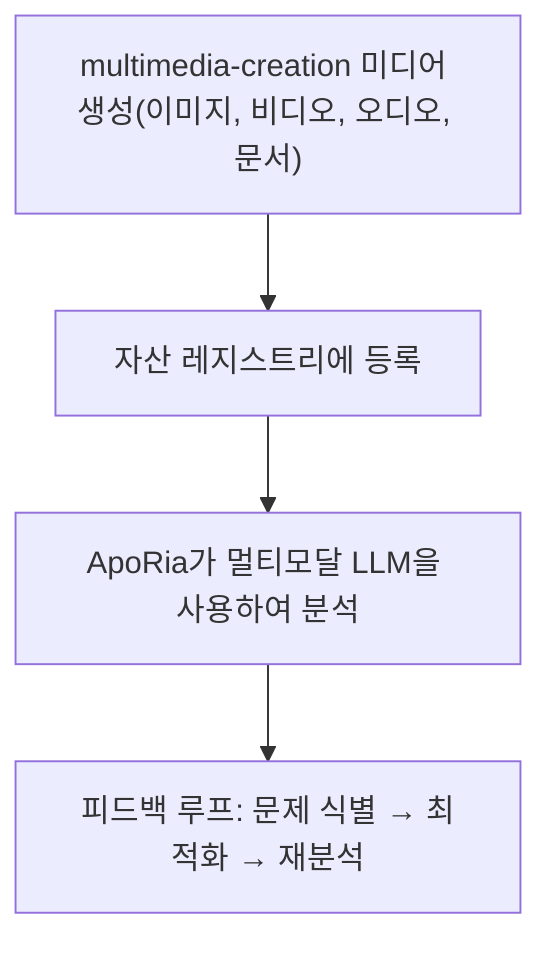

# 멀티모달 파이프라인

> **⚠️ 아카이브된 Agent 참조 — 개발 파이프라인에 없음**
> 본 문서에서 참조하는 `multimedia-creation` Layer2 Agent는 **아카이브**되었습니다. 해당 Rust 코드, `.d.ts` 바인딩 및 Agent 등록은 모두 삭제되었습니다. 본 문서에서 설명하는 멀티모달 파이프라인은 **설계 목표**이며, 제공된 기능이 아닙니다. 개발자가 명시적으로 요청하지 않는 한, 이 파이프라인의 작업을 구현하거나 일정에 포함하지 마십시오.
> multimedia-creation 및 ApoRia를 사용하여 미디어 생성, 등록 및 분석
> 현재 상태 설명: 본 문서는 주로 목표 워크플로를 설명합니다. 현재 코드베이스에는 ApoRia의 멀티모달 관련 도구가 실제로 존재하지만, 아래에서 설명하는 중앙 집중식 자산 레지스트리 및 완전한 폐쇄 루프 기능을 아직 완전히 갖추지는 못했습니다.

-----------------------------------------------------------------------------

## 목차

- [개요](#개요)
- [자산 레지스트리](#자산-레지스트리)
- [생성 도구](#생성-도구)
- [등록](#등록)
- [멀티모달 분석](#멀티모달-분석)
- [검토 루프](#검토-루프)
- [Office 문서](#office-문서)
- [전체 예시](#전체-예시)

-----------------------------------------------------------------------------

## 개요

Entelecheia(현추)는 현재 멀티모달 관련 기초 모듈, 특히 ApoRia 측의 초기 도구를 포함하고 있습니다. 그러나 여기서 설명하는 multimedia-creation → 중앙 집중식 자산 등록 → 멀티모달 검토 폐쇄 루프는 완전한 현황보다 목표 설계로 보는 것이 더 적합합니다.



-----------------------------------------------------------------------------

## 자산 레지스트리

자산 레지스트리는 ApoRia가 관리하는 중앙 집중식 미디어 메타데이터 저장소입니다. 다음을 추적합니다:

- 파일 경로 및 저장 위치
- MIME 유형
- 생성 메타데이터(프롬프트, 매개변수, 타임스탬프)
- 분석 이력 및 품질 점수

### 등록 / 검색 워크플로

```typescript
const asset = $.agent.ApoRia.media_asset_register({
  file_path: "/output/marketing-banner.png",
  mime_type: "image/png",
  metadata: {
    prompt: "A futuristic city skyline at sunset",
    generator: "multimedia-creation",
    model: "stable-diffusion-xl"
  }
});

const asset_id: string = asset.id;

const retrieved = $.agent.ApoRia.media_asset_retrieve({
  asset_id: asset_id
});
```

-----------------------------------------------------------------------------

## 생성 도구

multimedia-creation은 다양한 미디어 유형에 대한 생성 도구를 제공합니다. 모든 도구는 exec 코드에서 `$multimedia-creation.<tool>()`을 통해 호출합니다.

### 이미지 생성

```typescript
$multimedia-creation.image_generate({
  prompt: "A futuristic city skyline at sunset, cyberpunk style",
  width: 1024,
  height: 512,
  model: "stable-diffusion-xl",
  output_path: "/output/city-skyline.png"
});
```

### 비디오 생성

```typescript
$multimedia-creation.video_generate({
  prompt: "Camera panning across a mountain landscape at golden hour",
  duration_seconds: 10,
  fps: 24,
  resolution: "1080p",
  output_path: "/output/mountain-pan.mp4"
});
```

### 오디오 생성

```typescript
$multimedia-creation.audio_generate({
  prompt: "Ambient electronic background music, calm and atmospheric",
  duration_seconds: 30,
  format: "mp3",
  output_path: "/output/ambient-bg.mp3"
});
```

### 문서 생성

```typescript
$multimedia-creation.doc_generate({
  template: "technical-report",
  title: "Q4 Performance Analysis",
  content: report_markdown,
  format: "docx",
  output_path: "/output/q4-report.docx"
});
```

### 스프레드시트 생성

```typescript
$multimedia-creation.sheet_generate({
  title: "Budget Forecast 2025",
  data: budget_data,
  format: "xlsx",
  output_path: "/output/budget-2025.xlsx"
});
```

### 슬라이드 생성

```typescript
$multimedia-creation.slide_generate({
  title: "Product Roadmap Presentation",
  sections: slide_sections,
  format: "pptx",
  output_path: "/output/roadmap.pptx"
});
```

-----------------------------------------------------------------------------

## 등록

미디어 생성 후, ApoRia가 분석할 수 있도록 자산 레지스트리에 등록합니다:

```typescript
const result = $multimedia-creation.image_generate({
  prompt: "Product hero shot on white background",
  width: 1920,
  height: 1080,
  output_path: "/output/hero-shot.png"
});

const asset = $.agent.ApoRia.media_asset_register({
  file_path: result.output_path,
  mime_type: "image/png",
  metadata: {
    prompt: "Product hero shot on white background",
    generator: "multimedia-creation",
    dimensions: "1920x1080"
  }
});

const asset_id: string = asset.id;
```

-----------------------------------------------------------------------------

## 멀티모달 분석

ApoRia는 `$.agent.ApoRia.multimodal_chat()`을 통해 멀티모달 분석을 제공합니다. 하나 이상의 자산 ID와 텍스트 프롬프트를 전달합니다:

```typescript
const analysis = $.agent.ApoRia.multimodal_chat({
  prompt: "Analyze this image for composition, color balance, and visual hierarchy. Rate each aspect from 1-10.",
  asset_ids: [asset_id]
});
```

### 여러 자산 분석

```typescript
const comparison = $.agent.ApoRia.multimodal_chat({
  prompt: "Compare these two design variations. Which one has better visual balance and why?",
  asset_ids: [variant_a_id, variant_b_id]
});
```

### 컨텍스트 포함 분석

```typescript
const context_analysis = $.agent.ApoRia.multimodal_chat({
  prompt: "Does this image match the brand guidelines? Guidelines: primary color blue (#0066CC), clean layout, sans-serif typography.",
  asset_ids: [asset_id]
});
```

-----------------------------------------------------------------------------

## 검토 루프

멀티모달 파이프라인은 반복 검토 주기를 지원합니다:

1. **생성** — multimedia-creation이 초기 미디어 생성
1. **등록** — 자산 레지스트리에 저장
1. **분석** — ApoRia가 멀티모달 LLM을 사용하여 미디어 평가
1. **문제 식별** — 분석에서 구체적인 개선 사항 추출
1. **최적화** — multimedia-creation이 피드백에 따라 매개변수를 조정하여 재생성
1. **재분석** — ApoRia가 최적화된 출력을 평가

### exec 코드에서의 검토 루프 예시

```typescript
let iteration: number = 0;
const max_iterations: number = 3;
const quality_threshold: number = 8.0;
let current_prompt: string = "A serene mountain lake at dawn, photorealistic";

while (iteration < max_iterations) {
  iteration++;

  const gen_result = $multimedia-creation.image_generate({
    prompt: current_prompt,
    width: 1024,
    height: 768,
    output_path: `/output/lake-v${iteration}.png`
  });

  const asset = $.agent.ApoRia.media_asset_register({
    file_path: gen_result.output_path,
    mime_type: "image/png",
    metadata: { prompt: current_prompt, iteration: iteration }
  });

  const analysis = $.agent.ApoRia.multimodal_chat({
    prompt: "Rate this image on composition (1-10), color harmony (1-10), and overall quality (1-10). Provide specific improvement suggestions.",
    asset_ids: [asset.id]
  });

  const overall_score: number = analysis.data.overall_quality;

  if (overall_score >= quality_threshold) {
    report({ text: `Quality threshold met at iteration ${iteration}. Score: ${overall_score}` });
    break;
  }

  const suggestions = analysis.data.improvement_suggestions;
  current_prompt = current_prompt + ". " + suggestions.join(". ");

  if (iteration === max_iterations) {
    report({ text: `Max iterations reached. Final score: ${overall_score}` });
  }
}
```

-----------------------------------------------------------------------------

## Office 문서

multimedia-creation은 Office 호환 문서를 생성할 수 있습니다:

### Word 문서(`doc_generate`)

Markdown 또는 구조화된 콘텐츠에서 `.docx` 파일을 생성합니다. 일반적인 문서 유형의 템플릿을 지원합니다:

- 기술 보고서
- 회의록
- 제안서

```typescript
$multimedia-creation.doc_generate({
  template: "meeting-notes",
  title: "Sprint Planning - Week 12",
  content: meeting_content,
  format: "docx",
  output_path: "/output/sprint-12-notes.docx"
});
```

### Excel 스프레드시트(`sheet_generate`)

구조화된 데이터, 수식 및 서식을 포함한 `.xlsx` 파일을 생성합니다:

```typescript
$multimedia-creation.sheet_generate({
  title: "Monthly Revenue",
  data: revenue_data,
  format: "xlsx",
  output_path: "/output/revenue.xlsx"
});
```

### PowerPoint 프레젠테이션(`slide_generate`)

섹션, 글머리 기호 및 선택적 이미지 삽입을 포함한 `.pptx` 파일을 생성합니다:

```typescript
$multimedia-creation.slide_generate({
  title: "Quarterly Business Review",
  sections: [
    { title: "Revenue", bullets: ["Q1: $1.2M", "Q2: $1.5M"] },
    { title: "Goals", bullets: ["Launch v2.0", "Expand to APAC"] }
  ],
  format: "pptx",
  output_path: "/output/qbr.pptx"
});
```

-----------------------------------------------------------------------------

## 전체 예시

본 예시는 완전한 파이프라인을 보여줍니다: 마케팅 이미지 생성, 등록, 분석 및 최적화.

### 단계 1: 초기 이미지 생성

```typescript
const gen = $multimedia-creation.image_generate({
  prompt: "A modern SaaS product dashboard mockup, clean UI, blue and white color scheme",
  width: 1920,
  height: 1080,
  output_path: "/output/dashboard-v1.png"
});
```

### 단계 2: 자산 등록

```typescript
const asset = $.agent.ApoRia.media_asset_register({
  file_path: gen.output_path,
  mime_type: "image/png",
  metadata: {
    prompt: "SaaS dashboard mockup",
    purpose: "marketing",
    version: 1
  }
});
```

### 단계 3: 구도 분석

```typescript
const analysis = $.agent.ApoRia.multimodal_chat({
  prompt: "Analyze this dashboard mockup for: 1) Visual hierarchy, 2) Color consistency, 3) Readability of data elements. Provide a score (1-10) for each and specific suggestions for improvement.",
  asset_ids: [asset.id]
});
```

### 단계 4: 피드백에 따라 최적화

```typescript
const refined = $multimedia-creation.image_generate({
  prompt: "A modern SaaS product dashboard mockup, clean UI, blue and white color scheme. " + analysis.data.suggestions.join(". "),
  width: 1920,
  height: 1080,
  output_path: "/output/dashboard-v2.png"
});
```

### 단계 5: 등록 및 재분석

```typescript
const refined_asset = $.agent.ApoRia.media_asset_register({
  file_path: refined.output_path,
  mime_type: "image/png",
  metadata: {
    prompt: "SaaS dashboard mockup (refined)",
    purpose: "marketing",
    version: 2,
    previous_version: asset.id
  }
});

const final_analysis = $.agent.ApoRia.multimodal_chat({
  prompt: "Compare this refined version to the original. Has the visual hierarchy improved? Rate the overall quality 1-10.",
  asset_ids: [asset.id, refined_asset.id]
});

report({
  text: `Marketing image pipeline complete. Initial score: ${analysis.data.overall_score}, Refined score: ${final_analysis.data.overall_score}`
});
```

-----------------------------------------------------------------------------

## 다음 단계

- [기초 가이드](fundamentals.md)를 읽어 multimedia-creation 및 ApoRia Agent 세부 정보 확인
- [아키텍처](architecture.md)를 탐색하여 전체 Agent 시스템 개요 확인
- [Webhook 통합](webhook-setup.md)을 설정하여 외부 이벤트로 생성 트리거
