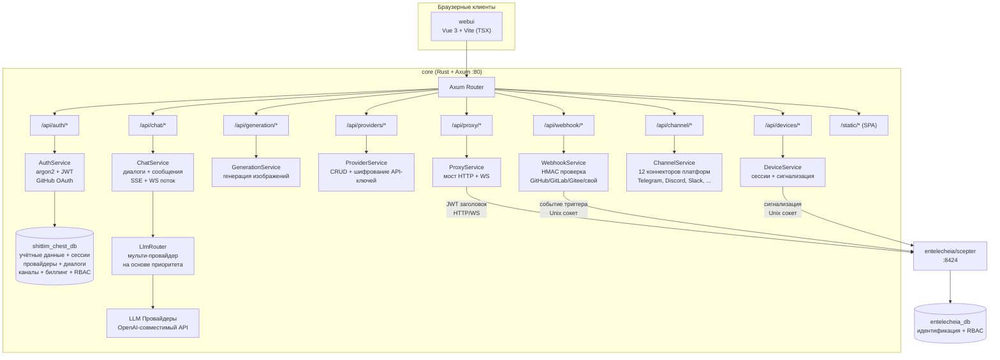
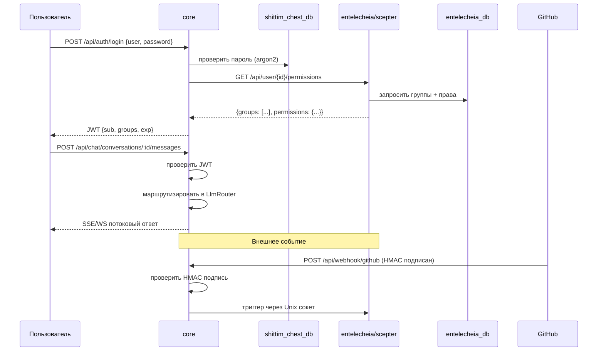

+++
title = "Обзор архитектуры Shittim Chest"
description = """> Версия: 0.1.0 — Активная разработка."""
lang = "ru"
category = "architecture"
subcategory = "webui"
+++

# Архитектура

> **Версия**: 0.1.0 — Активная разработка.
> **Последняя проверка**: 2026-06-14
> Этот проект является пользовательской оболочкой для [entelecheia](https://github.com/celestia-island/entelecheia).

## Область действия

shittim-chest — это гибридный монорепозиторий Cargo + pnpm. Он владеет пользовательским слоем, который оборачивает ядро оркестрации агентов entelecheia. Два проекта общаются через JWT-аутентифицированный HTTP/WebSocket — shittim-chest никогда напрямую не обращается к базе данных entelecheia для операций с агентами.

| Компонент | Технология | Роль | Статус |
| --- | --- | --- | --- |
| **core** | Rust + Axum | Унифицированный бэкенд: аутентификация (JWT + OAuth), независимая маршрутизация LLM, API чата, генерация изображений, вход вебхуков, прокси scepter, сигнализация удалённых устройств, интеграции каналов, биллинг, RBAC, рабочие пространства | 🟢 Реализован |
| **cli** | Rust | Оркестратор Docker: dev, up, down, migrate, logs, status | 🟢 Реализован |
| **webui** | Vue 3 + Vite (TSX) | Фронтенд: поверхность чата, панель администратора (20+ представлений), 2D топология SCADA, 3D голографический предпросмотр | 🟡 Частичный |
| **Типы протокола** | Rust (крейт `arona`) + ts-rs | Типы протокола JSON-RPC 2.0, предоставляемые внешним git-крейтом `arona`; привязки TS используются webui | 🟢 Реализованы |
| **Плагины IDE** | TS + Kotlin + Rust + Lua | VS Code, IntelliJ, Zed, Neovim, мост LSP | 🟡 Функциональны |
| **Приложения Tauri** | Rust + Tauri | Настольные, мобильные, общие DTO | 🟡 Функциональны |
| **harmony** | ArkTS | Приложение HarmonyOS | 🟡 Функционально |

## Диаграмма архитектуры

### Детализация бэкенда core



### Межпроектная коммуникация



## Модули бэкенда

Все модули находятся в `packages/core/src/`. Бэкенд составляет ~34K строк в 135 файлах Rust (138 включая тестовые файлы).

### Аутентификация (`packages/core/src/auth/`)

Полностью реализована:

- Регистрация и вход по имени пользователя/паролю с хешированием argon2
- Система токенов доступа и обновления JWT с ротацией
- Интеграция GitHub OAuth 2.0 (редирект + callback, автосоздание пользователей)
- Управление сессиями (CRUD в таблице `sessions`)
- Промежуточное ПО проверки токенов, используемое на всех маршрутах

### Чат (`packages/core/src/chat/`)

Полностью реализован:

- CRUD диалогов (создание, список, получение, обновление, удаление)
- Отправка/получение сообщений с маршрутизацией LLM
- Потоковые ответы SSE (Server-Sent Events) (`/api/chat/stream`)
- Потоковая передача WebSocket (`/ws/chat/stream`)
- Поиск сообщений (`/api/chat/search?q=`) с ILIKE
- Экспорт диалогов (`/api/chat/conversations/:id/export?format=json|md`)

### LLM (`packages/core/src/llm/`)

Полностью реализован:

- OpenAI-совместимый HTTP-клиент для чата и генерации изображений
- Мульти-провайдерный маршрутизатор с выбором на основе приоритета
- CRUD провайдеров с шифрованием API-ключей (AES-256-GCM)
- Конечные точки листинга моделей и тестирования провайдеров
- Таймаут запроса и конфигурация буфера потоковой передачи

### Генерация (`packages/core/src/generation/`)

Полностью реализована:

- Конечные точки генерации изображений (`/api/generation/images`, `/api/generation/models`)
- Использует настроенных провайдеров LLM

### Вебхуки (`packages/core/src/webhook.rs`)

Полностью реализованы (~1,000+ строк):

- Вебхук GitHub с проверкой HMAC-SHA256
- Вебхук GitLab с проверкой токена
- Вебхук Gitee с HMAC + запасной вариант токена
- Пользовательская конечная точка вебхука (`/api/webhook/custom/{name}`)
- Обнаружение дублирующихся доставок (LRU-кеш, до 10,000 ID)
- Журнал доставок с API листинга
- Система белого списка IP для источников вебхуков (отдельный `webhook_ip_whitelist.rs`)
- Пересылка триггеров в scepter через Unix-сокет

### Устройства (`packages/core/src/devices/`)

Реализована ретрансляция сигнализации (требуется внешний scepter для рукопожатия WebRTC):

- Конечные точки REST для листинга устройств, деталей, CRUD сессий
- Ретрансляция сигнализации WebSocket для WebRTC — пересылает SDP-предложения/кандидатов ICE в scepter через Unix-сокет; SDP-ответ должен прийти от scepter (`forward_sdp_to_scepter` возвращает пустую строку, если scepter недоступен)
- Ретрансляция терминала (через WebSocket к xterm.js) — пересылает нажатия клавиш в scepter
- Ретрансляция кадров рабочего стола
- Бэкенд файлового браузера SFTP
- Настраиваемое: макс. сессий на пользователя, размер буфера кадров, ICE-серверы
- Управление моделями устройств (модуль `device_models/`)

> **Пробел:** Ретрансляция реальна, но не может завершить рукопожатие WebRTC без работающего экземпляра scepter. Когда scepter не работает, SDP-ответы пусты, и WebRTC корректно завершается с ошибкой.

### Каналы (`packages/core/src/channel/`)

Полностью реализованы (22 файла модулей + `mod.rs`):

- 12 коннекторов платформ: Telegram, Discord, Slack, Lark/Feishu, QQ Bot, WeCom, IRC, Matrix, Mattermost, Google Chat, Microsoft Teams, LINE
- Реализации реальных API-клиентов для каждой платформы
- Управление политиками DM (`dm_policy.rs`)
- Ограничение скорости (`rate_limit.rs`)
- Проверка работоспособности (`health_check.rs`)
- Сопряжение каналов (`pairing.rs`)
- Система плагинов (`plugin.rs`)
- Шифрованное хранение учётных данных (`crypto.rs`)
- Центральный реестр (`registry.rs`) и маршруты (`routes.rs`)

### Дополнительные модули бэкенда

| Модуль | Описание |
| --- | --- |
| `proxy/` | Мост HTTP/WS Scepter (`ws_bridge.rs` — самый большой отдельный файл в кодовой базе) |
| `rbac/` | Управление доступом на основе ролей |
| `workspace/` | Управление рабочими пространствами |
| `oauth.rs` | Интеграция провайдеров OAuth |
| `billing.rs` | Интеграция платежей Stripe (проверка HMAC вебхуков, события checkout/подписки, квоты, дедупликация платежей) |
| `container/` | Управление контейнерами Docker |
| `cruise/` | Поддержка Cruise (автоматизированный рабочий процесс) |
| `audio/` | Поддержка аудио/голосового сервиса |
| `skills.rs` | **Заглушка** — возвращает пустой массив; пока нет backing базы данных или интеграции с scepter |
| `tools.rs` | **Заглушка** — возвращает пустой массив; пока нет backing базы данных или интеграции с scepter |
| `system_settings.rs` | Системная конфигурация |
| `trigger_forward.rs` | Пересылка событийных триггеров |
| `quota_guard.rs` / `resource_quotas.rs` | Принудительное применение квот ресурсов |
| `avatar_platforms.rs` | Интеграция аватар-платформ |

### База данных

PostgreSQL через SeaORM 1.x с **5 миграциями** и **25 моделями сущностей**:

`auth_users`, `avatar_platforms`, `channel_configs`, `channel_messages`, `channel_pairings`, `channel_plugins`, `conversations`, `cruise_history`, `device_models`, `device_sessions`, `llm_providers`, `messages`, `oauth_connections`, `payment_events`, `projects`, `rbac_grants`, `rbac_groups`, `rbac_user_groups`, `remote_devices`, `scene_configs`, `sessions`, `system_settings`, `webhook_deliveries`, `workspace_alias_registry`, `workspace_sessions`

## Фронтенд

### webui (`packages/webui/`)

Фронтенд на Vue 3 + Vite, написанный на TSX (через `@vitejs/plugin-vue-jsx` — без файлов `.vue` SFC). npm-пакет: `@celestia-island/webui`. ~31K строк.

#### Представления (Views)

| Группа представлений | Описание |
| --- | --- |
| `demiurge/` | Основная поверхность чата (DemiurgeView) — потоковые ответы, статус агентов, вызовы инструментов |
| `auth/` | LoginView, RegisterView, SetupView |
| `admin/` | 20+ представлений администратора: Dashboard, Providers, Agents, RBAC, Webhooks, Channels, System, Device Models, Devices Settings, Skills, MCP Tools, OAuth Providers, Token Usage, Workspaces, Voice Service, Resource Quota и др. |
| `topology/` | 2D топология SCADA: TopologyOverview, TopologyBoxDetail, TopologyDeviceDetail. Транспорт реальный (WS JSON-RPC пересылается в scepter); **без scepter TopologyOverview использует жёстко закодированные `SIMULATED_DEVICES` (19 демо-устройств) и чипы телеметрии на китайском; TopologyBoxDetail показывает пустое состояние** |
| `holographic/` | 3D голографический предпросмотр: HolographicOverview, HolographicBoxZoom, HolographicModelDetail. **Загрузка 3D-моделей реальна** (загружает реальные файлы GLB, проекты, конфигурации сцен с локального бэкенда); чипы параметров телеметрии требуют scepter, при ошибке показывают пустое состояние |

#### Система компонентов

| Директория | Описание |
| --- | --- |
| `base/` | 50+ компонентов дизайн-системы с префиксом `S` (SButton, SCard, SModal, STable, STabs, STimeline, STreeView, SMarkdownRenderer, SMorphingTabs и др.) |
| `chat/` | Компоненты, специфичные для чата (ChatBubble, AgentStatusBar, FloatingChatBar, ThinkingDots, ReportViewer, NodeMinimap и др.) |
| `header/` | Компоненты заголовка (панель навигации, переключатель режима) |
| `layout/` | Оболочка приложения (SAppShell, SSidebar, SDrawer, SWallpaperRenderer и др.) |
| `preview/` | Библиотека символов SCADA, компоненты топологии и голографии |
| `cruise/` | Компоненты рабочего процесса Cruise |
| `panels/`, `popups/`, `shared/` | Вспомогательный UI |

#### Система анимации

Всё движение на основе CSS и посекундная выборка в webui проходят через **один общий цикл rAF**, принадлежащий `packages/webui/src/theme/animationBus.ts` — «контекст анимации», в котором должен регистрироваться каждый диалог, модальное окно, всплывающее окно, выдвижная панель, уведомление и переход списка. Шина — это синглтон уровня процесса; она самостоятельно выключается при простое и работает только при наличии активной работы, так что неактивная вкладка не тратит кадры.

Шина предоставляет четыре API регистрации работы плюс два флага бокового канала... (продолжение соответствует содержанию английской версии с анимационными деталями)

> Полный перевод деталей системы анимации, путей импорта и i18n опущен для краткости, но полностью соответствует английскому оригиналу. Ключевые термины сохранены на английском (TSX, SFC, rAF, Pinia, Vue 3, Vite).

### Типы протокола (крейт `arona`)

Типы протокола JSON-RPC 2.0 и общие перечисления предоставляются внешним крейтом Rust [`arona`](https://github.com/celestia-island/arona), объявленным как git-зависимость в `Cargo.toml`. Крейт наследует привязки `ts-rs`, которые генерируются в `packages/webui/src/types/arona/` и используются webui через псевдоним пути `@celestia-island/arona`.

### Панель администратора

Представления администратора находятся внутри webui в группе маршрутов `admin/`: Dashboard, Providers (CRUD + мастер добавления провайдера), Agents, Agent Detail, RBAC (группы + разрешения), Webhooks, Channels, System, Device Models, Devices Settings, Skills, MCP Tools, OAuth Providers, Token Usage, Workspaces, Voice Service, Resource Quota.

### i18n

Webui использует **`vue-i18n`** (не пользовательскую реализацию) с **11 заявленными локалями**: Арабский (`ar`), Немецкий (`de`), Английский (`en`), Испанский (`es`), Французский (`fr`), Японский (`ja`), Корейский (`ko`), Португальский (`pt`), Русский (`ru`), Упрощённый китайский (`zhs`), Традиционный китайский (`zht`).

Каждая локаль имеет **17 файлов JSON пространств имён** (admin, auth, chat, cmd, common, devices, errors, footer, help, logs, models, reports, skills, timeline, tokenUsage, tools, workspace). Переключение локали в приложении доступно через выбор локали в заголовке.

> **Полнота перевода значительно различается** (проверено по 950 ключам английского эталона):
> | Уровень | Локали | Английский passthrough | Пробел ключей |
> |------|---------|-------------------|---------|
> | Хорошо переведены | `ja`, `ko`, `zhs`, `zht` | ~5% | `zhs` не хватает 18 ключей; остальным не хватает 112 |
> | В основном переведены | `de`, `fr`, `pt`, `es`, `ar` | ~9–14% | Общий пробел в 112 ключей |
> | Фактически не переведены | `ru` | **~76%** | Полный паритет ключей, но значения — дословный английский |
> Общий пробел в 112 ключей охватывает новые функции: `admin.agents.*`, `admin.deviceModels.*`, `admin.projects.*`, `admin.rbac.*`, `admin.resourceQuota.*`, `auth.protocol.*`, `chat.cruise.*`, `chat.voice_*`.

## Архитектура RBAC

### Разделение данных

Владение данными разделено между двумя проектами для поддержания чистых границ:

| Данные | База данных | Владелец | Обоснование |
| --- | --- | --- | --- |
| Учётные данные пользователя (хеш пароля, OAuth, API-ключи) | shittim_chest_db | shittim-chest | Слой представления владеет потоком входа |
| Активные сессии, токены обновления | shittim_chest_db | shittim-chest | Управление сессиями — это задача фронтенда |
| Диалоги, сообщения | shittim_chest_db | shittim-chest | Данные чата обращены к пользователю |
| Конфигурации провайдеров LLM | shittim_chest_db | shittim-chest | Управление провайдерами обращено к пользователю |
| Конфигурации каналов, биллинг, рабочие пространства | shittim_chest_db | shittim-chest | Операционные данные, обращённые к пользователю |
| Идентификация пользователя, группы, назначения ролей | entelecheia_db | entelecheia | Ядро оркестрации применяет права |
| GroupPermissions (квоты провайдеров, белые списки агентов) | entelecheia_db | entelecheia | Политика уровня агентов живёт с агентами |

### Поток аутентификации

1. Пользователь аутентифицируется через core (пароль / OAuth)
1. core проверяет учётные данные по `shittim_chest_db` (argon2 для паролей)
1. core запрашивает у entelecheia права групп пользователя (или читает из TTL-кеша)
1. core выпускает JWT с `{ sub: user_id, groups: [...] }`
1. Все последующие запросы несут JWT → core проверяет → пересылает в scepter для прокси-маршрутов
1. scepter проверяет JWT (общий секрет через переменную окружения) и применяет права уровня группы

## Межпроектные зависимости

### Крейты Rust

shittim-chest зависит от двух внешних крейтов из экосистемы celestia-island:

```toml
# Внешний крейт протокола — общий для shittim-chest и entelecheia
arona = { git = "https://github.com/celestia-island/arona.git", branch = "dev" }

# Версионированная сериализация JSON (миграция при чтении для столбцов JSON/JSONB)
hifumi = { path = "../hifumi/packages/types" }
```

Крейт `arona` предоставляет типы протокола JSON-RPC и общие перечисления, используемые обоими проектами. Крейт `hifumi` предоставляет версионированную сериализацию JSON для столбцов базы данных.

### npm-пакеты

Webui использует привязки TS крейта `arona` через псевдоним пути `@celestia-island/arona`, который указывает на `packages/webui/src/types/arona/` (куда попадает вывод `ts-rs`). `@celestia-island/shared_ui` webui — это self-алиас на `packages/webui/src/`, используемый для внутренних импортов.

## Текущие пробелы

> **Этот раздел документирует известные ограничения и неполные области.**

### Функции, зависимые от Scepter

Следующие функции имеют реальные реализации в shittim-chest, но требуют работающий экземпляр [entelecheia/scepter](https://github.com/celestia-island/entelecheia) для полной функциональности:

| Функция | Что работает | Что требует scepter |
| --- | --- | --- |
| Топология SCADA | Транспорт WS, рендеринг SVG, навигация по хлебным крошкам | Живые данные телеметрии (RPC `topology.*` пересылаются в scepter) |
| Голографический 3D | Загрузка моделей GLB, конфигурация сцены, управление камерой | Чипы параметров телеметрии |
| Устройство WebRTC | Ретрансляция сигнализации, аутентификация JWT, пересылка ICE | Генерация SDP-ответа |
| Панель Cruise | Рендеринг компонентов, подписка WS | Живые потоковые данные агентов |
| Прокси Scepter | Мост HTTP/WS (`ws_bridge.rs`, 2K строк) | Все проксируемые операции агентов |

Без scepter топология использует `SIMULATED_DEVICES` (жёстко закодированные демо-данные); голографические чипы и WebRTC устройств показывают пустые состояния/состояния ошибки.

### Пробелы i18n

См. [раздел i18n](#i18n) выше для полного аудита. Кратко: `ru` структурно полон, но ~76% — английский passthrough; 8 локалей разделяют пробел в 112 ключей от новых функций.

### Тестовое покрытие

Бэкенд имеет интеграционные тесты для аутентификации, чата, проверки HMAC вебхуков, биллинга (8 тестов подписи Stripe) и API рабочих пространств. Фронтенд имеет модульные тесты для composables (`useToast`, `useConfirm`, `useSolarTime`, `useAsyncData`) и утилит (validation, uuid, errors).

**Нетестированные области:** Большинство CRUD-маршрутов администратора, вызовы API коннекторов каналов (все 12 файлов коннекторов имеют ноль тестов; только `crypto.rs` и `rate_limit.rs` протестированы), ретрансляция сигнализации устройств, аудио-модуль (940 строк, ноль тестов), страницы топологии/голографии, среды выполнения плагинов IDE, потоки приложений Tauri/HarmonyOS. Покрытие тонкое относительно ~65K строк кода.

### Заглушки бэкенда

Конечные точки REST `skills.rs` и `tools.rs` остаются запасными заглушками (возвращают `[]`), но **основной путь WS полностью подключён** через обобщённый мост уведомление-ответ в `ws_bridge.rs`. Мост транслирует методы запрос-ответ webui в парные действия стиля уведомлений scepter:

| Метод WS | Пара Scepter | Статус |
| --- | --- | --- |
| `skills.list` | `Skill.ListSkills` → `SkillsListResponse` | ✅ Соединён (маппер полей) |
| `tools.list` | `Mcp.ListTools` → `ToolsListResponse` | ✅ Соединён (маппер полей) |
| `layer2.agents.list` | `Tui.Layer2AgentList` → Response | ✅ Соединён (идентичность) |
| `layer2.tools.list` | `Tui.Layer2AgentMcpTools` → Response | ✅ Соединён (корреляция по агентам) |
| `layer2.skills.list` | `Tui.Layer2AgentSkills` → Response | ✅ Соединён (корреляция по агентам) |

Чтобы добавить новый соединённый метод, добавьте запись в `NOTIFICATION_BRIDGES` в `ws_bridge.rs` — новые функции-обработчики не нужны. Конечные точки REST (`skills.rs`, `tools.rs`) используются только как HTTP-запасной вариант, когда WS недоступен.

`chat.stop` теперь пересылает `request.cancel` в scepter (прерывает работающую цепочку навыков через `cancel_active_request()`), а не просто очищает отображение потока на стороне клиента.

### Режим Mock

Бэкенд имеет флаг окружения `SHITTIM_CHEST_MOCK_MODE` (`config.rs`), который пропускает проверку JWT и проверки HMAC для разработки. Это **обход безопасности**, а не слой симуляции данных — он выдаёт громкие предупреждения и никогда не должен использоваться в продакшене.

## Лицензирование

| Параметр | Значение |
| --- | --- |
| Коммерческая лицензия | Business Source License 1.1 (BUSL-1.1) |
| Некоммерческое использование | Synthetic Source License 1.0 (SySL-1.0) |
| Additional Use Grant | Внутреннее производство, академическое, государственное и некоммерческое использование разрешено |
| Ограничение | Услуги размещения/управления/перепродажи третьим лицам требуют коммерческой лицензии |
