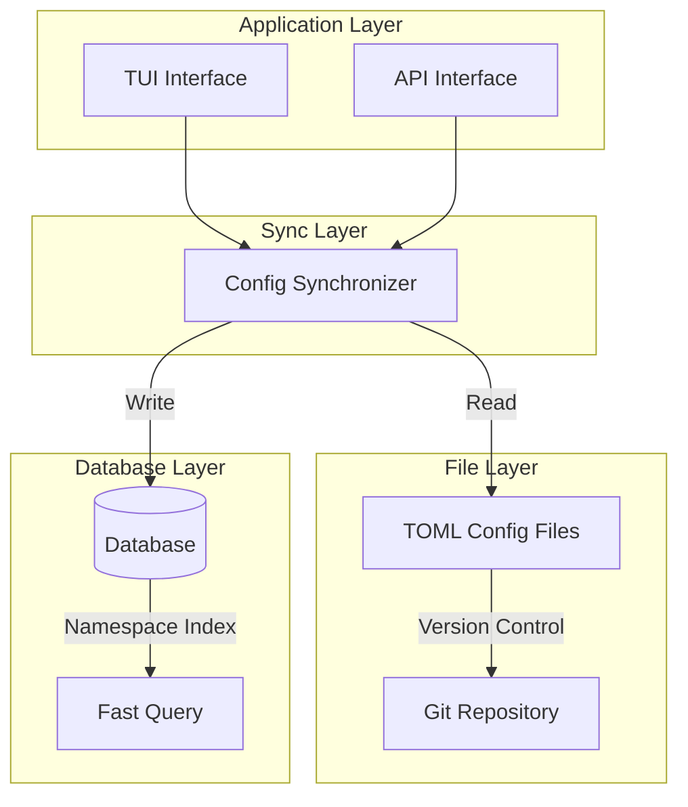
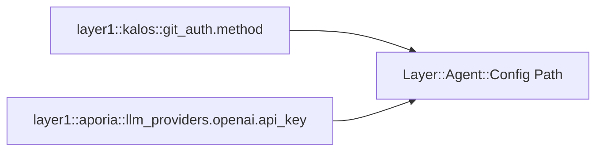
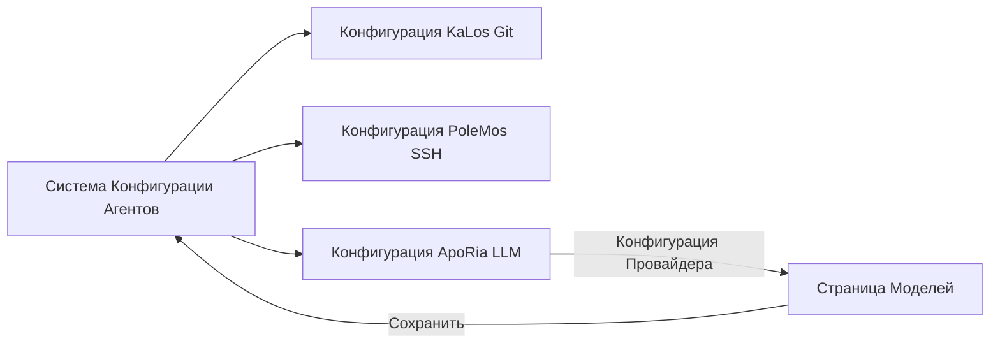

+++
title = "Проект Системы Конфигурации Агентов"
description = """Система Конфигурации Агентов предоставляет унифицированный механизм управления конфигурацией, поддерживая хранение в TOML-файлах и персистентность в базе данных, реализуя управление версиями конфиг"""
lang = "ru"
category = "design"
subcategory = "core"
+++

# Проект Системы Конфигурации Агентов

## Обзор

Система Конфигурации Агентов предоставляет унифицированный механизм управления конфигурацией, поддерживая хранение в TOML-файлах и персистентность в базе данных, реализуя управление версиями конфигурации и горячую перезагрузку.

## Основные Принципы

### Двухуровневая Архитектура Хранения



### Пространство Имён Конфигурации

Используется иерархический дизайн пространства имён:



## Проект Архитектуры

### Жизненный Цикл Конфигурации

```mermaid
stateDiagram-v2
    [*] --> Default: Системные Значения
    Default --> FileConfig: Загрузить TOML
    FileConfig --> DbSync: Синхронизировать с БД
    DbSync --> Active: Конфигурация Активна

    Active --> Updated: Изменение Пользователем
    Updated --> Validated: Проверка Формата
    Validated --> DbSync: Сохранить Изменения

    Active --> HotReload: Триггер Горячей Перезагрузки
    HotReload --> Active: Перезапуск Не Требуется
```

### Интерфейс Конфигурации TUI

```mermaid
graph TB
    subgraph Agent Document Modal
        Tabs[Обзор | Конфигурация | MCP | Навыки]
        Tabs --> Content[Область Содержимого]
    end

    subgraph Configuration Page
        Groups[Список Групп Конфигурации]
        Groups --> Group1[Конфигурация Git Auth]
        Groups --> Group2[Конфигурация Управления Источниками]
        Groups --> AddGroup[Добавить Группу Конфигурации]
    end

    Content --> Groups
```

## Связи с Другими Модулями



## Соображения Проектирования

### Безопасность

- Зашифрованное хранение чувствительной конфигурации
- Контроль доступа по разрешениям
- Аудит изменений конфигурации

### Расширяемость

- Поддержка пользовательских типов конфигурации
- Гибкие правила валидации
- Подключаемые обработчики конфигурации

### Согласованность

- Синхронизация файлов и базы данных
- Управление версиями конфигурации
- Обнаружение и разрешение конфликтов
