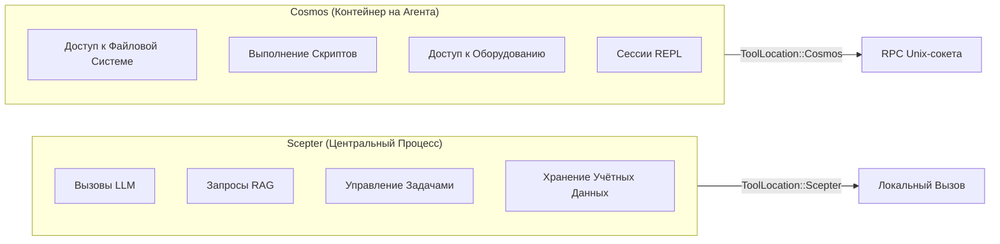
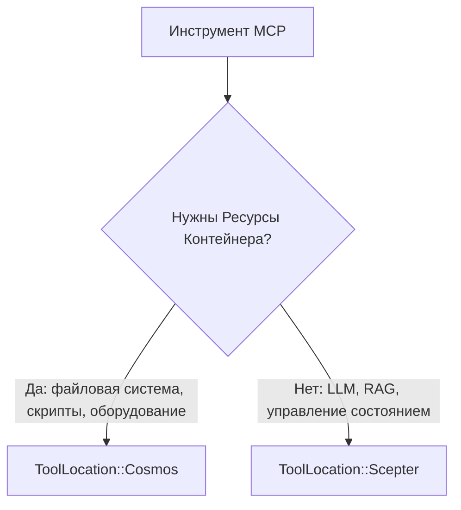
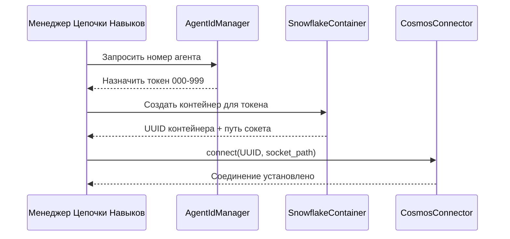
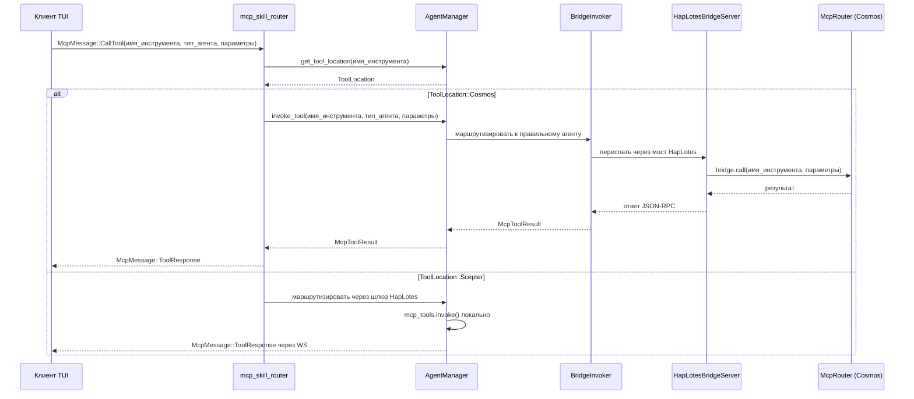
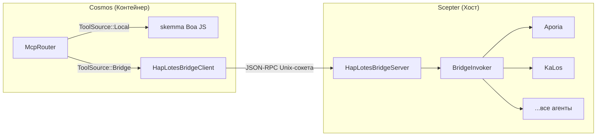
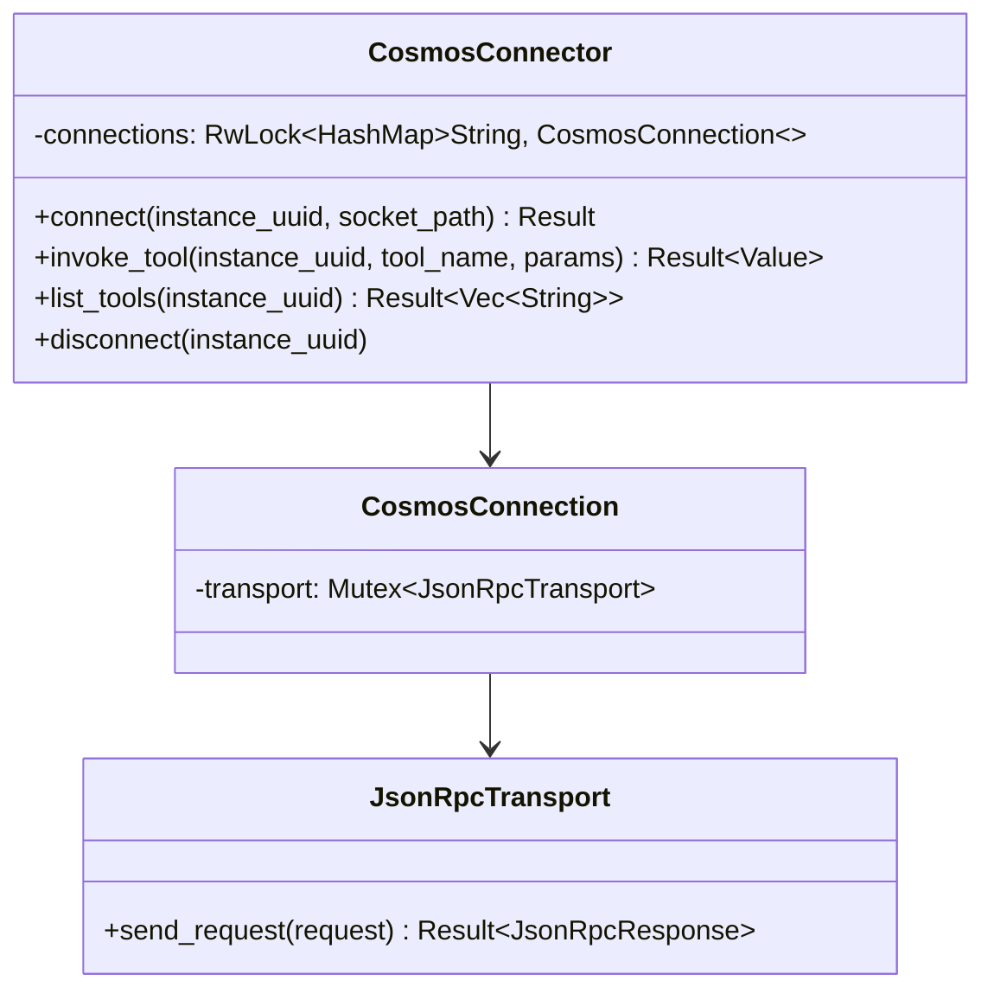
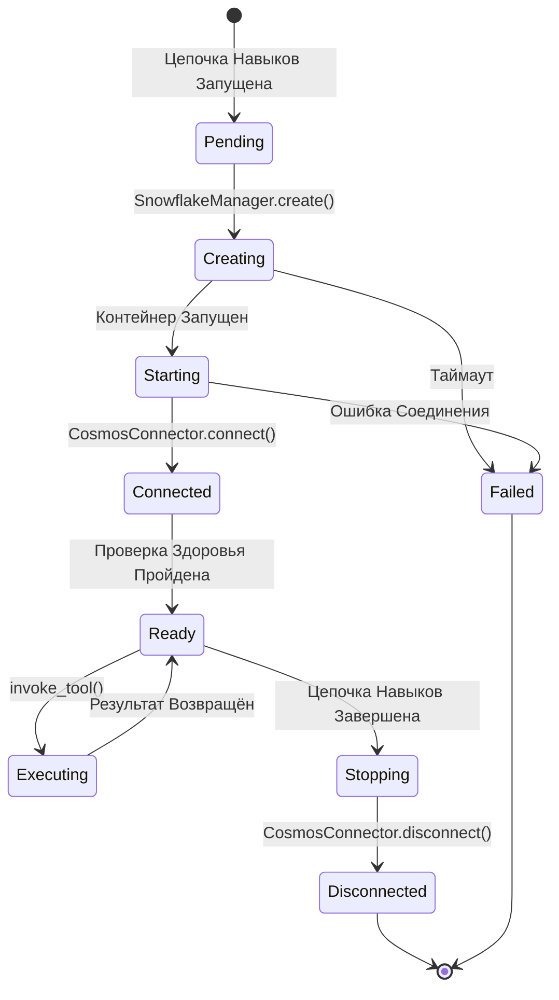
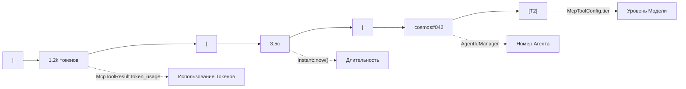
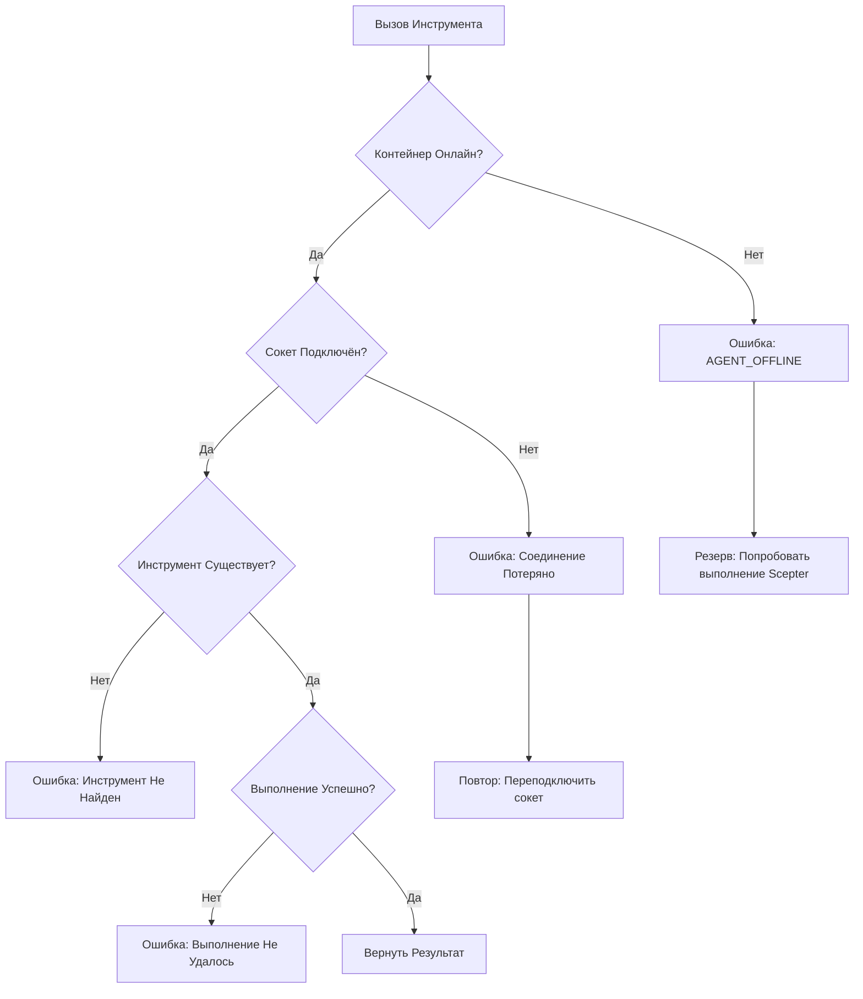

+++
title = "Проект Планирования Контейнеров Cosmos и Маршрутизации Токенов"
description = """Этот документ описывает архитектуру планирования контейнеров Cosmos: как инструменты MCP, помеченные `ToolLocation::Cosmos`, маршрутизируются через JSON-RPC Unix-сокета к соответствующим контейнер"""
lang = "ru"
category = "design"
subcategory = "core"
+++

# Проект Планирования Контейнеров Cosmos и Маршрутизации Токенов

## Обзор

Этот документ описывает архитектуру планирования контейнеров Cosmos: как инструменты MCP, помеченные `ToolLocation::Cosmos`, маршрутизируются через JSON-RPC Unix-сокета к соответствующим контейнерам, и как система токенов (номер агента) связывается с идентичностью контейнера и маршрутизацией.

## I. Модель Расположения Инструментов

### Двойная Среда Выполнения



### Перечисление ToolLocation

| Вариант | Место Выполнения | Транспорт |
| --- | --- | --- |
| `Scepter` (по умолчанию) | В процессе через `McpToolInvoker` | Прямой вызов функции |
| `Cosmos` | В контейнере через `CosmosConnector` | JSON-RPC Unix-сокета |

### Критерии Решения о Расположении



Инструменты, требующие ресурсов контейнера (файловая система, выполнение скриптов, доступ к оборудованию), помечаются `Cosmos`. Централизованные сервисы (LLM, RAG, управление задачами, взаимодействие с человеком) остаются `Scepter`.

## II. Система Токенов и Идентичность Контейнера

### Выделение Номера Агента



### Свойства Токена

| Свойство | Описание |
| --- | --- |
| Формат | Трёхзначное число: `000`-`999` |
| Выделитель | `AgentIdManager` в цепочке навыков |
| Привязка | Один токен на панель цепочки навыков |
| Отображение | Показывается в строке статистики TUI как `cosmos#NNN` |
| Персистентность | Сохраняется при перезапусках агента |

## III. Поток Маршрутизации Запросов

### Вызов MCP из TUI



### Ключевая Логика Маршрутизации

Решение о маршрутизации происходит в `mcp_skill_router.rs`:

1. Проверить `agent_manager.get_tool_location(имя_инструмента)`
1. Если `ToolLocation::Cosmos` и активен контейнеризованный режим:

   - Вызвать `agent_manager.invoke_tool()`, который маршрутизирует через `BridgeInvoker` → мост HapLotes → `McpRouter` Cosmos
   - `McpRouter` Cosmos диспетчеризует локально (skemma) или обратно в Scepter через мост для удалённых агентов
   - Вернуть `McpMessage::ToolResponse` напрямую в TUI

1. Иначе: маршрутизировать через шлюз HapLotes к процессу агента

## IV. Архитектура CosmosConnector / Моста

### Мост HapLotes (Текущий)

Мост HapLotes является **единственным каналом связи** между Scepter и контейнерами Cosmos.



### Пул Соединений (CosmosConnector — сторона Scepter)



### Протокол JSON-RPC

Все имена методов используют перечисление `UnixMethod` для безопасности типов на этапе компиляции:

| Вариант UnixMethod | Направление | Параметры |
| --- | --- | --- |
| `UnixMethod::McpCall` | Scepter → Cosmos | `{ tool_name, parameters }` |
| `UnixMethod::McpListTools` | Scepter → Cosmos | Нет |
| `UnixMethod::ReplSnapshot` | Scepter → Cosmos | `{ path }` |
| `UnixMethod::ReplRestore` | Scepter → Cosmos | `{ path }` |
| `UnixMethod::BridgeCall` | Cosmos → Scepter | `{ tool_name, parameters }` |
| `UnixMethod::BridgeListTools` | Cosmos → Scepter | Нет |

### Формат Ответа

```json
{
  "success": true,
  "data": { ... },
  "error": null
}
```

## V. Жизненный Цикл Контейнера



### Агенты Контейнера

Внутри контейнеров Cosmos только skemma работает локально (движок Boa JS). Все остальные инструменты агентов маршрутизируются через мост HapLotes обратно в Scepter:

| Агент | Роль | В Cosmos? |
| --- | --- | --- |
| SkeMma | Выполнение скриптов (Boa JS) | **Локально** (в процессе) |
| Aporia | Чат LLM | Через мост → Scepter |
| KaLos | Файловый В/В | Через мост → Scepter |
| NeiKos | Управление контейнерами | Через мост → Scepter |
| EleOs | Веб-поиск | Через мост → Scepter |
| Все остальные | Разное | Через мост → Scepter |

## VI. Интеграция Строки Статистики

### Формат Отображения

В `AgentDetailPage` TUI строка статистики показывает:



| Сегмент | Источник |
| --- | --- |
| `1.2k токенов` | `McpToolResult.token_usage` |
| `3.5с` | Длительность от `Instant::now()` |
| `cosmos#042` | Номер агента от `AgentIdManager` |
| `[T2]` | Уровень модели от `McpToolConfig.tier` |

## VII. Обработка Ошибок

### Режимы Сбоев



### Плавная Деградация

Когда контейнер недоступен, система может опционально переключиться на локальное выполнение `Scepter`, если для инструмента зарегистрирована локальная реализация.

## VIII. Будущие Расширения

| Функция | Описание | Приоритет |
| --- | --- | --- |
| Пул контейнеров | Повторное использование контейнеров между цепочками навыков | Средний |
| Мониторинг здоровья | Периодические проверки здоровья контейнеров | Высокий |
| Ограничения ресурсов | Ограничения CPU/памяти на контейнер | Высокий |
| Мульти-контейнерные инструменты | Инструменты, охватывающие несколько контейнеров | Низкий |
| Миграция контейнеров | Перемещение работающих контейнеров между хостами | Низкий |
