+++
title = "Проект Системы Конфигурации Провайдеров TOML"
description = """Система Конфигурации Провайдеров TOML мигрирует всю конфигурацию LLM Provider из жёстко закодированных значений в конфигурационные файлы TOML, достигая разделения конфигурации и кода, улучшая у"""
lang = "ru"
category = "design"
subcategory = "core"
+++

# Проект Системы Конфигурации Провайдеров TOML

## Обзор

Система Конфигурации Провайдеров TOML мигрирует всю конфигурацию LLM Provider из жёстко закодированных значений в конфигурационные файлы TOML, достигая разделения конфигурации и кода, улучшая удобство поддержки и расширяемость.

## Основные Цели

| Цель | Описание |
| --- | --- |
| Удобство поддержки | Конфигурация отделена от кода, не требуется перекомпиляция для изменений |
| Расширяемость | Добавление нового Провайдера требует только добавления файла TOML |
| Читаемость | Конфигурационные файлы ясны и легки для понимания |
| Повторное использование | Конфигурация может быть разделена между различными средами |

## Проект Архитектуры

### Процесс Загрузки Конфигурации

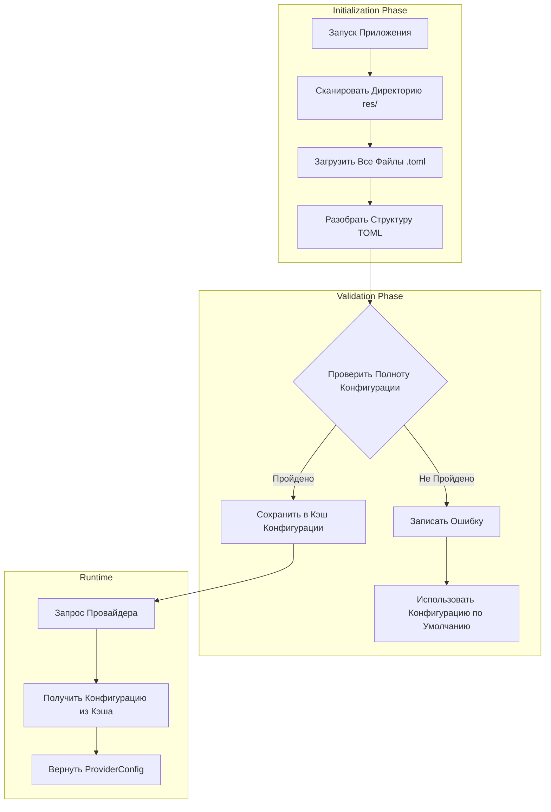

### Иерархия Конфигурации

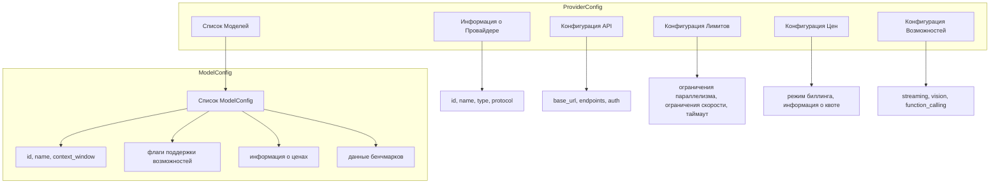

## Приоритет Конфигурации

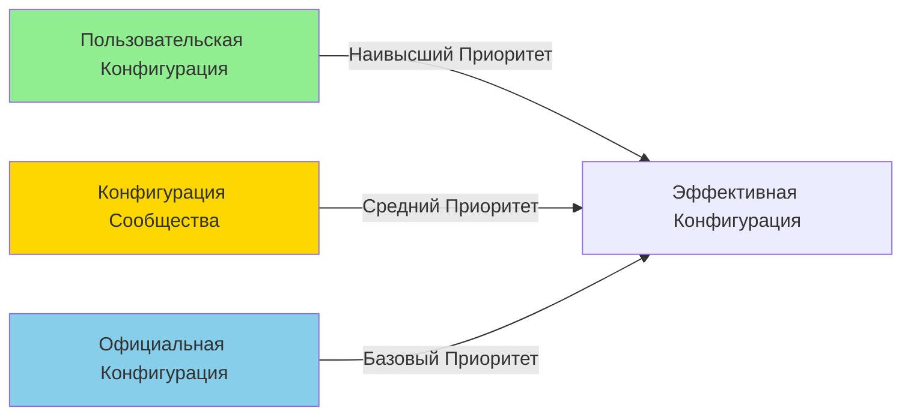

### Правила Слияния Приоритетов

| Слой | Источник | Описание |
| --- | --- | --- |
| 1 | Официальная Конфигурация | Данные официальной документации провайдера, как базовые значения по умолчанию |
| 2 | Конфигурация Сообщества | Оптимизированная конфигурация, предоставленная сообществом, переопределяет официальные данные |
| 3 | Пользовательская Конфигурация | Конфигурация, определённая пользователем, наивысший приоритет |

## Модели Ценообразования

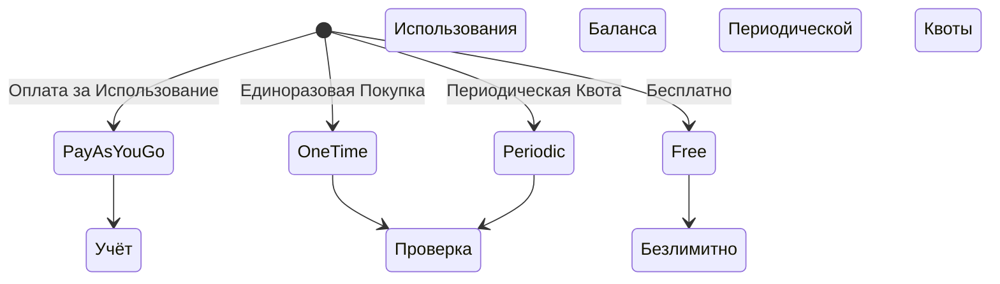

### Сравнение Моделей Ценообразования

| Модель | Применимые Сценарии | Характеристики |
| --- | --- | --- |
| PayAsYouGo | OpenAI, Anthropic | Оплата за токен, списание в реальном времени |
| OneTime | Предоплаченные пакеты | Предварительная покупка квоты, использование до исчерпания |
| Periodic | GLM China и др. | Периодический сброс квоты |
| Free | Локальные модели Ollama | Без ограничений стоимости |

## Классификация Типов Провайдеров

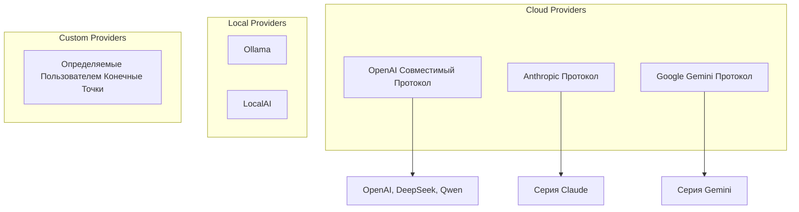

## Механизм Горячей Перезагрузки

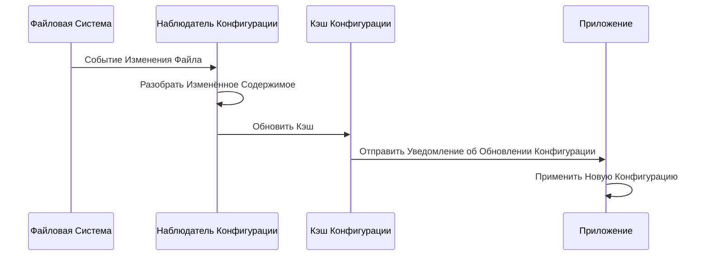

## Стратегия Обработки Ошибок

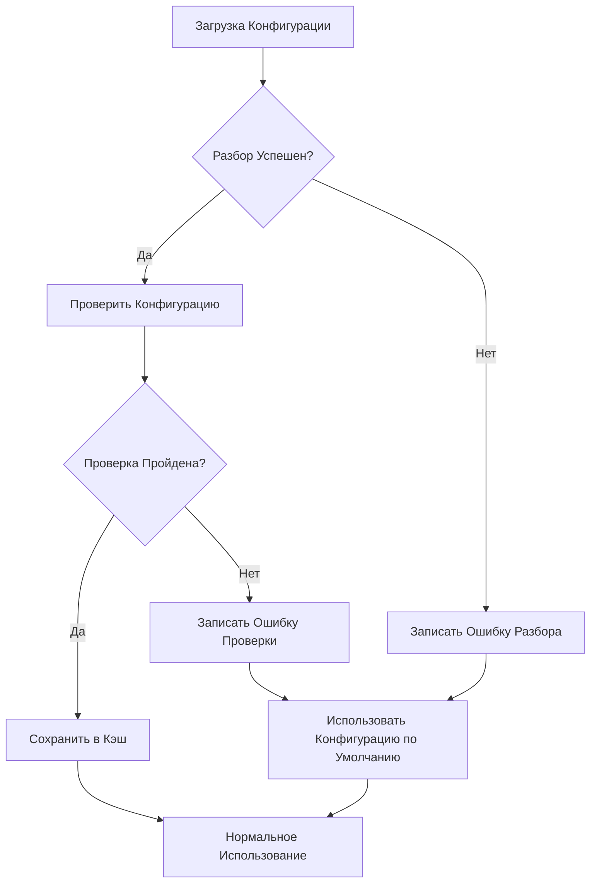

## Проект Расширяемости

### Добавление Нового Провайдера

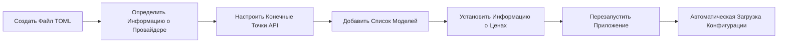

### Правила Проверки Конфигурации

| Поле | Правило Проверки | Обработка Ошибки |
| --- | --- | --- |
| provider.id | Непустое, уникальное | Отклонить загрузку, записать ошибку |
| api.base_url | Допустимый формат URL | Использовать значение по умолчанию |
| models[].id | Непустое | Пропустить эту модель |
| pricing.model | Проверка значения перечисления | По умолчанию PayAsYouGo |

## Соображения Безопасности

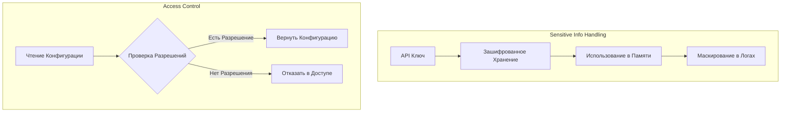

## Будущие Расширения

| Функция | Описание | Приоритет |
| --- | --- | --- |
| Горячая Перезагрузка Конфигурации | Загрузка внешних файлов конфигурации во время выполнения | Высокий |
| Проверка Конфигурации | Проверка полноты конфигурации при запуске | Высокий |
| Слияние Конфигураций | Пользовательская конфигурация переопределяет конфигурацию по умолчанию | Средний |
| Импорт/Экспорт Конфигурации | Поддержка импорта/экспорта файлов конфигурации | Средний |
| Обновление Агента | Авто-обновление конфигурации из официальной документации | Низкий |

# Проект Управления Метаданными Провайдеров

## Обзор

Система Управления Метаданными Провайдеров отвечает за динамическое получение информации о конфигурации из официальной документации LLM Provider, обеспечивая автоматизированные обновления и проверку конфигурационных данных.

## Основная Проблема

Текущая реализация содержит жёстко закодированную статистику использования и не имеет поддержки динамических данных Провайдеров. Необходимо создать автоматизированный механизм получения и управления метаданными.

## Проект Архитектуры

### Архитектура Потока Данных

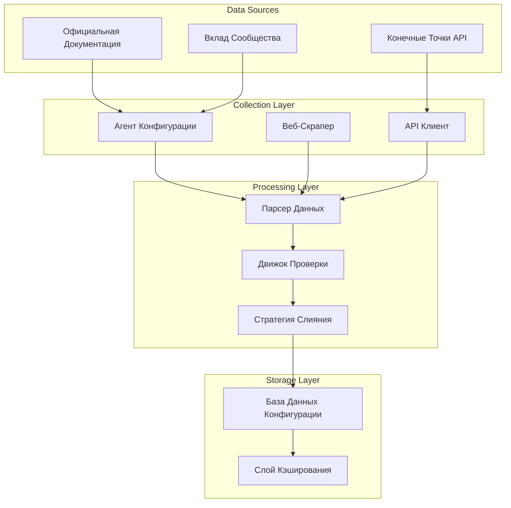

### Модель Приоритета Конфигурации

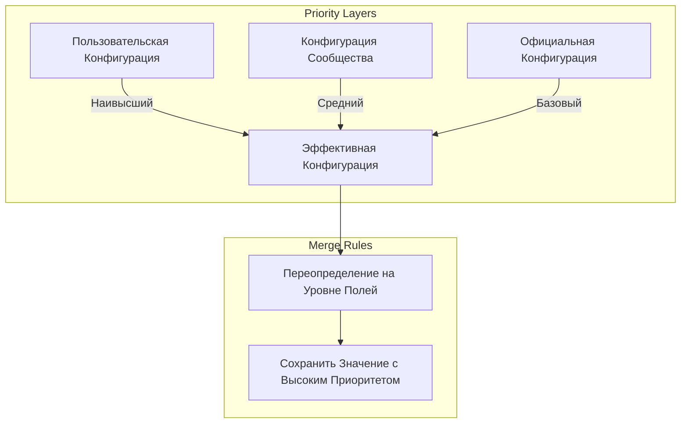

## Структура Метаданных

### Иерархия Конфигурации Провайдера

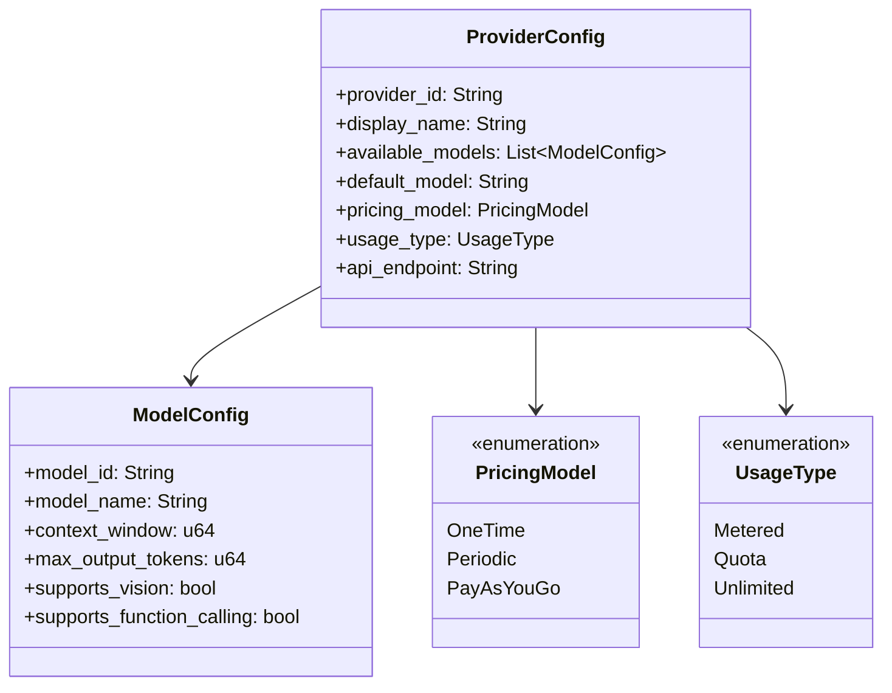

### Классификация Источников Конфигурации

| Тип Источника | Описание | Надёжность | Частота Обновления |
| --- | --- | --- | --- |
| Официальный | Официальная документация провайдера | Высокая | Автоматическая периодическая |
| Сообщество | Данные, предоставленные сообществом | Средняя | Ручное обновление |
| Пользовательское Переопределение | Настроенное пользователем | Наивысшая | В реальном времени |

## Система Сбора Агентов

### Процесс Сбора

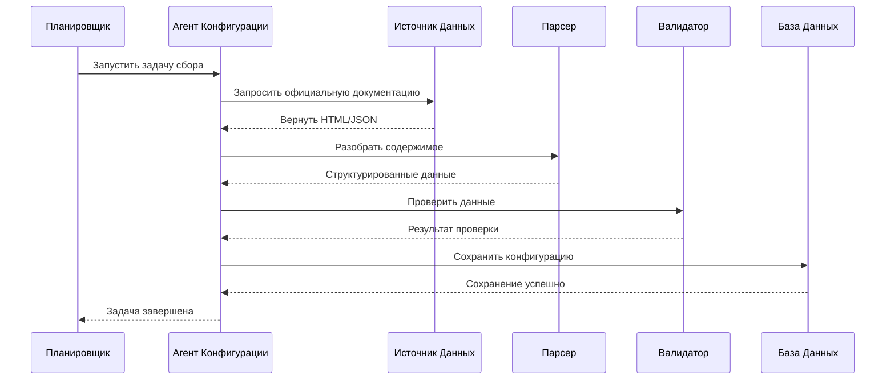

### Обязанности Агента Провайдера

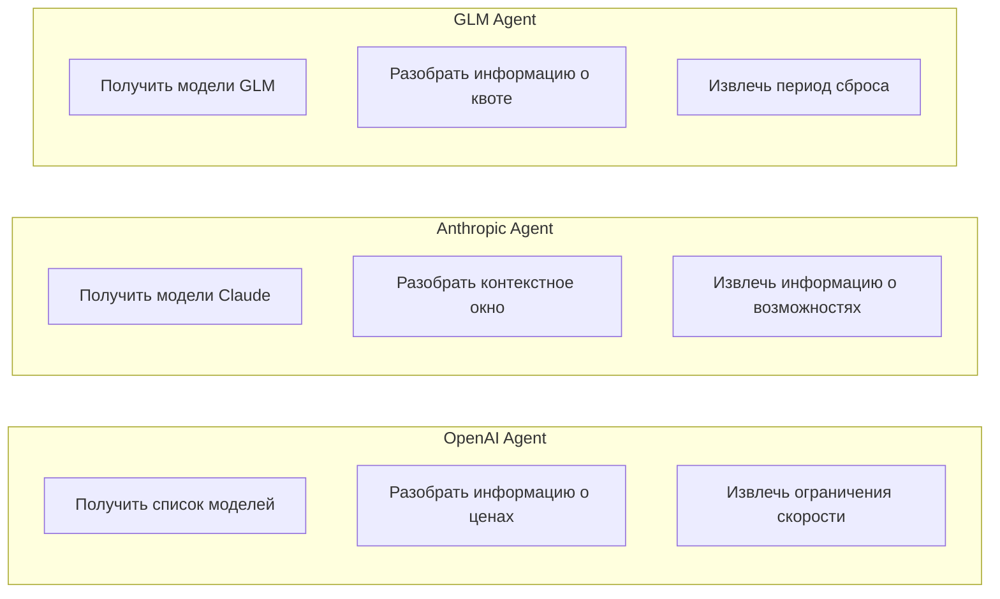

## Механизм Проверки Данных

### Процесс Проверки

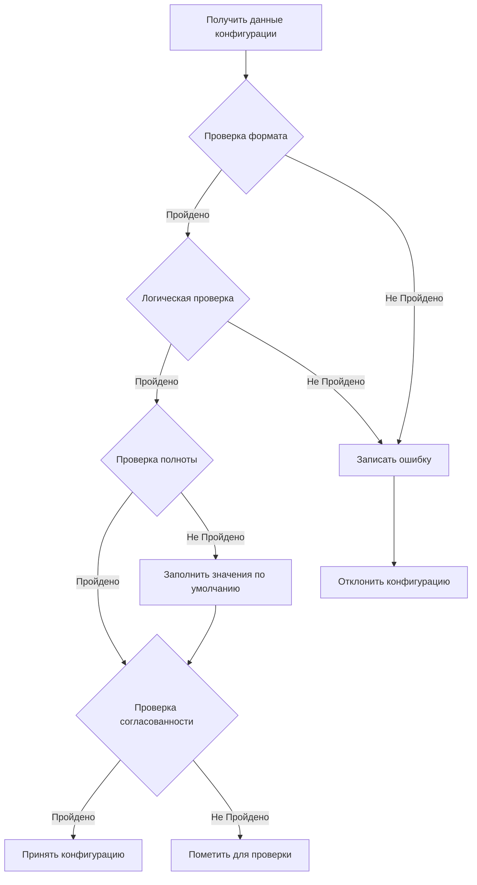

### Правила Проверки

| Тип Проверки | Содержание Проверки | Обработка Сбоя |
| --- | --- | --- |
| Проверка формата | Типы данных, форматы полей | Отклонить и записать |
| Логическая проверка | Диапазоны значений, значения перечислений | Использовать значения по умолчанию |
| Проверка полноты | Обязательные поля существуют | Заполнить значения по умолчанию |
| Проверка согласованности | Межполевые отношения корректны | Пометить для проверки |

## Стратегия Слияния Конфигураций

### Слияние на Уровне Полей

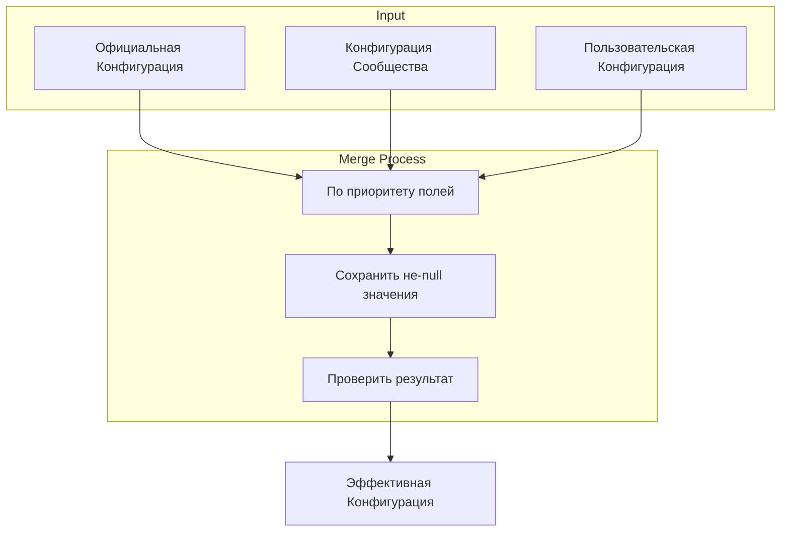

### Пример Слияния

| Поле | Официальное Значение | Значение Сообщества | Пользовательское Значение | Финальное Значение |
| --- | --- | --- | --- | --- |
| context_window | 128000 | - | 64000 | 64000 |
| max_concurrent | 100 | 50 | - | 50 |
| pricing_model | PayAsYouGo | - | - | PayAsYouGo |

## Интерфейс Пользовательской Конфигурации

### Структура Файла Конфигурации

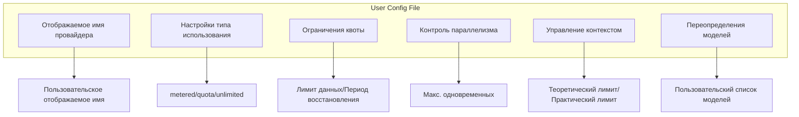

## Механизм Запланированного Обновления

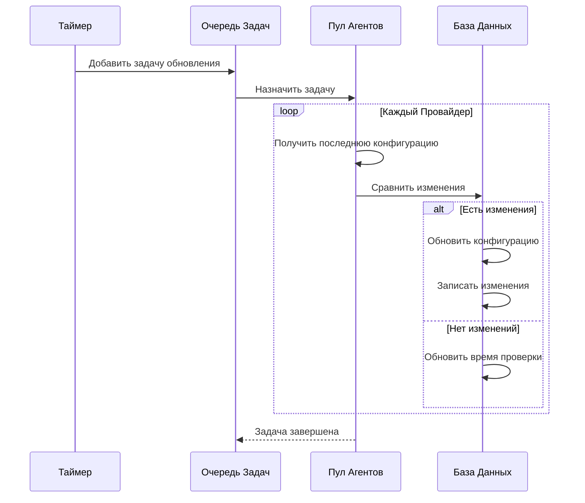

## Обработка Ошибок

### Обработка Сбоя Сбора

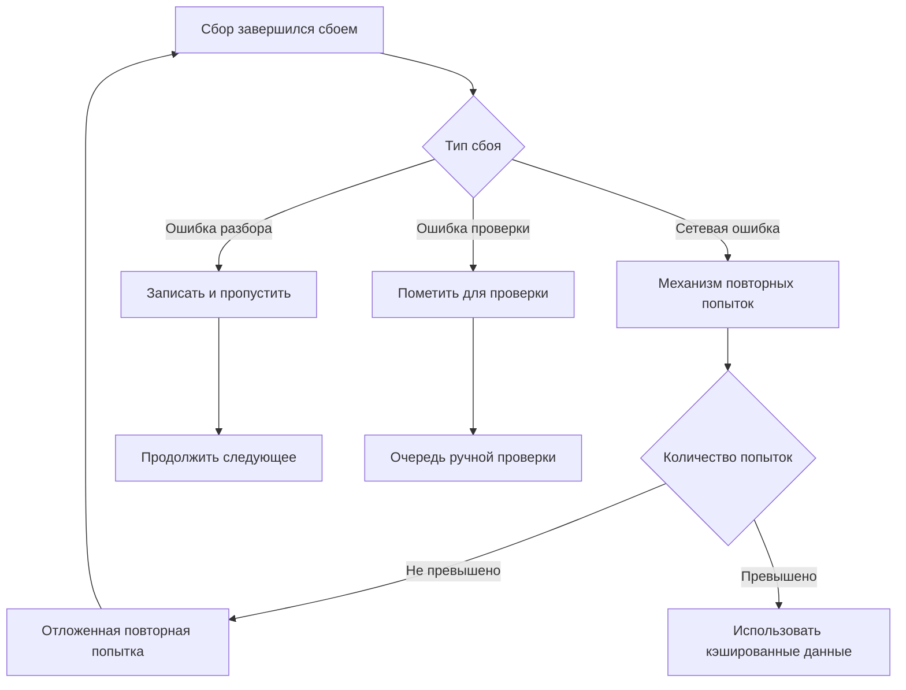

## Проект Расширяемости

### Добавление Нового Провайдера

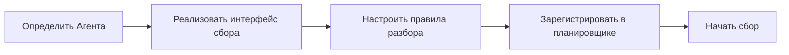

### Точки Расширения

| Тип Расширения | Описание | Реализация |
| --- | --- | --- |
| Новый Провайдер | Добавить новый источник конфигурации | Реализовать интерфейс Агента Провайдера |
| Новое поле | Расширить структуру конфигурации | Обновить модель данных и правила проверки |
| Новое правило проверки | Добавить логику проверки | Добавить реализацию валидатора |

## Реализация Агента Уровня 3

### Агент ProviderScratch

`ProviderScratch` — первый официальный Агент Уровня 3, служащий примером реализации средств скрапинга.

```mermaid
flowchart TB
    subgraph ProviderScratch Agent
        A[Вход Агента] --> B{Режим Выполнения}
        B -->|Режим TUI| C[Интерактивный Интерфейс]
        B -->|Режим CI| D[Автоматизированное Выполнение]

        C --> E[Выбрать Провайдера]
        D --> F[Прочитать переменные окружения]

        E --> G[Вызвать Навык]
        F --> G

        G --> H[Скрапинг документации]
        H --> I[Разбор данных]
        I --> J[Генерация TOML]

        J --> K{Подтвердить коммит?}
        K -->|Да| L[Записать в рабочее пространство]
        K -->|Нет| M[Отбросить изменения]

        L --> N[Запросить коммит пользователя]
    end
```

### Архитектура Навыков

Каждый Провайдер соответствует независимому Навыку:

```mermaid
graph LR
    subgraph Skills
        A[openai]
        B[anthropic]
        C[glm]
        D[deepseek]
        E[qwen]
        F[gemini]
    end

    subgraph Shared Components
        G[Скрапер Документации]
        H[Парсер Данных]
        I[Генератор TOML]
    end

    A --> G
    B --> G
    C --> G
    D --> G
    E --> G
    F --> G

    G --> H
    H --> I
```

### Структура Директории

```mermaid
flowchart LR
    Root[".amphoreus/provider_scratch/"]
    AT["agent.toml"]
    OV["overview/"]
    SK["skills/"]
    Root --> AT
    Root --> OV
    Root --> SK
    OV --> ZH["zhs.md"]
    SK --> OA["openai/"]
    SK --> AN["anthropic/"]
    SK --> GL["glm/"]
    SK --> DS["deepseek/"]
    SK --> QW["qwen/"]
    SK --> GE["gemini/"]
    OA --> OAP["prompt.md"]
    AN --> ANP["prompt.md"]
    GL --> GLP["prompt.md"]
    DS --> DSP["prompt.md"]
    QW --> QWP["prompt.md"]
    GE --> GEP["prompt.md"]
```

### Автоматизация CI

```mermaid
flowchart LR
    A[Запланированный триггер] --> B[Извлечь код]
    B --> C[Запустить ProviderScratch]
    C --> D{Обнаружить изменения}
    D -->|Есть изменения| E[Создать ветку]
    E --> F[Зафиксировать изменения]
    F --> G[Создать PR]
    G --> H[Ожидать проверки]
    D -->|Нет изменений| I[Завершено]
```

### Переменные Окружения

| Имя Переменной | Описание |
| --- | --- |
| `AMPHOREUS_PROVIDER_SCRATCH_PROVIDERS` | Список провайдеров для скрапинга |
| `AMPHOREUS_PROVIDER_SCRATCH_OUTPUT_DIR` | Путь к выходной директории |
| `AMPHOREUS_PROVIDER_SCRATCH_GIT_BRANCH` | Целевая Git ветка |
| `AMPHOREUS_PROVIDER_SCRATCH_DRY_RUN` | Только пробный запуск |

## Будущие Планы

| Функция | Описание | Приоритет |
| --- | --- | --- |
| Контроль версий конфигурации | Отслеживание истории изменений конфигурации | Высокий |
| Уведомление об изменениях | Уведомление пользователей об обновлениях конфигурации | Средний |
| Откат конфигурации | Поддержка отката к историческим версиям | Средний |
| Умные рекомендации | Рекомендация конфигураций на основе шаблонов использования | Низкий |
| GitHub巡回 Агент | Авто-создание PR для обновления конфигураций | Высокий |
