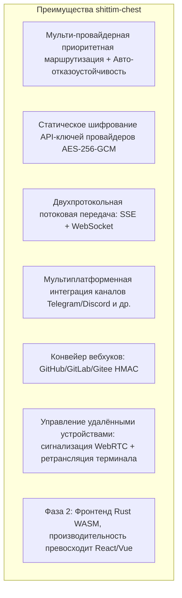

+++
title = "Позиционирование продукта и конкурентная среда"
description = """shittim-chest — это слабосвязанная платформа WebUI для LLM, с прямыми конкурентами: Open WebUI, LobeChat и подобными. Интеграция с entelecheia является опциональной функцией, а не архитектур"""
lang = "ru"
category = "design"
subcategory = "webui"
+++

# Позиционирование продукта и конкурентная среда

## Обзор

shittim-chest — это слабосвязанная платформа WebUI для LLM, с прямыми конкурентами: Open WebUI, LobeChat и подобными. Интеграция с entelecheia является опциональной функцией, а не архитектурной предпосылкой.

## Основное позиционирование

| Измерение | Описание |
| --- | --- |
| Сущность | Автономный, мульти-провайдерный WebUI чата для LLM |
| Конкуренты | Open WebUI, LobeChat, NextChat |
| Связь с entelecheia | Слабая связь: опциональная интеграция через JWT-прокси |
| Независимость | Обеспечивает полный опыт чата без entelecheia |

## Отличие от Open WebUI

## Граница с entelecheia

| shittim-chest | entelecheia |
| --- | --- |
| Аутентификация пользователей (argon2 + JWT) | Идентификация пользователей + Права (RBAC) |
| Управление сессиями | Оркестрация агентов (scepter) |
| Данные чата (диалоги/сообщения) | Среда выполнения контейнеров Cosmos |
| Управление провайдерами LLM + Шифрование ключей | Движок выполнения IEPL TypeScript |
| Вход вебхуков (проверка HMAC + пересылка) | Вызов инструментов агентов |
| Рендеринг фронтенда (arona) | Канал агентов WebSocket |
| Сессии удалённых устройств + Ретрансляция сигнализации | Агент устройств polemos |
| Мультиплатформенная конфигурация каналов | — |

**Ключевой принцип**: shittim-chest хранит только данные «на стороне пользователя»; entelecheia хранит только данные «на стороне агента». Они общаются через JWT-аутентифицированный HTTP/WebSocket, никогда не обращаясь к базам данных друг друга.

## Дорожная карта эволюции архитектуры

| Фаза | Статус | Содержание |
| --- | --- | --- |
| P1-P6 | Завершено | Автономный чат, аутентификация, управление провайдерами, вебхуки, прокси-мост, управление устройствами |
| P7 | Запланировано | Голосовой ввод/вывод (контейнер STT Docker + прокси TTS) |
| P8 | Запланировано | PWA мобильное + Tauri Mobile |
| P9 | Запланировано | Миграция фронтенда на Rust WASM (arona → Tairitsu) |

## Философия дизайна

1. **Автономность прежде всего**: Все основные функции не зависят от entelecheia. Переменных окружения `LLM_DEFAULT_PROVIDER_*` достаточно для независимого запуска чата.
1. **Слабосвязанная интеграция**: Интеграция с entelecheia — это опциональный прокси-слой. Пользователи могут выбрать использование только чата LLM или включить оркестрацию агентов через entelecheia.
1. **Прогрессивный WASM**: Фронтенд Vue 3 поставляется первым как «живая спецификация»; миграция на WASM имеет чёткие пороги принятия решения (зрелость фреймворка, покрытие экосистемы, пропускная способность разработки).
1. **Нативный Docker**: Все серверные компоненты управляются через Docker API bollard, без зависимости от docker-compose.
