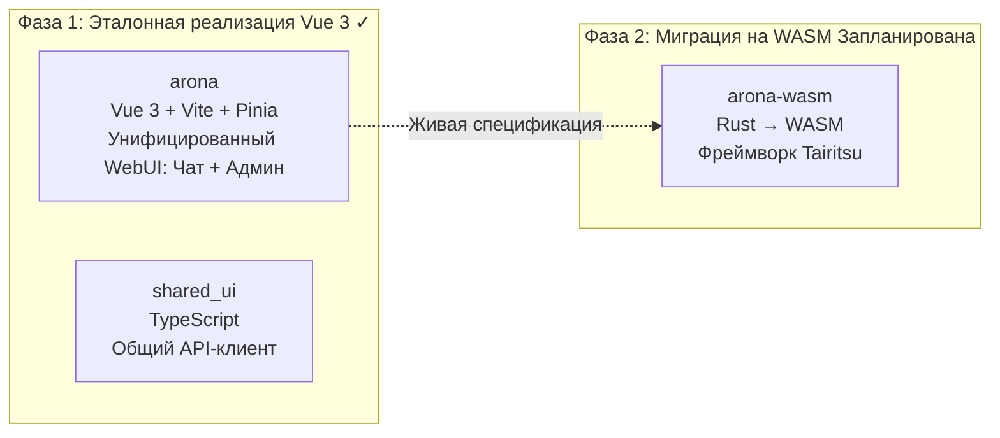
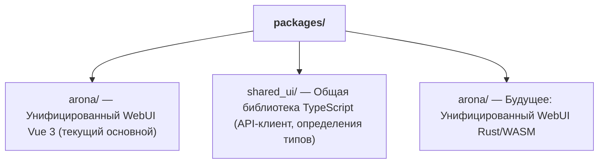

+++
title = "Стратегия миграции на двойной фронтенд WASM"
description = """shittim-chest использует двухфазную стратегию фронтенда «сначала Vue 3, потом WASM». Версия Vue 3 поставляется первой как эталонная реализация производственного уровня, а версия Rust/WASM мигрирует"""
lang = "ru"
category = "design"
subcategory = "webui"
+++

# Стратегия миграции на двойной фронтенд WASM

## Обзор

shittim-chest использует двухфазную стратегию фронтенда «сначала Vue 3, потом WASM». Версия Vue 3 поставляется первой как эталонная реализация производственного уровня, а версия Rust/WASM мигрирует, когда условия созреют. В период, когда обе версии работают параллельно, одинаковые взаимодействия пользователя должны давать одинаковые результаты.

## Разбивка по фазам



## Сравнение технологических стеков

| Измерение | Фаза 1 (Vue 3) | Фаза 2 (WASM) |
| --- | --- | --- |
| Язык | TypeScript / Vue 3 SFC | Rust |
| Фреймворк | Vite + Pinia + Vue Router | Tairitsu (собственная разработка) |
| Артефакт сборки | Бандл JS/CSS | Бинарник WASM |
| Размер бандла | Больше | Значительно меньше |
| Производительность в рантайме | Хорошая | Отличная (почти нативная скорость) |
| Опыт разработчика | Мгновенный HMR | Ожидание компиляции |
| Зрелость экосистемы | Зрелая | Ранняя стадия |

## Принцип «Живой спецификации»

Версия Vue 3 — это не просто временная реализация; она служит **исполняемой спецификацией** для миграции на WASM:

1. **Полнота функций**: Каждая функция в версии WASM должна вести себя идентично версии Vue 3
1. **Контракт API**: Обе версии используют один и тот же REST API и протокол WebSocket
1. **Визуальная согласованность**: Обе версии отображают один и тот же UI в одинаковых состояниях
1. **Прогрессивная замена**: Функции чата и администрирования arona могут мигрировать на WASM независимо

## Пороги принятия решения о миграции на WASM

Миграция на WASM не начнётся до созревания условий. Пороги принятия решения:

| Условие | Описание |
| --- | --- |
| Зрелость фреймворка Tairitsu | Библиотека компонентов, маршрутизация, управление состоянием, i18n и другая инфраструктура должны быть завершены |
| Покрытие экосистемы WASM | `web-sys` / `wasm-bindgen` должны поддерживать требуемые Web API |
| Пропускная способность разработки | Достаточно персонала для поддержки обеих версий при продвижении миграции |
| Требования к производительности | Версия Vue 3 сталкивается с узкими местами производительности в реальных сценариях |

## Структура пакетов фронтенда



`shared_ui/` содержит общий код фронтенда:

- API-клиент (аутентификация, чат, управление провайдерами и др.)
- Утилиты аутентификации (хранение JWT, обновление, перехватчики)
- Определения типов (перечисления домена, типы запросов/ответов)

## Команды разработки фронтенда

```bash
just build-frontend  # Собрать оба фронтенда (pnpm build:all)
dev.py               # Отслеживание + авто-пересборка при изменениях файлов
```

В режиме Dev `dev.py` отслеживает исходные файлы и запускает `pnpm build` при изменениях. Бэкенд обслуживает как статические ресурсы, так и конечные точки API на одном порту — отдельный dev-сервер или прокси не нужен.

## Принципы дизайна

1. **Vue 3 поставляет функции первым**: Не ждать WASM. Пользователи могут использовать полнофункциональный интерфейс чата и администрирования уже сегодня.
1. **WASM — это улучшение, а не замена**: Миграция не влияет на существующих пользователей — обе версии используют один и тот же API бэкенда.
1. **Бэкенд, независимый от фреймворка**: Бэкенд `shittim_chest` не знает о реализации фронтенда. Любой HTTP/WS-клиент может интегрироваться.
1. **Tairitsu — это зависимость, а не внутренняя разработка**: Начало миграции на WASM зависит от зрелости внешнего фреймворка Tairitsu.
