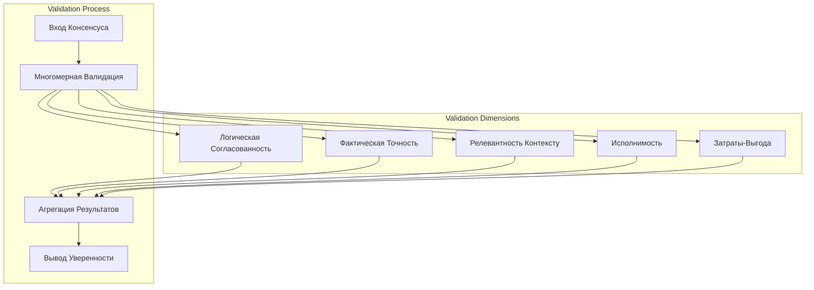
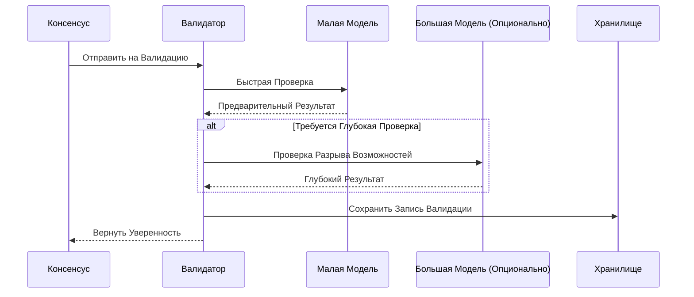
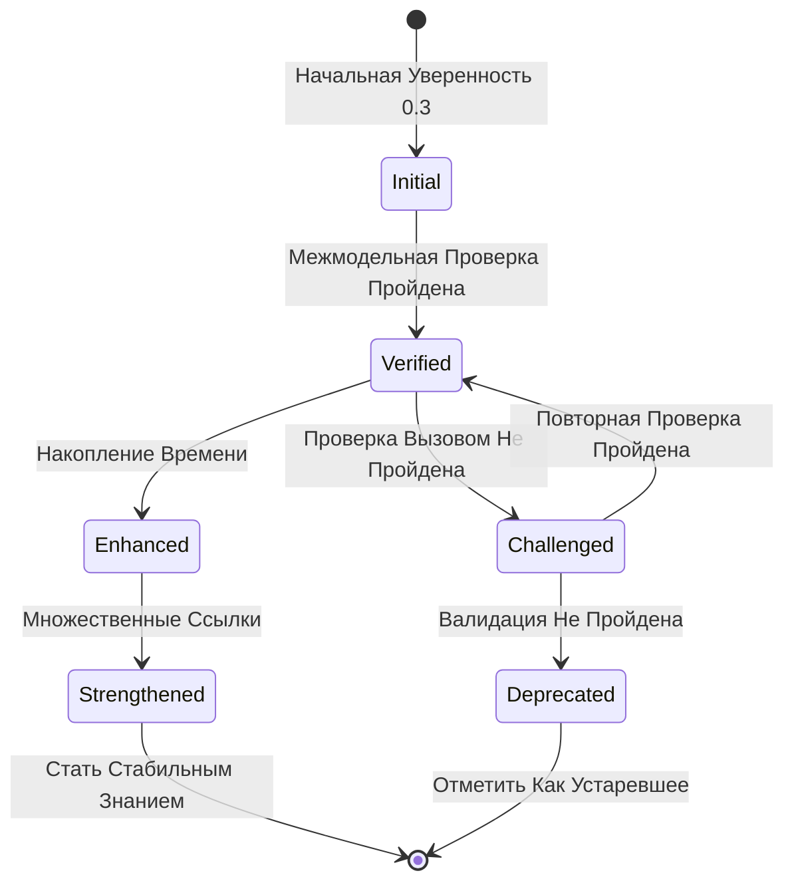
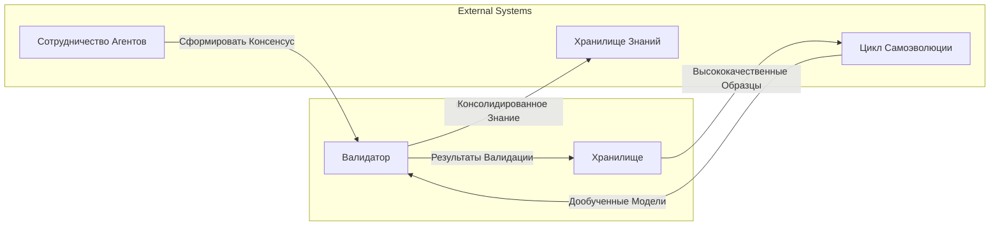

# Механизм Валидации Консенсуса

## Обзор

Механизм Валидации Консенсуса является ключевым компонентом системы мульти-агентного сотрудничества, используемым для проверки и оценки надёжности и точности консенсуса, сформированного несколькими Агентами, обеспечивая качество выходных данных системы.

## Основные Принципы

### Многомерная Система Валидации

Система выполняет комплексную валидацию по пяти измерениям:

### Описание Измерений Валидации

| Измерение | Цель Проверки | Ключевые Показатели |
| --- | --- | --- |
| Логическая Согласованность | Самосогласован ли консенсус | Отсутствие противоречий, полное обоснование |
| Фактическая Точность | Верны ли фактические утверждения | Соответствие известным знаниям |
| Релевантность Контексту | Релевантен ли текущей задаче | Оценка релевантности |
| Исполнимость | Исполним ли план | Оценка осуществимости |
| Затраты-Выгода | Разумно ли соотношение затрат и выгод | Оценка ROI |

## Проект Архитектуры

### Прогрессивный Процесс Валидации

### Механизм Накопления Уверенности

## Интеграция с Другими Системами

## Соображения Проектирования

### Контроль Затрат

- Приоритет малых моделей для валидации
- Использование больших моделей только при необходимости
- Кэширование и повторное использование результатов валидации

### Обеспечение Качества

- Многомерная перекрёстная валидация
- Накопление времени повышает достоверность
- Проверка вызовом обнаруживает потенциальные проблемы

### Отслеживаемость

- Полные записи истории валидации
- Поддержка аудита и обратного отслеживания
- Поддержка статистического анализа
